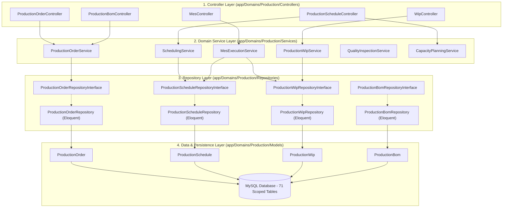
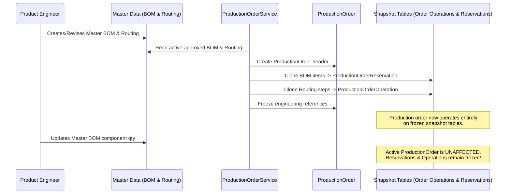
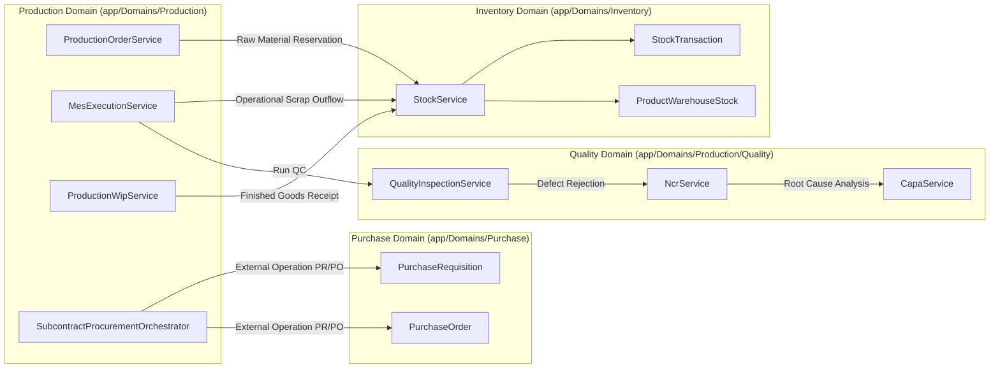

# Production Module — Technical Architecture & Engineering Standards

> **Domain Location:** `app/Domains/Production`  
> **Documentation Root:** `app/Domains/Production/docs/ARCHITECTURE.md`  
> **Architectural Pattern:** Domain-Driven Design (DDD) with 4-Layer Architecture & Repository Pattern

---

## 1. Domain Architecture Overview

The Production module is built strictly upon a decoupled 4-layer architecture. Business logic, calculations, algorithm orchestration, and transactional integrity reside exclusively in the **Service Layer**. Persistence is encapsulated behind **Repositories**, while **Controllers** act purely as HTTP traffic coordinators, FormRequest orchestrators, and authorization gates.

---

## 2. The 4 Layers & Responsibilities

### Layer 1: Controllers (`Controllers/`)
- **Permitted Responsibilities:**
  - Route binding and HTTP method coordination.
  - FormRequest validation triggers (`StoreProductionOrderRequest`, `MesCompleteOperationRequest`).
  - Fine-grained Gate authorization checks (`Gate::authorize('create', ProductionOrder::class)`).
  - Calling corresponding Domain Service methods.
  - Returning Blade views, JSON payloads, or HTTP redirects.
- **Strictly Forbidden:**
  - Direct Eloquent queries (`ProductionOrder::where(...)`).
  - Direct persistence calls (`Model::create()`, `$model->save()`).
  - Multi-step business transactions (`DB::transaction(...)` belongs in Services).
  - Business calculations (MRP explosion, leveling, WIP math).

### Layer 2: Domain Services (`Services/`)
- **Permitted Responsibilities:**
  - Encapsulating all domain workflow logic, status transitions, and scheduling algorithms.
  - Enforcing database transaction boundaries (`DB::transaction(function() { ... })`).
  - Orchestrating multi-model interactions (e.g., updating `ProductionOrder`, generating `ProductionWip`, emitting timeline events).
  - Performing cross-domain integration calls (Inventory `StockService`, Purchase PR/PO orchestration).
  - Emitting domain timeline events via `ProductionEventService`.

### Layer 3: Repositories (`Repositories/`)
- **Structure:**
  - Located in a **flat directory**: `app/Domains/Production/Repositories/`.
  - Pair of `*RepositoryInterface.php` and `*Repository.php`.
  - Registered exclusively in `app/Providers/AppServiceProvider.php`.
- **Responsibilities:**
  - Encapsulating raw Eloquent queries, pagination, eager loading, and filtering.
  - Managing pessimistic database locking helpers (`lockForUpdate()`).
  - Providing reusable aggregate query methods scoped by tenant.

### Layer 4: Eloquent Models (`Models/`)
- **Responsibilities:**
  - Representing database tables with typed `$casts`, `$fillable`, and relationships (`hasMany`, `belongsTo`).
  - Enforcing automatic multi-tenant scoping via `BelongsToTenant` trait.
  - Providing domain helper methods (e.g. `$order->isDraft()`, `$schedule->isFrozen()`).

---

## 3. Multi-Tenancy & Tenant Isolation

Tenant isolation is strictly enforced at every boundary:
1. **Global Scope:** Models implement `App\Models\Concerns\BelongsToTenant`, applying a global query scope `where('tenant_id', $currentTenantId)` to every query automatically.
2. **Database Schema:** Every single Production table (`71` tables) includes an indexed `tenant_id unsignedBigInteger` column with foreign key cascade to `tenants.id`.
3. **Route & Middleware:** Incoming requests traverse `App\Http\Middleware\ResolveTenant`, resolving tenant from hostname, custom domain, or local fallback header (`config('tenancy.local_fallback_slug')`).
4. **Service Context:** Methods requiring tenant ID accept `$tenantId = require_tenant_id();` and explicitly bind it on model instantiation.

---

## 4. Immutable Snapshot Architecture

A foundational architectural requirement in industrial manufacturing is that **work in progress must never be corrupted by ongoing engineering changes**. If an engineer modifies a BOM or changes machine cycle times on a Routing, active shopfloor jobs must proceed under their original approved engineering baseline.

The system solves this via the **Immutable Snapshot Architecture**:

---

## 5. Event Bus & Audit Event Timeline

Production execution is fully tracked via a dedicated operational event bus:
- **Service:** `App\Domains\Production\Services\ProductionEventService`
- **Model:** `App\Domains\Production\Models\ProductionEventTimeline`
- **Events Tracked:**
  - `Order Created`, `Material Reserved`, `Order Released`
  - `Schedule Generated`, `Schedule Levelled`, `Schedule Released`
  - `Operation Started`, `Operation Paused`, `Operation Completed`
  - `QC Inspection Recorded`, `Operational Scrap Recorded`, `Rework Order Created`
  - `Finished Goods Received`

Every event captures `tenant_id`, `production_order_id`, `event_type`, `title`, `description`, `severity` (`info`, `warning`, `danger`, `success`), `event_source`, and `triggered_by` (user ID).

---

## 6. Cross-Domain Integrations

