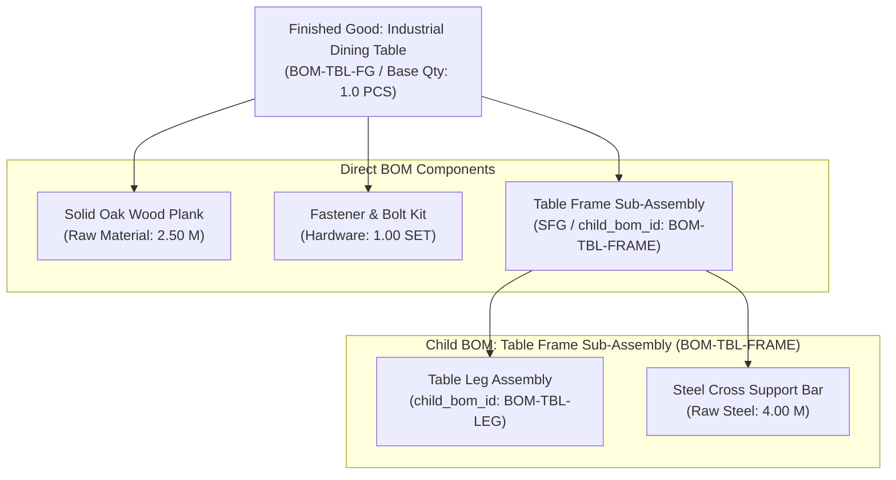
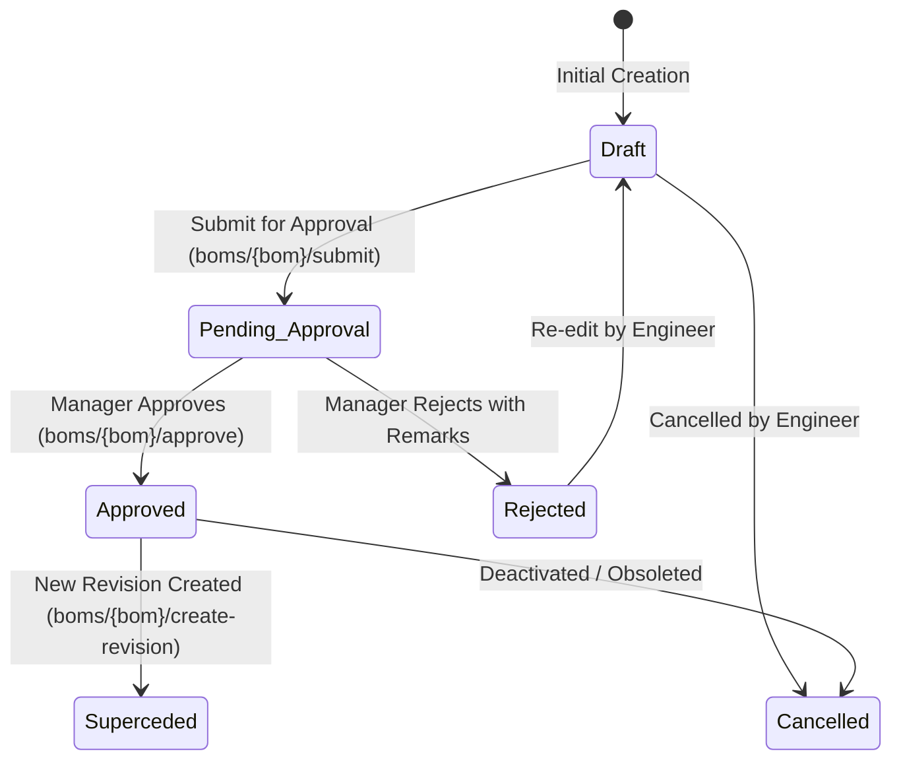

# Production Module — Bill of Materials (BOM) Engineering Guide

> **Domain Location:** `app/Domains/Production`  
> **Documentation Root:** `app/Domains/Production/docs/BOM_GUIDE.md`  
> **Primary Models:** `ProductionBom`, `ProductionBomItem`, `ProductionBomApproval`  
> **Primary Services:** `ProductionBomService`, `BomExplosionService`, `BomFormulaEvaluatorService`, `BomWhereUsedService`

---

## 1. Overview & Business Purpose

The **Bill of Materials (BOM)** is the authoritative engineering recipe defining the exact quantities of raw materials, parts, and sub-assemblies required to manufacture a single base unit of a product. In this ERP, BOMs support multi-level sub-assemblies, dynamic parameterized formulas, scrap allowances, formal approval workflows, and immutable snapshotting at the time of Production Order creation.


---

## 2. BOM Structure & Multi-Level Hierarchy

A BOM can contain both leaf-level raw materials and intermediate sub-assemblies (`child_bom_id`):



### Multi-Level Resolution (`BomExplosionService`)
When an order or plan is exploded:
1. The engine checks if any `ProductionBomItem` has `child_bom_id != null`.
2. If present, it recursively descends into the child BOM, multiplying component quantities by parent ratios.
3. The AJAX endpoint `plans/ajax-bom-explosion` returns the complete flattened or tree view for planner verification.

---

## 3. Parameterized Dynamic Formulas

For custom manufacturing (e.g. custom furniture, cut-to-size metal sheets), material consumption depends dynamically on customer-specified dimensions rather than fixed static ratios.

### Formula Engine (`BomFormulaEvaluatorService`)
- **Field:** `production_bom_items.formula` (e.g. `(length * width * thickness * density) / 1000000`).
- **Input Parameters:** Passed during Production Order creation in `production_orders.parameters` JSON (e.g. `{"length": 2400, "width": 1000, "thickness": 35, "density": 0.75}`).
- **Formula Preview Route:** `POST /production/boms/preview-formula` via `BomFormulaController::preview()`. Planners can test formulas with sample inputs before committing.

---

## 4. Engineering Approval & Revision Lifecycle

BOMs enforce strict engineering change governance to prevent unverified recipes from reaching the shopfloor:



### Key Business Rules
1. **One Active Version:** Only **one approved BOM** may exist per product at any time. When a new revision is approved, prior revisions transition to `superceded`.
2. **Duplicate & Revisions:** Planners can clone an existing BOM using `POST /production/boms/{bom}/duplicate` to quickly branch new product variants.

---

## 5. UI Action Traceability

| Action | UI Screen & Button | Validation & Controller | Service & DB Impact |
|---|---|---|---|
| **Create BOM** | `/production/boms` → `+ Create BOM` | `StoreProductionBomRequest`<br/>`ProductionBomController::store` | `ProductionBomService::create()`<br/>Creates `production_boms` & `production_bom_items`. Status: `draft`. |
| **Submit Approval** | `/production/boms/{id}` → `Submit` | `ProductionBomController::submitApproval` | Transitions status to `pending_approval`. Emits notification to Production Manager. |
| **Approve BOM** | `/production/boms/{id}` → `Approve` | `ProductionBomController::approve` | `ProductionBomService::approve()`<br/>Validates item completeness, sets status `approved`, sets `approved_at = now()`. |
| **Create Revision** | `/production/boms/{id}` → `New Revision` | `ProductionBomController::createRevision` | Clones header and items into new revision number (`v1.1`), leaves original approved until new version is approved. |

---

## 6. Code-to-Flow Traceability: Creating a BOM

```text
User Interface:
  Browser at http://127.0.0.1:8000/production/boms/create
  Form submit: product_id, base_quantity, uom_id, items array
        ↓
HTTP Route:
  POST /production/boms (Route name: production.boms.store)
        ↓
Controller Layer:
  App\Domains\Production\Controllers\ProductionBomController::store(StoreProductionBomRequest $request)
  Authorization: Gate::authorize('create', ProductionBom::class)
        ↓
Form Request:
  App\Domains\Production\Requests\StoreProductionBomRequest
  Validates: product_id, base_quantity > 0, items.*.material_id, items.*.quantity > 0
        ↓
Domain Service:
  App\Domains\Production\Services\ProductionBomService::create(array $data, int $tenantId, int $userId)
  Database transaction: DB::transaction(...)
  Number generation: App\Domains\Production\Services\ProductionBomNumberService::generateNextNumber()
        ↓
Repository Layer:
  App\Domains\Production\Repositories\ProductionBomRepositoryInterface
  Bound to: App\Domains\Production\Repositories\ProductionBomRepository
        ↓
Models & Database:
  INSERT INTO production_boms (tenant_id, bom_number, product_id, base_quantity, status, version)
  INSERT INTO production_bom_items (tenant_id, bom_id, material_id, quantity, scrap_percentage, formula)
```
