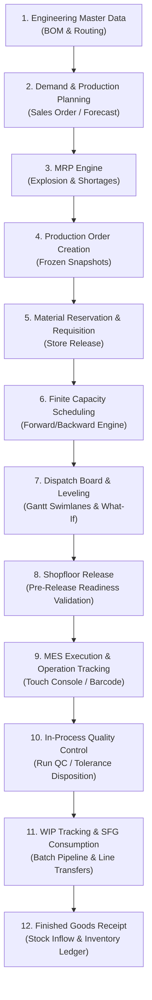

# Production Module — End-to-End Business Flow Guide

> **Domain Location:** `app/Domains/Production`  
> **Documentation Root:** `app/Domains/Production/docs/BUSINESS_FLOW.md`  
> **Purpose:** Comprehensive explanation of the complete industrial manufacturing journey in business and technical language.

---

## 1. The Verified Manufacturing Journey

The end-to-end manufacturing lifecycle traverses 12 distinct business milestones:

---

## 2. Milestone by Milestone Deep Dive

### Milestone 1: Engineering Master Data (BOM & Routing)
- **Business Goal:** Define the recipe (materials) and process steps (labor & machine time) required to fabricate a product.
- **UI Screen:** `/production/boms` and `/production/routing`
- **Key Actions:**
  - Create Bill of Materials (`ProductionBom`), configure items with raw materials, scrap percentage, and optional dynamic formula parameters.
  - Create Routing (`Routing`), define sequential or parallel operations (`RoutingOperation`), assign Work Centers, specify setup and processing minutes, and flag `quality_required` or `is_external`.
- **Database Records:** `production_boms`, `production_bom_items`, `routings`, `production_routing_operations`.

---

### Milestone 2 & 3: Production Planning & MRP
- **Business Goal:** Aggregate demand from Sales Orders or inventory forecasts, compute gross/net material requirements, and identify stock shortages.
- **UI Screen:** `/production/plans`
- **Trigger:** Click **Run MRP** on an active plan.
- **Service:** `App\Domains\Production\Services\MrpEngineService` and `MrpShortageService`.
- **Business Effect:** Analyzes `ProductWarehouseStock` against required BOM components, calculates safety stock and lead times, and generates `ProductionPlanRequirement` records.

---

### Milestone 4: Production Order Creation (Snapshotting)
- **Business Goal:** Instantiate an authorized manufacturing work order for a specific product and target quantity.
- **UI Screen:** `/production/orders/create` or `/production/plans/{plan}/create-order`
- **Service:** `App\Domains\Production\Services\ProductionOrderService::createDirect()` or `createFromPlan()`.
- **Snapshot Effect:**
  - Creates `ProductionOrder` in status `draft`.
  - Deep-clones BOM items into `ProductionOrderReservation`.
  - Deep-clones Routing operations into `ProductionOrderOperation` with frozen cycle times, machine assignments, and dependency chains (`FS`, `SS`, `FF`).

---

### Milestone 5: Material Requisition & Store Issuance
- **Business Goal:** Notify storekeepers to pick and stage raw materials before machine operators begin work.
- **Business Effect:**
  - Auto-generates `ProductionRequisitionSlip` with slip items.
  - Storekeeper reviews the slip in the Inventory module and records material issuance.
  - Order status advances to permit release once materials are confirmed issued.

---

### Milestone 6 & 7: Finite Capacity Scheduling & Dispatch Board
- **Business Goal:** Allocate shopfloor operations to physical Work Centers and machines without exceeding working shift capacity.
- **UI Screen:** `/production/schedules` and `/production/schedules/dispatch-board`
- **Screenshots:**
  
  
- **Engine Logic:**
  - `SchedulingService::generateSchedule()` projects operation start and end dates based on plant calendars, shift working hours, setup times, and run times.
  - Dispatch board displays operations across machine swimlanes.
  - Planners can drag-and-drop operations, lock critical jobs, and run `CapacityLevelingService` to resolve machine bottlenecks.

---

### Milestone 8: Shopfloor Release & Pre-Release Validation
- **Business Goal:** Formally transition the schedule and production order to the shopfloor.
- **UI Action:** Click **Release to Shopfloor** on the schedule show view or dispatch board.
- **Validation Guard:** `SchedulePreReleaseValidationService` validates:
  1. That raw materials are issued or reserved.
  2. That required Work Centers and Machines are active and not in maintenance breakdown.
  3. That predecessor dependencies are valid.
- **Resulting State:**
  - `ProductionSchedule.status` -> `released`
  - `ProductionOrder.status` -> `released`
  - First operation status -> `ready`
  - Initializes Work-in-Progress card (`ProductionWip`) via `ProductionWipService::initializeWip()`.

---

### Milestone 9: MES Shopfloor Execution
- **Business Goal:** Machine operators track actual work on physical work centers.
- **UI Screen:** `/production/mes`
- **Screenshot:**
  
- **Operator Actions:**
  - **Start Operation:** Sets operation status to `in_progress`, records machine start time.
  - **Log Partial Progress:** Operator inputs good quantity produced and any rejected units.
  - **Pause / Resume:** Operator pauses job with reason (e.g. tool change, meal break) and resumes when ready.
  - **Andon Alert:** Operator triggers emergency alarm if tooling breaks or material defects appear.

---

### Milestone 10: In-Process Quality Control (Run QC)
- **Business Goal:** Inspect intermediate output before allowing it to move to the next work center.
- **Screenshot:**
  
- **Workflow:**
  - If `RoutingOperation.quality_required == true`, the operation completion gate is locked.
  - QC Inspector clicks **Run QC**, evaluates physical parts against parameters defined in `ProductionQualityPlan`.
  - **Passed:** Unlocks good output for downstream transfer.
  - **Failed / Rejected:** Spawns an open `ProductionNcr` (Non-Conformance Report). Operator selects disposition: **Rework** (routes units to repair work center) or **Scrap** (writes off unrecoverable units).

---

### Milestone 11: WIP Tracking & Line Transfers
- **Business Goal:** Maintain real-time visibility over inventory located between workstations.
- **UI Screen:** `/production/wip`
- **Screenshot:**
  
- **Mechanism:**
  - Each batch maintains a `ProductionWip` card.
  - As operations complete, `ProductionWipService::transferWip()` moves units to the next routing operation swimlane.
  - Intermediate sub-assemblies (SFG) consumed in downstream assembly operations are automatically deducted via `ProductionWipService::recordSfgConsumption()`.

---

### Milestone 12: Finished Goods Receipt & Inventory Transfer
- **Business Goal:** Transfer completed production into warehouse finished goods inventory.
- **Trigger:** Operator or supervisor completes the final routing operation or clicks **Receive Finished Goods**.
- **Service Execution:** `ProductionExecutionService::receiveFinishedGoods()`.
- **Database & Inventory Impact:**
  1. Validates warehouse ownership.
  2. Creates `ProductionOrderReceipt`.
  3. Increments `ProductionOrder.quantity_produced`.
  4. Calls `StockService::recordInflow()`, incrementing `ProductWarehouseStock` and logging an immutable `StockTransaction`.
  5. Links batch genealogy (`ProductionLotTrace`) and stores serial number snapshots.
  6. Auto-closes order if produced quantity matches ordered quantity.
