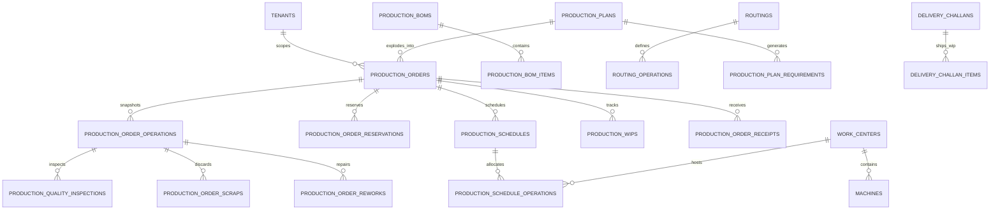

# Production Module — Database & Data Model Architecture Guide

> **Domain Location:** `app/Domains/Production`  
> **Documentation Root:** `app/Domains/Production/docs/DATA_MODEL.md`  
> **Verified Table Count:** 71 Production-Scoped Tables  
> **Tenant Isolation:** Enforced via `tenant_id` on all tables

---

## 1. High-Level Entity-Relationship Architecture

---

## 2. Core Table Catalog (71 Tables Grouped by Subsystem)

### Subsystem 1: Engineering Master Data (12 Tables)
| Table Name | Primary Purpose | Key Foreign Keys | Status Enums |
|---|---|---|---|
| `production_boms` | Master Bill of Materials header | `product_id` | `draft`, `pending_approval`, `approved`, `rejected`, `superceded` |
| `production_bom_items` | Material components, ratios & formulas | `bom_id`, `material_id`, `child_bom_id` | N/A |
| `production_bom_approvals` | Formal approval signature log | `bom_id`, `approved_by` | `approved`, `rejected` |
| `routings` | Manufacturing routing headers | `product_id` | `draft`, `active`, `archived` |
| `production_routing_operations` | Sequential operations and work center links | `routing_id`, `work_center_id`, `machine_id` | N/A |
| `production_routing_operation_materials` | Specific BOM items consumed at an operation | `routing_operation_id`, `material_id` | N/A |
| `production_routing_operation_alternate_machines` | Compatible alternate machines for leveling | `routing_operation_id`, `machine_id` | N/A |
| `production_work_centers` | Physical plant departments | N/A | `active`, `inactive` |
| `production_machines` | Individual equipment tools and spindles | `work_center_id`, `asset_id` | `idle`, `running`, `breakdown`, `maintenance` |
| `production_shifts` | Working shift operational hours | N/A | `active`, `inactive` |
| `production_calendars` | Plant working day definitions | N/A | N/A |
| `production_calendar_holidays` | Specific holiday closures | `calendar_id` | N/A |

---

### Subsystem 2: Planning & Demand (4 Tables)
| Table Name | Primary Purpose | Key Foreign Keys | Status Enums |
|---|---|---|---|
| `production_plans` | Long-range aggregate production plans | `product_id`, `bom_id`, `routing_id` | `draft`, `approved`, `released`, `completed`, `cancelled` |
| `production_plan_requirements` | Exploded MRP material requirements | `production_plan_id`, `product_id` | `pending`, `reserved`, `ordered` |
| `production_plan_operations` | Exploded routing operations for capacity | `production_plan_id`, `work_center_id` | N/A |
| `production_order_requests` | Ad-hoc manufacturing requests | `product_id`, `production_order_id` | `pending`, `converted`, `rejected` |

---

### Subsystem 3: Production Orders & Frozen Snapshots (7 Tables)
| Table Name | Primary Purpose | Key Foreign Keys | Status Enums |
|---|---|---|---|
| `production_orders` | Central manufacturing work order | `product_id`, `bom_id`, `routing_id` | `draft`, `scheduled`, `released`, `in_progress`, `completed`, `closed`, `cancelled` |
| `production_order_operations` | Immutable snapshot of routing operations | `production_order_id`, `work_center_id` | `waiting`, `ready`, `in_progress`, `paused`, `completed`, `skipped`, `cancelled` |
| `production_order_reservations` | Immutable snapshot of BOM materials | `production_order_id`, `product_id` | `pending_issue`, `partially_issued`, `fully_issued` |
| `production_order_issues` | Raw material stock deduction logs | `production_order_id`, `reservation_id` | N/A |
| `production_order_receipts` | Finished goods receipt logs | `production_order_id`, `warehouse_id` | `passed`, `quarantine`, `failed` |
| `production_requisition_slips` | Store pick request headers | `production_order_id` | `pending`, `partially_issued`, `issued` |
| `production_requisition_slip_items` | Specific components to pick | `requisition_slip_id`, `product_id` | N/A |

---

### Subsystem 4: Finite Capacity Scheduling & Dispatch (5 Tables)
| Table Name | Primary Purpose | Key Foreign Keys | Status Enums |
|---|---|---|---|
| `production_schedules` | Master schedule records | `production_order_id` | `draft`, `scheduled`, `released`, `in_progress`, `completed`, `cancelled` |
| `production_schedule_operations` | Scheduled operation blocks on timeline | `production_schedule_id`, `machine_id` | N/A |
| `production_schedule_scenarios` | Isolated what-if simulation schedules | `production_schedule_id` | `draft`, `promoted`, `discarded` |
| `production_schedule_scenario_operations` | Scenario operation time blocks | `scenario_id`, `machine_id` | N/A |
| `production_schedule_change_logs` | Audit trail of drag-and-drop shifts | `production_schedule_id`, `user_id` | N/A |

---

### Subsystem 5: Shopfloor Execution & MES (8 Tables)
| Table Name | Primary Purpose | Key Foreign Keys | Status Enums |
|---|---|---|---|
| `production_order_progress_logs` | Hourly/shift partial progress entries | `production_order_id`, `operation_id` | N/A |
| `production_batches` | Production lot tracking records | `production_order_id`, `product_id` | `active`, `completed`, `cancelled` |
| `production_batch_genealogies` | Component-to-parent lot genealogy | `parent_batch_id`, `child_batch_id` | N/A |
| `production_serial_numbers` | Unit-level serialized product tracking | `production_order_id`, `product_id` | `generated`, `assigned`, `shipped` |
| `production_scan_logs` | 2D barcode / QR scan audit trail | `user_id` | N/A |
| `production_operator_assignments` | Workstation operator scheduling | `operation_id`, `user_id` | `assigned`, `accepted`, `rejected` |
| `production_machine_state_histories` | Machine running/idle/breakdown timeline | `machine_id` | N/A |
| `production_machine_downtimes` | Equipment breakdown stoppage records | `machine_id` | `active`, `resolved` |

---

### Subsystem 6: Quality Control, NCR & CAPA (7 Tables)
| Table Name | Primary Purpose | Key Foreign Keys | Status Enums |
|---|---|---|---|
| `production_quality_plans` | Standard inspection templates | `product_id`, `routing_id` | `draft`, `active`, `archived` |
| `production_quality_plan_parameters` | Specific test parameters and tolerances | `quality_plan_id` | N/A |
| `production_quality_inspections` | Inspection records from "Run QC" | `production_order_operation_id` | `passed`, `failed`, `hold` |
| `production_quality_inspection_results` | Individual parameter measurement values | `inspection_id`, `parameter_id` | N/A |
| `production_ncrs` | Non-Conformance Reports | `production_order_operation_id` | `open`, `under_review`, `dispositioned`, `closed` |
| `production_capas` | Corrective & Preventive Action cases | `ncr_id` | `open`, `investigating`, `action_taken`, `closed` |
| `production_deviations` | Engineering deviation authorizations | `production_order_id` | `pending`, `approved`, `rejected` |

---

### Subsystem 7: Work-in-Progress & Defect Disposition (7 Tables)
| Table Name | Primary Purpose | Key Foreign Keys | Status Enums |
|---|---|---|---|
| `production_wips` | Real-time WIP tracking cards | `production_order_id`, `work_center_id` | `active`, `quality_hold`, `rework`, `transferred`, `completed` |
| `production_wip_transactions` | Immutable ledger of WIP movements | `wip_id`, `production_order_id` | `transferred`, `sfg_consumed`, `converted_to_finished_goods`, etc. |
| `production_order_scraps` | Operational scrap write-off records | `production_order_operation_id` | N/A |
| `production_order_reworks` | Rework event tracking | `production_order_operation_id` | `pending`, `in_progress`, `completed` |
| `production_rework_orders` | Sub-order routing defective units to repair | `parent_order_id` | `open`, `completed`, `failed` |
| `production_rework_operations` | Sequential repair operations | `rework_order_id`, `work_center_id` | `ready`, `in_progress`, `completed` |
| `production_scrap_disposals` | Final physical scrap salvage/disposal | `product_id` | `pending`, `disposed` |

---

### Subsystem 8: Subcontracting & Delivery Challans (2 Tables)
| Table Name | Primary Purpose | Key Foreign Keys | Status Enums |
|---|---|---|---|
| `delivery_challans` | Gate pass headers for outsourced WIP | `production_order_id`, `vendor_id` | `draft`, `dispatched`, `received` |
| `delivery_challan_items` | Specific materials shipped to vendor | `delivery_challan_id`, `product_id` | N/A |

---

### Subsystem 9: Engineering Change Orders (ECO) (3 Tables)
| Table Name | Primary Purpose | Key Foreign Keys | Status Enums |
|---|---|---|---|
| `production_ecos` | Engineering Change Orders | `bom_id`, `routing_id` | `draft`, `submitted`, `approved`, `released`, `closed`, `cancelled` |
| `production_eco_items` | Specific component changes in ECO | `eco_id`, `product_id` | N/A |
| `production_eco_approvals` | Formal multi-department sign-off | `eco_id`, `user_id` | `approved`, `rejected` |

---

### Subsystem 10: Plant Maintenance (3 Tables)
| Table Name | Primary Purpose | Key Foreign Keys | Status Enums |
|---|---|---|---|
| `production_pm_schedules` | Preventive maintenance schedules | `machine_id` | `active`, `paused` |
| `production_maintenance_work_orders` | Breakdown and PM maintenance orders | `machine_id`, `assigned_to` | `scheduled`, `in_progress`, `completed`, `cancelled` |
| `production_maintenance_work_order_spares`| Spare parts consumed during repair | `work_order_id`, `product_id` | N/A |
