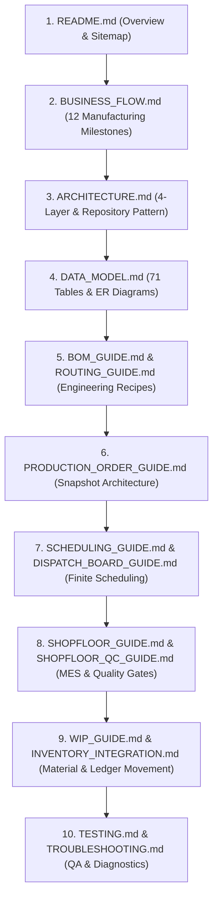

# Production Module — Developer Onboarding Handbook

> **Domain Location:** `app/Domains/Production`  
> **Documentation Root:** `app/Domains/Production/docs/DEVELOPER_ONBOARDING.md`  
> **Target Audience:** Any new backend or full-stack Laravel developer joining the engineering team

---

## 1. Welcome to the Production Domain

The Production module is one of the most sophisticated domains in the ERP. It coordinates heavy mathematical algorithms (finite capacity scheduling, MRP explosion, dynamic formula parsing), strict multi-tenancy, immutable snapshotting, and real-time shopfloor MES tracking.

Before touching code in `app/Domains/Production`, read the documentation in this exact sequence:



---

## 2. Key Directories & Code Map

```text
app/Domains/Production/
├── Controllers/         # 53 Controllers (HTTP routing, validation & view dispatch)
├── DTO/                 # Data Transfer Objects for scheduling & capacity payloads
├── Events/              # Production domain events (timeline hooks)
├── Listeners/           # Event listeners handling cross-domain reactions
├── Models/              # 70 Eloquent Models (extend BaseModel, BelongsToTenant)
├── Policies/            # 13 Gate Policies (RBAC authorization)
├── Repositories/        # 28 Repositories (14 Interfaces + 14 Implementations)
├── Requests/            # 46 FormRequests (Strongly-typed validation rules)
├── Routes/
│   └── web.php          # 298 Named Production Routes
├── Services/            # 74 Domain Services (Core business & scheduling logic)
└── docs/                # Complete 24-document knowledge base & UI screenshots
```

---

## 3. Top 10 Core Domain Services You Must Know

| Service Name | Primary Responsibility | Critical Method |
|---|---|---|
| `ProductionOrderService` | Order lifecycle, snapshotting, release, auto-completion | `createDirect()`, `release()`, `evaluateAndAutoCompleteOrder()` |
| `SchedulingService` | Forward & backward finite capacity scheduling | `generateSchedule()`, `detectConflicts()` |
| `CapacityLevelingService` | Heuristic automated schedule leveling | `previewCapacityLeveling()`, `applyCapacityLeveling()` |
| `SchedulePreReleaseValidationService` | Pre-release gates (materials, machines, dependencies) | `validate($schedule)` |
| `MesExecutionService` | Operator shopfloor actions (start, pause, complete, progress) | `startOperation()`, `completeOperation()`, `logPartialProgress()` |
| `ProductionWipService` | WIP card management, line transfers, SFG consumption | `initializeWip()`, `transferWip()`, `convertWipToFinishedGoods()` |
| `QualityInspectionService`| In-process inspection execution ("Run QC") & disposition | `processShopfloorInspection()` |
| `SubcontractProcurementOrchestrator` | Automated PR/PO generation for outsourced operations | `orchestrateSubcontractProcurement()` |
| `BomFormulaEvaluatorService` | Parameterized mathematical expression evaluation | `evaluateFormula()` |
| `ProductionExecutionService` | Operational scrap write-off and finished goods receipt | `receiveFinishedGoods()`, `logScrap()` |

---

## 4. The 7 Golden Rules for Production Developers

> [!WARNING]
> Violating these rules will corrupt manufacturing state, cause scheduling deadlocks, or break multi-tenant data isolation!

1. **Never Query Models Directly in Controllers:**
   - Controllers must call Domain Services or Repositories. Direct `ProductionOrder::where(...)` calls in controllers violate the 4-layer standard (`PRODUCTION_MODULE_STANDARDS.md`).
2. **Always Respect Database Transaction Boundaries:**
   - All multi-table updates belong inside `DB::transaction(function() { ... })` in the Service layer. Repositories must not encapsulate business transactions.
3. **Never Modify In-Flight Order Engineering Directly:**
   - Once a Production Order is saved, it operates exclusively on its frozen snapshots (`ProductionOrderOperation` and `ProductionOrderReservation`). Never alter master BOM or Routing tables expecting active orders to change.
4. **Never Bypass Tenant Scoping:**
   - Always verify that new entities include `tenant_id` and use the `BelongsToTenant` trait. In raw DB queries, explicitly scope `where('tenant_id', $tenantId)`.
5. **Never Move WIP Without Checking Predecessors:**
   - WIP cannot transfer downstream unless the source operation is completed, skipped, or has logged an approved transfer batch.
6. **Enforce the QC Gate Before Operation Completion:**
   - If an operation has `quality_required == true`, never permit completion until an approved inspection record is verified.
7. **Always Post Stock Movements Through `StockService`:**
   - Never write raw updates to `products_warehouse_stock.on_hand`. Always invoke `StockService::recordInflow()` or `StockService::recordOutflow()`.
