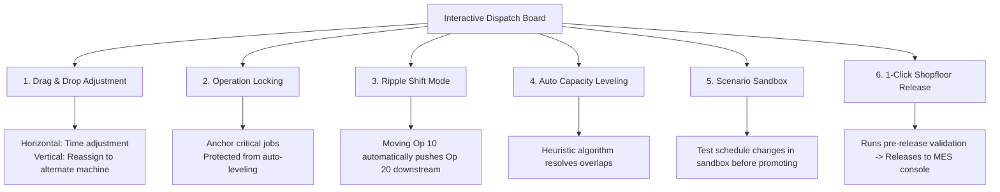
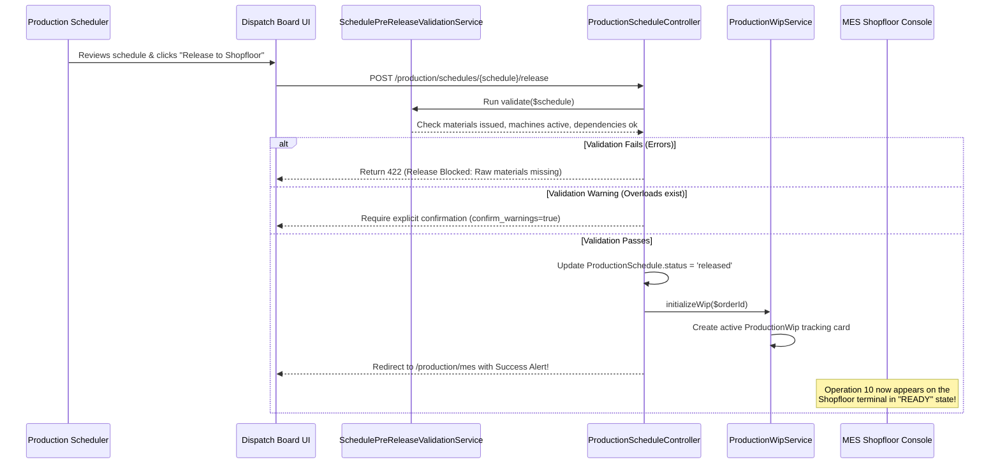

# Production Module — Interactive Dispatch Board & Timeline Guide

> **Domain Location:** `app/Domains/Production`  
> **Documentation Root:** `app/Domains/Production/docs/DISPATCH_BOARD_GUIDE.md`  
> **Primary Screen:** `/production/schedules/dispatch-board`  
> **Controller:** `App\Domains\Production\Controllers\ProductionScheduleController`  
> **Primary Services:** `CapacityPlanningService`, `SchedulingService`, `CapacityLevelingService`

---

## 1. Overview & Visual Architecture

The **Interactive Dispatch Board** is the graphical cockpit where production schedulers visualize shopfloor capacity, resolve machine collisions, adjust operation sequences, and formally release confirmed work orders to the shopfloor.


### Core Visual Elements
- **Work Center Swimlanes:** Grouped by department (e.g. Cutting, Welding, CNC, Assembly).
- **Machine Channels:** Individual rows for each physical machine tool.
- **Time Horizon Grid:** Configurable day, week, and month zoom levels showing shift operating hours.
- **Operation Job Blocks:** Color-coded cards representing `ProductionScheduleOperation` instances, showing order number, product name, quantity, and planned run duration.

---

## 2. Interactive Features & Controls



---

## 3. Detailed Operational Controls

### 3.1 Drag-and-Drop Adjustment
- **Horizontal Movement (Time Shift):** Planners drag an operation block left or right to change its scheduled start and completion timestamps.
- **Vertical Movement (Machine Reassignment):** Planners drag an operation vertically into another machine row within the same work center or an approved alternate machine.
- **AJAX Endpoint:** `POST /production/schedules/operations/{operation}/adjust` updates `planned_start` and `planned_end` with immediate database persistence.

### 3.2 Operation Locking (`toggleLock`)
- **Purpose:** Freeze an operation in place when materials have already been staged at a machine or a customer has requested an exact run window.
- **Action:** Clicking the lock icon on an operation card invokes `POST /production/schedules/operations/{operation}/toggle-lock`.
- **Effect:** Sets `is_locked = true`. The automated leveling engine will never move this operation; surrounding jobs must adjust around it.

### 3.3 Ripple Shift Logic
- When an operation is delayed (e.g. due to maintenance or late raw materials), dragging it forward with **Ripple Shift** enabled automatically cascades the delay to all downstream dependent operations (`previous_operation_id` chain), preventing schedule corruption.

---

## 4. What Happens Between Scheduling and Shopfloor Release?

This is a critical transition in manufacturing operations:



---

## 5. Code-to-Flow Traceability: Releasing from Dispatch Board

```text
User Interface:
  Browser at http://127.0.0.1:8000/production/schedules/dispatch-board
  User clicks: "Release to Shopfloor" button on schedule card
        ↓
HTTP Route:
  POST /production/schedules/{schedule}/release (production.schedules.release)
        ↓
Controller Layer:
  App\Domains\Production\Controllers\ProductionScheduleController::release(Request $request, int $id)
  Authorization: $this->authorize('release', $schedule)
        ↓
Validation Service:
  App\Domains\Production\Services\SchedulePreReleaseValidationService::validate($schedule)
  Verifies: materials issued, machine breakdown status, dependency integrity
        ↓
State Advancement:
  1. $schedule->update(['status' => 'released', 'released_at' => now(), 'released_by' => auth()->id()])
  2. $schedule->order->update(['status' => 'released'])
  3. App\Domains\Production\Services\ProductionWipService::initializeWip($schedule->production_order_id)
        ↓
Redirection:
  Redirects to route('production.mes.dashboard')
```
