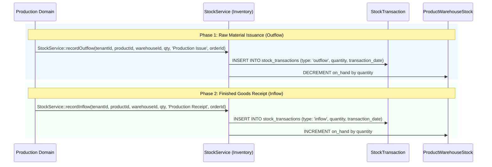

# Production Module — Inventory Integration Guide

> **Domain Location:** `app/Domains/Production`  
> **Documentation Root:** `app/Domains/Production/docs/INVENTORY_INTEGRATION.md`  
> **Partner Domain:** `app/Domains/Inventory`  
> **Core Integration Services:** `App\Domains\Inventory\Services\StockService`, `App\Domains\Production\Services\ProductionExecutionService`  
> **Core Inventory Models:** `Product`, `Warehouse`, `ProductWarehouseStock`, `StockTransaction`

---

## 1. Integration Architecture Overview

The Production domain never directly manipulates warehouse inventory tables with inline queries. All stock movements flow through the canonical `App\Domains\Inventory\Services\StockService`, guaranteeing strict multi-tenant isolation, inventory valuation integrity, and immutable stock ledger auditing.



---

## 2. The 3 Inventory Touchpoints

### Touchpoint 1: Raw Material Reservation & Issuance
- **Reservation Phase:** When an order is created, `ProductionOrderReservation` calculates net component quantities. At this point, stock has **not** left the warehouse; it is marked as reserved to prevent other sales orders from claiming it.
- **Issuance Phase:** Storekeepers review the auto-generated `ProductionRequisitionSlip`. When the physical goods leave the warehouse, `ProductionOrderController::issueMaterial()` calls:
  ```php
  StockService::recordOutflow(
      $tenantId,
      $materialId,
      $warehouseId,
      $quantity,
      "Production Issue for Order #{$order->order_number}",
      $order->id
  );
  ```
- **Ledger Result:** Decrements `ProductWarehouseStock.on_hand` and inserts an audited outflow `StockTransaction`.

---

### Touchpoint 2: Operational Scrap Outflow
- When raw material is damaged or scrapped on the shopfloor (`ProductionExecutionService::logScrap()`), if the item was already issued from warehouse stores, the system posts an inventory adjustment:
  ```php
  StockService::recordOutflow(
      $tenantId,
      $scrapProductId,
      $resolvedWarehouseId,
      $quantity,
      'Production Scrap',
      $order->id
  );
  ```
- **WIP Guardrail:** In-process intermediate WIP scrap does not deduct finished goods warehouse stock because intermediate WIP has not yet been received into a warehouse.

---

### Touchpoint 3: Finished Goods Receipt & Inflow
- When the final operation completes or completed WIP is converted, `ProductionExecutionService::receiveFinishedGoods()` orchestrates the receipt:
  1. Validates destination warehouse (must be active and tenant-owned).
  2. Creates `ProductionOrderReceipt`.
  3. Increments `ProductionOrder.quantity_produced`.
  4. Calls:
     ```php
     StockService::recordInflow(
         $tenantId,
         $order->product_id,
         $destinationWarehouseId,
         $quantity,
         "Production Receipt #{$order->order_number}",
         $order->id
     );
     ```
  5. Updates `ProductWarehouseStock.on_hand` in the target finished goods warehouse.
  6. **Quarantine Handling:** If `qualityStatus === 'quarantine'`, the system automatically routes the inflow into a designated quarantine warehouse rather than main commercial stock!

---

## 3. Batch & Lot Genealogy Trace (`ProductionLotTrace`)

For regulated and batch-tracked manufacturing:
- When finished goods are received, `ProductionLotTrace` records the parent-to-child lineage:
  - Links the `ProductionBatch` (shopfloor manufacturing run) to the destination `inventory_batch_id`.
  - Enables bidirectional traceability: given an end-customer serial number or batch, planners can immediately query which raw material supplier lots were consumed during that exact run.
