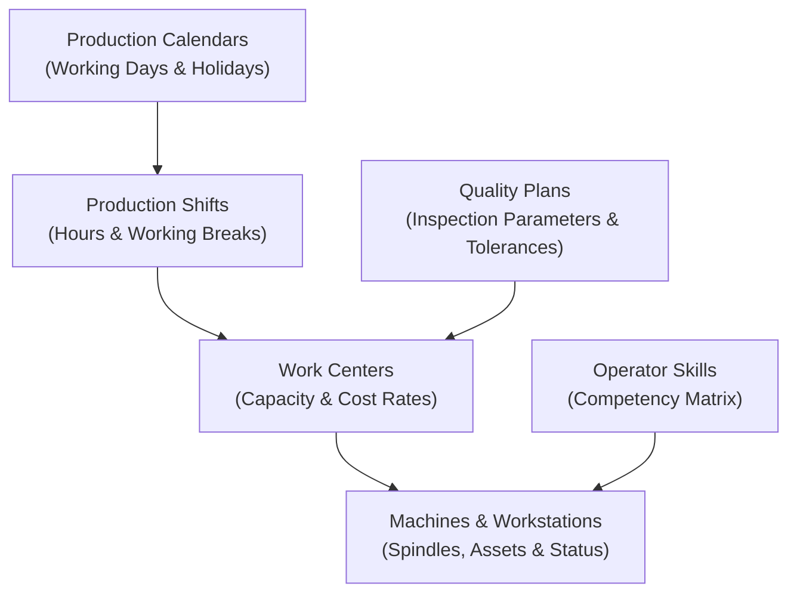

# Production Module — Master Data Engineering Guide

> **Domain Location:** `app/Domains/Production`  
> **Documentation Root:** `app/Domains/Production/docs/MASTER_DATA_GUIDE.md`  
> **Entities Covered:** Work Centers, Machines, Shifts, Calendars, Operator Skills, Quality Plans, Import/Export

---

## 1. Master Data Overview

Production master data defines the physical and operational constraints of the manufacturing plant. It forms the foundation for routing design, finite capacity calculations, shopfloor dispatching, and quality verification.

---

## 2. Work Centers (`WorkCenter`)

A Work Center represents a physical area or department where specific manufacturing tasks occur (e.g. Cutting, Welding, CNC Machining, Paint Shop, Final Assembly).

- **Route:** `production/work-centers`
- **Controller:** `App\Domains\Production\Controllers\WorkCenterController`
- **Model:** `App\Domains\Production\Models\WorkCenter`
- **Key Fields:**
  - `code`: Unique alphanumeric identifier (e.g. `WC-CUT`, `WC-WELD`).
  - `name`: Descriptive name (e.g. `Tube & Component Cutting Center`).
  - `cost_per_hour`: Standard overhead and labor cost applied per runtime hour.
  - `capacity_per_day_hours`: Maximum daily hours available across all workstations.
  - `is_active`: Status flag determining eligibility in routing and scheduling.
- **Relationships:**
  - `hasMany(Machine::class)`: Child machines allocated to this work center.
  - `hasMany(RoutingOperation::class)`: Operations routed to this department.
  - `hasMany(ProductionWip::class)`: Active WIP cards stationed here.

---

## 3. Machines & Equipment (`Machine`)

Machines represent individual tools, CNC centers, presses, or assembly benches within a Work Center.

- **Route:** `production/machines`
- **Controller:** `App\Domains\Production\Controllers\MachineController`
- **Model:** `App\Domains\Production\Models\Machine`
- **Key Fields:**
  - `work_center_id`: Parent Work Center reference.
  - `machine_code` & `name`: Equipment identifier (e.g. `CUT-BANDSAW-01`).
  - `status`: Current operational condition: `idle`, `running`, `breakdown`, `maintenance`.
  - `asset_id`: Optional foreign key linking to the Asset Management domain.
  - `hourly_rate`: Machine-specific depreciation and power operating cost.
- **Maintenance Integration:**
  - When a machine enters `breakdown` or has a pending `MaintenanceWorkOrder`, the finite scheduling engine flags conflicts if operations are scheduled on that machine during the downtime window.

---

## 4. Shifts & Working Calendars

Finite capacity scheduling requires precise knowledge of plant availability.

### 4.1 Production Shifts (`ProductionShift`)
- **Route:** `production/shifts`
- **Model:** `App\Domains\Production\Models\ProductionShift`
- **Attributes:** Shift code, name, `start_time` (e.g. `08:00`), `end_time` (e.g. `16:30`), break durations, and active status.
- **Multi-Shift Support:** Supports single-shift, 2-shift (day/night), or 24/7 continuous operations.

### 4.2 Production Calendars (`ProductionCalendar`)
- **Route:** `production/calendars`
- **Model:** `App\Domains\Production\Models\ProductionCalendar`
- **Holidays Table:** `production_calendar_holidays` defines company holidays, national observances, and planned plant shutdowns. Operations are never scheduled on holiday dates unless specifically overridden.

---

## 5. Quality Plans (`ProductionQualityPlan`)

Quality Plans define standardized inspection criteria applied during in-process operations or finished goods sign-off.

- **Route:** `production/quality-plans`
- **Controller:** `App\Domains\Production\Controllers\QualityPlanController`
- **Model:** `App\Domains\Production\Models\ProductionQualityPlan`
- **Child Entity:** `ProductionQualityPlanParameter`
  - `parameter_name`: e.g. `Frame Length`, `Weld Seam Integrity`, `Paint Thickness`.
  - `data_type`: `numeric`, `pass_fail`, `text`.
  - `min_value`, `max_value`, `target_value`: Numeric tolerance bounds.
  - `is_mandatory`: Enforces completion before inspection can be submitted.

---

## 6. Centralized Master Data Import / Export

Planners and engineers can bulk upload and export master engineering data using standard CSV / Excel templates:
- **Routes:**
  - `production/import-export/download-template/{type}`
  - `production/import-export/import-preview/{type}`
  - `production/import-export/import-confirm/{type}`
  - `production/import-export/export/{type}`
- **Supported Entities (`type`):**
  - `boms`: Master Bills of Materials with item rows.
  - `routings`: Routing headers and sequential operations.
  - `work-centers`: Work Centers and capacity profiles.
  - `machines`: Machine inventories and asset linkages.
