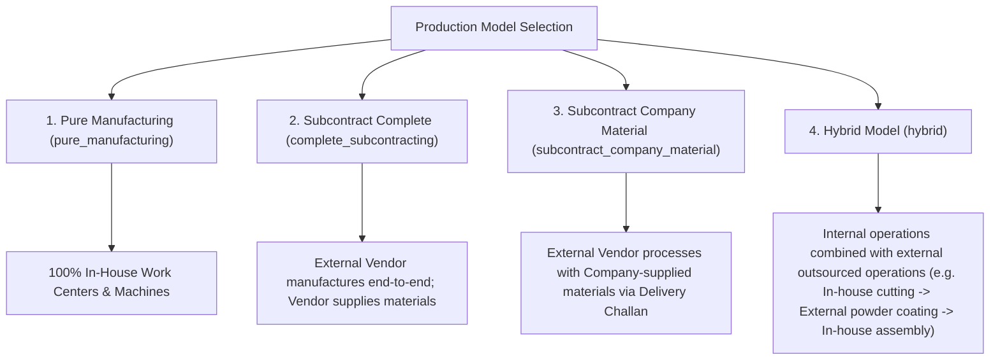

# Production Module — Product Requirements Document (PRD)

> **Document Type:** As-Implemented Product Requirements Document  
> **System:** Multi-Tenant SaaS ERP — Production Planning & MES  
> **Scope:** Implemented & Verified Capabilities (`app/Domains/Production`)

---

## 1. Purpose & Business Problem

Manufacturing enterprises face severe coordination friction between engineering designs, material inventory, machine capacity, shopfloor execution, and quality compliance. The Production module delivers a cohesive, closed-loop Manufacturing Resource Planning (MRP II) and Manufacturing Execution System (MES) designed to:
1. Prevent material stockouts and premature shopfloor releases through automated requisition slips and pre-release readiness gates.
2. Eliminate machine overloads and scheduling bottlenecks through finite capacity scheduling and an interactive drag-and-drop Dispatch Board.
3. Bridge the gap between planner schedules and shopfloor reality via a touch-enabled MES operator console with real-time progress, machine state, and Andon alerts.
4. Guarantee end-to-end batch and lot genealogy across multi-level sub-assemblies (SFG) and finished goods (FG).
5. Enforce in-process quality gates ("Run QC") before intermediate WIP can be transferred downstream, automatically isolating scrap and initiating rework orders.
6. Seamlessly manage outsourced operations (subcontracting/job work) with automated PR/PO procurement and Gate Pass Delivery Challans.

---

## 2. User Roles & Actors

| Actor | Persona / Role Code | Primary Responsibilities in Production |
|---|---|---|
| **Production Manager** | `production_manager` / `admin` | Approves BOMs, Routings, and ECOs; releases production plans; reviews plant OEE, cost variances, and executive dashboards. |
| **Production Planner / Scheduler** | `production_planner` | Runs MRP engine; creates production orders; runs forward/backward scheduling; balances machine capacity on the Dispatch Board; promotes what-if scenarios. |
| **Machine Operator / Shopfloor Tech** | `production_operator` | Logs into touch MES terminal; starts/pauses/completes operations; logs partial progress; reports Andon machine breakdown alerts. |
| **QC Inspector / Quality Engineer** | `quality_inspector` | Executes in-process inspections via "Run QC"; verifies parameter tolerances; files Non-Conformance Reports (NCR); triggers CAPA investigations. |
| **Storekeeper / Materials Manager** | `inventory_manager` | Issues raw materials against Production Requisition Slips; receives completed Finished Goods into warehouse stock. |
| **Subcontracting Executive** | `purchase_executive` | Issues Subcontract Delivery Challans (Gate Passes); dispatches semi-finished goods to external vendors; monitors vendor SLA and turnaround. |

---

## 3. Supported Production Models

The module natively supports 4 distinct manufacturing modes defined on `ProductionOrder.production_model`:

---

## 4. Feature Specifications

### 4.1 Master Data Engineering
- **Multi-Level Bill of Materials (BOM):** Hierarchical assemblies referencing raw materials, intermediate sub-assemblies (`child_bom_id`), scrap percentages, and standard output UOMs.
- **Parameterized Dynamic Formulas:** Mathematical expression parser supporting dynamic component quantities based on dimensions (`length`, `width`, `thickness`, `density`).
- **Engineering Revisions & Approval:** Formal revision tracking (`v1.0`, `v1.1`) with approval states (`draft`, `pending_approval`, `approved`, `rejected`).
- **Routings & Operations:** Step-by-step manufacturing instructions with sequence numbers, assigned Work Centers, alternate machines, setup times, and processing cycle times.
- **Operation Flags:** Individual operation-level switches for `quality_required` (QC gate), `is_external` (subcontracted), `is_parallel` (concurrent processing), and `transfer_batch_quantity` (overlapping operations).

### 4.2 Production Planning & MRP
- **Production Plans:** Long-range manufacturing plans tied to Sales Orders or forecasted demand.
- **Supply-Aware MRP Engine:** Explosion of BOM requirements evaluating current warehouse on-hand stock, existing open reservations, purchase orders in pipeline, Minimum Order Quantities (MOQ), and order multiples.
- **Requisition Slips:** Auto-generation of store requisition slips (`ProductionRequisitionSlip`) linked to planning requirements.

### 4.3 Production Orders & Snapshot Architecture
- **Order Generation:** Supports direct ad-hoc creation or 1-click plan conversion.
- **Immutable Snapshots:** At creation time, the order deep-clones BOM items into `ProductionOrderReservation` and routing steps into `ProductionOrderOperation`. Subsequent changes to master engineering records never alter in-flight production orders.
- **Multi-Level Explosion:** Sub-assemblies produce intermediate operations with distinct `bom_level`, `source_product_id`, and dependency linkages.

### 4.4 Finite Capacity Scheduling & Dispatch Board
- **Scheduling Directions:** Forward scheduling (from start date) and backward scheduling (from customer due date).
- **Calendar & Shift Awareness:** Engine respects plant calendars, official holidays, and shift operating hours per Work Center.
- **Conflict & Overload Detection:** Automatically identifies overlapping operations on single-spindle machines and flags capacity exceedance.
- **Capacity Leveling & Scenarios:** Automated heuristic schedule leveling; creation of isolated sandbox scenarios (`ProductionScheduleScenario`) with side-by-side comparison before promoting to primary schedule.
- **Interactive Dispatch Board:** Visual Gantt interface grouped by Work Center swimlanes, supporting drag-and-drop rescheduling, operation locking, and 1-click shopfloor release.

### 4.5 Shopfloor Execution (MES)
- **Operator Console:** Touch-friendly dashboard filtering jobs by Work Center, machine, or operator assignment.
- **Execution States:** Ready, In Progress, Paused (with pause reason), Completed, On Hold, Cancelled.
- **Partial Progress Logging:** Operators record units produced, scrapped, or rejected without completing the operation.
- **Barcode & QR Scanning:** Integrated scanner console logging badge scans, lot numbers, and machine tags into `ProductionScanLog`.
- **Andon Alert System:** Real-time problem escalation (machine breakdown, material shortage, tooling issue) broadcasting visual alarms to supervisors.

### 4.6 In-Process Quality Control (QC)
- **Gate Enforcement:** When an operation has `quality_required = true`, downstream transfer is held until an authorized inspection is posted.
- **"Run QC" Workflow:** Generates a `ProductionQualityInspection` pre-populated with active parameters from `ProductionQualityPlan`.
- **Disposition Outcomes:**
  - `Passed`: Releases good quantity to WIP for the next operation.
  - `Failed / Rejected`: Auto-creates an open Non-Conformance Report (NCR).
  - `Rework`: Generates a `ProductionReworkOrder` routing defective units to repair work centers.
  - `Scrap`: Logs unrecoverable units into `ProductionOrderScrap`.

### 4.7 Work-in-Progress (WIP) Tracking
- **Entity Model:** `ProductionWip` cards maintaining real-time good, available, completed, rejected, and scrap counts.
- **Transaction Ledger:** Every movement generates an immutable `ProductionWipTransaction` recording source/destination operations, work centers, and cost increments.
- **Cross-Assembly SFG Consumption:** Automatically tracks intermediate components produced in predecessor operations and decrements them upon assembly.

### 4.8 Subcontracting & Delivery Challans
- **Automated Procurement:** External operations automatically trigger draft/approved Purchase Requisitions (PR) or Purchase Orders (PO) based on tenant configuration.
- **Gate Pass Delivery Challans:** Formally issues raw materials or intermediate WIP to external vendors with challan printing and dispatch status tracking.
- **GRN Return Receipt:** When the vendor returns processed goods, stock inflow is verified against challan quantities.

### 4.9 Finished Goods Receipt & Inventory Transfer
- **Inflow Posting:** Final operation completion triggers `receiveFinishedGoods()`, creating a `ProductionOrderReceipt` and invoking `StockService::recordInflow()`.
- **Genealogy Trace:** Maps production batch numbers and serials to inventory ledger stock.

---

## 5. Explicitly Out of Scope / Boundary Limitations

The following capabilities are **not implemented** in the current scope:
1. **Automated Machine Telemetry (IoT / SCADA):** Machine downtime and states are recorded manually by operators; no direct PLC/OPC-UA hardware polling service is implemented.
2. **Dynamic Shopfloor Resequencing (AI Dispatching):** Scheduling adjustments are algorithm-assisted and human-directed via leveling and scenarios; autonomous AI resequencing is not active.
3. **Advanced Cost Variances GL Posting:** While estimated vs actual labor, material, and machine costs are computed on the order show view, automatic double-entry journal vouchers to general ledger accounts are handled in the accounting domain upon receipt rather than within production execution transactions.
