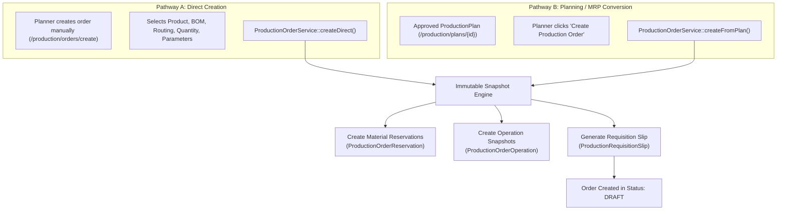
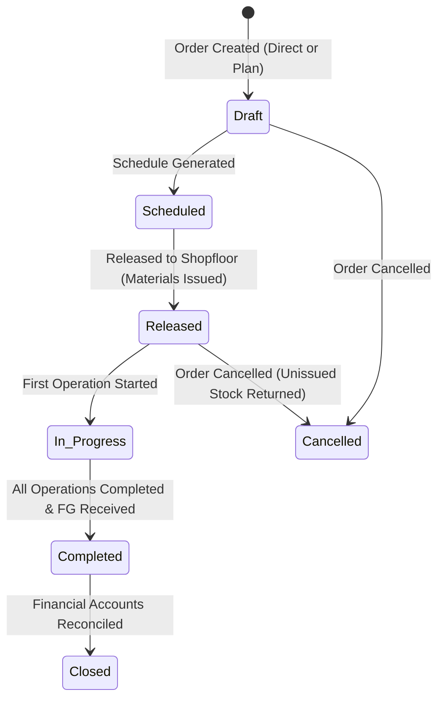

# Production Module — Production Order Lifecycle & Engineering Guide

> **Domain Location:** `app/Domains/Production`  
> **Documentation Root:** `app/Domains/Production/docs/PRODUCTION_ORDER_GUIDE.md`  
> **Primary Model:** `ProductionOrder`  
> **Primary Services:** `ProductionOrderService`, `ProductionReadinessService`, `ProductionMaterialService`, `ProductionCostService`, `ProductionVarianceAnalysisService`

---

## 1. Overview & Business Purpose

A **Production Order** is the binding operational contract that authorizes the shopfloor to manufacture a specified quantity of a product within a scheduled timeframe. It encapsulates the bill of materials, operation sequence, raw material reservations, shopfloor progress, and financial cost variance tracking.


---

## 2. Order Creation Paths

A Production Order can be created through two pathways:



---

## 3. The Snapshotting Architecture

At the exact instant a Production Order is saved, the system freezes the engineering configuration:

### 3.1 Material Reservation Snapshot (`ProductionOrderReservation`)
- For every BOM item, calculates `required_quantity = quantity_ordered * (bom_item.quantity * (1 + bom_item.scrap_percentage / 100))`.
- If dynamic formulas are present, evaluates expression with order parameters.
- Records reservations with initial status `pending_issue`.

### 3.2 Operation Step Snapshot (`ProductionOrderOperation`)
- For each routing step, creates an isolated snapshot row containing:
  - `sequence` & `operation_number`
  - `work_center_id` & `machine_id`
  - `setup_time_planned` & `processing_time_planned`
  - `total_time_planned` (`setup + (quantity * cycle_time)`)
  - Subcontract configuration (`is_external`, `vendor_id`, `subcontract_lead_time_days`)
  - Dependency linkages (`previous_operation_id`, `is_parallel`)

### 3.3 Multi-Level Sub-Assembly Snapshot (`snapshotMultiLevelRoutings`)
If intermediate sub-assemblies (SFG) exist, the engine recursively generates intermediate operations flagged with:
- `is_intermediate = true`
- `bom_level = 2` (or deeper)
- `source_product_id = sub_assembly_product_id`
- `target_produced_qty = calculated_sfg_quantity`

---

## 4. Material Readiness & Requisition Slips

Before an order can be released to the shopfloor, raw materials must be confirmed.

### Requisition Slips (`ProductionRequisitionSlip`)
- Automatically generated upon order creation.
- Communicates pick requests to the Storekeeper:
  - Raw material item IDs and required quantities.
  - Required warehouse storage location.
- As the storekeeper issues stock via `StockService::recordOutflow()`, the slip advances:
  - `pending` → `partially_issued` → `fully_issued`.

### Production Readiness Engine (`ProductionReadinessService`)
The order show view displays real-time readiness meters:
- **Material Readiness %:** `(Issued Materials / Total Required Materials) * 100`.
- **Machine Readiness %:** Confirms assigned machines are active and not in breakdown.
- **Release Guardrail:** Unless explicitly forced by an administrator, orders **cannot be released** until raw materials are at least partially issued by the store.

---

## 5. Cost Variance & Financial Tracking

The detail view computes live variance analysis across 4 pillars:

| Cost Component | Estimated / Standard Calculation | Actual Incurred Calculation |
|---|---|---|
| **Raw Materials** | Sum of BOM standard component costs * ordered qty | Sum of actual stock issue transactions (`StockTransaction.unit_cost * quantity_issued`) |
| **Direct Labor** | Sum of planned run times * Work Center hourly labor rate | Actual operator logged execution hours * operator hourly rate |
| **Machine Overhead** | Sum of planned machine cycle times * machine hourly rate | Actual machine runtime * machine depreciation hourly rate |
| **Subcontracting** | Sum of external operation planned subcontract costs | Invoiced vendor Purchase Order amount for service line |

---

## 6. Order Status State Machine



### Auto-Completion Guard (`evaluateAndAutoCompleteOrder`)
When an operator completes the final routing step, `ProductionOrderService::evaluateAndAutoCompleteOrder()` checks whether all operations have satisfied their target quantities. If true, it automatically sets `ProductionOrder.status = completed` and timestamps `completed_at = now()`.

---

## 7. Code-to-Flow Traceability: Creating a Production Order

```text
User Interface:
  Browser at http://127.0.0.1:8000/production/orders/create
  Form submit: product_id, quantity_ordered, start_date, end_date, bom_id, routing_id
        ↓
HTTP Route:
  POST /production/orders (Route name: production.orders.store)
        ↓
Controller Layer:
  App\Domains\Production\Controllers\ProductionOrderController::store(StoreProductionOrderRequest $request)
  Authorization: Gate::authorize('create', ProductionOrder::class)
        ↓
Domain Service:
  App\Domains\Production\Services\ProductionOrderService::createDirect(array $data, int $tenantId, int $userId)
  Transaction boundary: DB::transaction(...)
        ↓
Snapshot Execution:
  1. $order = ProductionOrder::create([...])
  2. $this->createMaterialReservation($order, $bomItem, $quantity)
  3. $this->createRequisitionSlip($order, $itemsToResolve)
  4. $this->snapshotMultiLevelRoutings($order, $bom, $routing, $quantity, $tenantId, $userId)
        ↓
Event Timeline:
  App\Domains\Production\Services\ProductionEventService::writeEvent(
      eventType: 'Order Created',
      title: 'Production Order Created'
  )
```
