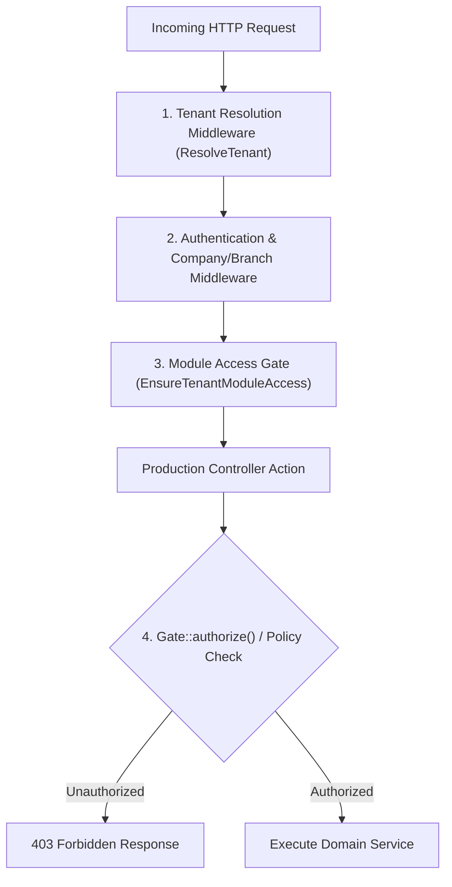

# Production Module — RBAC & Permissions Architecture Guide

> **Domain Location:** `app/Domains/Production`  
> **Documentation Root:** `app/Domains/Production/docs/RBAC_PERMISSIONS.md`  
> **Policy Location:** `app/Domains/Production/Policies`  
> **Total Policies:** 13 Domain Policies

---

## 1. Role-Based Access Architecture

Authorization in the Production module operates across three distinct security checkpoints:
1. **Module Access Middleware (`EnsureTenantModuleAccess`):** Verifies that the tenant has subscribed to the Production module.
2. **Controller Gates (`Gate::authorize()`):** Enforces fine-grained CRUD actions via dedicated Domain Policies.
3. **Shopfloor Execution Guard (`hasProductionPermission('production.mes.execute')`):** Protects touch operator terminals from unauthorized data entry.

---

## 2. Production Domain Policies (13 Policies)

Located in `app/Domains/Production/Policies/` and registered in `AppServiceProvider`:

| Policy Class | Target Model | Enforced Methods |
|---|---|---|
| `ProductionOrderPolicy` | `ProductionOrder` | `viewAny`, `view`, `create`, `update`, `delete`, `release`, `issue`, `receive` |
| `ProductionBomPolicy` | `ProductionBom` | `viewAny`, `view`, `create`, `update`, `delete`, `submit`, `approve` |
| `RoutingPolicy` | `Routing` | `viewAny`, `view`, `create`, `update`, `delete`, `approve` |
| `ProductionSchedulePolicy` | `ProductionSchedule` | `viewAny`, `view`, `create`, `delete`, `release`, `cancel` |
| `WorkCenterPolicy` | `WorkCenter` | `viewAny`, `view`, `create`, `update`, `delete` |
| `MachinePolicy` | `Machine` | `viewAny`, `create`, `update`, `delete` |
| `ProductionPlanPolicy` | `ProductionPlan` | `viewAny`, `view`, `create`, `update`, `release`, `mrp` |
| `QualityPlanPolicy` | `ProductionQualityPlan` | `viewAny`, `create`, `update`, `delete` |
| `QualityInspectionPolicy` | `ProductionQualityInspection`| `viewAny`, `create`, `approve` |
| `ProductionEcoPolicy` | `ProductionEco` | `viewAny`, `create`, `approve`, `release` |
| `DeliveryChallanPolicy` | `DeliveryChallan` | `viewAny`, `create`, `dispatch`, `receive` |
| `ShiftPolicy` | `ProductionShift` | `viewAny`, `create`, `update`, `delete` |
| `CalendarPolicy` | `ProductionCalendar` | `viewAny`, `create`, `update`, `delete` |

---

## 3. Production Permission Keys Catalog

| Permission Key | Description | Typical Roles |
|---|---|---|
| `production.dashboard.view` | View plant executive OEE dashboard and KPI summaries | Manager, Admin |
| `production.boms.manage` | Create, edit, submit, and duplicate Bills of Materials | Engineering, Planner |
| `production.boms.approve` | Formally approve or reject BOM revisions | Production Manager |
| `production.routing.manage` | Configure routing operations and machine links | Engineering, Planner |
| `production.plans.manage` | Create aggregate production plans and run MRP | Planner |
| `production.orders.view` | View orders directory, reservations, and variance tabs | All Production Roles |
| `production.orders.create` | Create direct production orders | Planner, Manager |
| `production.orders.release` | Release production order to shopfloor | Planner, Manager |
| `production.schedules.manage` | Generate schedules, level capacity, shift operations on Dispatch Board | Scheduler, Planner |
| `production.schedules.release` | Formally release schedule to shopfloor MES | Scheduler, Manager |
| `production.mes.execute` | Start/pause operations, log progress, report Andon, run QC, and log scrap | Machine Operator, Shopfloor Lead |
| `production.quality.inspect` | Perform parameter inspections, approve inspection reports, issue NCRs | QC Inspector, Quality Lead |
| `production.wip.manage` | View WIP cards, transfer WIP, adjust quantities, convert to FG | Shopfloor Lead, Manager |
| `production.subcontract.manage` | Issue Delivery Challans, dispatch goods, and record vendor returns | Subcontract Exec, Purchase |

---

## 4. UI Visibility vs Backend Authorization Audit

- **Audit Finding:** UI elements (such as "Release to Shopfloor", "Approve BOM", and "Run QC") are conditionally hidden in Blade views using `@can(...)` or `@if(auth()->user()->hasProductionPermission(...))` directives.
- **Security Check:** Even if an unauthorized user attempts to craft a direct HTTP POST request to `/production/mes/{op}/start`, the controller enforces `abort_unless(auth()->user()->hasProductionPermission('production.mes.execute'), 403)`, guaranteeing robust backend security.
