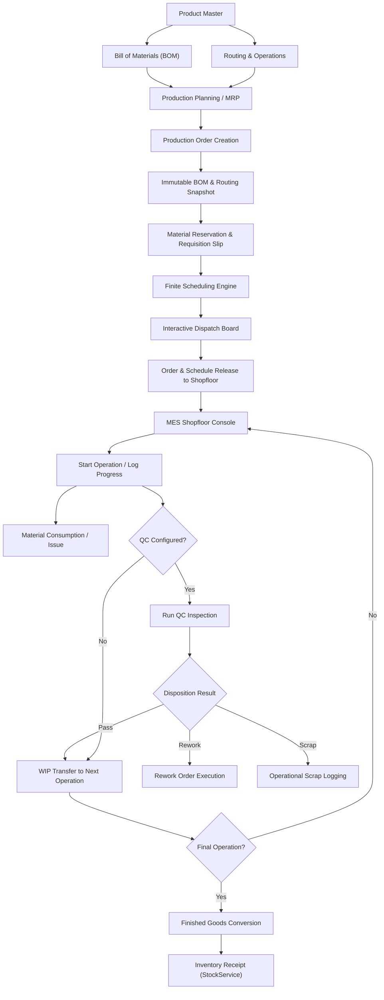
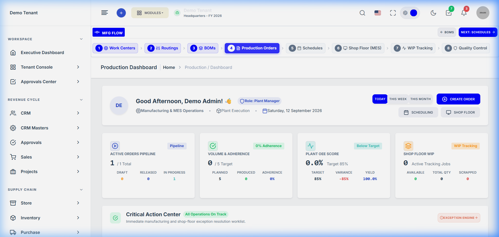
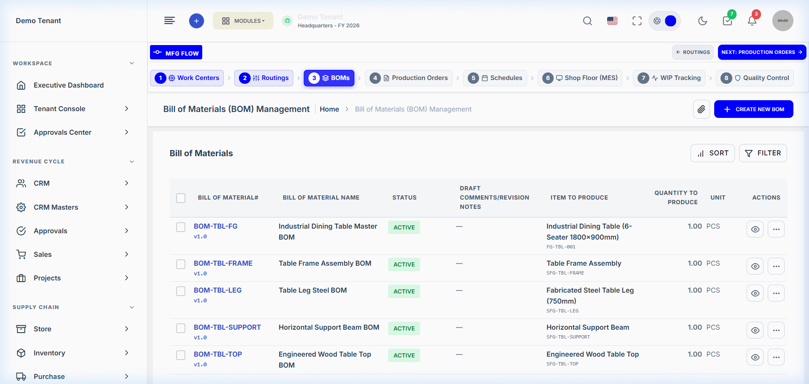
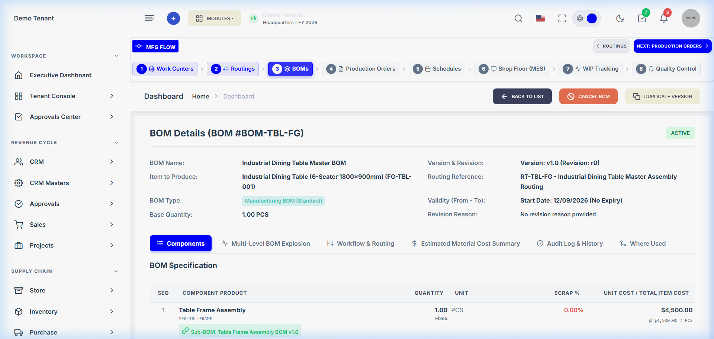
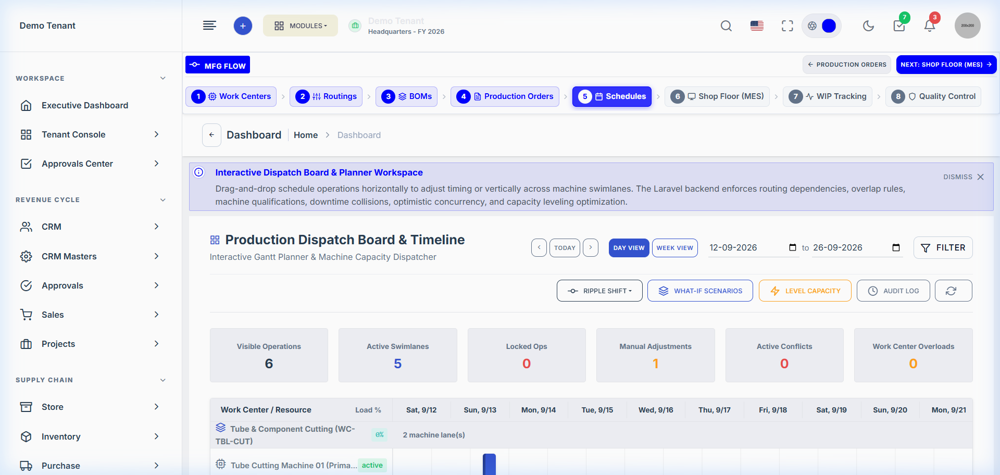
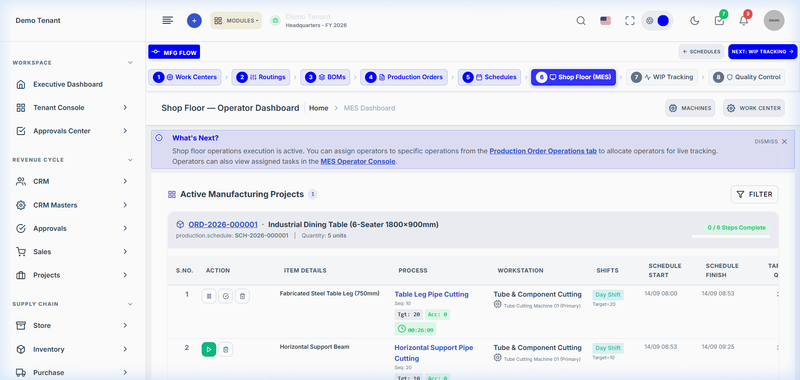
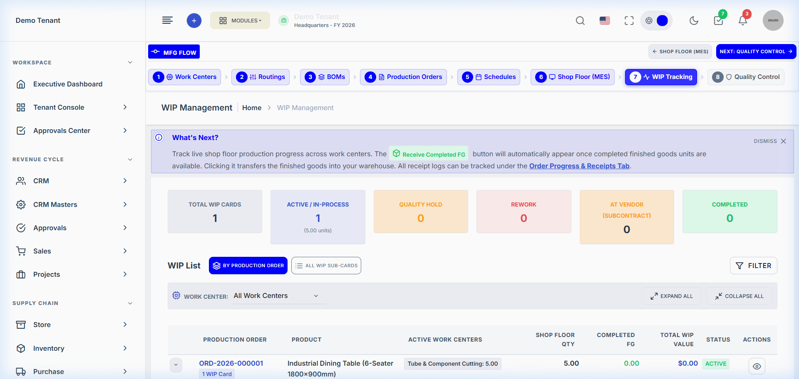
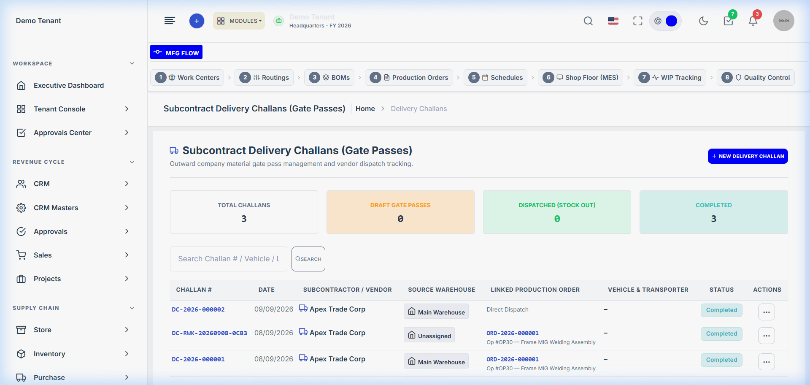
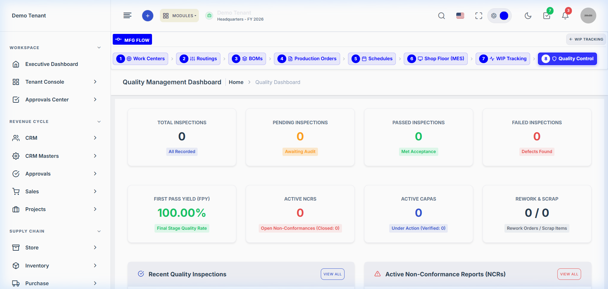

# Production Module — Complete Developer Knowledge Base & Architecture Guide

> **Domain Location:** `app/Domains/Production`  
> **Documentation Root:** `app/Domains/Production/docs`  
> **System Status:** Enterprise Production Ready (Fully Implemented & Verified)  
> **Source of Truth:** Live Codebase & Verified UI (`http://127.0.0.1:8000`)

---

## 1. Executive Summary

The **Production Planning & Manufacturing Execution (MES)** module is an enterprise-grade multi-tenant manufacturing management suite built within the Laravel SaaS ERP ecosystem. It models, schedules, executes, and audits discrete industrial manufacturing operations from Bill of Materials (BOM) engineering through finite capacity scheduling, touch-enabled shopfloor tracking, in-process quality control (QC), Work-in-Progress (WIP) tracking, subcontracting (job work), and finished goods (FG) inventory receipt.

### Key Capabilities at a Glance
- **Engineering Master Data:** Multi-level Bills of Materials (BOM), parameterized dynamic formulas, engineering revisions, and granular routing operations with Work Center / Machine constraints.
- **Production Planning & MRP:** Demand-driven Material Requirements Planning (MRP), supply-aware lot sizing, shortages tracking, and plan-to-order explosion.
- **Production Orders:** Direct and plan-based order generation, immutable BOM and routing snapshots, material reservations, and automated requisition slips.
- **Finite Scheduling & Dispatch Board:** Forward and backward constraint-based scheduling, shift/calendar aware capacity planning, overload leveling, what-if scenarios, and visual Gantt Dispatch Board.
- **MES & Shopfloor Execution:** Touch-enabled operator console, barcode/QR scanning, start/pause/resume tracking, machine state logging, partial output recording, and Andon escalation alerts.
- **In-Process Quality Control:** Configurable inspection plans, tolerance validation, non-conformance reports (NCR), corrective/preventive actions (CAPA), deviations, and disposition workflows.
- **WIP & Material Genealogy:** Batch pipeline tracking, inter-operation WIP transfers, semi-finished goods (SFG) cross-assembly consumption, and lot traceability.
- **Subcontracting & Job Work:** Pure and hybrid subcontract models, automated PR/PO orchestration, gate pass Delivery Challans, and GRN inventory reconciliation.
- **Plant Maintenance:** Machine breakdown work orders, PM schedules, and preventive maintenance blocking of scheduling swimlanes.

---

## 2. Production Domain Verification Overview

On September 12, 2026, an exhaustive read-only audit and live UI verification was conducted across the module. The system inventory confirmed:

| Metric | Verified Count | Scope & Details |
|---|---|---|
| **Models** | `70` | All Eloquent models in `app/Domains/Production/Models` |
| **Controllers** | `53` | Dedicated controllers in `app/Domains/Production/Controllers` |
| **Domain Services** | `74` | Pure business logic services in `app/Domains/Production/Services` |
| **Repositories** | `28` | 14 interfaces + 14 Eloquent implementations in `app/Domains/Production/Repositories` |
| **Form Requests** | `46` | Strongly-typed validation requests in `app/Domains/Production/Requests` |
| **Policies** | `13` | Fine-grained RBAC authorization policies in `app/Domains/Production/Policies` |
| **Registered Routes** | `298` | Named routes under `Route::prefix('production')` |
| **Feature Test Suites** | `84` | 56 suites in `tests/Feature/Production/` + 28 in `tests/Feature/Production*.php` |
| **Production DB Tables** | `71` | Production-scoped tables with tenant isolation |

---

## 3. High-Level Manufacturing Lifecycle

The actual verified end-to-end manufacturing flow follows this lifecycle:



---

## 4. Live UI Screen Tour

Below are verified screenshots captured from the live application running with demo tenant `warrgyizmorsch` at `http://127.0.0.1:8000`:

### Production Executive Dashboard

*Provides plant-wide visibility into Active Orders Pipeline, Volume & Schedule Adherence, OEE Scores, WIP value, and the Critical Action Center.*

### Bill of Materials (BOM) Directory & Specification

*BOM management table displaying multi-level assemblies, active revisions, and approval statuses.*


*Detailed component breakdown for Master BOM `#BOM-TBL-FG` with raw materials, component ratios, and routing references.*

### Interactive Dispatch Board & Gantt Planner

*Visual scheduling board with Work Center swimlanes, drag-and-drop operations, machine capacity, leveling, and What-If scenario tools.*

### Shopfloor Execution Console (MES)

*Touch-enabled terminal for machine operators to start jobs, record partial output, trigger Andon calls, and log operational scrap.*

### Work-in-Progress (WIP) Tracking

*Real-time visibility into active WIP batches, work center queues, and stage completion.*

### Subcontract Delivery Challans (Gate Pass)

*Outsourced WIP tracking with vendor gate passes, material dispatch, and GRN return tracking.*

### Quality Control Dashboard

*First Pass Yield (FPY), inspection logs, NCR disposition, and corrective action workflows.*

---

## 5. Documentation Directory Map

This knowledge base is organized into 24 specialized developer guides:

| Document | Description |
|---|---|
| [PRD.md](PRD.md) | As-implemented Product Requirements Document, boundaries, and actors |
| [ARCHITECTURE.md](ARCHITECTURE.md) | Technical architecture: 4-layer structure, tenancy, event bus, and transactions |
| [BUSINESS_FLOW.md](BUSINESS_FLOW.md) | End-to-end business journey from engineering through inventory transfer |
| [USER_WORKFLOW.md](USER_WORKFLOW.md) | Step-by-step practical user manual with UI actions and screenshots |
| [MASTER_DATA_GUIDE.md](MASTER_DATA_GUIDE.md) | Work Centers, Machines, Shifts, Calendars, Operator Skills, Quality Plans |
| [BOM_GUIDE.md](BOM_GUIDE.md) | Multi-level BOMs, dynamic formulas, version revisions, and explosion |
| [ROUTING_GUIDE.md](ROUTING_GUIDE.md) | Routing operations, dependencies, transfer batches, and machine constraints |
| [PRODUCTION_ORDER_GUIDE.md](PRODUCTION_ORDER_GUIDE.md) | Order lifecycle, snapshotting, material requisitions, readiness, and variance |
| [SCHEDULING_GUIDE.md](SCHEDULING_GUIDE.md) | Forward/backward scheduling algorithm, leveling, and scenario management |
| [DISPATCH_BOARD_GUIDE.md](DISPATCH_BOARD_GUIDE.md) | Visual Dispatch Board, swimlanes, lock controls, and release mechanics |
| [SHOPFLOOR_GUIDE.md](SHOPFLOOR_GUIDE.md) | Operator MES terminal, touch execution, progress logging, and Andon alerts |
| [SHOPFLOOR_QC_GUIDE.md](SHOPFLOOR_QC_GUIDE.md) | In-process quality control, "Run QC", tolerance checks, NCR, and CAPA |
| [WIP_GUIDE.md](WIP_GUIDE.md) | Work-in-Progress tracking, batch genealogy, SFG consumption, and FG transfer |
| [SCRAP_REWORK_GUIDE.md](SCRAP_REWORK_GUIDE.md) | Scrap vs rework lifecycle, defect dispositions, and inventory cost impact |
| [SUBCONTRACTING_GUIDE.md](SUBCONTRACTING_GUIDE.md) | Outsourced WIP, auto-procurement, Delivery Challans, and GRN receipt |
| [INVENTORY_INTEGRATION.md](INVENTORY_INTEGRATION.md) | Raw material reservations, store issue, and finished goods inflow postings |
| [DATA_MODEL.md](DATA_MODEL.md) | Comprehensive data dictionary of 71 production tables with ER diagrams |
| [STATUS_LIFECYCLE.md](STATUS_LIFECYCLE.md) | State machine diagrams and transition guards across all entities |
| [RBAC_PERMISSIONS.md](RBAC_PERMISSIONS.md) | Permissions audit, policy gates, and role assignments |
| [TESTING.md](TESTING.md) | Test suite catalog (84 test suites), test execution instructions, and verified results |
| [DEVELOPER_ONBOARDING.md](DEVELOPER_ONBOARDING.md) | Recommended reading path, critical code classes, and common traps |
| [TROUBLESHOOTING.md](TROUBLESHOOTING.md) | Diagnostic guide for unreleased orders, scheduling blocks, and WIP reconciliation |
| [AUDIT_FINDINGS.md](AUDIT_FINDINGS.md) | Full architectural findings, verified robust areas, and documentation notes |

---

## 6. Quick Start for Developers

### Local Environment
- **Web App URL:** `http://127.0.0.1:8000`
- **Default Credentials:** `admin@example.com` / `password`
- **Default Tenant Slug:** `warrgyizmorsch`

### Key Command Reference
```bash
# Run core Production feature tests
php vendor/phpunit/phpunit/phpunit tests/Feature/Production/AuditFixesTest.php --no-coverage
php vendor/phpunit/phpunit/phpunit tests/Feature/Production/ShopfloorQcScrapReworkArchitectureTest.php --no-coverage
php vendor/phpunit/phpunit/phpunit tests/Feature/Production/ScheduleDispatchAndPreReleaseTest.php --no-coverage

# Re-seed Table Manufacturing Demo
php artisan db:seed --class="Database\Seeders\TableManufacturingProductionSeeder"
```
