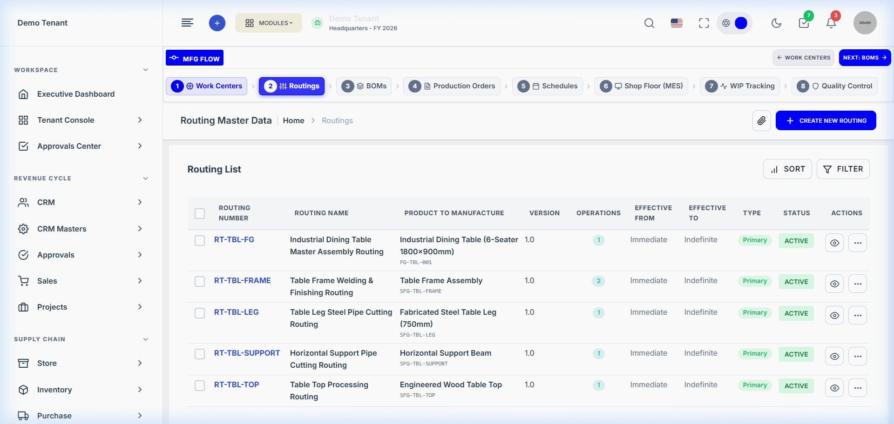
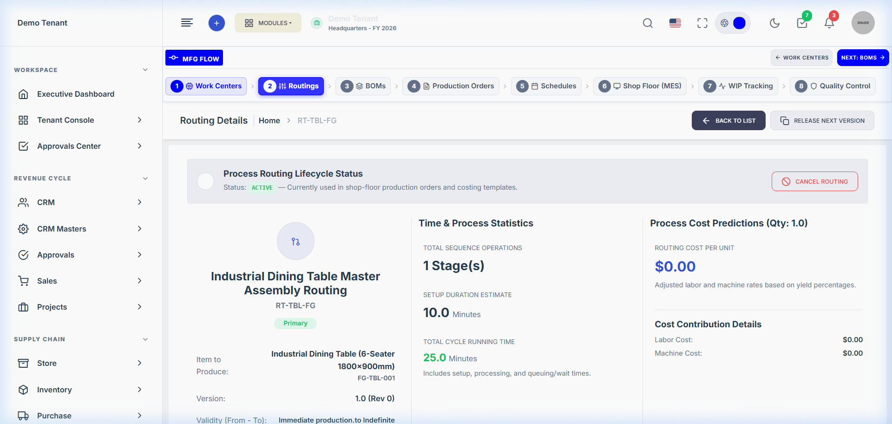
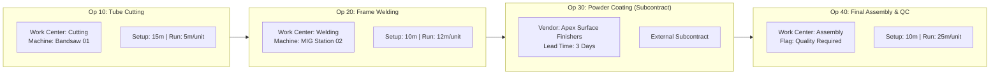

# Production Module — Routing & Operations Engineering Guide

> **Domain Location:** `app/Domains/Production`  
> **Documentation Root:** `app/Domains/Production/docs/ROUTING_GUIDE.md`  
> **Primary Models:** `Routing`, `RoutingOperation`, `RoutingOperationMaterial`, `RoutingOperationAlternateMachine`  
> **Primary Services:** `RoutingService`, `RoutingRecommendationService`, `RoutingCostService`

---

## 1. Overview & Business Purpose

A **Routing** defines the ordered sequence of manufacturing operations required to convert raw materials into a finished product or sub-assembly. While the BOM defines *what* is consumed, the Routing defines *where*, *how*, and *in what order* work is executed.




---

## 2. Anatomy of a Routing Operation (`RoutingOperation`)

Each stage in a routing represents an individual work center activity:



### Core Configuration Attributes
- **`sequence` & `operation_number`:** Step ordering (e.g. `10`, `20`, `30`). Sequence determines predecessor-successor flow unless explicitly configured as parallel.
- **`work_center_id` & `machine_id`:** Primary Work Center and preferred machine tool.
- **Time Profiles:**
  - `setup_time_minutes`: Fixed calibration time incurred once per production batch.
  - `processing_time_minutes`: Variable cycle time incurred per unit produced.
  - `teardown_time_minutes`: Post-run machine cleanup and tooling removal.
- **Alternate Machines:** Defined in `production_routing_operation_alternate_machines` to give the finite scheduling engine options during capacity leveling.

---

## 3. Advanced Operation Behaviors

### 3.1 Parallel Operations (`is_parallel`)
When multiple components can be manufactured concurrently (e.g. cutting table legs while cutting tabletop wood), operations are flagged with:
- `is_parallel = true`
- `parallel_group = "SUB_COMPONENTS"`
- `parallel_type = "AND"` (both must complete before assembly) or `"OR"` (alternative processes).
- **Scheduling Effect:** Forward scheduling schedules both operations simultaneously starting at the same timestamp on their respective work centers.

### 3.2 Transfer Batches & Overlapping Operations (`transfer_batch_quantity`)
In high-volume manufacturing, waiting for an entire batch (e.g. 500 units) to finish before moving the first unit to the next work center creates excessive lead times.
- `overlap_enabled = true`
- `transfer_batch_quantity = 50.0`: As soon as 50 units complete Op 10, Op 20 can begin immediately without waiting for the remaining 450 units!
- `transfer_lag_minutes = 15`: Buffer for material handler transit between bays.

### 3.3 Quality Required (`quality_required = true`)
- **Crucial In-Process Gate:** When checked, the shopfloor MES engine enforces an inspection gate. Operators cannot transfer WIP to the next operation until a Quality Inspector completes an inspection and issues an approved disposition.

### 3.4 External Subcontract Operations (`is_external = true`)
- Flags the operation as outsourced (e.g. heat treatment, electroplating, anodizing).
- Requires `vendor_id`, `subcontract_lead_time_days`, `subcontract_cost_per_unit`, and `subcontract_service_product_id`.
- Automatically orchestrates Purchase Requisitions (PR) or Purchase Orders (PO) upon release.

---

## 4. How Routing Shapes Downstream Execution

| Engineering Routing Configuration | Downstream Effect on Production Order & Shopfloor |
|---|---|
| `setup_time_minutes` & `processing_time_minutes` | Calculates total planned duration: `setup + (quantity * cycle_time)`. Used by finite scheduling engine. |
| `work_center_id` & `machine_id` | Determines machine swimlane on Dispatch Board and operator filter on MES dashboard. |
| `previous_operation_id` / `dependencies` | Prevents next operation from starting in MES until predecessor is completed or transfer batch is logged. |
| `quality_required = true` | Renders the **Run QC** action on MES console; blocks downstream WIP transfer until passed. |
| `is_external = true` | Renders Delivery Challan dispatch button; pauses shopfloor timer while goods are at vendor site. |

---

## 5. Code-to-Flow Traceability: Creating a Routing

```text
User Interface:
  Browser at http://127.0.0.1:8000/production/routing/create
  Form submit: product_id, routing_code, operations array
        ↓
HTTP Route:
  POST /production/routing (Route name: production.routing.store)
        ↓
Controller Layer:
  App\Domains\Production\Controllers\RoutingController::store(StoreRoutingRequest $request)
  Authorization: Gate::authorize('create', Routing::class)
        ↓
Form Request:
  App\Domains\Production\Requests\StoreRoutingRequest
  Validates: product_id, operations.*.name, operations.*.work_center_id, operations.*.processing_time_minutes
        ↓
Domain Service:
  App\Domains\Production\Services\RoutingService::create(array $data, int $tenantId, int $userId)
  Number generation: App\Domains\Production\Services\RoutingNumberService::generateNextNumber()
        ↓
Models & Database:
  INSERT INTO routings (tenant_id, routing_number, product_id, status)
  INSERT INTO production_routing_operations (tenant_id, routing_id, sequence, operation_number, work_center_id, machine_id, setup_time_minutes, processing_time_minutes, quality_required, is_external)
```
