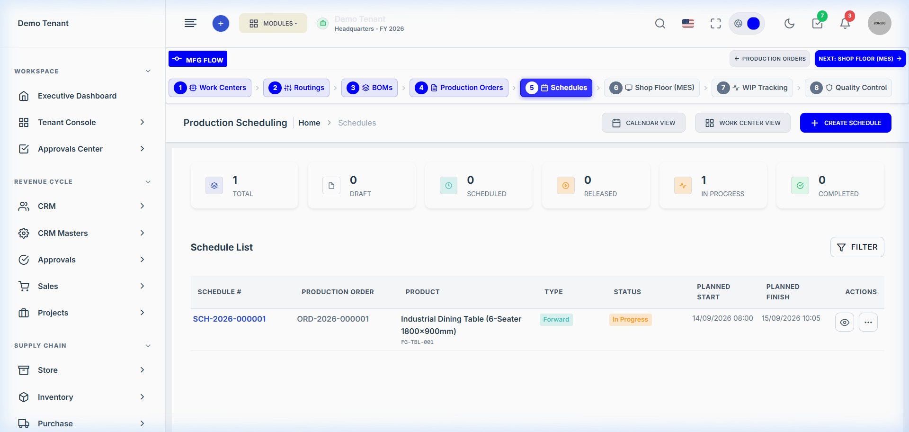
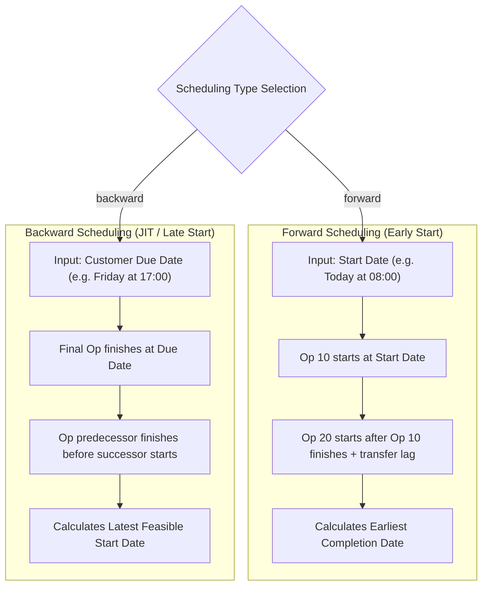

# Production Module — Finite Capacity Scheduling Engine Guide

> **Domain Location:** `app/Domains/Production`  
> **Documentation Root:** `app/Domains/Production/docs/SCHEDULING_GUIDE.md`  
> **Primary Models:** `ProductionSchedule`, `ProductionScheduleOperation`, `ProductionScheduleScenario`  
> **Primary Services:** `SchedulingService`, `SchedulingCalendarService`, `CapacityPlanningService`, `CapacityLevelingService`, `SchedulePreReleaseValidationService`

---

## 1. Overview & Scheduling Philosophy

Industrial production cannot assume infinite machine capacity. If three jobs are assigned to a single laser cutting machine on Monday morning, executing them simultaneously is physically impossible.

The **Finite Capacity Scheduling Engine** calculates precise operation start and finish timestamps based on:
1. **Physical Machine Availability:** Only one active job per spindle/machine at any given minute.
2. **Plant Calendar & Working Shifts:** Only consumes time during configured working shift hours (e.g. 08:00–16:30), skipping company holidays and planned maintenance windows.
3. **Predecessor Dependencies:** Enforces finish-to-start (FS) constraints between sequence steps.
4. **Setup & Processing Durations:** Incorporates fixed setup time plus variable runtime based on batch quantity.



---

## 2. The Scheduling Algorithms



### Forward Scheduling Algorithm
Implemented in `SchedulingService::generateSchedule()`:
1. For each operation in sequence:
   - Evaluates machine availability from the requested start date.
   - Converts planned minutes (`setup_time_planned + processing_time_planned`) into working shift blocks via `SchedulingCalendarService`.
   - If machine is occupied by an existing confirmed schedule, finds the next available time slot.
   - Sets `planned_start` and `planned_end`.
   - Feeds `planned_end + transfer_lag_minutes` as the earliest allowable start for successor operations.

---

## 3. Conflict & Overload Detection

The scheduling service constantly monitors for operational collisions across two vectors:

### 3.1 Machine Overlaps (`detectConflicts()`)
- Detects if two `ProductionScheduleOperation` rows on the same `machine_id` have overlapping time windows `[planned_start, planned_end]`.
- Renders visible warning badges on the Dispatch Board and logs alerts in the schedule detail view.

### 3.2 Daily Capacity Overloads (`detectOverloads()`)
- Compares total scheduled runtime hours for a Work Center against `work_centers.capacity_per_day_hours`.
- Flags red alert if utilization exceeds 100%.

---

## 4. Automated Capacity Leveling (`CapacityLevelingService`)

When conflicts or overloads exist, planners do not need to manually calculate dates for dozens of operations:

1. **Trigger:** Click **Level Capacity** on the schedule or Dispatch Board.
2. **Heuristic Engine:**
   - Evaluates priority ordering based on order due date, customer importance, and operation locks.
   - Identifies unlocked conflicting operations.
   - Shifts the lower-priority operation forward to the earliest open window on that machine or an alternate machine (`RoutingOperationAlternateMachine`).
   - Recursively cascades adjustments downstream to ensure successor dependencies are not violated.
3. **Preview & Apply:** Planners can preview the leveling displacement (`POST /production/schedules/capacity-leveling/preview`) before committing the adjustments to database (`POST /production/schedules/capacity-leveling/apply`).

---

## 5. What-If Scenarios (`ProductionScheduleScenario`)

Planners frequently need to model hypothetical schedule disruptions without risking active shopfloor operations:
- **Sandbox Creation:** Planners clone an active schedule into an isolated scenario: `POST /production/schedules/scenarios`.
- **Modifications:** Shift orders, simulate adding an extra overtime shift, or simulate a machine breakdown.
- **Side-by-Side Comparison:** View comparison metrics (total duration, machine utilization, delay days) via `/production/schedules/scenarios/{id}/compare`.
- **Promote / Discard:** If the scenario proves superior, clicking **Promote Scenario** atomically copies scenario dates into the primary schedule and updates the dispatch board.

---

## 6. Pre-Release Validation (`SchedulePreReleaseValidationService`)

Before a schedule can transition to `released`, the system runs a server-side audit:

| Check | Severity | Validation Rule |
|---|---|---|
| **Material Shortage** | Error (Blocks Release) | Raw materials must be fully or partially issued by the store department. |
| **Machine Breakdown** | Error (Blocks Release) | Machine must not have status `breakdown` during scheduled dates. |
| **Schedule Overlap** | Warning (Requires Confirmation) | Operations share the same machine at the same time. Requires planner sign-off. |
| **Shift Overload** | Warning (Requires Confirmation) | Scheduled hours exceed standard shift length. |

---

## 7. Code-to-Flow Traceability: Scheduling an Order

```text
User Interface:
  Browser at http://127.0.0.1:8000/production/schedules/create
  Select: production_order_id, start_date, scheduling_type (forward/backward)
        ↓
HTTP Route:
  POST /production/schedules (Route name: production.schedules.store)
        ↓
Controller Layer:
  App\Domains\Production\Controllers\ProductionScheduleController::store()
  Authorization: $this->authorize('create', ProductionSchedule::class)
        ↓
Domain Service:
  App\Domains\Production\Services\SchedulingService::generateSchedule($order, $startDate, $type)
  Calls: App\Domains\Production\Services\SchedulingCalendarService
  Calculates: working shift windows, machine slots, setup/cycle minutes
        ↓
Database Output:
  INSERT INTO production_schedules (tenant_id, schedule_number, production_order_id, status)
  INSERT INTO production_schedule_operations (tenant_id, production_schedule_id, work_center_id, machine_id, planned_start, planned_end)
```
