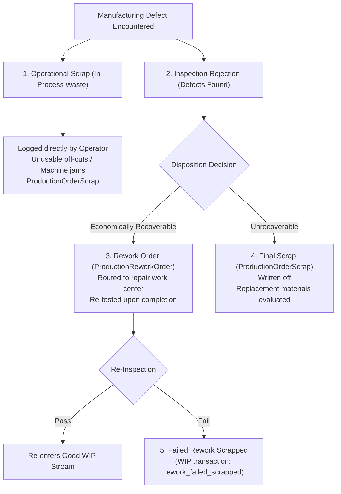

# Production Module — Scrap, Rework & Defect Disposition Guide

> **Domain Location:** `app/Domains/Production`  
> **Documentation Root:** `app/Domains/Production/docs/SCRAP_REWORK_GUIDE.md`  
> **Primary Models:** `ProductionOrderScrap`, `ProductionOrderRework`, `ProductionReworkOrder`, `ProductionReworkOperation`, `ProductionScrapDisposal`  
> **Primary Services:** `ScrapService`, `ReworkService`, `ProductionMaterialService`

---

## 1. Defect Classification & Distinctions

In industrial manufacturing, defective units must not be treated uniformly. The module explicitly distinguishes between 4 operational defect states:

---

## 2. Operational Scrap Lifecycle (`ProductionOrderScrap`)

- **Definition:** Raw material or intermediate components damaged or lost during machine processing (e.g. metal off-cuts, shattered glass, machining burrs).
- **Trigger:** Operator clicks **Log Scrap** on the MES console or order view (`POST /production/mes/{op}/scrap`).
- **Required Fields:** `quantity`, `reason`, `product_id`, `batch_id`.
- **System Actions:**
  1. Creates `ProductionOrderScrap` row.
  2. If the scrapped item is the operation's output component, increments `ProductionOrderOperation.quantity_scrapped`.
  3. Evaluates Replacement Material: `ProductionMaterialService::evaluateAndIssueReplacementMaterial()` checks whether replacement raw materials must be requisitioned to satisfy the customer's final ordered quantity.
  4. Inventory Outflow Posting: If the scrapped item was a warehouse-issued raw material, posts inventory outflow via `StockService::recordOutflow()`. In-process WIP scrap does not deduct warehouse stock because the goods have not yet been received into a finished warehouse.

---

## 3. Rework Lifecycle (`ProductionReworkOrder`)

- **Definition:** Defective units that can be brought into conformance via additional labor (e.g. re-machining a shaft, repainting a scratch, re-soldering a PCB joint).
- **Trigger:** Inspector or operator issues a `rework` disposition.
- **Workflow:**
  1. Auto-creates a `ProductionNcr` logging defect severity.
  2. Creates a `ProductionReworkOrder` linked to the parent order and batch.
  3. Creates sequential `ProductionReworkOperation` steps assigned to a repair Work Center.
  4. The operator starts and completes the repair steps on the MES console:
     - `POST /production/quality/rework/ops/{id}/start`
     - `POST /production/quality/rework/ops/{id}/complete`
  5. Upon completion, the repaired units are re-inspected. If passed, they rejoin the good WIP flow without double-counting initial production counts!

---

## 4. Failed Rework & Scrap Escalation

If units undergoing rework cannot be salvaged:
- **Action:** Inspector triggers `POST /production/quality/rework/{id}/fail`.
- **System Actions:**
  1. Closes the rework order as `failed`.
  2. Creates a `ProductionWipTransaction` with `transaction_type = 'rework_failed_scrapped'`.
  3. Emits high-priority notification to the Production Manager.
  4. Converts the remaining quantity to final operational scrap.

---

## 5. Financial & Cost Summary Impact

| Defect State | WIP Balance Effect | Order Cost Sheet Effect | Inventory Effect |
|---|---|---|---|
| **Operational Scrap** | Decrements available quantity on current WIP card | Absorbed as manufacturing shrinkage; increases per-unit cost of remaining good units | Raw material stock ledger deducted if applicable |
| **Rework Loop** | Holds quantity in `rework` status; prevents downstream transfer | Incurs additional direct labor and machine overhead costs on the rework work center | No inventory movement until final FG sign-off |
| **Failed Rework** | Deducted permanently from WIP balance | Rework labor and machine costs remain charged to the order as unrecovered defect expenses | Final write-off to scrap expense account |
