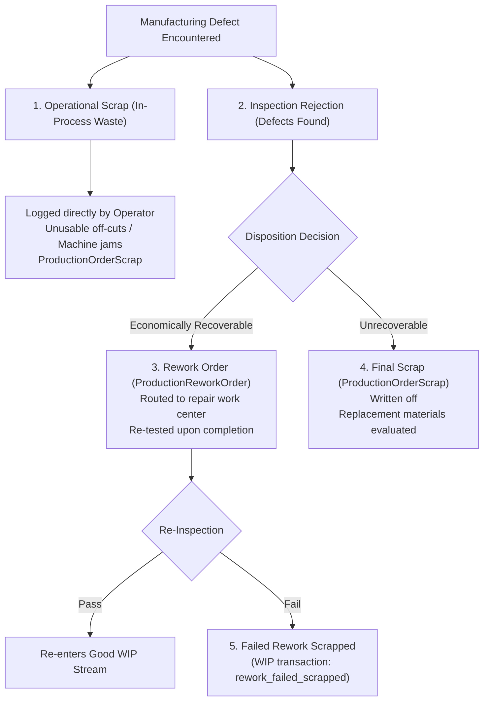

# Production Module — Scrap, Rework & Defect Disposition Guide

> **Domain Location:** `app/Domains/Production`  
> **Documentation Root:** `app/Domains/Production/docs/SCRAP_REWORK_GUIDE.md`  
> **Primary Models:** `ProductionOrderScrap`, `ProductionOrderRework`, `ProductionReworkOrder`, `ProductionReworkOperation`, `ProductionScrapDisposal`  
> **Primary Services:** `ScrapService`, `ReworkService`, `ProductionMaterialService`

---

## 1. Defect Classification & Distinctions

In industrial manufacturing, defective units must not be treated uniformly. The module explicitly distinguishes between 4 operational defect states:

```mermaid
graph TD
    DEFECT["Manufacturing Defect Encountered"]
    
    DEFECT --> TYPE1["1. Operational Scrap (In-Process Waste)"]
    DEFECT --> TYPE2["2. Inspection Rejection (Defects Found)"]
    
    TYPE1 --> SCRAP1["Logged directly by Operator\nUnusable off-cuts / Machine jams\nProductionOrderScrap"]
    
    TYPE2 --> DISP{"Disposition Decision"}
    DISP -- Economically Recoverable --> RWK["3. Rework Order (ProductionReworkOrder)\nRouted to repair work center\nRe-tested upon completion"]
    DISP -- Unrecoverable --> SCRAP2["4. Final Scrap (ProductionOrderScrap)\nWritten off\nReplacement materials evaluated"]
    
    RWK --> TEST{"Re-Inspection"}
    TEST -- Pass --> GOOD["Re-enters Good WIP Stream"]
    TEST -- Fail --> RWK_FAIL["5. Failed Rework Scrapped\n(WIP transaction: rework_failed_scrapped)"]
```

---

## 2. Operational Scrap Lifecycle (`ProductionOrderScrap`)

- **Definition:** Raw material or intermediate components damaged or lost during machine processing (e.g. metal off-cuts, shattered glass, machining burrs).
- **Trigger:** Operator clicks **Log Scrap** on the MES console or order view (`POST /production/mes/{op}/scrap`).
- **Required Fields:** `quantity`, `reason`, `product_id`, `batch_id`.
- **System Actions:**
  1. Creates `ProductionOrderScrap` row.
  2. If the scrapped item is the operation's output component, increments `ProductionOrderOperation.quantity_scrapped`.
  3. Evaluates Replacement Material: `ProductionMaterialService::evaluateAndIssueReplacementMaterial()` checks whether replacement raw materials must be requisitioned to satisfy the customer's final ordered quantity.
  4. Inventory Outflow Posting: If the scrapped item was a warehouse-issued raw material, posts inventory outflow via `StockService::recordOutflow()`. In-process WIP scrap does not deduct warehouse stock because the goods have not yet been received into a finished warehouse.

---

## 3. Rework Lifecycle (`ProductionReworkOrder`)

- **Definition:** Defective units that can be brought into conformance via additional labor and/or additional raw materials (e.g. re-machining a shaft, replacing a burnt gasket, re-soldering a PCB joint).
- **Trigger:** Inspector or operator issues a `rework` disposition.
- **Workflow:**
  1. Auto-creates a `ProductionNcr` logging defect severity.
  2. Creates a `ProductionReworkOrder` linked to the parent order and batch.
  3. Dynamic Cost Estimate is derived automatically from the planned repair stages and Work Center labor/overhead rates (`calculateDynamicCostEstimate`), avoiding arbitrary fallbacks.
  4. Creates sequential `ProductionReworkOperation` steps assigned to a repair Work Center.
  5. **Material Consumption Flow:** If repair requires additional parts or materials:
     - Operator/Storekeeper issues material via Web UI modal or API (`POST /production/quality/rework/{id}/issue-material`).
     - Handled by `ProductionMaterialService::issueReworkMaterial()`.
     - Stock is deducted via canonical `StockService::recordOutflow()` with FIFO or Weighted Average valuation.
     - Persisted in `production_order_issues` with `rework_order_id`, `rework_operation_id`, and `issue_type = 'rework'`.
     - Triggers canonical `PostProductionConsumptionJournal` (Debit WIP 1204, Credit Inventory).
     - Material cost is capitalized to parent order WIP sheet and added to `$rework->actual_cost`.
  6. The operator executes and completes the repair steps on the MES console:
     - `POST /production/quality/rework/ops/{id}/start`
     - `POST /production/quality/rework/ops/{id}/complete`
     - Duration is calculated from elapsed minutes or explicit input (`setup_time_actual`, `processing_time_actual`).
     - Cost rates are dynamically resolved from the Work Center (`cost_per_hour`, `overhead_rate`) and Routing machine rate without hardcoded numbers.
  7. Upon completion of all rework operations:
     - Repaired units are re-inspected or restored to good WIP without double-counting initial production counts.
     - **No Double-Counting Integration:** A `ProductionCostAdjustment` is generated on the parent `ProductionOrder` under category `CATEGORY_REWORK_EXPENSE` containing **only** additional Labor, Machine, and Overhead expenses. Material cost is strictly excluded from the adjustment because it was already recognized at the moment of issue.

---

## 4. Failed Rework & Scrap Escalation

If units undergoing rework cannot be salvaged:
- **Action:** Inspector triggers `POST /production/quality/rework/{id}/fail`.
- **System Actions:**
  1. Closes the rework order as `failed`.
  2. Cancels any non-completed rework operations.
  3. Creates a `ProductionWipTransaction` with `transaction_type = 'rework_failed_scrapped'`.
  4. Creates a `ProductionScrapDisposal` record with status `pending_approval`.
  5. Emits high-priority event to the Production Manager.
  6. Converts the remaining quantity to final operational scrap.

---

## 5. Financial & Cost Summary Impact

| Defect State | WIP Balance Effect | Order Cost Sheet Effect | Inventory & Accounting Effect |
|---|---|---|---|
| **Operational Scrap** | Decrements available quantity on current WIP card | Absorbed as manufacturing shrinkage; increases per-unit cost of remaining good units | Raw material stock ledger deducted if applicable |
| **Rework Material Issue** | Increments `material_cost` and `total_value` on parent order WIP | Adds to Rework Order `material_cost` and `actual_cost` | `StockService::recordOutflow` deducts inventory; `PostProductionConsumptionJournal` posts Dr WIP (1204), Cr Inventory |
| **Rework Operation Completion** | Increments `labor_cost`, `machine_cost`, `overhead_cost` on parent order WIP | Incurs actual labor & overhead based on configured Work Center rates; creates `ProductionCostAdjustment` (`CATEGORY_REWORK_EXPENSE`) excluding material | Capitalized into WIP; reflected in Final Costing Summary without double-counting |
| **Failed Rework** | Deducted permanently from WIP balance | Rework labor, machine, and material costs remain charged to the order as unrecovered defect expenses | Final write-off to scrap disposal workflow |
