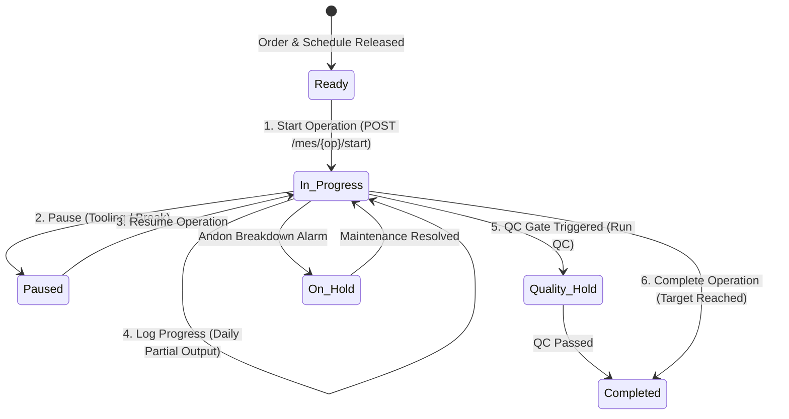

# Production Module — Shopfloor Execution (MES) Guide

> **Domain Location:** `app/Domains/Production`  
> **Documentation Root:** `app/Domains/Production/docs/SHOPFLOOR_GUIDE.md`  
> **Primary Screen:** `/production/mes` (MES Terminal) and `/production/mes/operator` (Touch Operator View)  
> **Controller:** `App\Domains\Production\Controllers\MesController`  
> **Primary Service:** `App\Domains\Production\Services\MesExecutionService`

---

## 1. Overview & Shopfloor Philosophy

The **Manufacturing Execution System (MES)** is the digital workstation console where machine operators, assembly technicians, and line leads record physical production events. Designed with high-contrast touch targets, it eliminates paper job travelers and provides real-time shopfloor telemetry to plant management.


---

## 2. Operator Workflow & Action Lifecycle

An operator interacts with an assigned operation through 6 standard execution actions:



---

## 3. Detailed Action Specifications

### 3.1 Start Operation (`POST /production/mes/{op}/start`)
- **Operator Action:** Operator selects their assigned workstation and clicks **Start Job**.
- **Backend Service:** `MesExecutionService::startOperation()`
- **Database Effects:**
  - `ProductionOrderOperation.status` transitions from `ready` to `in_progress`.
  - `actual_start_date` is stamped to current timestamp.
  - Machine state transitions to `running` via `MachineStateService`.
  - Emits timeline event `Operation Started`.

### 3.2 Log Partial Progress (`POST /production/mes/{op}/log-progress`)
- **Purpose:** On multi-day jobs, operators log shift output without closing the operation.
- **Form Fields:**
  - `quantity_produced`: Good units completed during this run.
  - `quantity_rejected`: Units needing inspection or rework.
  - `quantity_scrapped`: Unusable shrinkage.
  - `remarks`: Optional shift notes.
- **Backend Effects:**
  - Creates a `ProductionOrderProgressLog` entry with operator user ID and timestamp.
  - Increments `ProductionOrderOperation.quantity_produced`.
  - Updates associated `ProductionWip` card available quantity.

### 3.3 Pause & Resume Operation
- **Pause (`POST /production/mes/{op}/pause`):** Halts the runtime clock. Captures reason (e.g. `tool_change`, `lunch_break`, `setup_adjustment`).
- **Resume (`POST /production/mes/{op}/resume`):** Restarts the runtime clock.

### 3.4 Complete Operation (`POST /production/mes/{op}/complete`)
- **Validation Guard:**
  - If `RoutingOperation.quality_required == true`, the operation cannot complete until a passed QC inspection is recorded!
- **Backend Effects:**
  - Updates `ProductionOrderOperation.status = completed`.
  - Stamps `actual_end_date = now()`.
  - Calculates actual cycle time.
  - **Unlocks Next Operation:** Automatically identifies successor operation in the dependency chain and updates its status to `ready`!
  - Moves good units to the next work center via `ProductionWipService::transferWip()`.

### 3.5 Andon Emergency Alert (`POST /production/mes/{op}/andon-alert`)
- **Purpose:** Fast-response escalation when machine breaks down, material is missing, or safety hazards occur.
- **Input:** Category (`machine_breakdown`, `tooling_failure`, `material_defect`, `safety`), Severity (`warning`, `critical`), Reason, Remarks.
- **System Effect:** Immediately renders high-priority blinking alert banner on supervisor dashboards and updates machine status to `breakdown`.

---

## 4. Barcode & QR Scanner Integration

Workstations equipped with 2D barcode scanners utilize the integrated scanner console (`/production/mes/scanner`):
- **Badge Scan:** Automatically authenticates the operator.
- **Job Traveler Scan:** Instantly loads the target operation into the MES console.
- **Material Lot Scan:** Verifies raw material batch number against order reservations before allowing consumption.
- **Scan Logs:** Every barcode scan is logged into `production_scan_logs` for traceability audits.

---

## 5. Batch & Serial Number Management

Depending on the product tracking mode configured in Master Data:

### 5.1 Batch Tracking (`ProductionBatch`)
- Batches represent production lots (e.g. `BAT-2026-000142`).
- **Batch Splitting:** Operators can split a large batch into smaller sub-lots (`POST /production/mes/batches/split`) if running across multiple machines.
- **Batch Merging:** Combine compatible lots (`POST /production/mes/batches/merge`).

### 5.2 Serial Numbering (`ProductionSerialNumber`)
- For discrete equipment (e.g. electronics, pumps, valves).
- Generated automatically (`POST /production/mes/serials/generate`) with prefix, sequence padding, and checksum.
- Serial numbers are tracked individually through each routing operation.

---

## 6. Code-to-Flow Traceability: Completing an Operation

```text
User Interface:
  Operator on MES Console at http://127.0.0.1:8000/production/mes
  Clicks: "Complete Operation" -> Inputs final good quantity
        ↓
HTTP Route:
  POST /production/mes/{op}/complete (production.mes.complete)
        ↓
Controller Layer:
  App\Domains\Production\Controllers\MesController::complete(MesCompleteOperationRequest $request, int $op)
  Authorization: abort_unless(auth()->user()->hasProductionPermission('production.mes.execute'), 403)
        ↓
Form Request:
  App\Domains\Production\Requests\MesCompleteOperationRequest
  Validates: quantity_produced > 0, quantity_rejected >= 0, quantity_scrapped >= 0
        ↓
Domain Service:
  App\Domains\Production\Services\MesExecutionService::completeOperation(int $opId, array $data, int $userId)
  Transaction boundary: DB::transaction(...)
        ↓
Business Logic:
  1. Validates QC gate if quality_required is true
  2. Updates ProductionOrderOperation status to 'completed'
  3. App\Domains\Production\Services\ProductionWipService::transferWip() to successor operation
  4. Identifies next operation in dependency chain and sets status to 'ready'
  5. App\Domains\Production\Services\ProductionOrderService::evaluateAndAutoCompleteOrder()
```
