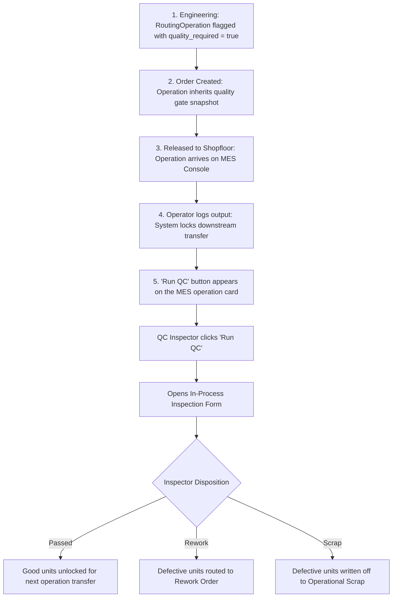

# Production Module — In-Process Quality Control (QC) & Inspection Guide

> **Domain Location:** `app/Domains/Production`  
> **Documentation Root:** `app/Domains/Production/docs/SHOPFLOOR_QC_GUIDE.md`  
> **Primary Models:** `ProductionQualityInspection`, `ProductionQualityInspectionResult`, `ProductionQualityPlan`, `ProductionNcr`, `ProductionCapa`  
> **Primary Services:** `QualityInspectionService`, `NcrService`, `CapaService`

---

## 1. Overview & Quality Philosophy

In discrete manufacturing, catching defects at the source prevents compounding rework costs. If a welded frame has crooked joints, powder coating and final assembly must not proceed.

The **In-Process Quality Control (QC)** subsystem enforces physical inspection gates directly on the shopfloor execution line.


---

## 2. When and Where Does "Run QC" Appear?



### Authorization & Visibility
- **When it appears:** Visible on any active operation where `quality_required == true` or where partial output has been reported.
- **Who can use it:** Users with role `quality_inspector`, `production_manager`, or permission `production.mes.execute`.

---

## 3. What Happens When "Run QC" Is Clicked?

1. **Form Trigger:** Inspector clicks **Run QC** (or opens `/production/quality/inspections/create`).
2. **Inspection Generation:**
   - Evaluates whether the product or routing operation has an active `ProductionQualityPlan`.
   - Pre-populates the inspection checklist with defined parameter rows (e.g. `Length (mm)`, `Hardness (HRC)`, `Visual Finish`).
3. **Inspector Input:**
   - `accepted_qty`: Quantity meeting specification.
   - `rejected_qty`: Quantity failing specification.
   - For each parameter: Enters observed measurement value. The system compares it against `min_value` and `max_value`.
   - `defect_reason`: Root cause category if defects exist.

---

## 4. The 3 Disposition Outcomes

### Disposition A: Passed (Good Units)
- **Status:** `ProductionQualityInspection.status = approved`, `result = passed`.
- **WIP Effect:**
  - `ProductionWipService::disposeInspection()` transitions the WIP card from `quality_hold` to `active`.
  - The good quantity is unlocked and ready for downstream transfer to the next routing operation.

### Disposition B: Rework Required
- **Trigger:** Units have non-critical defects that can be corrected (e.g. burrs needing deburring, weld spatter needing grinding).
- **Automated Workflow:**
  1. Auto-creates an open Non-Conformance Report (`ProductionNcr`).
  2. Spawns a `ProductionReworkOrder` and linked `ProductionReworkOperation`.
  3. WIP card status transitions to `rework`.
  4. Defective units remain isolated from finished goods until the rework loop is executed and re-inspected.

### Disposition C: Scrapped (Unrecoverable)
- **Trigger:** Parts are damaged beyond economic recovery.
- **Automated Workflow:**
  1. Auto-creates an NCR entry.
  2. Creates a `ProductionOrderScrap` record with defect category.
  3. Deducts the quantity from available WIP (`scrap_quantity += $qty`).
  4. Triggers `ProductionMaterialService::evaluateAndIssueReplacementMaterial()` if replacement raw materials are required.

---

## 5. Can an Operation Complete Before QC?

> **STRICT SYSTEM RULE:**  
> **NO.** If `RoutingOperation.quality_required == true`, calling `MesExecutionService::completeOperation()` will throw an `InvalidArgumentException`:  
> *"Cannot complete operation: Quality inspection required before final sign-off."*  
> Downstream operations cannot receive WIP until inspection disposition is recorded.

---

## 6. Code-to-Flow Traceability: Recording QC Inspection

```text
User Interface:
  Operator/Inspector clicks "Run QC" on MES Console at http://127.0.0.1:8000/production/mes
  Inputs: accepted_qty, rejected_qty, quality_plan_id, defect_reason, parameter values
        ↓
HTTP Route:
  POST /production/mes/{op}/quality-inspection (production.mes.quality-inspection)
        ↓
Controller Layer:
  App\Domains\Production\Controllers\MesController::recordQualityInspection(Request $request, int $op)
  Authorization: abort_unless(auth()->user()->hasProductionPermission('production.mes.execute'), 403)
        ↓
Domain Service:
  App\Domains\Production\Services\QualityInspectionService::processShopfloorInspection($tenantId, $data, $userId)
  Transaction boundary: DB::transaction(...)
        ↓
Records Created:
  1. INSERT INTO production_quality_inspections (tenant_id, production_order_id, production_order_operation_id, accepted_qty, rejected_qty, result)
  2. INSERT INTO production_quality_inspection_results (tenant_id, inspection_id, parameter_id, measured_value, is_passed)
  3. If rejected > 0: App\Domains\Production\Services\NcrService::createNcr(...)
  4. App\Domains\Production\Services\ProductionWipService::disposeInspection(...)
```
