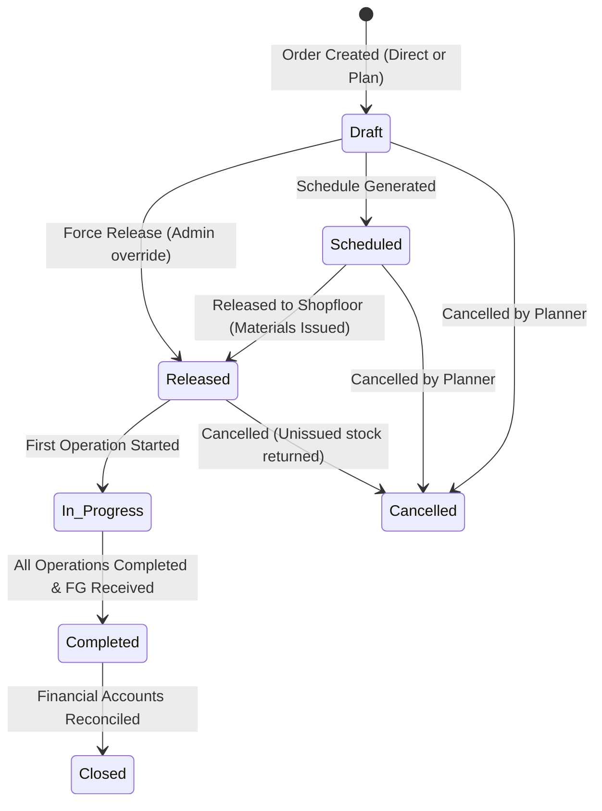
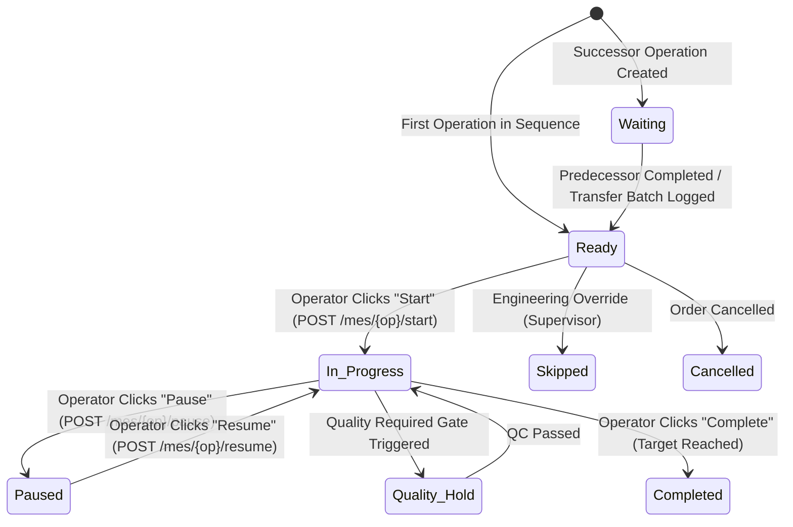
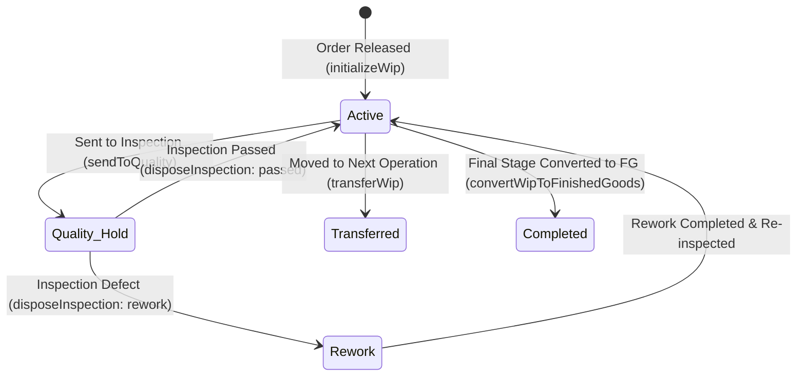
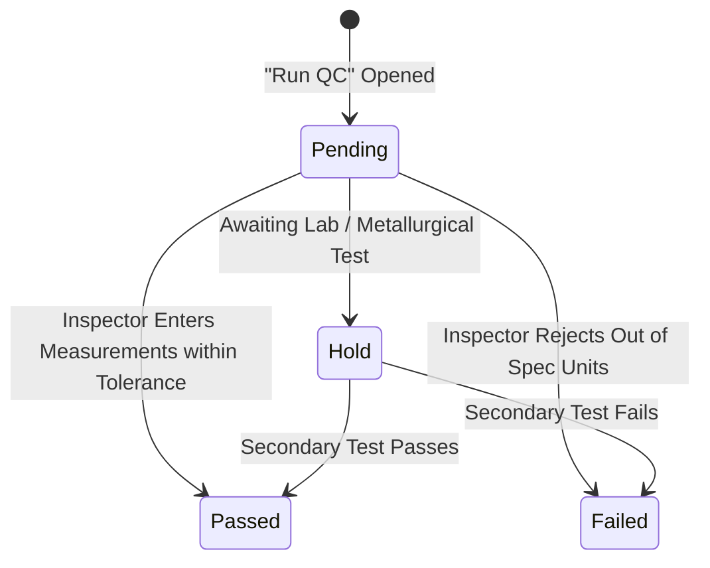
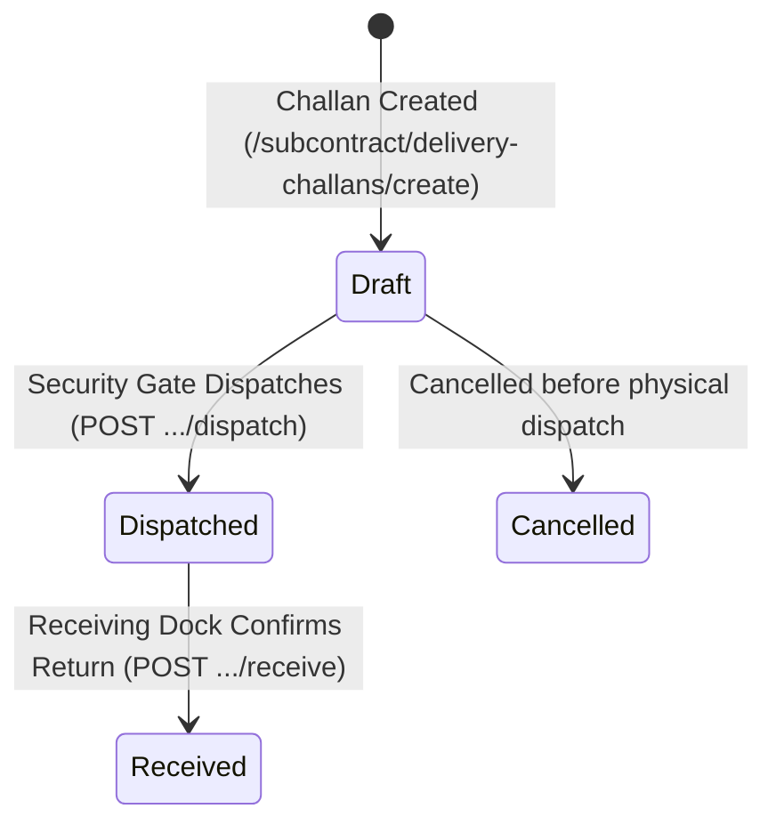

# Production Module — Status & State Machine Specification Guide

> **Domain Location:** `app/Domains/Production`  
> **Documentation Root:** `app/Domains/Production/docs/STATUS_LIFECYCLE.md`  
> **Purpose:** Authoritative reference for all entity lifecycle state machines, allowed transitions, and validation guards.

---

## 1. Production Order State Machine

### Transition Table: Production Order
| From State | To State | Trigger / UI Action | Validation Rules | Database & System Effect |
|---|---|---|---|---|
| `draft` | `scheduled` | SchedService generates schedule | Order must have valid product and quantity > 0 | Generates `production_schedules` row. |
| `draft` / `scheduled` | `released` | Click "Release to Shopfloor" | Raw materials must be issued by store; machines operational | Sets `released_at = now()`; initializes `ProductionWip`; unlocks first operation as `ready`. |
| `released` | `in_progress` | Operator clicks "Start" in MES | Predecessor dependencies met | Sets `actual_start_date = now()`. |
| `in_progress` | `completed` | Final operation completed & FG received | All operations must be `completed`, `skipped`, or `cancelled` | Sets `completed_at = now()`, `actual_end_date = now()`. |
| `completed` | `closed` | Click "Close Order" | No open NCRs or WIP discrepancies | Sets `closed_at = now()`. Order becomes completely immutable. |
| Any open | `cancelled` | Click "Cancel Order" | Order cannot be completed or closed | Releases raw material reservations; cancels pending schedules. |

---

## 2. Production Order Operation State Machine

### Transition Table: Operations
| From State | To State | Trigger | Validation | Next State Allowed |
|---|---|---|---|---|
| `waiting` | `ready` | Predecessor operation marked `completed` or transfer batch met | Dependency condition met | `in_progress`, `skipped` |
| `ready` | `in_progress` | Operator clicks "Start" in MES | Machine must be active and not in breakdown | `paused`, `completed`, `on_hold` |
| `in_progress` | `paused` | Operator clicks "Pause" | Pause reason mandatory | `in_progress` |
| `in_progress` | `completed` | Operator clicks "Complete" | Quality gate passed if `quality_required = true` | Unlocks successor operation to `ready` |

---

## 3. Work-in-Progress (WIP) State Machine

---

## 4. Quality Inspection State Machine

---

## 5. Subcontract Delivery Challan State Machine

