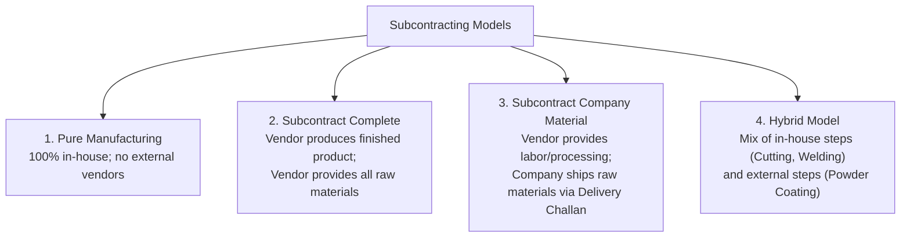

# Production Module — Subcontracting & Job Work Guide

> **Domain Location:** `app/Domains/Production`  
> **Documentation Root:** `app/Domains/Production/docs/SUBCONTRACTING_GUIDE.md`  
> **Primary Models:** `DeliveryChallan`, `DeliveryChallanItem`, `ProductionOrderOperation`  
> **Primary Services:** `SubcontractProcurementOrchestrator`, `SubcontractDeliveryChallanController`, `SubcontractMaterialBalanceService`, `SubcontractPerformanceService`

---

## 1. Overview & Business Models

When an enterprise lacks specialized machinery (e.g. powder coating, heat treatment, chrome plating) or experiences capacity spikes, it outsources operations to external vendors.

The system supports 4 manufacturing models configured via `production_orders.production_model`:




---

## 2. External Operation Configuration

An outsourced step is configured on the routing operation:
- `is_external = true`
- `vendor_id`: Assigned external service provider.
- `subcontract_lead_time_days`: Transit and processing buffer (e.g. 3 days).
- `subcontract_cost_per_unit`: Contract rate per unit processed.
- `subcontract_service_product_id`: Non-inventory service SKU used for purchase invoicing.
- `material_supply_type`: `company_supplied` (we ship material) or `vendor_supplied` (vendor sources).

---

## 3. Automated Procurement Orchestration (`SubcontractProcurementOrchestrator`)

When an order containing an external operation is released, the orchestrator consults the tenant's subcontract policy (`production/settings`):

| Tenant Policy Setting | Automated Procurement Action Upon Release |
|---|---|
| **Manual PR/PO** | Emits a notification to purchasing; planner manually raises a Purchase Requisition via button **Generate Subcontract PR**. |
| **Auto Draft PO** | Automatically generates a draft Purchase Order in the Purchase module linked to the external vendor and service SKU. |
| **Auto Approved PO** | Generates an approved Purchase Order ready for vendor dispatch without requiring manual buyer sign-off. |

---

## 4. Delivery Challans (Gate Pass) Workflow

To comply with tax regulations and track physical material custody when shipping intermediate goods to third-party processors:

```mermaid
sequenceDiagram
    participant Planner as Production Planner
    participant Challan as Delivery Challan System
    participant Gate as Plant Security Gate Pass
    participant Vendor as External Processor
    participant Receiving as Plant GRN Receiving

    Planner->>Challan: Create Delivery Challan (/production/subcontract/delivery-challans/create)
    Challan->>Challan: Validate stock on-hand (check-stock endpoint)
    Planner->>Challan: Click "Dispatch Material" (POST .../dispatch)
    Challan->>Gate: Print official Delivery Challan Gate Pass
    Challan->>Challan: Mark status = 'dispatched'; materials in vendor custody
    Vendor->>Vendor: Processes intermediate WIP (e.g. Powder Coating)
    Vendor->>Receiving: Returns processed goods with delivery slip
    Receiving->>Challan: Click "Receive Goods" (POST .../receive)
    Challan->>Challan: Mark status = 'received'; GRN stock verified
    Note over Receiving: Material re-enters the shopfloor and<br/>advances to next internal routing operation!
```

---

## 5. UI Endpoints & Controllers

- **Directory:** `GET /production/subcontract/delivery-challans`
- **Create:** `GET /production/subcontract/delivery-challans/create`
- **Stock Check:** `GET /production/subcontract/delivery-challans/check-stock`
- **Print Gate Pass:** `GET /production/subcontract/delivery-challans/{id}/print` (renders clean printable HTML without third-party PDF dependencies)
- **Dispatch:** `POST /production/subcontract/delivery-challans/{id}/dispatch`
- **Receive:** `POST /production/subcontract/delivery-challans/{id}/receive`
- **Vendor Analytics & SLA:** `GET /production/subcontract/analytics` evaluates vendor turnaround time against promised lead days.
