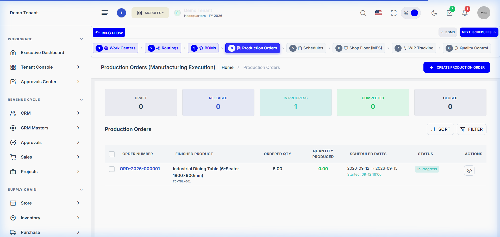
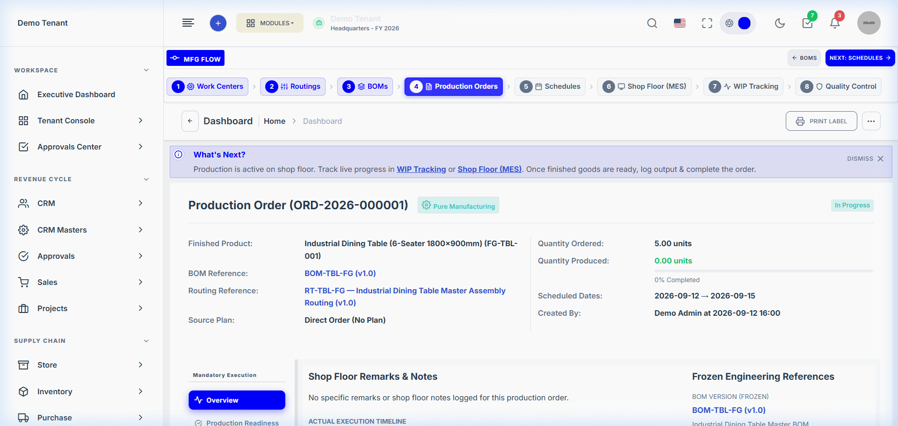

# Production Module — User Workflow Manual

> **Document Location:** `app/Domains/Production/docs/USER_WORKFLOW.md`  
> **Audience:** Production Planners, Schedulers, Shopfloor Supervisors, and Machine Operators  
> **System Environment:** SaaS ERP Production Planning & MES Suite

---

## 1. Quick Workflow Roadmap

Follow these 10 standard steps to take a product from raw material design to warehouse inventory receipt:

```text
Step 1: Create / Verify BOM
   ↓
Step 2: Create / Verify Routing
   ↓
Step 3: Create Production Order
   ↓
Step 4: Request & Issue Raw Materials
   ↓
Step 5: Generate Finite Schedule
   ↓
Step 6: Adjust Operations on Dispatch Board
   ↓
Step 7: Release Schedule to Shopfloor
   ↓
Step 8: Execute Operations in MES Console
   ↓
Step 9: Perform In-Process Quality Inspection (Run QC)
   ↓
Step 10: Convert Completed WIP to Finished Goods Inventory
```

---

## 2. Step-by-Step Operating Instructions

### Step 1: Create a Bill of Materials (BOM)


1. **Screen:** Navigate to **Production → BOMs** (`/production/boms`).
2. **Action:** Click the **+ Create BOM** button in the top right header.
3. **Input Data:**
   - **Product:** Select the target finished product (e.g. `Industrial Dining Table`).
   - **BOM Code:** Enter a unique code or leave blank for auto-generation (e.g. `BOM-TBL-FG`).
   - **Base Quantity:** Enter standard output quantity (e.g. `1.00`).
   - **Components Table:** Add raw materials and sub-assemblies. For each component, specify:
     - `Item / Material`: Select raw product.
     - `Quantity`: Enter consumption ratio.
     - `Scrap %`: Enter expected operational shrinkage.
4. **Save:** Click **Save BOM**.
5. **Approval:** If approval workflow is active, click **Submit for Approval** → Manager approves BOM.
6. **Next Step:** Configure the production routing.

---

### Step 2: Create a Production Routing


1. **Screen:** Navigate to **Production → Routing** (`/production/routing`).
2. **Action:** Click **+ Create Routing**.
3. **Input Data:**
   - **Routing Code:** e.g. `RT-TBL-FG`.
   - **Product:** Link to finished good.
   - **Operations Sequence:** Add steps:
     - Step 10: `Tube & Component Cutting` (Work Center: Cutting, Setup: 15 min, Cycle: 5 min/unit).
     - Step 20: `MIG Frame Welding` (Work Center: Welding, Setup: 10 min, Cycle: 12 min/unit).
     - Step 30: `Assembly & Packaging` (Work Center: Assembly, Setup: 10 min, Cycle: 25 min/unit, Flag: **Quality Required**).
4. **Save:** Click **Save Routing** and activate.
5. **Next Step:** Create the Production Order.

---

### Step 3: Create a Production Order



1. **Screen:** Navigate to **Production → Orders** (`/production/orders`).
2. **Action:** Click **+ Create Order**.
3. **Input Data:**
   - **Product:** Select target product.
   - **Quantity:** Enter units to produce (e.g. `5.00`).
   - **BOM & Routing:** System auto-selects active approved engineering versions.
   - **Start & Due Dates:** Select requested production window.
   - **Production Model:** Pure Manufacturing, Subcontract, or Hybrid.
4. **Save:** Click **Create Production Order**.
5. **Result:** Order is created in `draft` status. BOM and Routing are snapshot into frozen order tables.
6. **Next Step:** Issue materials and generate schedule.

---

### Step 4: Issue Materials via Requisition Slip



1. **Screen:** Open the Production Order detail view (`/production/orders/{id}`).
2. **Tab:** Click the **Reservations** tab.
3. **Verification:** Confirm all required raw materials are reserved.
4. **Action:** The system automatically notifies the Store department via Requisition Slip `#REQ-2026-XXXX`.
5. **Store Issuance:** Storekeeper records material issue in the Inventory module. Once issued, order readiness displays **100% Ready**.
6. **Next Step:** Schedule operations.

---

### Step 5 & 6: Schedule & Adjust on Dispatch Board


1. **Screen:** Navigate to **Production → Schedules → Dispatch Board** (`/production/schedules/dispatch-board`).
2. **Action:** Click **+ New Schedule** → Select the Production Order → Choose **Forward Scheduling** → Click **Generate**.
3. **Dispatch Board Review:**
   - View scheduled jobs on machine swimlanes.
   - Identify any red overload warnings or maintenance conflicts.
   - **Drag & Drop:** Move operation blocks horizontally to adjust start times, or drag between compatible alternate machines.
   - **Level Capacity:** Click **Level Capacity** to auto-resolve peak machine overloads.
4. **Next Step:** Release schedule to shopfloor.

---

### Step 7: Release Schedule to Shopfloor

1. **Screen:** On the Schedule view or Dispatch Board, locate the scheduled order.
2. **Action:** Click **Release to Shopfloor**.
3. **Pre-Release Check:** The system verifies:
   - Raw materials are issued.
   - Work Centers and machines are operational.
4. **Result:**
   - Schedule status changes to `released`.
   - Order status advances to `in_progress`.
   - First operation appears on the MES console in `ready` state.
   - Initial `ProductionWip` card is created.
5. **Next Step:** Operator executes work on MES.

---

### Step 8: Execute Operations on MES Console


1. **Screen:** Machine operator opens **Production → MES Execution** (`/production/mes`).
2. **Select Job:** Locate assigned operation in the **Ready** queue.
3. **Start:** Click **Start Operation**. Status transitions to `in_progress`.
4. **Log Progress:** As parts are produced, click **Log Progress** → Enter:
   - `Good Quantity Produced`
   - `Scrap / Defective Quantity` (if any)
5. **Complete:** When all units are produced, click **Complete Operation**.
6. **Next Step:** If QC is required, trigger inspection; otherwise units transfer to next operation.

---

### Step 9: In-Process Quality Inspection (Run QC)


1. **Trigger:** On operations flagged with `quality_required`, downstream transfer is locked until inspection is recorded.
2. **Action:** QC Inspector clicks **Run QC** on the operation row.
3. **Inspection Modal:**
   - Enter `Accepted Qty` and `Rejected Qty`.
   - Record parameter measurements against tolerance bands.
4. **Submit Disposition:**
   - **Pass:** Good units unlock and move to the next work center.
   - **Rework:** Defective units are assigned to a `ProductionReworkOrder`.
   - **Scrap:** Unusable units are logged into `ProductionOrderScrap`.

---

### Step 10: Convert Completed WIP to Finished Goods Inventory


1. **Screen:** Navigate to **Production → WIP Tracking** (`/production/wip`).
2. **Locate Card:** Find the order's completed final-stage WIP card showing available output.
3. **Action:** Click **Receive Finished Goods** (or **Convert to FG**).
4. **Input Data:**
   - Select destination **Warehouse** (e.g. `Main Finished Goods Warehouse`).
   - Confirm quantity and quality status (`Passed`).
5. **Submit:** Click **Confirm Receipt**.
6. **Business Result:**
   - `ProductionOrderReceipt` is created.
   - Inventory ledger increments finished goods on-hand stock via `StockService::recordInflow()`.
   - Production order auto-evaluates and marks complete!
