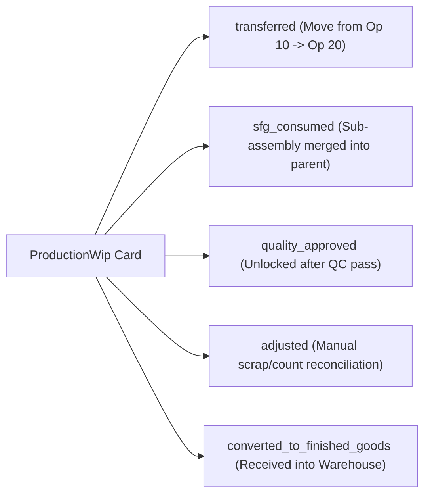

# Production Module — Work-in-Progress (WIP) Tracking Guide

> **Domain Location:** `app/Domains/Production`  
> **Documentation Root:** `app/Domains/Production/docs/WIP_GUIDE.md`  
> **Primary Models:** `ProductionWip`, `ProductionWipTransaction`  
> **Primary Service:** `App\Domains\Production\Services\ProductionWipService`

---

## 1. Overview & Business Purpose

**Work-in-Progress (WIP)** represents material that has left raw stores but has not yet reached finished goods inventory. In discrete manufacturing, high unmonitored WIP ties up working capital, conceals scrap, and causes scheduling blind spots.

The WIP Tracking system provides real-time visibility into inventory stationed between machine centers, tracks batch genealogy, logs value accumulation (material + labor + overhead), and automates finished goods conversion.


---

## 2. Anatomy of a WIP Card (`ProductionWip`)

Every active order maintains one or more `ProductionWip` cards tracking discrete operational state:

| Column | Description |
|---|---|
| `production_order_id` | Parent order reference. |
| `production_batch_id` | Specific production lot / batch identifier (or null for unbatched flow). |
| `product_id` | Product being processed (finished good or intermediate SFG sub-assembly). |
| `current_work_center_id` | Physical workstation currently holding the material. |
| `current_routing_operation_id` | Active routing operation step. |
| `quantity` | Initial input quantity staged for this stage. |
| `available_quantity` | Quantity currently unlocked and ready for processing. |
| `completed_quantity` | Quantity that has finished processing at this work center and is ready for transfer. |
| `rejected_quantity` | Quantity held for inspection, rework, or defect disposition. |
| `scrap_quantity` | Shrinkage written off at this stage. |
| `status` | `active`, `quality_hold`, `rework`, `transferred`, `completed`. |
| `material_cost`, `labor_cost`, `machine_cost`, `overhead_cost`, `total_value` | Accrued manufacturing value added up to this stage. |

---

## 3. The Immutable WIP Transaction Ledger (`ProductionWipTransaction`)

Every physical or financial adjustment writes an immutable transaction log:



---

## 4. Concrete Walkthrough: Moving WIP from Op 10 to Op 20

Here is the exact numerical flow implemented in the code:

```text
Step 1: Production Order created for 100 units.
        WIP Card #1 initialized at Op 10 (Cutting Center):
        - quantity: 100.00
        - available_quantity: 100.00
        - completed_quantity: 0.00

Step 2: Machine Operator cuts 100 tubes on Bandsaw.
        Logs Progress: 95 Good units, 5 Scrapped units.
        - available_quantity: 0.00
        - completed_quantity: 95.00
        - scrap_quantity: 5.00

Step 3: Op 10 completed. MesExecutionService calls:
        ProductionWipService::transferWip(wipId: 1, toOpId: 20)
        
        Effect on WIP Card #1 (Op 10):
        - status: 'transferred'
        - available_quantity: 0.00
        - completed_quantity: 0.00

        Effect on WIP Card #2 (Op 20 - Welding Center):
        - quantity: 95.00
        - available_quantity: 95.00
        - completed_quantity: 0.00
        - status: 'active'
        - Accrues labor & machine cost of Op 10!
```

---

## 5. Semi-Finished Goods (SFG) Cross-Assembly Consumption

When a manufacturing order produces complex assemblies (e.g. welding a frame made of pre-fabricated table legs):
- Predecessor intermediate operations produce sub-assemblies (SFG).
- When the parent assembly operation logs progress, `ProductionWipService::recordSfgConsumption()` automatically:
  1. Identifies cross-assembly predecessor dependencies (`dependency_type = 'cross_assembly'`).
  2. Multiplies parent delta by the component BOM ratio.
  3. Locks and increments `quantity_consumed` on the predecessor operation.
  4. Generates a `sfg_consumed` WIP transaction with 0 cost-added (preventing double-counting of material costs).
  5. Links batch genealogy via `BatchProductionService::recordComponentConsumptionGenealogy()`.

---

## 6. Converting Completed WIP to Finished Goods Inventory

Once the final routing step is completed:
1. **Single WIP Card Conversion (`POST /production/wip/{id}/convert`):**
   - User selects destination warehouse.
   - Invokes `ProductionExecutionService::receiveFinishedGoods()`.
   - Clears available WIP quantity (`status = completed`).
   - Increments inventory stock ledger via `StockService::recordInflow()`.
2. **Order-Level Bulk Conversion (`POST /production/wip/orders/{order}/convert-fg`):**
   - Transacts all completed stage cards across the entire order in a single database transaction.

---

## 7. Code-to-Flow Traceability: Converting WIP to FG

```text
User Interface:
  Browser at http://127.0.0.1:8000/production/wip
  Clicks: "Receive Finished Goods" on completed WIP card
  Inputs: warehouse_id, quality_status ('passed'), remarks
        ↓
HTTP Route:
  POST /production/wip/{wip}/convert (production.wip.convert)
        ↓
Controller Layer:
  App\Domains\Production\Controllers\WipController::convertToFg()
  Authorization: abort_unless(auth()->user() && auth()->user()->hasProductionPermission('production.mes.execute'), 403)
        ↓
Domain Service:
  App\Domains\Production\Services\ProductionWipService::convertWipToFinishedGoods($wipId, $warehouseId)
  Transaction boundary: DB::transaction(...)
        ↓
Execution Service Call:
  App\Domains\Production\Services\ProductionExecutionService::receiveFinishedGoods(
      $orderId, $qty, $qualityStatus, $remarks, $userId, $warehouseId, $batchNumber
  )
        ↓
Inventory Integration:
  1. INSERT INTO production_order_receipts (tenant_id, production_order_id, quantity_received, warehouse_id)
  2. App\Domains\Inventory\Services\StockService::recordInflow(...)
  3. Increments products_warehouse_stock.on_hand
  4. Inserts immutable stock_transactions row
  5. WIP card status updated to 'completed'
```
