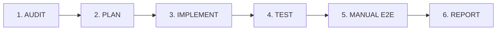

# Project Management — Agent Instructions & Operating Rules

**Document Category:** Operational Standard & Constraints  
**Audience:** AI Coding Agents & Human Developers  
**Scope:** `App\Domains\Projects` and `resources/views/modules/projects`

---

## 1. Mandatory Pre-Work: Reading List

Before proposing, planning, or writing a single line of code in the Project Management module, any AI agent or developer **MUST read the canonical documentation files** in the exact order below:

1. [PRD.md](file:///c:/Users/windo/Documents/GitHub/wm-product-saas/docs/project-management/PRD.md) — Understand domain scope, hierarchy, business rules, lifecycle, and UX decisions.
2. [ARCHITECTURE.md](file:///c:/Users/windo/Documents/GitHub/wm-product-saas/docs/project-management/ARCHITECTURE.md) — Understand layered architecture, service patterns, repository contracts, multi-tenancy traits, and authorization conventions.
3. [WORKFLOW.md](file:///c:/Users/windo/Documents/GitHub/wm-product-saas/docs/project-management/WORKFLOW.md) — Understand the full 16-stage lifecycle, decision trees, and the distinction between implemented vs target workflow.
4. [DATA_MODEL.md](file:///c:/Users/windo/Documents/GitHub/wm-product-saas/docs/project-management/DATA_MODEL.md) — Understand existing 8 schema tables, relationships, constraints, and target schema boundaries.
5. [INTEGRATIONS.md](file:///c:/Users/windo/Documents/GitHub/wm-product-saas/docs/project-management/INTEGRATIONS.md) — Understand integration boundaries with Core Users, CRM Customers, Sales Invoicing, Accounting, Storage, and Notifications.
6. [design-spec.md](file:///c:/Users/windo/Documents/GitHub/wm-product-saas/docs/project-management/design-spec.md) — Understand UI/UX design tokens, components, modal layouts, drawer specifications, and screen patterns.
7. [IMPLEMENTATION_ROADMAP.md](file:///c:/Users/windo/Documents/GitHub/wm-product-saas/docs/project-management/IMPLEMENTATION_ROADMAP.md) — Understand the ordered execution phases, prerequisites, and milestone goals.
8. [AUDIT_BASELINE.md](file:///c:/Users/windo/Documents/GitHub/wm-product-saas/docs/project-management/AUDIT_BASELINE.md) — Understand what was already proven to exist, what passed testing, and known architectural gaps.

After reviewing these files, inspect the current codebase to verify that files and models match expectations before introducing modifications.

---

## 2. Architecture Rules

- **Preserve Existing Layered Architecture:**
  - **Controllers:** Must remain thin (`try/catch` or delegating to services, handling redirect/JSON). Do NOT write query or domain logic in controllers.
  - **Form Requests:** All input validation must reside in dedicated `App\Domains\Projects\Requests` classes.
  - **Domain Services:** All business rules, transactions, progress calculations, collaborator invariant checks, and cross-entity mutations belong in `App\Domains\Projects\Services`.
  - **Repositories:** Data access and query construction must use `App\Domains\Projects\Repositories` interfaces bound to Eloquent implementations in `App\Providers\AppServiceProvider`.
  - **Models:** Retain pure relationship declarations, fillables, casts, and query scopes.
- **Do Not Rewrite Working Functionality:**
  - Functionality verified as `FULLY IMPLEMENTED` in [AUDIT_BASELINE.md](file:///c:/Users/windo/Documents/GitHub/wm-product-saas/docs/project-management/AUDIT_BASELINE.md) must be preserved unless an explicit change request is approved.
- **No Duplicate Domain Infrastructure:**
  - Do NOT create parallel models, tables, or services for functionality that exists in the ERP.
  - Specifically: **Do NOT build a parallel `project_invoices` system.** Project billing MUST interface with `App\Domains\Sales\Models\Invoice` and its accounting pipeline.
  - **Do NOT build a custom file upload table** if `App\Domains\Core\Services\FileStorageService` or standard Laravel storage handles documents.
- **Tenant Isolation Invariant:**
  - Every project table MUST have `tenant_id`, `company_id`, and `branch_id`.
  - Every Eloquent model MUST include `BelongsToTenant`, `BelongsToCompany`, and `BelongsToBranch`.
  - Never bypass global tenant scopes unless performing system-level migrations.
- **Authorization & RBAC Invariant:**
  - Enforce server-side checks via `AccessService::allows($user, 'projects.action')` or `$this->authorize()` policies.
  - Do NOT rely solely on frontend Blade `@if` conditions or button hiding for security.

---

## 3. Database & Schema Rules

- **Never Rename Existing Columns or Tables:**
  - Existing tables (`projects`, `project_members`, `project_milestones`, `project_task_lists`, `project_tasks`, `project_sub_tasks`, `project_task_dependencies`, `project_activity_logs`) have active production and test references.
  - Do NOT rename columns without an approved, backward-compatible migration plan.
- **Never Drop or Remove Existing Fields:**
  - Even if a column seems unused or redundant with a future design, leave it intact or deprecate gracefully.
- **Check Existing Schema Before Adding Tables/Columns:**
  - Inspect `DATA_MODEL.md` and database migrations before drafting new migration files.
  - Use standard Laravel migration conventions: foreign keys with `cascadeOnDelete()` where parent-child cascading is standard (e.g., project -> milestones).
- **Foreign Key Convention:**
  - Resource assignments must point to `users.id` (Core User model), NOT `employees.id`, because the ERP's HRMS `Employee` lacks multi-tenant scoping and auth binding.

---

## 4. UI / UX Rules

- **Reuse Existing ERP Component Architecture:**
  - Use Duralux / ERP Blade components (`<x-ui.*>`, `<x-card>`, `<x-button>`, `<x-modal>`, `<x-badge>`).
  - Do NOT introduce TailwindCSS, Bootstrap 5, or new UI component libraries.
  - Preserve global CSS conventions in `resources/views/layouts/admin.blade.php`.
- **Preserve the Fast Project Creation Flow:**
  - The modal at `resources/views/modules/projects/index.blade.php` intentionally allows creating a project with minimal fields:
    ```
    Project Name (required)
    Code (auto-generated)
    Client / Type (optional)
    → Click "Create Project"
    → Redirect to Project Detail
    → Complete remaining metadata inline or via tabbed drawers
    ```
  - **DO NOT convert this modal into a massive, multi-step 30-field wizard.** This is an intentional ERP UX pattern.
- **Prefer Inline & Tabbed Editing:**
  - Edits to project description, dates, budget, milestones, tasks, and members are performed inline or via focused offcanvas drawers within the project workspace.

---

## 5. Development Workflow (Strict Lifecycle)

Every development task undertaken in this module must strictly follow this phased cycle:



1. **AUDIT:**
   - Review current code, existing tests, and database schema relevant to the assigned phase.
   - Cross-check against canonical documentation.
2. **PLAN:**
   - Formulate the implementation plan specifying exact files to modify, new files to create, and test cases.
   - Await user approval before writing code if architectural ambiguity exists.
3. **IMPLEMENT:**
   - Execute the plan adhering strictly to repository, service, and form-request conventions.
   - Keep controllers thin and atomic.
4. **TEST:**
   - Run automated unit and feature tests:
     ```bash
     php artisan test --filter=Project
     ```
   - All 133 existing tests must continue to pass.
   - Write new test cases covering all new business rules, edge cases, and authorization checks.
5. **MANUAL E2E VALIDATION:**
   - Validate UI flows via browser subagent or local HTTP checks.
   - Verify modal opens, form submits, status badges render, and inline edits persist.
6. **REPORT:**
   - Deliver a clear, concise report summarizing changes made, tests executed, and documentation updated.

---

## 6. Testing Rules

- **Zero Regression Tolerance:**
  - The Project Management suite currently passes 133 tests with 393 assertions. A pull request or agent run that breaks any of these tests is invalid.
- **Coverage Requirement for New Features:**
  - Every new Service method must have unit test coverage.
  - Every new route/controller endpoint must have feature test coverage testing:
    - Successful operation (200 / 302 redirect).
    - Validation failures (422 Unprocessable Entity).
    - Tenant isolation (Tenant B cannot access or mutate Tenant A's project resources).
    - RBAC enforcement (User lacking permission receives 403 Forbidden).
- **In-Memory & Transaction Safety:**
  - Tests should use `RefreshDatabase` and adhere to SQLite in-memory test constraints configured in `phpunit.xml`.

---

## 7. Documentation Synchronization Rules

- **No Code Without Doc Update:**
  - If a feature alters database schema, update `DATA_MODEL.md`.
  - If an endpoint or service contract changes, update `ARCHITECTURE.md`.
  - If a lifecycle transition or business rule changes, update `WORKFLOW.md` and `PRD.md`.
  - If a UI screen or modal is added/updated, update `design-spec.md`.
  - Mark completed phases in `IMPLEMENTATION_ROADMAP.md`.
- **Single Source of Truth:**
  - Never create duplicate files such as `PRD-v2.md` or `DATA_MODEL_NEW.md`. All updates must be made directly in the canonical files within `docs/project-management/`.
