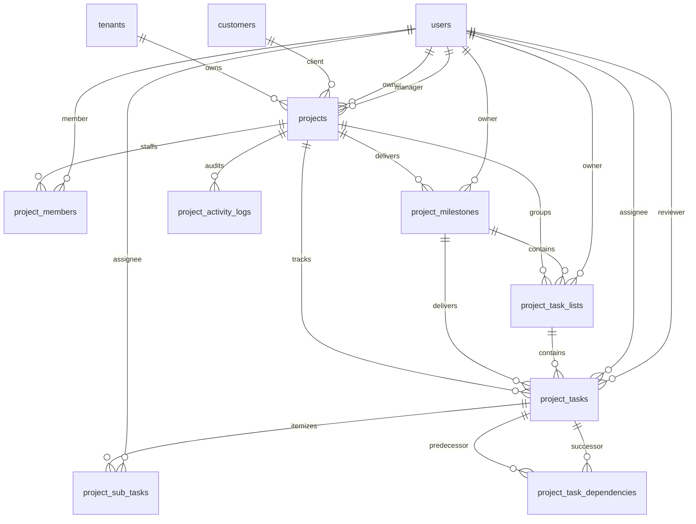

# Project Management Module — Data Model Specification

> **Document Status:** Canonical Data Model Reference  
> **Target Location:** `docs/project-management/DATA_MODEL.md`  
> **Source References:** Database Migrations, Eloquent Models, Requirements Specification, Audit Baseline (September 10, 2026).

---

## 1. Existing Implemented Tables

All existing tables in this domain are prefixed with `project_*` (except the root `projects` table) and enforce multi-tenant data ownership via foreign keys to `tenants`, `companies`, and `branches`.

---

### 1.1 `projects`
- **Purpose:** Primary project entity representing client engagements or internal initiatives.
- **Model:** [`App\Domains\Projects\Models\Project`](file:///c:/Users/windo/Documents/GitHub/wm-product-saas/app/Domains/Projects/Models/Project.php)
- **Primary Key:** `id` (bigint unsigned, auto-increment)
- **Tenant Ownership:**
  - `tenant_id` -> `tenants(id)` ON DELETE CASCADE
  - `company_id` -> `companies(id)` ON DELETE SET NULL
  - `branch_id` -> `branches(id)` ON DELETE SET NULL
- **Foreign Keys:**
  - `customer_id` -> `customers(id)` ON DELETE SET NULL (CRM Customer)
  - `owner_id` -> `users(id)` ON DELETE SET NULL
  - `manager_id` -> `users(id)` ON DELETE SET NULL
- **Key Columns:**
  - `project_code`: string, unique per tenant (`PRJ-0001`)
  - `name`: string
  - `start_date`: date
  - `end_date`: date, nullable
  - `budget_type`: string, nullable (`Fixed`, `Time & Material`)
  - `budget_amount`: decimal(15, 2), nullable
  - `budget_hours`: decimal(10, 2), nullable
  - `billing_method`: string, nullable (`Project Based`, `Milestone Based`, `Task Based`, `User Based`)
  - `priority`: string, default 'Medium' (`Low`, `Medium`, `High`, `Critical`)
  - `status`: string, default 'Draft' (`Draft`, `Active`, `On Hold`, `Completed`, `Closed`, `Cancelled`)
  - `description`: text, nullable
- **Constraints & Indexes:**
  - UNIQUE: `['tenant_id', 'project_code']`
  - INDEX: `['tenant_id', 'status']`
- **Soft Deletes:** Yes (`deleted_at`)
- **Status:** **ACTIVE / IN USE**

---

### 1.2 `project_members`
- **Purpose:** Staffing allocation of system users to projects with commercial rates and hour budgets.
- **Model:** [`App\Domains\Projects\Models\ProjectMember`](file:///c:/Users/windo/Documents/GitHub/wm-product-saas/app/Domains/Projects/Models/ProjectMember.php)
- **Primary Key:** `id` (bigint unsigned)
- **Tenant Ownership:** `tenant_id`, `company_id`, `branch_id`
- **Foreign Keys:**
  - `project_id` -> `projects(id)` ON DELETE CASCADE
  - `user_id` -> `users(id)` ON DELETE CASCADE
- **Key Columns:**
  - `project_role`: string, nullable (e.g. Lead Developer, QA Specialist)
  - `rate_per_hour`: decimal(12, 2), nullable (client billable rate)
  - `cost_per_hour`: decimal(12, 2), nullable (internal resource cost)
  - `budget_hours`: decimal(10, 2), nullable (allocated hour ceiling)
  - `is_active`: boolean, default true
- **Constraints & Indexes:**
  - UNIQUE: `['project_id', 'user_id', 'deleted_at']`
  - INDEX: `['tenant_id', 'project_id']`
- **Soft Deletes:** Yes (`deleted_at`)
- **Status:** **ACTIVE / IN USE**

---

### 1.3 `project_milestones`
- **Purpose:** Major delivery phases and client target deadlines.
- **Model:** [`App\Domains\Projects\Models\Milestone`](file:///c:/Users/windo/Documents/GitHub/wm-product-saas/app/Domains/Projects/Models/Milestone.php)
- **Primary Key:** `id` (bigint unsigned)
- **Tenant Ownership:** `tenant_id`, `company_id`, `branch_id`
- **Foreign Keys:**
  - `project_id` -> `projects(id)` ON DELETE CASCADE
  - `owner_id` -> `users(id)` ON DELETE SET NULL
- **Key Columns:**
  - `name`: string
  - `description`: text, nullable
  - `start_date`: date, nullable
  - `due_date`: date, nullable
  - `status`: string, nullable (`Draft`, `Active`, `On Hold`, `Completed`, `Closed`)
  - `completion_percentage`: unsigned tinyint, default 0
- **Constraints & Indexes:**
  - INDEX: `['tenant_id', 'project_id']`
- **Soft Deletes:** Yes (`deleted_at`)
- **Status:** **ACTIVE / IN USE**

---

### 1.4 `project_task_lists`
- **Purpose:** Logical grouping and board column containers for tasks.
- **Model:** [`App\Domains\Projects\Models\TaskList`](file:///c:/Users/windo/Documents/GitHub/wm-product-saas/app/Domains/Projects/Models/TaskList.php)
- **Primary Key:** `id` (bigint unsigned)
- **Tenant Ownership:** `tenant_id`, `company_id`, `branch_id`
- **Foreign Keys:**
  - `project_id` -> `projects(id)` ON DELETE CASCADE
  - `milestone_id` -> `project_milestones(id)` ON DELETE SET NULL
  - `owner_id` -> `users(id)` ON DELETE SET NULL
- **Key Columns:**
  - `name`: string
  - `description`: text, nullable
  - `position`: unsigned integer, default 0 (ordering sequence)
- **Constraints & Indexes:**
  - INDEX: `['tenant_id', 'project_id']`
  - INDEX: `['project_id', 'position']`
- **Soft Deletes:** Yes (`deleted_at`)
- **Status:** **ACTIVE / IN USE**

---

### 1.5 `project_tasks`
- **Purpose:** Actionable units of work.
- **Model:** [`App\Domains\Projects\Models\Task`](file:///c:/Users/windo/Documents/GitHub/wm-product-saas/app/Domains/Projects/Models/Task.php)
- **Primary Key:** `id` (bigint unsigned)
- **Tenant Ownership:** `tenant_id`, `company_id`, `branch_id`
- **Foreign Keys:**
  - `project_id` -> `projects(id)` ON DELETE CASCADE
  - `milestone_id` -> `project_milestones(id)` ON DELETE SET NULL
  - `task_list_id` -> `project_task_lists(id)` ON DELETE CASCADE
  - `assignee_id` -> `users(id)` ON DELETE SET NULL
  - `reviewer_id` -> `users(id)` ON DELETE SET NULL
- **Key Columns:**
  - `task_code`: string (`PRJ-0001-T-001`)
  - `title`: string
  - `description`: text, nullable
  - `priority`: string, default 'Medium' (`Low`, `Medium`, `High`, `Critical`)
  - `status`: string, default 'Open' (`Open`, `In Progress`, `Review`, `On Hold`, `Completed`, `Cancelled`)
  - `start_date`: date, nullable
  - `due_date`: date, nullable
  - `estimated_hours`: decimal(8, 2), nullable
  - `actual_hours`: decimal(8, 2), default 0.00
  - `position`: unsigned integer, default 0
  - `completed_at`: timestamp, nullable
- **Constraints & Indexes:**
  - UNIQUE: `['project_id', 'task_code']`
  - INDEX: `['tenant_id', 'project_id']`
  - INDEX: `['project_id', 'task_list_id', 'position']`
  - INDEX: `['assignee_id']`
- **Soft Deletes:** Yes (`deleted_at`)
- **Status:** **ACTIVE / IN USE**

---

### 1.6 `project_sub_tasks`
- **Purpose:** Subtasks and itemized checklist under parent tasks.
- **Model:** [`App\Domains\Projects\Models\SubTask`](file:///c:/Users/windo/Documents/GitHub/wm-product-saas/app/Domains/Projects/Models/SubTask.php)
- **Primary Key:** `id` (bigint unsigned)
- **Tenant Ownership:** `tenant_id`, `company_id`, `branch_id`
- **Foreign Keys:**
  - `task_id` -> `project_tasks(id)` ON DELETE CASCADE
  - `assignee_id` -> `users(id)` ON DELETE SET NULL
- **Key Columns:**
  - `title`: string
  - `is_completed`: boolean, default false
  - `position`: unsigned integer, default 0
  - `completed_at`: timestamp, nullable
- **Constraints & Indexes:**
  - INDEX: `['tenant_id', 'task_id']`
  - INDEX: `['task_id', 'position']`
- **Soft Deletes:** Yes (`deleted_at`)
- **Status:** **ACTIVE / IN USE**

---

### 1.7 `project_task_dependencies`
- **Purpose:** Directed dependency edge between tasks (Task A depends on Task B).
- **Model:** [`App\Domains\Projects\Models\TaskDependency`](file:///c:/Users/windo/Documents/GitHub/wm-product-saas/app/Domains/Projects/Models/TaskDependency.php)
- **Primary Key:** `id` (bigint unsigned)
- **Tenant Ownership:** `tenant_id`, `company_id`, `branch_id`
- **Foreign Keys:**
  - `project_id` -> `projects(id)` ON DELETE CASCADE
  - `task_id` -> `project_tasks(id)` ON DELETE CASCADE
  - `depends_on_task_id` -> `project_tasks(id)` ON DELETE CASCADE
- **Constraints & Indexes:**
  - UNIQUE: `['task_id', 'depends_on_task_id']`
  - INDEX: `['tenant_id', 'project_id']`
- **Soft Deletes:** None
- **Status:** **ACTIVE / IN USE**

---

### 1.8 `project_activity_logs`
- **Purpose:** Shared polymorphic activity history stream.
- **Model:** [`App\Domains\Projects\Models\ActivityLog`](file:///c:/Users/windo/Documents/GitHub/wm-product-saas/app/Domains/Projects/Models/ActivityLog.php)
- **Primary Key:** `id` (bigint unsigned)
- **Tenant Ownership:** `tenant_id`, `company_id`, `branch_id`
- **Foreign Keys:**
  - `project_id` -> `projects(id)` ON DELETE CASCADE
  - `triggered_by` -> `users(id)` ON DELETE SET NULL
- **Polymorphic Columns:** `subject_type`, `subject_id` (nullable)
- **Key Columns:**
  - `event_type`: string (e.g. `project.created`, `task.status_changed`)
  - `title`: string
  - `description`: text, nullable
  - `metadata`: json, nullable
  - `created_at`: timestamp, nullable (no `updated_at`)
- **Constraints & Indexes:**
  - INDEX: `['tenant_id', 'project_id', 'created_at']`
- **Soft Deletes:** None
- **Status:** **ACTIVE / IN USE**

---

## 2. Target Future Data Structures

> [!IMPORTANT]
> The following schemas represent requirements-driven target specifications.
> **DO NOT write migrations or alter database schema during this baseline phase.**
> Exact column types and indexes will be finalized during their respective implementation phases.

---

### 2.1 `project_time_logs` (Time Tracking & Timesheet)
- **Purpose:** Records hours logged by users against tasks and projects for productivity and billing.
- **Entity Model:** `App\Domains\Projects\Models\TimeLog` *(To be created in Phase 3)*
- **Proposed Attributes:**
  - `id`: bigint PK
  - `tenant_id`, `company_id`, `branch_id` (Tenant Scopes)
  - `project_id`: FK -> `projects(id)` ON DELETE CASCADE
  - `task_id`: FK -> `project_tasks(id)` ON DELETE CASCADE
  - `user_id`: FK -> `users(id)` ON DELETE CASCADE (resource logging time)
  - `log_date`: date
  - `start_time`: time, nullable
  - `end_time`: time, nullable
  - `hours`: decimal(8, 2)
  - `is_billable`: boolean, default true
  - `hourly_rate`: decimal(12, 2), nullable (captured from `project_members.rate_per_hour` at log time)
  - `description`: text, nullable
  - `approval_status`: string, default 'Pending' (`Pending`, `Approved`, `Rejected`)
  - `approved_by`: FK -> `users(id)` ON DELETE SET NULL
  - `approved_at`: timestamp, nullable
  - `rejection_remarks`: text, nullable
  - `is_invoiced`: boolean, default false
  - `invoice_id`: FK -> `invoices(id)` ON DELETE SET NULL (Sales Invoice linkage)
- **Status:** **TO BE DESIGNED & IMPLEMENTED IN PHASE 3**

---

### 2.2 `project_issues` (Defect & Issue Management)
- **Purpose:** Tracks project bugs, quality defects, and resolutions with retest verification.
- **Entity Model:** `App\Domains\Projects\Models\Issue` *(To be created in Phase 4)*
- **Proposed Attributes:**
  - `id`: bigint PK
  - `tenant_id`, `company_id`, `branch_id`
  - `project_id`: FK -> `projects(id)` ON DELETE CASCADE
  - `task_id`: FK -> `project_tasks(id)` ON DELETE SET NULL (optional task link)
  - `issue_number`: string (e.g. `PRJ-0001-ISS-001`)
  - `title`: string
  - `description`: text
  - `reporter_id`: FK -> `users(id)` ON DELETE SET NULL
  - `assignee_id`: FK -> `users(id)` ON DELETE SET NULL
  - `priority`: string (`Low`, `Medium`, `High`, `Critical`)
  - `severity`: string (`Minor`, `Major`, `Critical`)
  - `status`: string, default 'Open' (`Open`, `Assigned`, `In Progress`, `Resolved`, `Closed`)
  - `resolution_date`: timestamp, nullable
  - `resolution_notes`: text, nullable
- **Status:** **TO BE DESIGNED & IMPLEMENTED IN PHASE 4**

---

### 2.3 `project_documents` (Project File Management)
- **Purpose:** Central repository for project documentation, architecture blueprints, test cases, and file attachments.
- **Entity Model:** `App\Domains\Projects\Models\Document` *(To be created in Phase 4)*
- **Proposed Attributes:**
  - `id`: bigint PK
  - `tenant_id`, `company_id`, `branch_id`
  - `project_id`: FK -> `projects(id)` ON DELETE CASCADE
  - `attachable_type`, `attachable_id`: nullable polymorphic relation (link to Task, Issue, or Milestone)
  - `name`: string
  - `file_path`: string (storage path)
  - `file_name`: string (original filename)
  - `file_size`: integer (bytes)
  - `mime_type`: string
  - `category`: string (e.g., Requirement, Design, API, Test Case, Meeting Minutes, Attachment)
  - `uploaded_by`: FK -> `users(id)` ON DELETE SET NULL
  - `remarks`: text, nullable
- **Status:** **TO BE DESIGNED & IMPLEMENTED IN PHASE 4**

---

### 2.4 `project_reviews` (Client Review / UAT)
- **Purpose:** Captures formal client acceptance testing sign-offs.
- **Entity Model:** `App\Domains\Projects\Models\ProjectReview` *(To be created in Phase 5)*
- **Proposed Attributes:**
  - `id`: bigint PK
  - `tenant_id`, `company_id`, `branch_id`
  - `project_id`: FK -> `projects(id)` ON DELETE CASCADE
  - `reviewer_id`: FK -> `users(id)` ON DELETE SET NULL (or external contact record)
  - `review_date`: date
  - `status`: string (`Pending`, `Approved`, `Rework Required`)
  - `comments`: text, nullable
  - `sign_off_evidence`: string, nullable
- **Status:** **TO BE DESIGNED & IMPLEMENTED IN PHASE 5**

---

### 2.5 `project_change_requests` (Scope & Budget Adjustments)
- **Purpose:** Governs formal additions or alterations to project scope, budget, or timelines.
- **Entity Model:** `App\Domains\Projects\Models\ChangeRequest` *(To be created in Phase 5)*
- **Proposed Attributes:**
  - `id`: bigint PK
  - `tenant_id`, `company_id`, `branch_id`
  - `project_id`: FK -> `projects(id)` ON DELETE CASCADE
  - `cr_number`: string (`PRJ-0001-CR-001`)
  - `requested_by`: FK -> `users(id)` ON DELETE SET NULL
  - `description`: text
  - `impact_schedule_days`: integer, default 0
  - `impact_budget_amount`: decimal(15, 2), default 0.00
  - `impact_budget_hours`: decimal(10, 2), default 0.00
  - `status`: string, default 'Pending' (`Pending`, `Approved`, `Rejected`, `Implemented`)
  - `approved_by`: FK -> `users(id)` ON DELETE SET NULL
  - `approved_at`: timestamp, nullable
- **Status:** **TO BE DESIGNED & IMPLEMENTED IN PHASE 5**

---

### 2.6 Project Billing Bridge (Sales Invoicing)
- **Architecture Standard:** **DO NOT create a separate `project_invoices` table.**
- **Implementation Strategy:**
  - Reuse [`App\Domains\Sales\Models\Invoice`](file:///c:/Users/windo/Documents/GitHub/wm-product-saas/app/Domains/Sales/Models/Invoice.php).
  - Add nullable `project_id` foreign key to `invoices` (or create a polymorphic link `invoiceable`).
  - Bridge table/lines: Invoice line items link back to `project_time_logs` (for T&M billing) or `project_milestones` (for milestone billing).
- **Status:** **TO BE DESIGNED & IMPLEMENTED IN PHASE 7**

---

### 2.7 Project Closure Columns on `projects`
- **Purpose:** Supports formal operational project closeout.
- **Additive Migration on `projects` Table:**
  - `closure_date`: date, nullable
  - `closure_status`: string, nullable (`Completed`, `Terminated`, `Handed Over`)
  - `client_approval_ref`: string, nullable (reference to approved UAT sign-off)
  - `final_remarks`: text, nullable
- **Status:** **TO BE DESIGNED & IMPLEMENTED IN PHASE 8**
