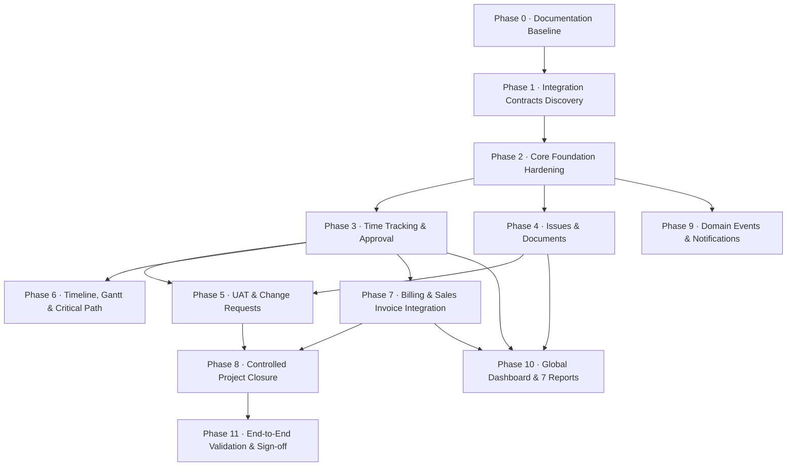

# Project Management Module — Implementation Roadmap

> **Document Status:** Canonical Implementation Roadmap  
> **Target Location:** `docs/project-management/IMPLEMENTATION_ROADMAP.md`  
> **Sequencing Rationale:** Ordered strictly by business dependency, technical risk, and architectural layering.

---

## 1. Roadmap Overview & Phasing Logic

The roadmap is structured into twelve sequential phases. Each phase builds upon the operational data produced by predecessor phases:
- Foundation Hardening (Phase 2) ensures that existing core entities (tasks, subtasks, dependencies, milestones) have correct business semantics before time tracking or issues are attached to them.
- Time Tracking (Phase 3) is implemented early because timesheets provide the actual hours needed for Scheduling (Phase 6), Reports (Phase 10), and Billing (Phase 7).
- Issues and Documents (Phase 4) provide quality and collateral management for project execution.
- UAT and Change Requests (Phase 5) establish the gate for Project Closure (Phase 8).
- Billing Integration (Phase 7) aggregates approved timesheets from Phase 3.
- Final Dashboard & Reports (Phase 10) require operational data across all earlier phases to render real metrics.

---

## 2. Phase-by-Phase Execution Plan

### Phase 0: Documentation Baseline *(Current Phase)*
- **Objective:** Establish canonical documentation covering requirements, architecture, workflows, data models, and audit baseline.
- **Deliverables:**
  - `docs/project-management/PRD.md`
  - `docs/project-management/ARCHITECTURE.md`
  - `docs/project-management/WORKFLOW.md`
  - `docs/project-management/DATA_MODEL.md`
  - `docs/project-management/INTEGRATIONS.md`
  - `docs/project-management/design-spec.md`
  - `docs/project-management/IMPLEMENTATION_ROADMAP.md`
  - `docs/project-management/AUDIT_BASELINE.md`
  - `docs/project-management/AGENTS.md`
- **Exit Criteria:** Complete documentation suite established; zero application code modifications.

---

### Phase 1: Integration Contracts & Technical Discovery
- **Objective:** Finalize contracts with existing shared ERP systems prior to code implementation.
- **Key Tasks:**
  1. **Sales Invoicing Contract:** Inspect [`App\Domains\Sales\Services\InvoiceService`](file:///c:/Users/windo/Documents/GitHub/wm-product-saas/app/Domains/Sales) to verify the data contract for passing project lines, billable amounts, and customer IDs into standard Sales Invoices.
  2. **File Storage Standards:** Validate disk configurations, upload size limits, and tenant path isolation rules for `project_documents`.
  3. **Notification Channels:** Confirm Laravel `notifications` table structure and mail delivery configuration in the ERP.
  4. **Timeline & Gantt Evaluation:** Evaluate adapting the ERP's native HTML5 Drag & Drop Timeline architecture (from `resources/views/modules/production/schedules/dispatch-board.blade.php`) vs. a focused technical spike for curved SVG dependency links.
- **Exit Criteria:** Technical interface specifications signed off; shared service contracts verified.

---

### Phase 2: Core Foundation Hardening
- **Objective:** Fix verified business logic gaps in the existing M1–M6 implementation.
- **Scope Clarification:**
  - *Project Creation Modal:* Fast Project Creation (`Name` -> `Create` -> `Detail Inline Edit`) is an intentional UX choice and is **not** a defect. It remains lightweight.
- **Critical Foundation Work:**
  1. **Task Dependency Enforcement:** Update [`TaskService::updateStatus()`](file:///c:/Users/windo/Documents/GitHub/wm-product-saas/app/Domains/Projects/Services/TaskService.php#L183-L214) to enforce dependencies server-side. Prevent transitioning a task to `In Progress` or `Completed` if any predecessor task is incomplete.
  2. **Subtask Capability Expansion:** Add `start_date`, `due_date`, `estimated_hours`, and `status` to `project_sub_tasks`. Update `SubTaskService` to calculate and rollup completion percentage into parent tasks.
  3. **Milestone Progress Rollup:** Automate `Milestone.completion_percentage` derivation from child tasks rather than relying strictly on manual entry.
  4. **Dependency Semantics:** Add `dependency_type` (`FS`, `SS`, `FF`) to `project_task_dependencies`.
- **Exit Criteria:** All 133 existing tests continue passing; new feature tests verify dependency gating and subtask rollups.

---

### Phase 3: Time Tracking & Timesheet Approval
- **Objective:** Enable team members to log time against tasks, and Project Managers to review and approve hours.
- **Key Tasks:**
  1. **Database:** Migration creating `project_time_logs` (tenant, company, branch, project_id, task_id, user_id, date, hours, billable flag, rate, approval_status, approver_id).
  2. **Model & Repository:** Create `TimeLog` model (BaseModel, tenant scopes) and `TimeLogRepositoryInterface` / `TimeLogRepository`.
  3. **Service:** Build `TimeLogService` handling time submission, rate lookup from `project_members`, approval/rejection logic, and dynamic rollup to `Task.actual_hours`.
  4. **Controller & Routes:** `TimeLogController` (entry CRUD) and `TimesheetApprovalController` (approval queue).
  5. **UI Views:** Time entry modal component in Task Workspace, and a dedicated Timesheet Approval screen (`projects/timelogs/approval.blade.php`).
- **Exit Criteria:** Time logs successfully update task actual hours; PMs can approve/reject entries; locked timesheets cannot be altered.

---

### Phase 4: Issue Management & Project Documents
- **Objective:** Implement quality defect tracking and project document management.
- **Key Tasks:**
  1. **Issues Database:** Migration creating `project_issues` (code `PRJ-0001-ISS-001`, project_id, task_id, reporter_id, assignee_id, priority, severity, status, resolution).
  2. **Issue Lifecycle Service:** Build `IssueService` enforcing the retest workflow (`Open` -> `Assigned` -> `In Progress` -> `Resolved` -> Retest Fails / Retest Passes -> `Closed`).
  3. **Issue UI Views:** Issue directory table and Issue Detail Workspace (`projects/issues/`).
  4. **Documents Database:** Migration creating `project_documents` (project_id, attachable polymorphic relation, file_path, category, size, mime).
  5. **Document Service & Controller:** Secure upload, category categorization, and permission-checked download streaming.
  6. **UI Integration:** Documents tab on Project Detail and Attachments widget in Task Workspace.
- **Exit Criteria:** Issues enforce retest loops; files upload securely to tenant storage and stream correctly to authorized users.

---

### Phase 5: Client Review / UAT & Change Requests
- **Objective:** Implement formal client sign-off and scope change governance.
- **Key Tasks:**
  1. **UAT Database:** Migration creating `project_reviews` (project_id, reviewer_id, review_date, status, comments, sign-off evidence).
  2. **UAT Service & Gatekeeper:** Build `ProjectReviewService` blocking review creation until 100% of milestones are `Completed`.
  3. **Change Requests Database:** Migration creating `project_change_requests` (cr_number, project_id, requestor, impact_days, impact_budget_amount, impact_hours, status).
  4. **Change Request Service:** Logic to automatically adjust project budget and create child tasks upon CR approval.
  5. **UI Views:** UAT review modal/screen and Change Request management tab on Project Detail.
- **Exit Criteria:** UAT cannot be started with open milestones; "Rework Required" triggers CR creation; approved CRs adjust project budget.

---

### Phase 6: Timeline, Scheduling, Gantt & Critical Path
- **Objective:** Provide interactive timeline visualization and automated schedule calculation.
- **Key Tasks:**
  1. **Gantt Component:** Integrate lightweight frontend Gantt renderer in `resources/views/modules/projects/timeline.blade.php`.
  2. **Scheduling Service:** Build `ProjectScheduleService` calculating Critical Path (Early Start/Finish, Late Start/Finish, Slack/Float).
  3. **AJAX Date Shifting:** Implement endpoint to shift dependent task dates when predecessor bars are moved in the Gantt UI.
- **Exit Criteria:** Gantt renders real project milestones, tasks, and dependency links; critical path is highlighted; date changes persist.

---

### Phase 7: Billing & Sales Invoice Integration
- **Objective:** Connect approved billable time and completed milestones directly into ERP Sales Invoices.
- **Key Tasks:**
  1. **Billing Service:** Build `ProjectBillingService` that queries unbilled approved `TimeLog` records (for T&M contracts) and completed `Milestone` records (for milestone contracts).
  2. **Sales Invoice Bridge:** Integrate with [`App\Domains\Sales\Services\InvoiceService`](file:///c:/Users/windo/Documents/GitHub/wm-product-saas/app/Domains/Sales) to generate standard Sales Invoices with line items linked to project deliverables.
  3. **Mark Billed:** Update `is_invoiced = true` and record `invoice_id` on billed time logs to prevent duplicate invoicing.
  4. **UI View:** Billing tab on Project Detail displaying invoice history, outstanding amounts, and payment status.
- **Exit Criteria:** Invoices generate cleanly in Sales module with general ledger auto-posting; double-billing is prevented.

---

### Phase 8: Controlled Project Closure
- **Objective:** Enforce strict business condition gates before a project can be marked closed.
- **Key Tasks:**
  1. **Database:** Migration adding closure columns (`closure_date`, `closure_status`, `client_approval_ref`, `final_remarks`) to `projects`.
  2. **Closure Service:** Build `ProjectClosureService` that verifies all 5 closure gates:
     - Zero open tasks or subtasks.
     - Zero unresolved issues.
     - Approved Client UAT Review.
     - All approved time logs invoiced.
     - Milestones completed.
  3. **Closure UI:** Dedicated "Close Project" verification modal with blocker checklist.
  4. **Read-Only Lock:** Once closed, project rejects any new task creation or timesheet submissions.
- **Exit Criteria:** Closure blocked if any gate fails; successful closure transitions status to `Closed` and archives project.

---

### Phase 9: Domain Events & Notifications
- **Objective:** Dispatch in-app and email notifications on key project events.
- **Key Tasks:**
  1. **Events:** Create event classes in `app/Domains/Projects/Events/` (`TaskAssigned`, `TaskCompleted`, `IssueLogged`, `TimesheetSubmitted`, `UATRequested`).
  2. **Notifications:** Create Laravel notification classes leveraging `database` and `mail` channels.
  3. **Listeners:** Wire listeners in `app/Domains/Projects/Listeners/`.
  4. **Top Nav Bell:** Ensure unread project notifications appear in the Duralux top navbar bell menu.
- **Exit Criteria:** Users receive notifications for task assignments and review requests; notifications link directly to relevant workspace.

---

### Phase 10: Executive Dashboard & 7 Operational Reports
- **Objective:** Provide project portfolio analytics and dedicated operational reports.
- **Key Tasks:**
  1. **Global Dashboard:** Build `ProjectDashboardController` and `projects/dashboard.blade.php` with portfolio KPI cards and workload heatmaps.
  2. **Reports Service & Controller:** Build `ProjectReportController` and `ProjectReportService`.
  3. **Seven Reports:**
     - Project Summary Report
     - Task Status Report
     - Resource Utilization Report
     - Timesheet & Billability Report
     - Issue & Defect Density Report
     - Milestone Variance Report
     - Budget vs. Actual Cost Report
  4. **Export:** Excel/CSV download support for all reports.
- **Exit Criteria:** All 7 reports display accurate data matching seeded fixtures; export produces formatted spreadsheets.

---

### Phase 11: Final End-to-End Validation & User Sign-Off
- **Objective:** Execute full lifecycle integration testing and complete read-only audit verification.
- **Key Tasks:**
  1. Run complete test suite (`php artisan test`).
  2. Execute E2E walkthrough script simulating complete lifecycle: Create Project -> Staff -> Milestone -> Task -> Dependency -> Time Log -> Timesheet Approval -> Issue Retest -> UAT Sign-off -> Sales Invoicing -> Controlled Closure.
  3. Produce final walkthrough artifact.
- **Exit Criteria:** 100% test pass rate across all feature suites; zero regressions; user sign-off.
