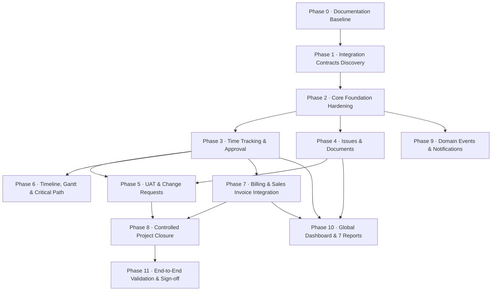

# Project Management Module — Implementation Roadmap

> **Document Status:** Canonical Implementation Roadmap  
> **Target Location:** `docs/project-management/IMPLEMENTATION_ROADMAP.md`  
> **Sequencing Rationale:** Ordered strictly by business dependency, technical risk, and architectural layering.

---

## Current Roadmap State

| Attribute | State |
|---|---|
| **Last Completed Major Phase** | **Phase 2 — Core Foundation Hardening** (Status: Completed & Formally Verified) |
| **Current Major Phase** | **None** — between major phases (no major implementation phase currently in progress) |
| **Next Major Phase** | **Phase 3 — Time Tracking & Timesheet Approval** |
| **Phase 3 Status** | **NOT STARTED** |
| **Next Authorized Action** | **Phase 3A — Read-Only Requirements / Current-State Audit** |

> [!IMPORTANT]
> **Roadmap Scope & Governance Principle:**  
> The implementation roadmap tracks **ONLY major planned product-development phases**.  
> Routine maintenance, UI cleanup, visual polish, dropdown fixes, bug fixes, regression fixes, stabilization, refactoring, small UX improvements, and isolated technical corrections are **not** roadmap phases.  
> These activities may occur before, during, or between major phases without altering the major phase sequence or creating intermediate roadmap phases (unless they directly affect a formal phase completion or reveal a verified architectural blocker).

---

## 1. Roadmap Overview & Phasing Logic

The roadmap is structured into twelve controlled major phases with defined business and technical dependencies. Each phase builds upon the operational data produced by predecessor phases:
- Foundation Hardening (Phase 2) ensures that existing core entities (tasks, subtasks, dependencies, milestones) have correct business semantics before time tracking or issues are attached to them.
- Time Tracking (Phase 3) is implemented early because timesheets provide the actual hours needed for Scheduling (Phase 6), Reports (Phase 10), and Billing (Phase 7).
- Issues and Documents (Phase 4) provide quality and collateral management for project execution.
- UAT and Change Requests (Phase 5) establish the gate for Project Closure (Phase 8).
- Billing Integration (Phase 7) aggregates approved timesheets from Phase 3.
- Final Dashboard & Reports (Phase 10) require operational data across all earlier phases to render real metrics.



---

### Phase Status Governance

Every major phase strictly follows a progressive governance lifecycle. An AI agent or developer must **never** jump directly from a planned phase into implementation without completing the preceding governance and approval gates:

```
NOT STARTED
    ↓
AUDIT (Read-only discovery of current schema, services, routes, UI, tests)
    ↓
ARCHITECTURE / INTEGRATION VALIDATION (Contract validation against ERP dependencies)
    ↓
IMPLEMENTATION PLAN (Detailed design artifact created and submitted for review)
    ↓
APPROVED FOR IMPLEMENTATION (Explicit user approval obtained)
    ↓
IMPLEMENTATION (Domain code, migrations, requests, services, views)
    ↓
TESTING / VALIDATION (Feature test suites, regression testing, assertions check)
    ↓
FINAL VERIFICATION (Read-only verification of delivered scope against plan)
    ↓
COMPLETED / VERIFIED
```

> [!NOTE]
> **Audit Subordination Rule:**  
> An audit may discover that the originally proposed implementation is incorrect, unnecessary, or already available elsewhere in the ERP. In that situation, the implementation plan **MUST** be changed to use the verified existing architecture.  
> The roadmap's target implementation is subordinate to the actual audited ERP architecture. Never implement the roadmap literally if the repository proves that a better existing implementation should be reused or extended.

---

### Critical Architectural Principles

#### 1. Existing ERP Infrastructure Reuse & Integration Rule
Before creating **ANY** new database table, migration, model, repository, service, controller, route, permission, UI component, storage mechanism, notification mechanism, activity logging mechanism, export mechanism, billing mechanism, user/resource mechanism, or other infrastructure, the AI agent or developer **MUST** first audit the existing ERP implementation.

The audit must inspect at minimum:
- Existing migrations
- Current database tables and schema
- Eloquent models
- Repositories
- Domain services
- Controllers and endpoints
- Routes and middleware
- Requests and validation rules
- Permissions and RBAC policies
- Tenant, company, and branch isolation scopes
- Existing UI components (`x-ui`, Duralux templates)
- Existing shared services
- Existing integrations
- Existing feature and unit tests
- Canonical documentation

The agent must answer the following six questions:
1. **Does the required capability already exist?**
2. **Is an existing table, model, service, or component reusable?**
3. **Can an existing implementation be extended safely?**
4. **Is the existing implementation compatible with Project Management?**
5. **Does another ERP module already own this responsibility?**
6. **Would creating a new implementation duplicate existing functionality?**

**Rule:** ONLY if the audit establishes that suitable infrastructure does not exist may a new implementation be proposed. No duplicate infrastructure may be created merely because a new module needs similar functionality.

#### 2. Database & Migration Safety Rule
Before proposing or creating any new migration or table, the agent **MUST** inspect:
- All relevant existing migration files
- Current table definitions
- Model relationships
- Database indexes
- Foreign key constraints
- Tenant (`tenant_id`), company (`company_id`), and branch (`branch_id`) columns
- Existing status/enum conventions
- Soft-delete (`deleted_at`) conventions
- Existing fields that may already satisfy the requirement

**Decision Matrix:**
- If a suitable table already exists: $\to$ **Reuse it.**
- If an existing table can safely be extended: $\to$ **Evaluate extension before creating a new table.**
- If a new table is genuinely required: $\to$ **Document why the existing table cannot be reused.**

**Mandatory Database Constraints:**
- **NEVER modify old or historical migrations** merely to implement a new phase. Existing migrations are historical database contracts already executed in production/staging.
- New schema changes must use **new migrations**.
- **Never create a second table** for the same business concept.
- **Never create duplicate columns** because an existing column already represents the required data.
- **Never rename or remove existing columns or tables** without an explicitly approved architectural requirement.
- **Never destroy existing data contracts** to fit a new feature.

#### 3. Cross-Module Integration & Module Ownership Boundaries
Project Management is an integral module of the existing ERP ecosystem and must integrate with existing modules rather than creating parallel or isolated systems.

**Module Ownership Matrix:**

| ERP Domain / Resource | Owning Module / Infrastructure | Project Management Integration Pattern |
|---|---|---|
| **Users / Employees / Staff** | Core User / HRMS | Reuse existing Core `User` and ERP resource/member structures where applicable. |
| **Customers / Clients** | CRM / Sales | Reuse existing CRM / Customer entities; do **not** create a PM customer table. |
| **Sales Invoicing** | Sales Module | PM calculates and identifies billable work; Sales owns Sales Invoice generation and lines. |
| **General Ledger & Accounting**| Accounting Module | Accounting owns ledger posting, chart of accounts, and financial journal entries. |
| **File Storage** | Shared Storage / Laravel Disk | Reuse ERP Storage infrastructure and strict tenant folder isolation rules. |
| **Activity Logging** | Core Audit Infrastructure | Reuse existing `ActivityLogService` and shared activity log schemas. |
| **Access Control (RBAC)** | Core Auth / Permissions | Reuse existing permission, role, and `AccessService` architecture. |
| **Multi-Tenancy** | Core Tenancy | Reuse existing tenant/company/branch isolation traits and global scopes. |
| **User Interface (UI)** | Duralux / Common UI | Reuse existing Duralux, `x-ui`, and established ERP design patterns. |
| **Data Export** | Core Export Utilities | Reuse existing ERP export infrastructure for CSV/Excel generation. |
| **Notifications** | Core Notifications | Reuse Laravel notifications table and notification channels (Phase 9). |
| **Timeline / Gantt** | Production Module Dispatch | Reuse native HTML5 Drag & Drop Timeline patterns before introducing third-party libraries. |
| **Time Tracking / Worklogs** | Shared ERP Infrastructure (or PM Domain if justified) | PM owns project execution and project-level time/work-tracking **requirements**; existing ERP time/worklog infrastructure must be reused or integrated if available. A dedicated `project_time_logs` table must not be assumed. |

**Ownership Principle:**  
Project Management owns project execution, tasks, milestones, dependencies, project review workflows, project reporting, and project-level time/work-tracking **requirements** (such as task attribution, billability tracking, and timesheet approvals). Crucially, existing ERP time/worklog infrastructure must be reused or integrated if available; this does not imply that a separate `project_time_logs` table must necessarily be created.  
When Project Management needs functionality owned by another module, it must **integrate with that module** instead of reproducing that module's functionality inside Projects.

---

### AI Agent Continuation Rules

All future AI agents working in this repository must strictly adhere to the following 20 governance rules:

1. **Read Roadmap First:** Inspect `docs/project-management/IMPLEMENTATION_ROADMAP.md` before initiating any Project Management task.
2. **Determine Last Completed Phase:** Identify the last completed and verified major phase (`Phase 2 — Core Foundation Hardening`).
3. **Determine Next Major Phase:** Identify the next major phase in the canonical sequence (`Phase 3 — Time Tracking & Timesheet Approval`).
4. **Determine Next Authorized Action:** Perform only the next authorized step (`Phase 3A — Read-Only Requirements / Current-State Audit`) for the next phase. Phase 3A is strictly a read-only discovery/current-state/gap audit; architecture and integration decisions must happen only in the following Architecture / Integration Validation gate.
5. **No Automatic Implementation:** Do not automatically start implementation of the next phase. A phase remains `NOT STARTED` until explicitly authorized.
6. **Follow Lifecycle Gates:** Strictly observe the progression: `NOT STARTED` $\to$ `AUDIT` $\to$ `ARCHITECTURE` $\to$ `PLAN` $\to$ `APPROVAL` $\to$ `IMPLEMENTATION` $\to$ `TESTING` $\to$ `VERIFICATION` $\to$ `COMPLETED`.
7. **Maintenance Is Not a Phase:** Do not create or track ad-hoc maintenance, UI cleanup, visual polish, or minor bug fixes as roadmap phases.
8. **Preserve Completed Phases:** Do not refactor, rename, or dismantle completed phases unless a verified regression requires correction.
9. **No Premature Feature Creep:** Never introduce models, migrations, routes, or UI from future phases prematurely.
10. **Zero Infrastructure Duplication:** Reuse existing ERP infrastructure (Duralux UI components, `AccessService`, `BaseModel`, tenant traits, activity logging).
11. **Observe Documentation Standards:** Adhere strictly to `AGENTS.md`, `PRD.md`, `ARCHITECTURE.md`, `WORKFLOW.md`, and `DATA_MODEL.md`.
12. **Existing Infrastructure First:** Before creating anything, search the repository and migration history for an existing implementation of the required business capability.
13. **Migration-First Audit:** Never assume a table is missing. Inspect migration history and current database schema before proposing a migration.
14. **Reuse Before Extend:** Prefer: existing implementation $\to$ existing extension $\to$ new implementation only if strictly necessary.
15. **Module Ownership:** If another ERP module already owns a capability, integrate with that module instead of creating a PM duplicate.
16. **Historical Migration Protection:** Never edit old migrations to implement a new feature. Use a new migration when a schema change is genuinely required.
17. **No Duplicate Business Concepts:** Do not create duplicate tables, models, or services for concepts already represented in the ERP.
18. **Audit Findings Override Assumptions:** If the roadmap proposes a component that the audit proves already exists or should be owned by another module, revise the implementation plan accordingly.
19. **Integration Before Isolation:** Prefer clean integration with existing ERP contracts over PM-specific isolated implementations.
20. **Explicit Justification Required:** Every genuinely new infrastructure component introduced in a future implementation plan must have a documented reason explaining why existing infrastructure could not safely be reused or extended.

---

## 2. Phase-by-Phase Execution Plan

### Phase 0: Documentation Baseline — [COMPLETED]
- **Status:** **COMPLETED**
- **Objective:** Establish canonical documentation covering requirements, architecture, workflows, data models, and audit baseline.
- **Deliverables:**
  - `docs/project-management/PRD.md`
  - `docs/project-management/ARCHITECTURE.md`
  - `docs/project-management/WORKFLOW.md`
  - `docs/project-management/DATA_MODEL.md`
  - `docs/project-management/INTEGRATIONS.md`
  - `docs/project-management/design-spec.md`
  - `docs/project-management/IMPLEMENTATION_ROADMAP.md`
  - `docs/project-management/AUDIT_BASELINE.md`
  - `docs/project-management/AGENTS.md`
- **Exit Criteria:** Complete documentation suite established; zero application code modifications.

---

### Phase 1: Integration Contracts & Technical Discovery — [COMPLETED]
- **Status:** **COMPLETED**
- **Objective:** Finalize contracts with existing shared ERP systems prior to code implementation.
- **Key Tasks:**
  1. **Sales Invoicing Contract:** Inspect `App\Domains\Sales\Services\InvoiceService` to verify the data contract for passing project lines, billable amounts, and customer IDs into standard Sales Invoices.
  2. **File Storage Standards:** Validate disk configurations, upload size limits, and tenant path isolation rules for `project_documents`.
  3. **Notification Channels:** Confirm Laravel `notifications` table structure and mail delivery configuration in the ERP.
  4. **Timeline & Gantt Evaluation:** Evaluate adapting the ERP's native HTML5 Drag & Drop Timeline architecture (from `resources/views/modules/production/schedules/dispatch-board.blade.php`) vs. a focused technical spike for curved SVG dependency links.
- **Exit Criteria:** Technical interface specifications signed off; shared service contracts verified.

---

### Phase 2: Core Foundation Hardening — [COMPLETED / VERIFIED]
- **Status:** **COMPLETED / VERIFIED**
- **Objective:** Fix verified business logic gaps in the existing M1–M6 implementation.
- **Scope Clarification:**
  - *Project Creation Modal:* Fast Project Creation (`Name` -> `Create` -> `Detail Inline Edit`) is an intentional UX choice and remains lightweight and untouched.
- **Completed Foundation Work:**
  1. **Task Dependency Enforcement & Semantics:**
     - Added `dependency_type` (`Finish-to-Start`, `Start-to-Start`, `Finish-to-Finish`, `Start-to-Finish`) to `project_task_dependencies`.
     - In-memory cycle detection rejects direct and indirect circular chains before persistence.
     - Updated `TaskService::updateStatus()` (`app/Domains/Projects/Services/TaskService.php`) to enforce transition gates server-side against predecessor state (while administrative transitions `On Hold` and `Cancelled` are always permitted).
  2. **Subtask Execution Metadata & Synchronization:**
     - Added `start_date`, `due_date`, `estimated_hours`, and `status` to `project_sub_tasks`.
     - Implemented canonical status $\iff$ is_completed synchronization (`status = Completed` $\iff$ `is_completed = true` / `completed_at = now()`).
     - Maintained parent task status autonomy (never auto-mutating parent task status on subtask completion).
  3. **Milestone Progress Rollup:**
     - Automated `Milestone.completion_percentage` derivation from non-cancelled child tasks (`completed / eligible * 100`, 0% if 0 eligible).
     - Recalculates dynamically on task creation, status update, deletion, and reassignment between milestones.
  4. **Project Progress Aggregation:**
     - Aligned `ProjectService::dashboardStats()` and task list progress to consistently exclude cancelled tasks from denominator.
- **Exit Verification:**
  - Full Project test suite passing (136 tests, 402 assertions, 0 failures).
  - Manual browser validation confirmed subtask metadata, toggle synchronization, dependency type selection, and badge rendering.

---

### Phase 3: Time Tracking & Timesheet Approval — [NOT STARTED]
- **Status:** **NOT STARTED**
- **Next Authorized Action:** **Phase 3A — Read-Only Requirements / Current-State Audit**
- **Objective:** Enable team members to log time against tasks, and Project Managers to review and approve hours.

#### Initial Target Scope — Subject to Phase 3A Audit and Architecture Validation
> [!IMPORTANT]
> The target scope items below represent **provisional architectural targets**. They **MUST NOT** be treated as pre-approved implementation decisions.  
> During the Phase 3A read-only audit, the agent must first determine whether equivalent time-tracking, attendance, or worklog infrastructure already exists elsewhere in the ERP.  
> If an existing system is suitable: **integrate, reuse, or extend it.**  
> If an existing system is not suitable: **document the verified gap and justify any PM-specific infrastructure.**  
> Never assume that `project_time_logs` or new controllers must definitely be created before the audit confirms it.

**Provisional Target Scope (Subject to Audit):**
1. **Database:** Migration creating `project_time_logs` (tenant, company, branch, project_id, task_id, user_id, date, hours, billable flag, rate, approval_status, approver_id) *only if existing ERP worklog/attendance tables cannot be reused or extended*.
2. **Model & Repository:** Create `TimeLog` model (BaseModel, tenant scopes) and `TimeLogRepositoryInterface` / `TimeLogRepository` if justified by audit.
3. **Service:** Build `TimeLogService` handling time submission, rate lookup from `project_members`, approval/rejection logic, and dynamic rollup to `Task.actual_hours`.
4. **Controller & Routes:** `TimeLogController` (entry CRUD) and `TimesheetApprovalController` (approval queue).
5. **UI Views:** Time entry modal component in Task Workspace, and a dedicated Timesheet Approval screen (`resources/views/modules/projects/timelogs/approval.blade.php`).

#### Phase 3A Mandatory Audit Requirements
> [!IMPORTANT]
> **Phase 3A Governance & Boundary — Strict Read-Only Audit:**  
> Phase 3A is strictly a **READ-ONLY discovery, current-state, and gap audit**. No architecture or integration decisions may be made or finalized during Phase 3A. Architectural decisions, schema design, table reuse/extension strategies, and integration contracts must happen **only** in the subsequent **Architecture / Integration Validation gate**, which then informs the formal Implementation Plan.

Before entering the Architecture / Integration Validation gate or proposing any implementation plan, the future Phase 3A read-only audit **MUST** inspect at minimum:
- **Database:** All time, timesheet, attendance, and worklog migration files; all existing database tables, columns, indexes, foreign keys, and tenant/company/branch scoping columns.
- **Models:** `Project`, `Task`, `SubTask`, `ProjectMember`, `User`, and any existing time/timesheet/worklog models across the entire ERP.
- **Services:** Existing time tracking services, timesheet services, attendance services, rate calculation services, and approval workflows.
- **Repositories:** Existing time/worklog repositories, and project/task repositories that may already expose `actual_hours` or similar fields.
- **Routes & Controllers:** Existing time entry endpoints, approval routes, and task workspace controller actions.
- **User Interface:** Existing time-entry modals, timesheet review screens, approval interfaces, and task workspace UI patterns.
- **Business Rules:** Billable vs. non-billable categorization, hourly rate hierarchies, actual vs. estimated hours rollup, approval/rejection state machines, timesheet locking, entry editing/deletion permissions, date/time boundaries, overlapping entries, duplicate entry prevention, and project/task association rules.
- **Security & Authorization:** Multi-tenant scoping, company and branch isolation, project membership validation, RBAC permissions, and individual record ownership.
- **Cross-Module Integrations:** Sales invoicing data expectations, Accounting ledger requirements, CRM client relationships, HRMS attendance links (if applicable), and existing report/export capabilities.
- **Tests:** Existing time/timesheet tests, project test suites, and potential regression risks.

---

### Phase 4: Issue Management & Project Documents — [PLANNED]
- **Status:** **PLANNED**
- **Objective:** Implement quality defect tracking and project document management.
- **Initial Target Scope (Subject to Phase 4 Audit):**
  1. **Issues Database:** Migration creating `project_issues` (code `PRJ-0001-ISS-001`, project_id, task_id, reporter_id, assignee_id, priority, severity, status, resolution).
  2. **Issue Lifecycle Service:** Build `IssueService` enforcing the retest workflow (`Open` -> `Assigned` -> `In Progress` -> `Resolved` -> Retest Fails / Retest Passes -> `Closed`).
  3. **Issue UI Views:** Issue directory table and Issue Detail Workspace (`resources/views/modules/projects/issues/`).
  4. **Documents Database:** Migration creating `project_documents` (project_id, attachable polymorphic relation, file_path, category, size, mime), reusing existing ERP storage infrastructure.
  5. **Document Service & Controller:** Secure upload, category categorization, and permission-checked download streaming.
  6. **UI Integration:** Documents tab on Project Detail and Attachments widget in Task Workspace.
- **Exit Criteria:** Issues enforce retest loops; files upload securely to tenant storage and stream correctly to authorized users.

---

### Phase 5: Client Review / UAT & Change Requests — [PLANNED]
- **Status:** **PLANNED**
- **Objective:** Implement formal client sign-off and scope change governance.
- **Initial Target Scope (Subject to Phase 5 Audit):**
  1. **UAT Database:** Migration creating `project_reviews` (project_id, reviewer_id, review_date, status, comments, sign-off evidence).
  2. **UAT Service & Gatekeeper:** Build `ProjectReviewService` blocking review creation until 100% of milestones are `Completed`.
  3. **Change Requests Database:** Migration creating `project_change_requests` (cr_number, project_id, requestor, impact_days, impact_budget_amount, impact_hours, status).
  4. **Change Request Service:** Logic to automatically adjust project budget and create child tasks upon CR approval.
  5. **UI Views:** UAT review modal/screen and Change Request management tab on Project Detail.
- **Exit Criteria:** UAT cannot be started with open milestones; "Rework Required" triggers CR creation; approved CRs adjust project budget.

---

### Phase 6: Timeline, Scheduling, Gantt & Critical Path — [PLANNED]
- **Status:** **PLANNED**
- **Objective:** Provide interactive timeline visualization and automated schedule calculation.
- **Initial Target Scope (Subject to Phase 6 Audit):**
  1. **Gantt Component:** Integrate lightweight frontend Gantt renderer in `resources/views/modules/projects/timeline.blade.php`, evaluating native HTML5 Drag & Drop Timeline architecture first.
  2. **Scheduling Service:** Build `ProjectScheduleService` calculating Critical Path (Early Start/Finish, Late Start/Finish, Slack/Float).
  3. **AJAX Date Shifting:** Implement endpoint to shift dependent task dates when predecessor bars are moved in the Gantt UI.
- **Exit Criteria:** Gantt renders real project milestones, tasks, and dependency links; critical path is highlighted; date changes persist.

---

### Phase 7: Billing & Sales Invoice Integration — [PLANNED]
- **Status:** **PLANNED**
- **Objective:** Connect approved billable time and completed milestones directly into ERP Sales Invoices.
- **Architectural Boundary & Invoicing Flow:**
  ```
  Project Management Module
      ↓ (calculates & identifies billable project hours & milestone deliverables)
  Sales Module (App\Domains\Sales\Services\InvoiceService)
      ↓ (generates standard Sales Invoice with linked lines & customer reference)
  Accounting Module
      ↓ (posts general ledger journals and tracks payment receipts)
  ```
- **Initial Target Scope (Subject to Phase 7 Audit):**
  1. **Billing Service:** Build `ProjectBillingService` that queries unbilled approved time logs (for T&M contracts) and completed milestones (for milestone contracts).
  2. **Sales Invoice Bridge:** Integrate with `App\Domains\Sales\Services\InvoiceService` to generate standard Sales Invoices. The Sales module remains the sole owner of Sales Invoice creation.
  3. **Billed Status Tracking:** Record billing linkage using fields and contracts verified during Phase 7 architecture validation (preventing duplicate billing).
  4. **UI View:** Billing tab on Project Detail displaying invoice history, outstanding amounts, and payment status.
- **Exit Criteria:** Invoices generate cleanly in Sales module with general ledger auto-posting; double-billing is prevented.

---

### Phase 8: Controlled Project Closure — [PLANNED]
- **Status:** **PLANNED**
- **Objective:** Enforce strict business condition gates before a project can be marked closed.
- **Initial Target Scope (Subject to Phase 8 Audit):**
  1. **Database:** Migration adding closure columns (`closure_date`, `closure_status`, `client_approval_ref`, `final_remarks`) to `projects`.
  2. **Closure Service:** Build `ProjectClosureService` that verifies all 5 closure gates:
     - Zero open tasks or subtasks.
     - Zero unresolved issues.
     - Approved Client UAT Review.
     - All approved time logs invoiced.
     - Milestones completed.
  3. **Closure UI:** Dedicated "Close Project" verification modal with blocker checklist.
  4. **Read-Only / Archival State:** Project transitions to the approved Closed state and follows the ERP's established archival/read-only behavior, subject to Phase 8 audit.
- **Exit Criteria:** Closure blocked if any gate fails; successful closure transitions status to `Closed` and archives project according to established ERP conventions.

---

### Phase 9: Domain Events & Notifications — [PLANNED]
- **Status:** **PLANNED**
- **Objective:** Dispatch in-app and email notifications on key project events.
- **Initial Target Scope (Subject to Phase 9 Audit):**
  1. **Events:** Create event classes in `app/Domains/Projects/Events/` (`TaskAssigned`, `TaskCompleted`, `IssueLogged`, `TimesheetSubmitted`, `UATRequested`).
  2. **Notifications:** Create Laravel notification classes leveraging existing `database` and `mail` channels.
  3. **Listeners:** Wire listeners in `app/Domains/Projects/Listeners/`.
  4. **Top Nav Bell:** Ensure unread project notifications appear in the Duralux top navbar bell menu.
- **Exit Criteria:** Users receive notifications for task assignments and review requests; notifications link directly to relevant workspace.

---

### Phase 10: Executive Dashboard & 7 Operational Reports — [PLANNED]
- **Status:** **PLANNED**
- **Objective:** Provide project portfolio analytics and dedicated operational reports.
- **Initial Target Scope (Subject to Phase 10 Audit):**
  1. **Global Dashboard:** Build `ProjectDashboardController` and `resources/views/modules/projects/dashboard.blade.php` with portfolio KPI cards and workload heatmaps.
  2. **Reports Service & Controller:** Build `ProjectReportController` and `ProjectReportService`.
  3. **Seven Reports:**
     - Project Summary Report
     - Task Status Report
     - Resource Utilization Report
     - Timesheet & Billability Report
     - Issue & Defect Density Report
     - Milestone Variance Report
     - Budget vs. Actual Cost Report
  4. **Export:** Excel/CSV download support reusing existing ERP export infrastructure.
- **Exit Criteria:** All 7 reports display accurate data matching seeded fixtures; export produces formatted spreadsheets.

---

### Phase 11: Final End-to-End Validation & User Sign-Off — [PLANNED]
- **Status:** **PLANNED**
- **Objective:** Execute full lifecycle integration testing and complete read-only audit verification.
- **Key Tasks:**
  1. Run complete test suite (`php artisan test`).
  2. Execute E2E walkthrough script simulating complete lifecycle: Create Project -> Staff -> Milestone -> Task -> Dependency -> Time Log -> Timesheet Approval -> Issue Retest -> UAT Sign-off -> Sales Invoicing -> Controlled Closure.
  3. Produce final walkthrough artifact.
- **Exit Criteria:** 100% test pass rate across all feature suites; zero regressions; user sign-off.
