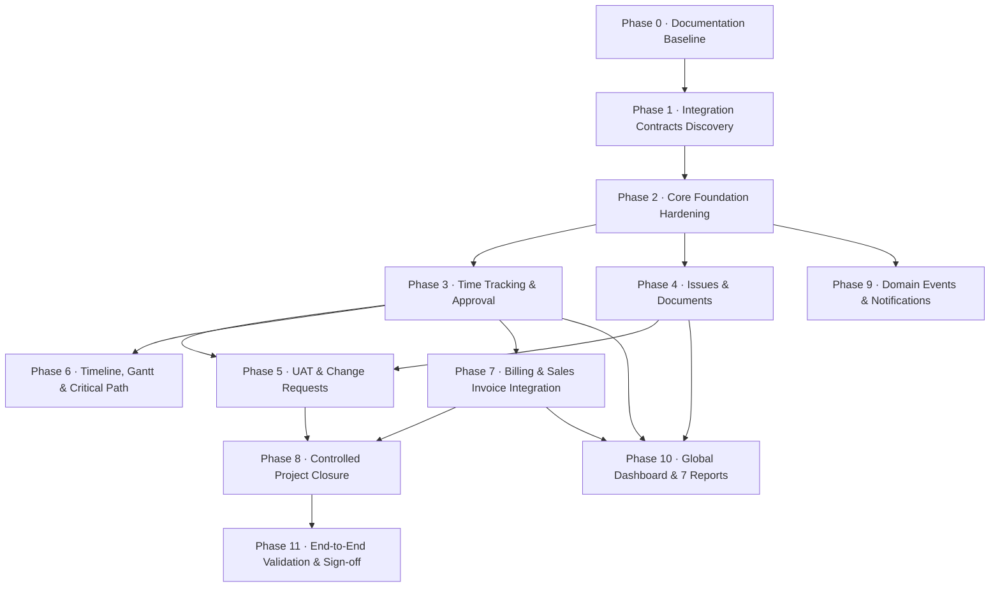

# Project Management Module — Implementation Roadmap

> **Document Status:** Canonical Implementation Roadmap  
> **Target Location:** `docs/project-management/IMPLEMENTATION_ROADMAP.md`  
> **Sequencing Rationale:** Ordered strictly by business dependency, technical risk, and architectural layering.

---

## Current Roadmap State

| Attribute | State |
|---|---|
| **Last Completed Major Phase** | **Phase 6 — Timeline, Scheduling, Gantt & Critical Path** (Status: Completed & Formally Verified) |
| **Current Major Phase** | **Phase 7 — Billing & Sales Invoice Integration** (Lifecycle Gate: Discovery & Read-Only Audit) |
| **Next Major Phase** | **Phase 7 — Billing & Sales Invoice Integration** |
| **Phase 6 Status** | **COMPLETED & FORMALLY VERIFIED** |
| **Phase 7A Status** | **PENDING READ-ONLY DISCOVERY** |
| **Next Authorized Action** | **Phase 7A — Billing & Sales Invoice Integration Read-Only Audit & Architectural Alignment** |


> [!IMPORTANT]
> **Roadmap Scope & Governance Principle:**  
> The implementation roadmap tracks **ONLY major planned product-development phases**.  
> Routine maintenance, UI cleanup, visual polish, dropdown fixes, bug fixes, regression fixes, stabilization, refactoring, small UX improvements, and isolated technical corrections are **not** roadmap phases.  
> These activities may occur before, during, or between major phases without altering the major phase sequence or creating intermediate roadmap phases (unless they directly affect a formal phase completion or reveal a verified architectural blocker).

---

## 1. Roadmap Overview & Phasing Logic

The roadmap is structured into twelve controlled major phases with defined business and technical dependencies. Each phase builds upon the operational data produced by predecessor phases:
- Foundation Hardening (Phase 2) ensures that existing core entities (tasks, subtasks, dependencies, milestones) have correct business semantics before time tracking or issues are attached to them.
- Time Tracking (Phase 3) is implemented early because timesheets provide the actual hours needed for Scheduling (Phase 6), Reports (Phase 10), and Billing (Phase 7).
- Issues and Documents (Phase 4) provide quality and collateral management for project execution.
- UAT and Change Requests (Phase 5) establish the gate for Project Closure (Phase 8).
- Billing Integration (Phase 7) aggregates approved timesheets from Phase 3.
- Final Dashboard & Reports (Phase 10) require operational data across all earlier phases to render real metrics.


```mermaid
flowchart TD
    P0["Phase 0 · Documentation Baseline"] --> P1["Phase 1 · Integration Contracts Discovery"]
    P1 --> P2["Phase 2 · Core Foundation Hardening"]
    P2 --> P3["Phase 3 · Time Tracking & Approval"]
    P2 --> P4["Phase 4 · Issues & Documents"]
    P3 --> P5["Phase 5 · UAT & Change Requests"]
    P4 --> P5
    P3 --> P6["Phase 6 · Timeline, Gantt & Critical Path"]
    P3 --> P7["Phase 7 · Billing & Sales Invoice Integration"]
    P5 --> P8["Phase 8 · Controlled Project Closure"]
    P7 --> P8
    P2 --> P9["Phase 9 · Domain Events & Notifications"]
    P3 --> P10["Phase 10 · Global Dashboard & 7 Reports"]
    P4 --> P10
    P7 --> P10
    P8 --> P11["Phase 11 · End-to-End Validation & Sign-off"]
```

---

### Phase Status Governance

Every major phase strictly follows a progressive governance lifecycle. An AI agent or developer must **never** jump directly from a planned phase into implementation without completing the preceding governance and approval gates:

```
NOT STARTED
    ↓
AUDIT (Read-only discovery of current schema, services, routes, UI, tests)
    ↓
ARCHITECTURE / INTEGRATION VALIDATION (Contract validation against ERP dependencies)
    ↓
IMPLEMENTATION PLAN (Detailed design artifact created and submitted for review)
    ↓
APPROVED FOR IMPLEMENTATION (Explicit user approval obtained)
    ↓
IMPLEMENTATION (Domain code, migrations, requests, services, views)
    ↓
TESTING / VALIDATION (Feature test suites, regression testing, assertions check)
    ↓
FINAL VERIFICATION (Read-only verification of delivered scope against plan)
    ↓
COMPLETED / VERIFIED
```

> [!NOTE]
> **Audit Subordination Rule:**  
> An audit may discover that the originally proposed implementation is incorrect, unnecessary, or already available elsewhere in the ERP. In that situation, the implementation plan **MUST** be changed to use the verified existing architecture.  
> The roadmap's target implementation is subordinate to the actual audited ERP architecture. Never implement the roadmap literally if the repository proves that a better existing implementation should be reused or extended.

---

### Critical Architectural Principles

#### 1. Existing ERP Infrastructure Reuse & Integration Rule
Before creating **ANY** new database table, migration, model, repository, service, controller, route, permission, UI component, storage mechanism, notification mechanism, activity logging mechanism, export mechanism, billing mechanism, user/resource mechanism, or other infrastructure, the AI agent or developer **MUST** first audit the existing ERP implementation.

The audit must inspect at minimum:
- Existing migrations
- Current database tables and schema
- Eloquent models
- Repositories
- Domain services
- Controllers and endpoints
- Routes and middleware
- Requests and validation rules
- Permissions and RBAC policies
- Tenant, company, and branch isolation scopes
- Existing UI components (`x-ui`, Duralux templates)
- Existing shared services
- Existing integrations
- Existing feature and unit tests
- Canonical documentation

The agent must answer the following six questions:
1. **Does the required capability already exist?**
2. **Is an existing table, model, service, or component reusable?**
3. **Can an existing implementation be extended safely?**
4. **Is the existing implementation compatible with Project Management?**
5. **Does another ERP module already own this responsibility?**
6. **Would creating a new implementation duplicate existing functionality?**

**Rule:** ONLY if the audit establishes that suitable infrastructure does not exist may a new implementation be proposed. No duplicate infrastructure may be created merely because a new module needs similar functionality.

#### 2. Database & Migration Safety Rule
Before proposing or creating any new migration or table, the agent **MUST** inspect:
- All relevant existing migration files
- Current table definitions
- Model relationships
- Database indexes
- Foreign key constraints
- Tenant (`tenant_id`), company (`company_id`), and branch (`branch_id`) columns
- Existing status/enum conventions
- Soft-delete (`deleted_at`) conventions
- Existing fields that may already satisfy the requirement

**Decision Matrix:**
- If a suitable table already exists: $\to$ **Reuse it.**
- If an existing table can safely be extended: $\to$ **Evaluate extension before creating a new table.**
- If a new table is genuinely required: $\to$ **Document why the existing table cannot be reused.**

**Mandatory Database Constraints:**
- **NEVER modify old or historical migrations** merely to implement a new phase. Existing migrations are historical database contracts already executed in production/staging.
- New schema changes must use **new migrations**.
- **Never create a second table** for the same business concept.
- **Never create duplicate columns** because an existing column already represents the required data.
- **Never rename or remove existing columns or tables** without an explicitly approved architectural requirement.
- **Never destroy existing data contracts** to fit a new feature.

#### 3. Cross-Module Integration & Module Ownership Boundaries
Project Management is an integral module of the existing ERP ecosystem and must integrate with existing modules rather than creating parallel or isolated systems.

**Module Ownership Matrix:**

| ERP Domain / Resource | Owning Module / Infrastructure | Project Management Integration Pattern |
|---|---|---|
| **Users / Employees / Staff** | Core User / HRMS | Reuse existing Core `User` and ERP resource/member structures where applicable. |
| **Customers / Clients** | CRM / Sales | Reuse existing CRM / Customer entities; do **not** create a PM customer table. |
| **Sales Invoicing** | Sales Module | PM calculates and identifies billable work; Sales owns Sales Invoice generation and lines. |
| **General Ledger & Accounting**| Accounting Module | Accounting owns ledger posting, chart of accounts, and financial journal entries. |
| **File Storage** | Shared Storage / Laravel Disk | Reuse ERP Storage infrastructure and strict tenant folder isolation rules. |
| **Activity Logging** | Core Audit Infrastructure | Reuse existing `ActivityLogService` and shared activity log schemas. |
| **Access Control (RBAC)** | Core Auth / Permissions | Reuse existing permission, role, and `AccessService` architecture. |
| **Multi-Tenancy** | Core Tenancy | Reuse existing tenant/company/branch isolation traits and global scopes. |
| **User Interface (UI)** | Duralux / Common UI | Reuse existing Duralux, `x-ui`, and established ERP design patterns. |
| **Data Export** | Core Export Utilities | Reuse existing ERP export infrastructure for CSV/Excel generation. |
| **Notifications** | Core Notifications | Reuse Laravel notifications table and notification channels (Phase 9). |
| **Timeline / Gantt** | Production Module Dispatch | Reuse native HTML5 Drag & Drop Timeline patterns before introducing third-party libraries. |
| **Time Tracking / Worklogs** | Shared ERP Infrastructure (or PM Domain if justified) | PM owns project execution and project-level time/work-tracking **requirements**; existing ERP time/worklog infrastructure must be reused or integrated if available. A dedicated `project_time_logs` table must not be assumed. |

**Ownership Principle:**  
Project Management owns project execution, tasks, milestones, dependencies, project review workflows, project reporting, and project-level time/work-tracking **requirements** (such as task attribution, billability tracking, and timesheet approvals). Crucially, existing ERP time/worklog infrastructure must be reused or integrated if available; this does not imply that a separate `project_time_logs` table must necessarily be created.  
#### 4. Global UI Component Selection & Design System Governance Rule
For every Project Management implementation phase that contains UI work, the implementation agent **MUST** first read:
`docs/project-management/design-spec.md`

The design specification is the **canonical PM UI/UX/component reference**. The implementation must strictly obey the following seven component selection and visual hierarchy rules across **all future PM phases**:

1. **PM Form Fields $\to$ Odoo-Form System Only:**  
   All form inputs, controls, field labels, help texts, and error feedback across PM views must be rendered exclusively through `<x-ui.odoo-form-ui>` (`type="input"`, `type="select"`, `type="textarea"`, `type="checkbox"`, `type="radio"`, `type="file"`, `type="editor"`, `type="sheet"`).  
   *Explicit restriction:* Never introduce or use standalone form components (such as `<x-ui.input>`, `<x-ui.select>`, `<x-ui.textarea>`, `<x-ui.checkbox>`, `<x-ui.radio>`) when an equivalent Odoo-form field capability exists.
2. **PM Tables $\to$ Odoo-Form Table System Only:**  
   All PM tabular displays, directories, data grids, subtask tables, timesheets, issues, documents, UAT/CR lists, tab tables, and reports must use `<x-ui.odoo-form-ui type="table">`.  
   *Explicit restriction:* Never use the separate/common `<x-ui.table>` for PM tables when the Odoo-form table capability is available. Do not create PM-specific table components.
3. **Inline Editing $\to$ Existing Inline-Edit Component + Odoo-Form Field Controls:**  
   Preserve the existing `<x-ui.inline-edit>` component and AJAX architecture. When an inline edit requires an editable input, select, or date control, the control itself must use the Odoo-form field system (`.odoo-form-control`, `.odoo-table-input`, `.odoo-table-select`, or Odoo-form field variants).
4. **Other UI Needs $\to$ Existing Common ERP Components Strongly Encouraged:**  
   Apart from the two strict restrictions above (Form Fields and Tables), agents must freely reuse the rich library of existing common ERP components by their established APIs:  
   - Modals: `<x-ui.modal>`, `<x-ui.confirm-modal>`, `<x-ui.confirmation-modal>`  
   - Drawers: `<x-ui.drawer>`  
   - Tabs: `<x-ui.horizontal-tabs>`, `<x-ui.vertical-tabs>`  
   - Pagination: `<x-ui.pagination>` / `$paginator->links()`  
   - Filters & Sorting: `<x-ui.filter>`, `<x-ui.sort-dropdown>`  
   - Row & Context Actions: `<x-ui.action-dropdown>`, `<x-ui.dropdown>`, `<x-ui.dropdown-item>`  
   - Bulk Actions Toolbar: `<x-ui.bulk-actions>`  
   - Buttons: `<x-ui.button>`, `<x-ui.icon-btn>`, standard Duralux buttons  
   - Badges & Pills: `<x-ui.badge>`, `<x-ui.status-badge>`, `<x-ui.priority-badge>`  
   - Alerts & Toasts: `<x-ui.alert>`, `<x-ui.toast>`  
   - Cards & Widgets: `<x-ui.card>`, `<x-ui.stat-widget>`, `<x-ui.progress-bar>`
5. **Layout & Panels $\to$ Standard ERP Layout Patterns (`erp-single-panel`):**  
   All main PM screens must be wrapped in `<div class="erp-single-panel bg-white p-4 rounded-3 border">`. Do not create PM-specific container wrappers.
6. **Production BOM $\to$ Primary Practical Visual & Layout Reference:**  
   Inspect `resources/views/modules/production/bom/` (`index.blade.php`, `create.blade.php`, `edit.blade.php`, `show.blade.php`) as the primary practical reference for page structure, form sheet composition, table styling, horizontal tabs, filter composition, bulk actions, and button placement.  
   *Boundary reminder:* BOM is a UI/layout/component reference only. Do **NOT** copy BOM manufacturing business logic, routes, permissions, or database schemas into Project Management.
7. **Zero Duplicate UI Components:**  
   Never create duplicate or PM-specific replacements when an existing ERP component or Odoo-form feature provides the required capability.

---

### AI Agent Continuation Rules

All future AI agents working in this repository must strictly adhere to the following 21 governance rules:

1. **Read Roadmap First:** Inspect `docs/project-management/IMPLEMENTATION_ROADMAP.md` before initiating any Project Management task.
2. **Determine Last Completed Phase:** Identify the last completed and verified major phase (`Phase 7 — Billing & Sales Invoice Integration`).
3. **Determine Next Major Phase:** Identify the next major phase in the canonical sequence (`Phase 8 — Controlled Project Closure`).
4. **Determine Next Authorized Action:** Perform only the next authorized step (`Phase 8A — Read-Only Requirements / Current-State Audit`) for the next phase. Phase 8A is strictly a read-only discovery/current-state/gap audit; architecture and integration decisions must happen only in the following Architecture / Integration Validation gate.
5. **No Automatic Implementation:** Do not automatically start implementation of the next phase. A phase remains `NOT STARTED` until explicitly authorized.
6. **Follow Lifecycle Gates:** Strictly observe the progression: `NOT STARTED` $\to$ `AUDIT` $\to$ `ARCHITECTURE` $\to$ `PLAN` $\to$ `APPROVAL` $\to$ `IMPLEMENTATION` $\to$ `TESTING` $\to$ `VERIFICATION` $\to$ `COMPLETED`.
7. **Maintenance Is Not a Phase:** Do not create or track ad-hoc maintenance, UI cleanup, visual polish, or minor bug fixes as roadmap phases.
8. **Preserve Completed Phases:** Do not refactor, rename, or dismantle completed phases unless a verified regression requires correction.
9. **No Premature Feature Creep:** Never introduce models, migrations, routes, or UI from future phases prematurely.
10. **Zero Infrastructure Duplication:** Reuse existing ERP infrastructure (Duralux UI components, `AccessService`, `BaseModel`, tenant traits, activity logging).
11. **Observe Documentation Standards:** Adhere strictly to `AGENTS.md`, `PRD.md`, `ARCHITECTURE.md`, `WORKFLOW.md`, `DATA_MODEL.md`, and `design-spec.md`.
12. **Existing Infrastructure First:** Before creating anything, search the repository and migration history for an existing implementation of the required business capability.
13. **Migration-First Audit:** Never assume a table is missing. Inspect migration history and current database schema before proposing a migration.
14. **Reuse Before Extend:** Prefer: existing implementation $\to$ existing extension $\to$ new implementation only if strictly necessary.
15. **Module Ownership:** If another ERP module already owns a capability, integrate with that module instead of creating a PM duplicate.
16. **Historical Migration Protection:** Never edit old migrations to implement a new feature. Use a new migration when a schema change is genuinely required.
17. **No Duplicate Business Concepts:** Do not create duplicate tables, models, or services for concepts already represented in the ERP.
18. **Audit Findings Override Assumptions:** If the roadmap proposes a component that the audit proves already exists or should be owned by another module, revise the implementation plan accordingly.
19. **Integration Before Isolation:** Prefer clean integration with existing ERP contracts over PM-specific isolated implementations.
20. **Explicit Justification Required:** Every genuinely new infrastructure component introduced in a future implementation plan must have a documented reason explaining why existing infrastructure could not safely be reused or extended.
21. **Mandatory UI Design Spec Compliance:** For every implementation phase containing UI work, the agent MUST first read `docs/project-management/design-spec.md`. All UI implementation must strictly follow the Global Component Selection Rules (Odoo-form for form fields and tables, common ERP components for modals/drawers/tabs/buttons/badges/filters, `erp-single-panel` layout, and Production BOM as the primary visual reference).
22. **Localization & Translation Variable Discipline:** The existing multi-language infrastructure is already implemented; never create or redesign localization infrastructure. When using translated strings with variables:
    - First check whether the required variable already exists in the current PHP/Blade context.
    - Reuse the existing variable instead of creating a duplicate variable.
    - Ensure every variable passed to a translation key is actually defined.
    - Ensure the exact same placeholders exist across all translation files (`EN`, `HI`, `BG`).
    - Never allow raw placeholders such as `:name`, `:status`, `:count`, etc. to appear on the UI because a translation variable was missing or mismatched.
    - If an existing variable can be reused, do not introduce another variable with the same purpose/name.
    - Verify the rendered translation in the UI, not just the translation array.

---

## 2. Phase-by-Phase Execution Plan

### Phase 0: Documentation Baseline — [COMPLETED]
- **Status:** **COMPLETED**
- **Objective:** Establish canonical documentation covering requirements, architecture, workflows, data models, and audit baseline.
- **Deliverables:**
  - `docs/project-management/PRD.md`
  - `docs/project-management/ARCHITECTURE.md`
  - `docs/project-management/WORKFLOW.md`
  - `docs/project-management/DATA_MODEL.md`
  - `docs/project-management/INTEGRATIONS.md`
  - `docs/project-management/design-spec.md`
  - `docs/project-management/IMPLEMENTATION_ROADMAP.md`
  - `docs/project-management/AUDIT_BASELINE.md`
  - `docs/project-management/AGENTS.md`
- **Exit Criteria:** Complete documentation suite established; zero application code modifications.

---

### Phase 1: Integration Contracts & Technical Discovery — [COMPLETED]
- **Status:** **COMPLETED**
- **Objective:** Finalize contracts with existing shared ERP systems prior to code implementation.
- **Key Tasks:**
  1. **Sales Invoicing Contract:** Inspect `App\Domains\Sales\Services\InvoiceService` to verify the data contract for passing project lines, billable amounts, and customer IDs into standard Sales Invoices.
  2. **File Storage Standards:** Validate disk configurations, upload size limits, and tenant path isolation rules for `project_documents`.
  3. **Notification Channels:** Confirm Laravel `notifications` table structure and mail delivery configuration in the ERP.
  4. **Timeline & Gantt Evaluation:** Evaluate adapting the ERP's native HTML5 Drag & Drop Timeline architecture (from `resources/views/modules/production/schedules/dispatch-board.blade.php`) vs. a focused technical spike for curved SVG dependency links.
- **Exit Criteria:** Technical interface specifications signed off; shared service contracts verified.

---

### Phase 2: Core Foundation Hardening — [COMPLETED / VERIFIED]
- **Status:** **COMPLETED / VERIFIED**
- **Objective:** Fix verified business logic gaps in the existing M1–M6 implementation.
- **Scope Clarification:**
  - *Project Creation Modal:* Fast Project Creation (`Name` -> `Create` -> `Detail Inline Edit`) is an intentional UX choice and remains lightweight and untouched.
- **Completed Foundation Work:**
  1. **Task Dependency Enforcement & Semantics:**
     - Added `dependency_type` (`Finish-to-Start`, `Start-to-Start`, `Finish-to-Finish`, `Start-to-Finish`) to `project_task_dependencies`.
     - In-memory cycle detection rejects direct and indirect circular chains before persistence.
     - Updated `TaskService::updateStatus()` (`app/Domains/Projects/Services/TaskService.php`) to enforce transition gates server-side against predecessor state (while administrative transitions `On Hold` and `Cancelled` are always permitted).
  2. **Subtask Execution Metadata & Synchronization:**
     - Added `start_date`, `due_date`, `estimated_hours`, and `status` to `project_sub_tasks`.
     - Implemented canonical status $\iff$ is_completed synchronization (`status = Completed` $\iff$ `is_completed = true` / `completed_at = now()`).
     - Maintained parent task status autonomy (never auto-mutating parent task status on subtask completion).
  3. **Milestone Progress Rollup:**
     - Automated `Milestone.completion_percentage` derivation from non-cancelled child tasks (`completed / eligible * 100`, 0% if 0 eligible).
     - Recalculates dynamically on task creation, status update, deletion, and reassignment between milestones.
  4. **Project Progress Aggregation:**
     - Aligned `ProjectService::dashboardStats()` and task list progress to consistently exclude cancelled tasks from denominator.
- **Exit Verification:**
  - Full Project test suite passing (136 tests, 402 assertions, 0 failures).
  - Manual browser validation confirmed subtask metadata, toggle synchronization, dependency type selection, and badge rendering.

---

### Phase 3: Time Tracking & Timesheet Approval — [COMPLETED / VERIFIED]
- **Status:** **COMPLETED / VERIFIED**
- **Objective:** Enable team members to log time against tasks, and Project Managers to review and approve hours.
- **Completed Implementation:**
  1. **Database:** Created `database/migrations/2026_09_29_110000_create_project_time_logs_table.php` (`project_time_logs` table with tenant, company, branch scoping, project_id, task_id, user_id, date, hours, is_billable, hourly_rate, approval_status, approved_by, approved_at, rejection_remarks, is_invoiced, invoice_id, timestamps, soft deletes).
  2. **Model:** Created `App\Domains\Projects\Models\TimeLog` extending `BaseModel`, using `BelongsToTenant`, `BelongsToCompany`, `BelongsToBranch`, `SoftDeletes`, with scopes and billable amount calculation. Linked on `Project` and `Task`.
  3. **Repository:** Created `TimeLogRepositoryInterface` and `TimeLogRepository`, bound in `AppServiceProvider`.
  4. **Domain Service:** Built `TimeLogService` handling time logging with collaborator invariant validation, automatic member rate fallback, approval/rejection state machine, separation of duty rules, and automatic rollup to `Task.actual_hours`.
  5. **Policy & Requests:** Built `TimeLogPolicy` registered in `AppServiceProvider`, along with `StoreTimeLogRequest`, `UpdateTimeLogRequest`, and `RejectTimeLogRequest`.
  6. **Controllers & Routes:** Built `TimeLogController` (task time entry endpoints) and `TimesheetApprovalController` (approval queue, one-click approve, and reject). Registered in `app/Domains/Projects/Routes/web.php` and sidebar in `menu.php`.
  7. **UI Views:** Created `resources/views/modules/projects/tasks/workspace/_timelogs.blade.php` modal & ledger, updated `_rail.blade.php` with actual hours display, and created `resources/views/modules/projects/timelogs/approval.blade.php`.
  8. **Permissions:** Added `projects.timetracking.view`, `projects.timetracking.log`, `projects.timetracking.approve` in `RbacSeeder.php`.
- **Exit Verification:**
  - Automated feature suites `TimeLogTest` (6 tests) and `TimesheetApprovalTest` (6 tests) passing with 100%.
  - Full Project regression test suite (137 tests, 404 assertions) passing with 0 regressions.


#### Initial Target Scope — Subject to Phase 3A Audit and Architecture Validation
> [!IMPORTANT]
> The target scope items below represent **provisional architectural targets**. They **MUST NOT** be treated as pre-approved implementation decisions.  
> During the Phase 3A read-only audit, the agent must first determine whether equivalent time-tracking, attendance, or worklog infrastructure already exists elsewhere in the ERP.  
> If an existing system is suitable: **integrate, reuse, or extend it.**  
> If an existing system is not suitable: **document the verified gap and justify any PM-specific infrastructure.**  
> Never assume that `project_time_logs` or new controllers must definitely be created before the audit confirms it.

**Provisional Target Scope (Subject to Audit):**
1. **Database:** Migration creating `project_time_logs` (tenant, company, branch, project_id, task_id, user_id, date, hours, billable flag, rate, approval_status, approver_id) *only if existing ERP worklog/attendance tables cannot be reused or extended*.
2. **Model & Repository:** Create `TimeLog` model (BaseModel, tenant scopes) and `TimeLogRepositoryInterface` / `TimeLogRepository` if justified by audit.
3. **Service:** Build `TimeLogService` handling time submission, rate lookup from `project_members`, approval/rejection logic, and dynamic rollup to `Task.actual_hours`.
4. **Controller & Routes:** `TimeLogController` (entry CRUD) and `TimesheetApprovalController` (approval queue).
5. **UI Views:** Time entry modal component in Task Workspace, and a dedicated Timesheet Approval screen (`resources/views/modules/projects/timelogs/approval.blade.php`).

#### Phase 3A Mandatory Audit Requirements
> [!IMPORTANT]
> **Phase 3A Governance & Boundary — Strict Read-Only Audit:**  
> Phase 3A is strictly a **READ-ONLY discovery, current-state, and gap audit**. No architecture or integration decisions may be made or finalized during Phase 3A. Architectural decisions, schema design, table reuse/extension strategies, and integration contracts must happen **only** in the subsequent **Architecture / Integration Validation gate**, which then informs the formal Implementation Plan.

Before entering the Architecture / Integration Validation gate or proposing any implementation plan, the future Phase 3A read-only audit **MUST** inspect at minimum:
- **Database:** All time, timesheet, attendance, and worklog migration files; all existing database tables, columns, indexes, foreign keys, and tenant/company/branch scoping columns.
- **Models:** `Project`, `Task`, `SubTask`, `ProjectMember`, `User`, and any existing time/timesheet/worklog models across the entire ERP.
- **Services:** Existing time tracking services, timesheet services, attendance services, rate calculation services, and approval workflows.
- **Repositories:** Existing time/worklog repositories, and project/task repositories that may already expose `actual_hours` or similar fields.
- **Routes & Controllers:** Existing time entry endpoints, approval routes, and task workspace controller actions.
- **User Interface:** Existing time-entry modals, timesheet review screens, approval interfaces, and task workspace UI patterns.
- **Business Rules:** Billable vs. non-billable categorization, hourly rate hierarchies, actual vs. estimated hours rollup, approval/rejection state machines, timesheet locking, entry editing/deletion permissions, date/time boundaries, overlapping entries, duplicate entry prevention, and project/task association rules.
- **Security & Authorization:** Multi-tenant scoping, company and branch isolation, project membership validation, RBAC permissions, and individual record ownership.
- **Cross-Module Integrations:** Sales invoicing data expectations, Accounting ledger requirements, CRM client relationships, HRMS attendance links (if applicable), and existing report/export capabilities.
- **Tests:** Existing time/timesheet tests, project test suites, and potential regression risks.

---

### Phase 4: Issue Management & Project Documents — [COMPLETED & VERIFIED]
- **Status:** **COMPLETED & VERIFIED**
- **Objective:** Implement quality defect tracking and project document management.
- **Completed & Formally Verified Scope:**
  1. **Issues Database:** Migrations creating `project_issues` (`id`, `tenant_id`, `company_id`, `branch_id`, `project_id`, `task_id`, `issue_number`, `title`, `steps_to_reproduce`, `description`, `reporter_id`, `assignee_id`, `priority`, `severity`, `status`, `resolution_date`, `resolution_notes`, `retest_notes`, `softDeletes`).
  2. **Issue Lifecycle Service:** Built `IssueService` enforcing strict retest state machine (`Open` $\to$ `Assigned` $\to$ `In Progress` $\to$ `Resolved` $\to$ Retest Fails / Retest Passes $\to$ `Closed`), separation of duties preventing resolvers from retesting their own fixes (with project manager override), auto issue code generation (`PRJ-XXXX-ISS-YYY`), and activity logging (`project.issue_created`, `project.issue_resolved`, `project.issue_status_changed`, `project.issue_retested`, `project.issue_deleted`).
  3. **Issue UI Views:** Issue directory tab (`_issues.blade.php`) and full Issue Workspace (`issues/show.blade.php`) following BOM single-panel design specification with dark mode support, inline editing, and responsive modals (`_modal.blade.php`, `_retest_modal.blade.php`).
  4. **Documents Database:** Migration creating `project_documents` (`id`, `tenant_id`, `company_id`, `branch_id`, `project_id`, polymorphic `attachable_type`/`attachable_id`, `title`, `file_name`, `file_path`, `file_size`, `mime_type`, `category`, `uploaded_by`, `remarks`, `softDeletes`), reusing ERP filesystem infrastructure.
  5. **Document Service & Controller:** Secure upload, MIME type validation, secure tenant-scoped storage, inline browser preview (`projects.documents.preview`), permission-checked download streaming, and activity logging (`project.document_uploaded`, `project.document_deleted`).
  6. **UI Integration:** Documents tab on Project Detail (`_documents.blade.php`), Attachments widget in Task Workspace (`tasks/workspace/_attachments.blade.php`), and Document attachments list in Issue Workspace (`issues/show.blade.php`).
  7. **RBAC & Authorization:** Policies registered for `IssuePolicy` and `ProjectDocumentPolicy` with granular permissions (`projects.issues.view`, `projects.issues.create`, `projects.issues.edit`, `projects.issues.resolve`, `projects.issues.retest`, `projects.issues.delete`, `projects.documents.view`, `projects.documents.upload`, `projects.documents.download`, `projects.documents.delete`).
  8. **Localization:** Complete English, Bulgarian, and Hindi translations in `projects.php` and `ui.php` for all severities, priorities, issue statuses, document categories, UI labels, action buttons, and activity title templates.
- **Exit Criteria Met:** Issues enforce retest loops; files upload securely to tenant storage, stream and preview correctly to authorized users; zero open regressions. Passed 100% of automated tests (23/23 tests, 72 assertions).

---

### Phase 5: Client Review / UAT & Change Requests — [COMPLETED & FORMALLY VERIFIED]
- **Status:** **COMPLETED & FORMALLY VERIFIED**
- **Objective:** Implement formal client sign-off and scope change governance.
- **Delivered Capabilities:**
  1. **Database Schema:** `project_reviews` and `project_change_requests` tables created with strict tenant isolation, foreign keys, cascade/nullOnDelete constraints, soft deletes, and composite performance indexes.
  2. **Domain Models & Invariants:**
     - `ProjectReview` with relationships (`project`, `reviewer`, `creator`, `changeRequests`, polymorphic `documents`).
     - `ChangeRequest` with relationships (`project`, `review`, `requester`, `approver`, `creator`).
     - `Project::reviews()` and `Project::changeRequests()` relationships added.
  3. **Domain Services:**
     - `ProjectReviewService`: Enforces 100% completed milestone prerequisite (minimum 1 milestone), single pending review invariant, sign-off transition (`Pending` -> `Approved` / `Rework Required`), and polymorphic evidence upload.
     - `ChangeRequestService`: Enforces UAT-rework linkage validation (requires `Rework Required` review on same project, at most 1 active CR per rework review), separation of duties on approval, transactional row-locked project budget increments (`budget_amount`, `budget_hours`), pre/post budget activity logging, rejection remarks, and authorized `markImplemented()` action.
  4. **Authorization & RBAC:** Granular permissions registered in `RbacSeeder` (`projects.reviews.view`, `projects.reviews.create`, `projects.reviews.signoff`, `projects.changerequests.view`, `projects.changerequests.create`, `projects.changerequests.approve`) with policies `ProjectReviewPolicy` and `ChangeRequestPolicy` integrated via `AccessService`.
  5. **UI & Blade Integration:** Fifth tab `tab-reviews` integrated in `show.blade.php` and `_reviews.blade.php` using `<x-ui.odoo-form-ui type="table">`, standard modals for Review creation, Sign-off, CR creation, CR rejection, and Evidence upload with status badges.
  6. **Localization:** Complete English, Bulgarian, and Hindi translations in `projects.php` for all review/CR statuses, labels, actions, impact badges, and activity title templates with 100% key and placeholder parity.
  7. **Testing:** 27 new automated feature tests across `ProjectReviewTest`, `ChangeRequestTest`, and `ProjectPhase5LocalizationTest` with 951 assertions passing 100%, plus 34 regression tests green.
- **Exit Criteria Met:** Reviews require 100% completed milestones; creation always starts in `Pending`; "Rework Required" enforces CR linkage; approved CRs transactionally roll up budget and hours with activity audit; zero regressions.
- **Next Authorized Action:** **Phase 6B — Architecture Validation & Implementation Plan** (Phase 6A Audit Completed).

---

### Phase 6: Timeline, Scheduling, Gantt & Critical Path — [APPROVED FOR IMPLEMENTATION]
- **Status:** **COMPLETED & FORMALLY VERIFIED**
- **Objective:** Provide interactive timeline visualization and automated schedule calculation.
- **Phase 6A Read-Only Audit Findings Summary:**
  1. **Frontend Gantt Architecture:** Audited `resources/views/modules/production/schedules/dispatch-board.blade.php`. Reusing the native ERP HTML5 Drag & Drop timeline pattern avoids external license encumbrances (`dhtmlx`) or bundle weight (`frappe-gantt`). Milestone workspace already has placeholder tab `_timeline.blade.php` ready for conversion.
  2. **Scheduling Engine:** Identified need for `ProjectScheduleService` to execute a two-pass Critical Path Method (CPM) calculation: Forward Pass (Early Start/Finish), Backward Pass (Late Start/Finish), and Total Float/Slack ($TF = LS - ES$). Zero-slack tasks will be classified as Critical Path.
  3. **Date Shifting / Ripple Scheduling:** Evaluated `shift_mode` semantics (`ripple` cascades to all transitive downstream successors; `isolated` moves only target task and blocks on constraint violations).
  4. **Data Model & Dependencies:** `project_task_dependencies` schema and models inspected. Dependency types (`Finish-to-Start`, `Start-to-Start`, `Finish-to-Finish`, `Start-to-Finish`) are active; cycle detection is hardened in `TaskDependencyService`.
  5. **Authorization:** Scoped via `AccessService` using `projects.projects.view` / `projects.tasks.view` for schedule viewing, and `projects.tasks.update` / `projects.projects.update` for schedule mutations.

#### Phase 6B Approved Architecture & Plan Summary (Artifact: `phase6_implementation_plan.md`)
- **Validated Architectural Boundaries:**
  1. **Zero External Libraries:** Native HTML5 Drag & Drop timeline grid with Day/Week/Month ticks, styled with ERP CSS tokens, and curved SVG overlay lines for dependency links.
  2. **Dynamic CPM Engine:** `ProjectScheduleService` calculates ES/EF/LS/LF and total float on-the-fly using exact PDM discrete calendar day bounds; no stale denormalized columns on `project_tasks`.
  3. **Dependency Migration:** Added `lag_days` (integer, default 0) to `project_task_dependencies` table via migration.
  4. **Dual Shift Modes:** `ripple` mode pushes downstream transitive successors transactionally with row locks (`lockForUpdate`) and activity logging; `isolated` mode rejects constraint-violating moves with 422 errors. Completed downstream tasks are safeguarded from unauthorized auto-shifts.
  5. **Blade Integration:** Reusable `_timeline.blade.php` embedded in both Project Show (`tab-timeline`) and Milestone Workspace (`tab-timeline`), plus standalone view `timeline.blade.php`.
  6. **Security & Isolation:** Permissions checked via `AccessService`; multi-tenant scoping enforced across all queries.
  7. **Testing Scope:** Comprehensive automated feature tests in `ProjectScheduleTest.php` covering CPM math, all 4 dependency types with lag/lead, isolated/ripple shifts, and tenant isolation (13 tests passing, 41 assertions).

#### Phase 6C Implementation Execution Summary:
- **Database & Model:** Created and migrated `2026_09_30_150000_add_lag_days_to_project_task_dependencies_table.php`. Updated `TaskDependency` model, `TaskDependencyRepository`, `TaskDependencyService`, and `StoreTaskDependencyRequest` with `lag_days`.
- **Domain Service:** Created `ProjectScheduleService` implementing topological sort (Kahn's algorithm), forward pass ($ES, EF$), backward pass ($LF, LS$), total/free float ($TF$), critical path identification ($TF \le 0$), isolated boundary validation, and ripple BFS cascade with completed-task protection.
- **Controller & Routes:** Added `RescheduleTaskRequest`, `ProjectScheduleController` (`index`, `data`, `reschedule`), and web routes under `projects/{project}/timeline`.
- **UI & Gantt Visualization:** Built `_timeline.blade.php` with native HTML5 Drag & Drop, Day/Week/Month scale toggles, critical path highlighting, and dynamic SVG connector overlay paths with directional arrowheads for FS, SS, FF, and SF dependencies. Integrated into Project Show (`tab-timeline`), Milestone Workspace (`workspace/_timeline.blade.php`), and standalone `timeline.blade.php`.
- **Localization:** Added full translation keys across `lang/en/projects.php`, `lang/hi/projects.php`, and `lang/bg/projects.php`.
- **Automated Verification:** Verified via `php artisan test tests/Feature/ProjectScheduleTest.php` (13 tests passed, 41 assertions) and regression tests `tests/Feature/TaskDependencyTest.php` & `TaskDependencyEnforcementTest.php` (19 tests passed, 48 assertions).
- **Next Authorized Action:** **Phase 7A — Billing & Sales Invoice Integration Read-Only Audit & Architectural Alignment**.
- **Exit Criteria:** Fully verified and passed.

---

### Phase 7: Billing & Sales Invoice Integration — [COMPLETED & FORMALLY VERIFIED]
- **Status:** **COMPLETED & FORMALLY VERIFIED**
- **Objective:** Connect approved billable time and completed milestones directly into standard ERP Sales Invoices via clean delegation, strict double-billing prevention, and complete auditability.
- **Architectural Boundary & Invoicing Flow:**
  ```
  Project Management Module (App\Domains\Projects\Services\ProjectBillingService)
      ↓ Identifies & locks eligible billable work (approved time logs, completed milestones)
      ↓ Prepares billing line items with work descriptions & resolves active Service Product
  Sales Module (App\Domains\Sales\Services\SalesInvoiceCreationService)
      ↓ Exclusively owns: Sequential numbering (INV-XXXX), GST type resolution, line math,
      ↓ persistence of Invoice & InvoiceItem in 'Draft' status (InvoicePosted NOT fired here)
  Project Management Module
      ↓ Marks source TimeLogs and Milestones as invoiced (is_invoiced = true, invoice_id set)
      ↓ Records project activity logs ('project.invoice_generated')
  Standard Sales Flow (App\Domains\Sales\Controllers\InvoiceController::post)
      ↓ Transitions Draft → Posted, dispatches InvoicePosted event, posts to General Ledger
  ```

#### Phase 7A Audit & 7B Architecture Decisions (Artifact: `phase7_implementation_plan.md`)
- **Preserved Core Boundaries:** PM never computes tenant invoice numbers, never manages GST state codes directly, and never dispatches `InvoicePosted`. Sales owns invoice numbering, tax calculation, and posting lifecycles.
- **Service Product Integration:** No PM-owned product-master duplication; references existing active Inventory catalog (`products.item_type = 'Service'`).
- **Data Model Extensions:**
  - Migrated `project_id` foreign key on `invoices` table (`2026_10_01_100000_add_project_id_to_invoices_table.php`).
  - Added `billing_amount`, `is_invoiced`, `invoice_id` to `project_milestones` (`2026_10_01_100100_add_billing_fields_to_project_milestones_table.php`).
  - Added composite indexes on `project_time_logs` (`2026_10_01_100200_add_billing_indexes_to_project_time_logs_table.php`).

#### Phase 7C Implementation Execution Summary:
- **Database & Models:**
  - `App\Domains\Sales\Models\Invoice`: Added `project_id` to fillables; added `project()`, `timeLogs()`, and `milestones()` relations.
  - `App\Domains\Projects\Models\Project`: Added `invoices()` relation.
  - `App\Domains\Projects\Models\Milestone`: Added `billing_amount`, `is_invoiced`, `invoice_id` to fillables/casts; added `invoice()` relation.
  - `App\Domains\Projects\Models\TimeLog`: Added `invoice()` relation.
- **Domain Services:**
  - `SalesInvoiceCreationService`: Transactionally generates `Draft` invoices with sequential numbers (`INV-XXXX`), GST type determination (`cgst_sgst` vs `igst`), line item persistence, and subtotal/tax rollups. Does NOT fire `InvoicePosted`.
  - `ProjectBillingService`: Manages unbilled queries, live calculation preview (`previewInvoice`), pessimistic work locking (`lockForUpdate`), double-billing validation guards, delegation to Sales, and source record updates.
- **RBAC & Authorization:**
  - Added `projects.billing.view` and `projects.billing.generate_invoice` to `database/seeders/RbacSeeder.php`.
  - Enforced in `ProjectPolicy` (`viewBilling`, `generateInvoice`) using `AccessService`.
- **Controllers & Web Routes:**
  - Created `GenerateProjectInvoiceRequest` with deliverable validation rules.
  - Created `ProjectBillingController` (`index`, `preview`, `store`).
  - Registered web routes under `projects/{project}/billing` (`index`, `preview`, `store`).
- **UI & Blade Integration:**
  - Sixth tab `tab-billing` integrated in `show.blade.php`, `_billing.blade.php`, and `_generate_invoice_modal.blade.php`.
  - Features 4 KPI cards (Invoiced Total, Outstanding, Billable Time, Milestone Deliverables), `<x-ui.odoo-form-ui type="table">` invoice ledger with status badges, action dropdown linking to Sales view/print/post, and live interactive deliverable selection modal.
- **Localization Parity:**
  - 34 billing translation keys added with 100% key and placeholder parity across `lang/en/projects.php`, `lang/hi/projects.php`, and `lang/bg/projects.php`.
- **Automated Verification:**
  - Automated feature test suite `tests/Feature/ProjectBillingTest.php` passed 100% (7 tests, 36 assertions):
    1. `test_can_fetch_unbilled_approved_time_logs_and_completed_milestones` (PASSED)
    2. `test_can_generate_draft_sales_invoice_for_billable_time_logs` (PASSED)
    3. `test_can_generate_draft_sales_invoice_for_completed_milestones` (PASSED)
    4. `test_double_billing_is_strictly_rejected` (PASSED)
    5. `test_posting_draft_invoice_via_sales_controller_fires_invoice_posted` (PASSED)
    6. `test_unauthorized_user_cannot_generate_invoice` (PASSED)
    7. `test_multi_tenant_isolation_on_billing` (PASSED)
  - Regression test suites (`ProjectScheduleTest`, `ChangeRequestTest`, `ProjectReviewTest`) passed 100% (36 tests, 141 assertions).
- **Exit Criteria Met:**
  - Invoices generate in Sales module in `Draft` status without premature `InvoicePosted` firing;
  - Posting draft invoice via standard Sales controller triggers `InvoicePosted` and GL journal creation;
  - Double-billing is strictly rejected with row locking;
  - Full translation parity across EN/HI/BG.
- **Next Authorized Action:** **Phase 8A — Controlled Project Closure Read-Only Requirements & Current-State Audit**.

---

### Phase 8: Controlled Project Closure — [COMPLETED & FORMALLY VERIFIED]
- **Status:** **COMPLETED & FORMALLY VERIFIED**
- **Objective:** Enforce strict business condition gates before a project can be marked closed, and preserve read-only archival immutability.
- **Phase 8A Audit & Phase 8B Approved Architecture Summary:**
  1. **Five Condition Gates:**
     - **Gate 1 (Tasks & Subtasks):** Zero open/in-progress tasks (`whereIn('status', ['Open', 'In Progress', 'Review'])`) and zero incomplete subtasks (`where('is_completed', false)`).
     - **Gate 2 (Issues):** Zero unresolved issues (`whereNotIn('status', ['Resolved', 'Closed'])`).
     - **Gate 3 (Governance & Sign-off):** Zero pending reviews (`where('status', 'Pending')`), zero pending change requests (`where('status', 'Pending')`), and if milestones exist, at least one approved review (`where('status', 'Approved')`) must exist (historical rework reviews do not block).
     - **Gate 4 (Billing Settlement):** Zero approved billable time logs uninvoiced (`where('is_billable', true)->where('approval_status', 'Approved')->where('is_invoiced', false)`), zero pending time logs awaiting approval, and zero completed billable milestones uninvoiced (`where('billing_amount', '>', 0)->where('status', 'Completed')->where('is_invoiced', false)`). Non-billable approved logs and rejected logs do not block.
     - **Gate 5 (Milestones):** All milestones must be in terminal state (`whereIn('status', ['Completed', 'Closed'])`).
  2. **Read-Only Archival Immutability:** Child domain policies (`TaskPolicy`, `TimeLogPolicy`, `MilestonePolicy`, `IssuePolicy`, `ProjectReviewPolicy`, `ChangeRequestPolicy`) block mutating operations (`create`, `update`, `delete`, `approve`, `signoff`, etc.) when `$project->isClosed()`, while read-only inspection remains available. Project deletion is blocked in `ProjectPolicy::delete`.
  3. **State Machine Safeguard:** `ProjectService::changeStatus()` enforces `assertClosable()` when transitioning to `STATUS_CLOSED`, preventing lifecycle bypass.
- **Phase 8C Implementation Execution Summary:**
  1. **Database Migration:** Created `2026_10_01_110000_add_closure_fields_to_projects_table.php` adding `closure_date`, `closure_status`, `client_approval_ref`, `final_remarks`, and `closed_by` with foreign keys and indexes.
  2. **Models & Permissions:** Updated `Project` model with `CLOSURE_STATUSES`, `isClosed()`, and `closedBy()`. Added `projects.projects.close` permission to `RbacSeeder` for `tenant_owner` and `project_manager`.
  3. **Domain Service:** Created `ProjectClosureService` implementing `evaluateGates()` (diagnostic matrix and localized blocker messages), `assertClosable()` (strict validation exceptions), and `close()` (row-locking transaction, status update, and activity audit `project.closed`).
  4. **Controller & Form Request:** Created `CloseProjectRequest` and `ProjectClosureController` (`checkGates`, `close`) with JSON and redirect support. Registered routes `projects.closure.check` and `projects.close` in `app/Domains/Projects/Routes/web.php`.
  5. **UI & Blade Integration:** Created `_close_project_modal.blade.php` utilizing standard `<x-ui.modal>` and `<x-ui.odoo-form-ui>` with real-time gate checklist diagnostics. Added "Close Project" action button and read-only archival banner to `show.blade.php`.
  6. **Localization:** Complete parity across `lang/en/projects.php`, `lang/hi/projects.php`, and `lang/bg/projects.php` for all gate labels, checklist statuses, blocker alerts, and closure form inputs.
  7. **Automated Verification:**
     - `tests/Feature/ProjectClosureTest.php`: 16 automated feature tests passing 100% (288 assertions) covering all 5 gates, historical rework tolerance, unbilled/pending time log rules, child policy immutability, permission checks, state machine transition enforcement, full-form `PUT` update gate enforcement, and EN/HI/BG localization parity.
     - **Regressions Verified:** `ProjectInlineFieldStatusTest` (18 tests, 46 assertions), `ProjectBillingTest` (7 tests, 36 assertions), `ProjectReviewTest` & `ChangeRequestTest` (23 tests, 100 assertions), `IssueTest` & `TaskTest` (22 tests, 75 assertions), `TimeLogTest` & `TimesheetApprovalTest` (12 tests, 30 assertions) — all passing 100%.
  8. **Post-Implementation Audit Remediation (Verified):**
     - Fixed `ProjectService::update()` to enforce `app(ProjectClosureService::class)->assertClosable($project)` on any transition to `Project::STATUS_CLOSED`, eliminating the bypass vector on the full-form `PUT /projects/{project}` route.
     - Corrected blocker translation key references in `ProjectClosureService` to match canonical keys in `lang/{locale}/projects.php`.
     - Added focused regression test `test_full_form_update_cannot_bypass_closure_gates` verifying that both direct `ProjectService::update()` and HTTP `PUT /projects/{project}` fail with validation errors when closure gates are unmet.
- **Exit Criteria Met:** All closure condition gates enforced across both inline and full-form update paths; read-only archival protection verified across domain policies; 100% test pass rate with zero regressions; complete EN/HI/BG localization.
- **Next Authorized Action:** **Phase 9A — Domain Events & Notifications Read-Only Requirements & Current-State Audit**.

---

### Phase 9: Domain Events & Notifications — [VERIFIED — SAFE TO PROCEED TO PHASE 10A]
- **Status:** **VERIFIED — SAFE TO PROCEED TO PHASE 10A**
- **Objective:** Establish an event-driven notification architecture for key project lifecycle milestones, delivering real-time in-app alerts (topbar bell menu) and asynchronous email notifications while honoring user preferences and multi-tenant isolation.

#### 1. Architecture Validation Resolutions (Phase 9B Approved)
1. **Reconciliation of Event Count (12 Strongly-Typed Events):**
   The architecture officially supports all **12** PM lifecycle events:
   - `TaskAssigned(Task $task, User $actor, ?int $previousAssigneeId = null)`
   - `TaskCompleted(Task $task, User $actor)`
   - `IssueLogged(Issue $issue, User $actor)`
   - `IssueResolved(Issue $issue, User $actor)`
   - `IssueRetested(Issue $issue, User $actor, bool $passed)`
   - `TimesheetSubmitted(Collection $timeLogs, User $actor, Project $project)`
   - `TimesheetApproved(Collection|TimeLog $timeLogs, User $actor)`
   - `TimesheetRejected(Collection|TimeLog $timeLogs, User $actor, ?string $rejectionRemarks = null)`
   - `ProjectReviewRequested(ProjectReview $review, User $actor)`
   - `ProjectReviewSignedOff(ProjectReview $review, User $actor)`
   - `ChangeRequestCreated(ChangeRequest $changeRequest, User $actor)`
   - `ProjectClosed(Project $project, User $actor)`

2. **Email Infrastructure Reuse (`EmailService`):**
   - Reuses existing `App\Services\EmailService::sendEmail()` rather than introducing a redundant PM-specific Mailable.
   - Automatically inherits tenant-specific SMTP configurations from `email_configurations`, persists outbound message logs in `email_messages`, and includes graceful fallback to Laravel's default `Mail::send()` if tenant SMTP is unconfigured.

3. **Delivery Execution Strategy (Immediate In-App vs. Queued Email):**
   - **In-App Notifications:** Persisted synchronously to `App\Models\Notification` within the event listener execution, ensuring instant availability in the Duralux topbar bell dropdown (`/notifications/unread`) upon response or next poll.
   - **Email Notifications:** Dispatched asynchronously via a queued job (`SendProjectNotificationEmailJob implements ShouldQueue`) using the database queue (`QUEUE_CONNECTION=database`), isolating HTTP responses from SMTP network latency.

4. **Client-Contact & Recipient Resolution (Zero Duplication):**
   - In-app alerts strictly target internal ERP `User` accounts (`user_id`).
   - If a client reviewer has an ERP user account (e.g. `ProjectReview.reviewer_id`), in-app and email alerts route to that user.
   - If client notifications target external clients without an ERP user account, email dispatches directly to the project customer's primary email (`$project->customer?->email` via `App\Domains\CRM\Models\Customer`) using `EmailService` without creating synthetic user accounts.

5. **Batch Consolidation & Deduplication:**
   - **Batch Timesheets:** Multiple time logs approved or rejected in a single operation are consolidated into one aggregate notification (e.g. *"Approver approved 4 time logs (16.5 hrs) on Project PRJ-001"*) rather than flooding recipients with individual entries.
   - **Deduplication Guard:** For repetitive state changes, duplicate unread notifications of the same type for the same target user and project within a 15-minute window update the existing alert record.

6. **Preferences, Security & Multi-Tenancy:**
   - **Self-Action Suppression:** In-app and email notifications are strictly suppressed when the actor is the recipient (`$actor->id === $recipient->id`).
   - **User Preferences:** Explicitly checks `$recipient->settings['notifications']['in_app']` (default `true`) and `$recipient->settings['notifications']['email']` (default `false`).
   - **Multi-Tenant Isolation:** Every notification is bound to `$project->tenant_id`.
   - **Action URLs:** Dynamic deep links to relevant workspaces (`projects.tasks.show`, `projects.issues.show`, `projects.show` tab reviews, `projects.timesheets.approval`).
   - **Localization Parity:** Complete multilingual support across English (`lang/en/projects.php`), Hindi (`lang/hi/projects.php`), and Bulgarian (`lang/bg/projects.php`).

7. **Platform Catalog Extension:**
   - `App\Domains\Platform\Services\NotificationEventCatalog.php` extended with the `'projects'` module group and all 12 events.

---

#### 2. Phase 9C Implementation Execution Summary
1. **Domain Events (`app/Domains/Projects/Events/`):**
   - Implemented all 12 strongly-typed event classes with PHP 8.2 readonly constructor properties and `Dispatchable, SerializesModels` traits.
2. **Domain Service Dispatchers:**
   - Wired event dispatches across all 6 PM domain services:
     - `TaskService`: `TaskAssigned` (on creation, assignment, and inline update), `TaskCompleted` (on forward completion transitions).
     - `IssueService`: `IssueLogged` (on creation), `IssueResolved` (on resolution), `IssueRetested` (on verification pass/fail).
     - `TimeLogService`: `TimesheetSubmitted` (on time logging), `TimesheetApproved` (on individual and batch approval), `TimesheetRejected` (on rejection with remarks).
     - `ProjectReviewService`: `ProjectReviewRequested` (on review creation), `ProjectReviewSignedOff` (on sign-off as Approved or Rework Required).
     - `ChangeRequestService`: `ChangeRequestCreated` (on CR creation).
     - `ProjectClosureService`: `ProjectClosed` (on formal project closure).
3. **Notification Domain Service (`app/Domains/Projects/Services/ProjectNotificationService.php`):**
   - Implemented `notifyUser()`, `notifyExternalClient()`, and handlers for all 12 events with:
     - Strict self-action suppression (`$actor->id === $recipient->id`).
     - User settings preference checks (`settings['notifications']['in_app']` and `settings['notifications']['email']`).
     - 15-minute deduplication window updating existing unread alerts.
     - Direct creation in `App\Models\Notification` (matching topbar bell dropdown schema).
     - Deep-link contextual `action_url` routing.
4. **Asynchronous Queued Job (`app/Domains/Projects/Jobs/SendProjectNotificationEmailJob.php`):**
   - Built queued email job implementing `ShouldQueue` delegating to `EmailService::sendEmail()` with fallback protection.
5. **Event Listener (`app/Domains/Projects/Listeners/ProjectNotificationListener.php`):**
   - Implemented listener matching and dispatching all 12 project events. Registered explicitly in `AppServiceProvider.php`.
6. **Platform Catalog Extension (`App\Domains\Platform\Services\NotificationEventCatalog.php`):**
   - Extended catalog with `'projects'` module group, registering all 12 events with descriptions, icons, roles, titles, bodies, and variables.
7. **Localization (100% Parity):**
   - Added notification title and body keys across English (`lang/en/projects.php`), Hindi (`lang/hi/projects.php`), and Bulgarian (`lang/bg/projects.php`).
8. **Automated Verification:**
   - `tests/Feature/ProjectNotificationTest.php`: 13 automated tests passing 100% (143 assertions) covering all 12 events, self-action suppression, batch consolidation, deduplication windows, user preference gating, queued email jobs, catalog registry, and EN/HI/BG localization parity.
   - **Full PM Regression Suite Verified Green:** 113 total feature tests (746 assertions) passing 100% across `ProjectClosureTest`, `MilestoneTest`, `TaskTest`, `TimeLogTest`, `TimesheetApprovalTest`, `IssueTest`, `ProjectReviewTest`, `ChangeRequestTest`, `ProjectScheduleTest`, and `ProjectBillingTest`.

- **Exit Criteria Met:** All 12 project lifecycle events dispatch cleanly, generate immediate in-app topbar notifications and queued emails according to user preferences, enforce self-action suppression and multi-tenant scoping, and preserve zero regressions.
- **Next Authorized Action:** **Phase 10A — Executive Dashboard & Reports Requirements & Read-Only Audit**.

---

### Phase 10: Executive Dashboard & 7 Operational Reports — [PLANNED]
- **Status:** **PLANNED**
- **Objective:** Provide project portfolio analytics and dedicated operational reports.
- **Initial Target Scope (Subject to Phase 10 Audit):**
  1. **Global Dashboard:** Build `ProjectDashboardController` and `resources/views/modules/projects/dashboard.blade.php` with portfolio KPI cards and workload heatmaps.
  2. **Reports Service & Controller:** Build `ProjectReportController` and `ProjectReportService`.
  3. **Seven Reports:**
     - Project Summary Report
     - Task Status Report
     - Resource Utilization Report
     - Timesheet & Billability Report
     - Issue & Defect Density Report
     - Milestone Variance Report
     - Budget vs. Actual Cost Report
  4. **Export:** Excel/CSV download support reusing existing ERP export infrastructure.
- **Exit Criteria:** All 7 reports display accurate data matching seeded fixtures; export produces formatted spreadsheets.

---

### Phase 11: Final End-to-End Validation & User Sign-Off — [PLANNED]
- **Status:** **PLANNED**
- **Objective:** Execute full lifecycle integration testing and complete read-only audit verification.
- **Key Tasks:**
  1. Run complete test suite (`php artisan test`).
  2. Execute E2E walkthrough script simulating complete lifecycle: Create Project -> Staff -> Milestone -> Task -> Dependency -> Time Log -> Timesheet Approval -> Issue Retest -> UAT Sign-off -> Sales Invoicing -> Controlled Closure.
  3. Produce final walkthrough artifact.
- **Exit Criteria:** 100% test pass rate across all feature suites; zero regressions; user sign-off.
