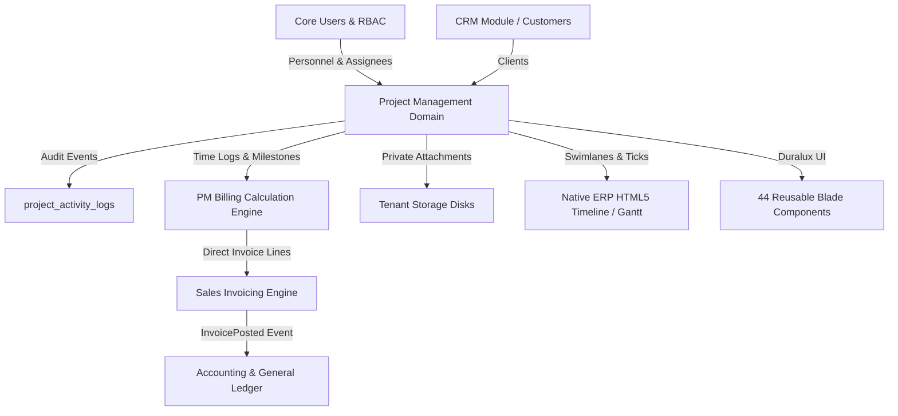

# Project Management Module — Integrations, Boundaries & Reuse Map

**Document Status:** Canonical Integration & Contract Reference  
**Audit Completed:** September 10, 2026 (Phase 1 Integration Audit)  
**Target Location:** `docs/project-management/INTEGRATIONS.md`  
**Source Code Baseline:** `App\Models\User`, `App\Domains\CRM\Models\Customer`, `App\Domains\Sales`, `App\Domains\Accounting`, `App\Domains\Production`, `resources/views/components/ui/`

---

## 1. Executive Summary

A comprehensive read-only audit of the entire ERP codebase was conducted to validate integration boundaries for Project Management. 

**Key Verdict:** The existing ERP infrastructure strongly supports the planned Project Management expansion. Project Management can seamlessly reuse Core Users, CRM Customers, Sales Invoicing, General Ledger auto-posting, Activity Logging, and the rich `<x-ui.*>` Blade component suite. 

No duplicate invoicing system, no duplicate employee model, and no duplicate file storage framework need to be created. Furthermore, an inspection of the codebase revealed that the ERP already has an established, bespoke HTML5 Drag & Drop Gantt/Timeline board in the Production module (`resources/views/modules/production/schedules/dispatch-board.blade.php`), meaning external license-encumbered Gantt libraries (Frappe Gantt or DHTMLX) are NOT mandatory.



---

## 2. Core User Integration (`App\Models\User`)

### 2.1 Current Infrastructure
- **Model:** `App\Models\User` (`users` table).
- **Multi-Tenancy:** Uses `BelongsToTenant` trait (`tenant_id`), plus `company_id` and `branch_id`.
- **Role & Permissions:**
  - `role_id` -> `App\Models\Access\Role`.
  - `roles()` -> `BelongsToMany` via `user_roles` with pivot `['tenant_id', 'branch_id', 'department_id']`.
  - Authorization is evaluated server-side via `App\Services\Access\AccessService::allows($user, $permission, $context)`.
- **Notification Readiness:** Uses `Illuminate\Notifications\Notifiable` trait.

### 2.2 Recommended Project Management Usage
All personnel assignments in Project Management must link directly to `User`:
- `projects.owner_id` -> `users.id`
- `projects.manager_id` -> `users.id`
- `project_members.user_id` -> `users.id`
- `project_milestones.owner_id` -> `users.id`
- `project_task_lists.owner_id` -> `users.id`
- `project_tasks.assignee_id` -> `users.id`
- `project_tasks.reviewer_id` -> `users.id`
- `project_sub_tasks.assignee_id` -> `users.id`
- Future `project_time_logs.user_id` -> `users.id`
- Future `project_issues.reported_by` / `assigned_to` -> `users.id`
- Future `project_reviews.reviewer_id` -> `users.id`

### 2.3 Existing Selector & Collaborator Invariant
- **Selector:** User selectors query `User::query()->where('tenant_id', require_tenant_id())`.
- **Collaborator Invariant:** Enforced in `StoreTaskRequest`:
  ```php
  'assignee_id' => [
      'nullable', 'integer',
      Rule::exists('project_members', 'user_id')
          ->where('tenant_id', $tenantId)
          ->where('project_id', $project?->id)
          ->where('is_active', true),
  ],
  ```
  A user must first be an active project member before being assigned to tasks, task lists, or milestones.

### 2.4 Risks & Constraints
- **HRMS Employee Exclusion:** The ERP contains `App\Domains\HRMS\Models\Employee`. However, `Employee` does **NOT** implement `BelongsToTenant` query scopes and does not have an authentication account. Direct foreign keys to `Employee` present severe cross-tenant leakage risks. **All project resources must remain bound to `User`.** If employee metadata (e.g. employee code, job title) is needed in the UI, it must be accessed safely via the `User->employee` relation.

---

## 3. CRM Customer Integration (`App\Domains\CRM\Models\Customer`)

### 3.1 Current Infrastructure
- **Model:** `App\Domains\CRM\Models\Customer` (`customers` table).
- **Inheritance & Multi-Tenancy:** Extends `App\Core\Database\BaseModel` (which enforces `BelongsToTenant`), and uses `BelongsToCompany` and `BelongsToBranch`.
- **Relationships:** `Customer` has `salesOrders()`, `invoices()`, `payments()`, and `crmAccount()`.

### 3.2 Recommended Project Management Usage
- `projects.customer_id` -> `customers.id` (foreign key with `nullOnDelete()`).
- In `StoreProjectRequest`, customer selection is validated with tenant scoping:
  ```php
  'customer_id' => ['nullable', 'integer', Rule::exists('customers', 'id')->where('tenant_id', $tenantId)]
  ```
- Lookup route `projects.lookups.clients` searches `Customer::query()->where('name', 'like', ...)->get()` within the current tenant.

### 3.3 Duplication Risk
- **Zero Duplication:** Do NOT create a `clients` or `project_clients` table. CRM's `Customer` is the single source of truth for clients across the ERP.

---

## 4. Sales Invoicing Integration (`App\Domains\Sales\Models\Invoice`)

### 4.1 Current Infrastructure
- **Model:** `App\Domains\Sales\Models\Invoice` (`invoices` table).
- **Line Items:** `App\Domains\Sales\Models\InvoiceItem` (`invoice_items` table).
- **Controller:** `App\Domains\Sales\Controllers\InvoiceController`.
- **Status Lifecycle:** `Draft` -> `Posted` (or `Sent`) -> `Paid` / `Cancelled`.
- **Tax Calculation:** Supports `item_wise_tax` or `order_tax_rate`, calculates `cgst_amount`, `sgst_amount`, and `igst_amount`.
- **Payment Tracking:** `amount_paid`, `balance_due`, and `PaymentAllocation` records.

### 4.2 Invoice Creation Entry Point
In `InvoiceController::create`, the ERP already supports a `'direct'` invoicing mode when `customer_id` is supplied without a `sales_order_id`:
```php
$mode = $requestedMode ?: ($customerId ? 'direct' : 'sales_order');
```
When creating an invoice via `InvoiceController::store` or domain service:
1. Validates `customer_id`, `invoice_number`, `invoice_date`, `due_date`, and line items.
2. Creates `Invoice` with `status = 'Draft'`.
3. Creates `InvoiceItem` records inside a `DB::transaction()`.
4. Dispatches `event(new InvoicePosted($invoice))` upon posting.

### 4.3 Line Item Mechanism & Product Contract
- `invoice_items` contains:
  - `item_name` (string)
  - `description` (text, nullable)
  - `quantity` (numeric)
  - `unit_price` (numeric)
  - `tax_rate`, `tax_amount`, `cgst_amount`, `sgst_amount`, `igst_amount`
  - `discount`, `subtotal`, `total_amount`
  - `product_id` (foreign key to `products.id`)
  - `warehouse_id` (nullable)
- **Critical Product Finding:** In `App\Domains\Inventory\Models\Product`, the model explicitly supports:
  ```php
  'item_type', // Goods, Service
  ```
  with `hsn_sac`, `gst_rate`, and `sales_account`.
- **Project Management Integration Contract:**
  When Phase 7 (Billing Integration) is implemented:
  - Project Management calculates billable items:
    - **Time & Materials:** Sum of approved, unbilled `project_time_logs` (`hours * hourly_rate`).
    - **Fixed Milestone:** Fixed amount from a completed `project_milestones` record.
  - Project Management passes these lines to the Sales invoicing service, referencing either a designated Service Product (e.g., "Project Consulting Services") or a tenant-configured default billing service product.
  - Sales creates the `Invoice` and `InvoiceItem` records.
  - Project Management records the generated `invoice_id` on the billed `project_time_logs` or `project_milestones` to lock them against duplicate billing.

### 4.4 Data Ownership
- **Project Management Owns:** Time tracking logs, billable flag, hourly rates, milestone billing triggers, billing calculation logic.
- **Sales Owns:** Invoice entity, invoice numbering (`INV-XXXX`), GST tax calculation, line item pricing, payment allocations, invoice status transitions (`Draft`, `Sent`, `Paid`).

---

## 5. Accounting / General Ledger Integration (`App\Domains\Accounting`)

### 5.1 Current Infrastructure
- **Domain:** `App\Domains\Accounting`.
- **Auto-Posting Mechanism:**
  - When a Sales Invoice is created or posted, `InvoiceController` fires `event(new InvoicePosted($invoice))`.
  - `App\Domains\Accounting\Listeners\PostInvoiceJournal` handles the event:
    - Debits **Accounts Receivable** (Account Code `1100`).
    - Credits **Sales Revenue** (Account Code `4010`) for `subtotal - discount_amount`.
    - Credits **Taxes Payable** (Account Code `2020`) for `tax_amount`.
    - Posts the voucher via `App\Domains\Accounting\Services\JournalService`.

### 5.2 Project Management Responsibility vs. Accounting
- **PM Responsibility:** **ZERO DIRECT GENERAL LEDGER POSTING.** Project Management must never create journal entries directly.
- **Accounting Responsibility:** Owns the Chart of Accounts, Fiscal Years, Journal Entries, and Balance Sheets.
- **Integration Principle:** 
  $$\text{Project Management} \xrightarrow{\text{Billing Calculation}} \text{Sales Invoice} \xrightarrow{\text{InvoicePosted Event}} \text{General Ledger}$$
  This preserves the audit trail and financial integrity of the ERP.

---

## 6. File Storage Integration

### 6.1 Current Infrastructure
- **Central Storage Class:** There is **NO** custom `FileStorageService` class in the codebase.
- **Current Pattern:** CRM (`LeadService`), HRMS (`EmployeeController`), and Production (`ProductionCostAdjustmentController`) interact directly with Laravel's standard `Illuminate\Support\Facades\Storage` facade using `Storage::disk('public')` and `Storage::disk('local')`.
- **Private Attachments:** Production uses `Storage::disk('local')->download($path)` for protected documents.

### 6.2 Recommended Project Management Usage (`project_documents`)
- Files must be stored on the **`local` private disk** to ensure confidentiality and tenant protection:
  $$\text{Path: } \texttt{tenants/\{tenant\_id\}/projects/\{project\_id\}/documents/\{filename\}}$$
- Downloads must be served via a streaming controller response protected by policy authorization:
  ```php
  return Storage::disk('local')->download($doc->file_path, $doc->file_name);
  ```
- **Versioning:** Standard Laravel `Storage` does not provide file versioning. Document versioning (`v1`, `v2`, `v3`) must be maintained at the database layer in `project_documents` (`version` column, parent document linking).

---

## 7. Notification Infrastructure

### 7.1 Current Infrastructure
- **Current State:** The ERP does **NOT** currently have a `notifications` database table or custom notification classes.
- **Foundation:** `App\Models\User` already uses `Illuminate\Notifications\Notifiable`.

### 7.2 Integration Plan for Phase 9
- Project Management will define domain event classes:
  - `TaskAssigned`, `TaskStatusChanged`, `MilestoneCompleted`, `TimesheetSubmitted`, `UatReviewRequested`.
- Standard Laravel Notifications (`App\Domains\Projects\Notifications\*`) will implement `via()` returning `['mail', 'database']`.
- Publish and run the standard Laravel notifications migration (`php artisan notifications:table`) during Phase 9 to power the top navbar notification drawer.

---

## 8. Activity Logging (`App\Domains\Projects\Services\ActivityLogService`)

### 8.1 Current Infrastructure
- **Table:** `project_activity_logs`.
- **Model:** `App\Domains\Projects\Models\ActivityLog` (extends `BaseModel`, uses `BelongsToTenant`, `BelongsToCompany`, `BelongsToBranch`).
- **Polymorphism:** Already fully implemented!
  ```php
  public function subject(): MorphTo
  {
      return $this->morphTo();
  }
  ```
- **Service:** `ActivityLogService::record(Project $project, string $eventType, string $title, ?string $description, ?Model $subject, array $metadata)`:
  - Logs `tenant_id`, `project_id`, `subject_type`, `subject_id`, `event_type`, `title`, `description`, `triggered_by`, `metadata`.

### 8.2 Future Entity Integration
Every new entity in future phases (`TimeLog`, `Issue`, `ProjectDocument`, `Review`, `ChangeRequest`) can be passed directly as `$subject` to `ActivityLogService::record()`. Zero architectural changes to activity logging are required.

---

## 9. Common UI Component Library (`resources/views/components/ui/`)

The application has an extensive library of 44 pre-built `<x-ui.*>` Blade components:

| Component | Blade Path | Usage in Project Management |
|---|---|---|
| **Inline Edit** | `components/ui/inline-edit.blade.php` | In-place editing of project names, dates, budgets, priorities |
| **Drawer / Offcanvas** | `components/ui/drawer.blade.php` | Task details, member assignments, issue triage |
| **Modal** | `components/ui/modal.blade.php` | Fast project creation, time log entry, confirmation dialogs |
| **Budget Widget** | `components/ui/budget-widget.blade.php` | Project budget vs. actual spend visualization |
| **Activity Timeline** | `components/ui/activity-timeline.blade.php` | Real-time audit log stream in project detail sidebar |
| **Avatar Group** | `components/ui/avatar-group.blade.php` | Project member avatar stacking with `+N` indicator |
| **Status Badge** | `components/ui/status-badge.blade.php` | Color-coded status rendering across all entities |
| **Priority Badge** | `components/ui/priority-badge.blade.php` | Low / Medium / High / Critical priority indicators |
| **Progress Bar** | `components/ui/progress-bar.blade.php` | Milestone and project percentage progress bars |
| **Stat Widget** | `components/ui/stat-widget.blade.php` | Top metric cards on Project Directory & Dashboard |
| **Table** | `components/ui/table.blade.php` | Responsive data grids with sortable headers |
| **Filters & Sort** | `components/ui/filter.blade.php`, `sort-dropdown.blade.php` | Search, status, client, and owner filter bars |
| **Pagination** | `components/ui/pagination.blade.php` | Unified ERP pagination controls |
| **Action Dropdown** | `components/ui/action-dropdown.blade.php` | Three-dots contextual action menus |
| **Toast** | `components/ui/toast.blade.php` | Success, warning, and error toast alerts |

---

## 10. Gantt / Timeline / Calendar Assessment

### 10.1 Investigation Findings
- **`package.json` Inspection:** Neither `frappe-gantt` nor `dhtmlx-gantt` is installed in `devDependencies` or `dependencies`.
- **Vendor Scripts (`public/assets/vendors/js`):**
  - `apexcharts.min.js` (installed)
  - `tui-calendar.min.js`, `tui-date-picker.min.js` (TOAST UI Calendar suite, installed)
  - `jquery-ui.min.js` (installed)
  - `moment.min.js` (installed)
- **Production Module Inspection (`resources/views/modules/production/schedules/`):**
  - The ERP **already contains a complete, custom HTML5 Drag & Drop Gantt and Dispatch Board** (`dispatch-board.blade.php` and `calendar.blade.php`).
  - **Key Features Already Built:**
    - Timeline grid scales (Day, Week, Month).
    - Swimlanes (Resource/Machine rows with sticky labels).
    - Timeline header date ticks (`#ganttHeaderTicks`).
    - Positioned operation bars with percentage offsets (`leftPct`, `widthPct`).
    - Native HTML5 Drag & Drop (`bar.draggable = true`, `dragstart`, `dragover`, `drop`).
    - Tooltips via `bootstrap.Tooltip`.
    - Status coloring, lock icons, and variance indicators.

### 10.2 Recommendation for Phase 6
- **Decision:** **REUSE & ADAPT THE NATIVE ERP TIMELINE PATTERN.**
- **Reasoning:**
  1. The ERP's existing production schedule timeline is 100% integrated with the theme, CSS variables, and Bootstrap 5.
  2. Introducing Frappe Gantt or DHTMLX adds external bundle weight, styling conflicts, and potential commercial licensing issues (DHTMLX requires a paid commercial license for enterprise/GPLv3).
  3. Adapting the existing `dispatch-board.blade.php` timeline engine to Project Management tasks, milestones, and dependencies is the cleanest, most maintainable architectural choice.
  4. If curved SVG dependency connector lines prove too complex to draw natively, a focused technical spike in Phase 6 will evaluate lightweight SVG overlay renderers.

---

## 11. Reporting & Export Infrastructure

### 11.1 Excel / CSV Export
- **Package:** `Maatwebsite\Excel` (installed).
- **Pattern:** `App\Exports\ProjectsExport` implements `FromCollection`, `WithHeadings`, `WithMapping`.
- **Future PM Usage:** Create `TimesheetExport`, `ProjectSummaryExport`, and `IssueExport` following this exact pattern.

### 11.2 PDF Generation
- **Package:** `Barryvdh\DomPDF\Facade\Pdf` (installed).
- **Pattern:** `Pdf::loadView('modules.projects.pdf_summary', $data)->download('project.pdf')`.
- **Future PM Usage:** Formal Project Status Report and Timesheet Sign-off PDFs will use DomPDF with dedicated Blade print templates.

---

## 12. Tenant, Company & Branch Isolation Audit

| Entity | `tenant_id` | `company_id` | `branch_id` | Global Scope Applied? | Isolation Risk Level |
|---|---|---|---|---|---|
| `users` | Yes | Yes | Yes | `BelongsToTenant` | **SAFE** |
| `customers` | Yes | Yes | Yes | `BelongsToTenant`, `Company`, `Branch` | **SAFE** |
| `projects` | Yes | Yes | Yes | `BelongsToTenant`, `Company`, `Branch` | **SAFE** |
| `project_members` | Yes | Yes | Yes | `BelongsToTenant`, `Company`, `Branch` | **SAFE** |
| `project_milestones` | Yes | Yes | Yes | `BelongsToTenant`, `Company`, `Branch` | **SAFE** |
| `project_task_lists` | Yes | Yes | Yes | `BelongsToTenant`, `Company`, `Branch` | **SAFE** |
| `project_tasks` | Yes | Yes | Yes | `BelongsToTenant`, `Company`, `Branch` | **SAFE** |
| `project_sub_tasks` | Yes | Yes | Yes | `BelongsToTenant`, `Company`, `Branch` | **SAFE** |
| `project_task_dependencies` | Yes | Yes | Yes | `BelongsToTenant`, `Company`, `Branch` | **SAFE** |
| `project_activity_logs` | Yes | Yes | Yes | `BelongsToTenant`, `Company`, `Branch` | **SAFE** |
| `invoices` | Yes | Yes | Yes | `BelongsToCompany`, `BelongsToBranch` | **SAFE** |
| `invoice_items` | Yes | Yes | Yes | `BelongsToTenant`, `Company`, `Branch` | **SAFE** |
| `employees` (HRMS) | No | No | No | **None (No BaseModel)** | **UNSAFE — Excluded from PM** |

---

## 13. RBAC & Permissions Matrix

### 13.1 Currently Implemented Permissions (`RbacSeeder.php`)
1. `projects.projects.view`
2. `projects.projects.create`
3. `projects.projects.update`
4. `projects.projects.delete`
5. `projects.members.manage`
6. `projects.milestones.manage`
7. `projects.tasklists.manage`
8. `projects.tasks.view`
9. `projects.tasks.create`
10. `projects.tasks.update`
11. `projects.tasks.delete`

### 13.2 Future Permissions Required (By Phase)
- **Phase 3 (Time Tracking):**
  - `projects.timetracking.view`
  - `projects.timetracking.log`
  - `projects.timetracking.approve`
- **Phase 4 (Issues & Documents):**
  - `projects.issues.view`
  - `projects.issues.manage`
  - `projects.documents.view`
  - `projects.documents.upload`
  - `projects.documents.delete`
- **Phase 5 (UAT & Change Requests):**
  - `projects.reviews.view`
  - `projects.reviews.manage`
  - `projects.changerequests.view`
  - `projects.changerequests.create`
  - `projects.changerequests.approve`
- **Phase 7 (Billing Integration):**
  - `projects.billing.view`
  - `projects.billing.generate`
- **Phase 8 (Project Closure):**
  - `projects.projects.close`
- **Phase 10 (Reports):**
  - `projects.reports.view`

---

## 14. Data Ownership Matrix

| Domain | Entity | Canonical Owner | Project Management Role |
|---|---|---|---|
| **Core** | `User` | Core Domain | Assignee, Owner, Manager, Reviewer reference |
| **Core / Access** | `Role`, `Permission` | Access Domain | Authorization evaluation via `AccessService` |
| **CRM** | `Customer` | CRM Domain | Project Client reference (`customer_id`) |
| **Sales** | `Invoice`, `InvoiceItem` | Sales Domain | Target invoice created from project billing calculation |
| **Accounting** | `Journal`, `JournalItem` | Accounting Domain | Auto-posted from Sales Invoices (never direct from PM) |
| **Storage** | Physical Files on Disk | Laravel Filesystem | Tenant-isolated project attachment paths |
| **Notifications** | `notifications` | Laravel Framework | Delivery channel for project domain events |
| **Projects** | `Project` | Project Management | Root project entity |
| **Projects** | `ProjectMember` | Project Management | Project membership & role registry |
| **Projects** | `Milestone` | Project Management | Major deliverables & progress rollup |
| **Projects** | `TaskList`, `Task`, `SubTask` | Project Management | WBS task hierarchy & execution |
| **Projects** | `TaskDependency` | Project Management | Graph relationships & gating logic |
| **Projects** | `ActivityLog` | Project Management | Audit trail entries |
| **Projects (Future)** | `TimeLog` | Project Management | Time tracking & billable hours |
| **Projects (Future)** | `Issue` | Project Management | Defect tracking & resolution |
| **Projects (Future)** | `ProjectDocument` | Project Management | Document metadata & version registry |
| **Projects (Future)** | `Review` (UAT) | Project Management | Client sign-off cycles |
| **Projects (Future)** | `ChangeRequest` | Project Management | Scope/budget variance approval |

---

## 15. Reuse Map

| Existing ERP Component | PM Usage | Action | Architectural Reason |
|---|---|---|---|
| `App\Models\User` | Resources, Owners, Assignees | **REUSE** | Single authentication and identity source; tenant-isolated. |
| `App\Domains\CRM\Models\Customer` | Project Client | **REUSE** | Canonical client entity across CRM and Sales; avoids duplicate `clients` table. |
| `App\Domains\Sales\Models\Invoice` | Project Invoicing | **REUSE** | Commercial invoice engine with GST, tax, and PDF generation. |
| `InvoicePosted` / `PostInvoiceJournal` | GL Auto-Posting | **REUSE** | Accounting postings are triggered via standard invoice events. |
| `ActivityLogService` | Audit Trail | **REUSE** | Polymorphic logging already handles all project sub-entities. |
| `resources/views/components/ui/*` | Blade UI | **REUSE** | 44 enterprise UI components preserve unified Duralux styling. |
| `Maatwebsite\Excel` | CSV / Excel Export | **REUSE** | Standardized ERP export pipeline. |
| `Barryvdh\DomPDF\Facade\Pdf` | PDF Generation | **REUSE** | Standardized ERP PDF generation engine. |
| Native Production Timeline (`dispatch-board.blade.php`) | Gantt & Timeline | **REUSE / EXTEND** | Existing HTML5 Drag & Drop swimlane board eliminates external 3rd-party dependencies. |
| `Illuminate\Support\Facades\Storage` | Document Files | **REUSE** | Standard Laravel private storage on `local` disk. |
| `App\Domains\HRMS\Models\Employee` | Direct FKs | **EXCLUDE** | Lacks tenant scopes; high data-leakage risk. Use `User->employee` instead. |
| `project_invoices` (Proposed) | Duplicate Billing | **EXCLUDE** | Redundant parallel system; violates single source of truth. |

---

## 16. Duplicate-System Risks & Safeguards

1. **Parallel Invoice System Risk:**
   - *Risk:* Creating a custom `project_invoices` table that bypasses Sales and Accounting.
   - *Safeguard:* Strict rule enforced in `AGENTS.md` and `ARCHITECTURE.md`: Project Management only calculates billing data and invokes the existing Sales Invoice engine.
2. **Employee Foreign Key Risk:**
   - *Risk:* Referencing `employees.id` on tasks or time logs.
   - *Safeguard:* All foreign keys must point to `users.id`. Enforced by Form Request validation rules (`Rule::exists('users', 'id')`).
3. **Duplicate Client Table Risk:**
   - *Risk:* Creating a local `clients` table inside `App\Domains\Projects`.
   - *Safeguard:* `projects.customer_id` strictly references `customers.id`.
4. **Third-Party Gantt Dependency Bloat:**
   - *Risk:* Pulling in heavy, conflicting NPM packages like DHTMLX.
   - *Safeguard:* Reusing the existing native HTML5 Timeline architecture proven in the Production module.
