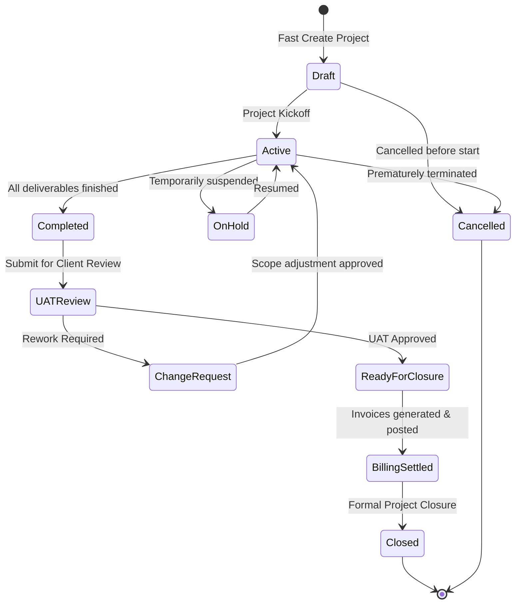

# Project Management Module — Product Requirements Document (PRD)

> **Document Status:** Canonical Requirement Baseline  
> **Target Location:** `docs/project-management/PRD.md`  
> **Source Documents:** *Project Management Module – Functional Flow.pdf*, *Project Management Module – Screen Wise Fields.pdf*, Workflow Diagram, and Codebase Audit Baseline (September 10, 2026).

---

## 1. Product Purpose

The **Project Management (PM) Module** is a vertical domain within this multi-tenant SaaS ERP. It provides end-to-end planning, execution, monitoring, resource coordination, quality governance, time tracking, client sign-off, and billing integration for customer-facing client engagements, manufacturing project orders, and internal corporate projects.

The module connects client deliverables to day-to-day operational execution (milestones, tasks, subtasks), personnel utilization (members, billable rates, timesheet approvals), quality tracking (issues and retesting), governance (UAT reviews and change requests), and commercial realization (billing via the ERP's shared Sales & Accounting engines).

---

## 2. Business Goals

1. **Delivery Predictability:** Provide visibility into project progress, milestone health, deadlines, and critical path schedules across client engagements.
2. **Resource Accountability & Allocation:** Track team member assignments, billable rates, internal cost rates, estimated hours vs. actual hours logged, and budget consumption.
3. **Quality & Scope Governance:** Track issues/defects through a structured retest workflow, gate client sign-offs via formal UAT reviews, and manage scope alterations through impact-evaluated Change Requests.
4. **Billing Accuracy:** Aggregate approved billable timesheets and milestone accomplishments directly into standard ERP commercial invoicing without duplicate billing systems.
5. **Seamless SaaS Tenancy & Enterprise Security:** Enforce company-, branch-, and tenant-level data isolation, and restrict actions using scoped Role-Based Access Control (RBAC).

---

## 3. Project Hierarchy & Relationships

```
Project (Root Entity)
  ├── Project Members / Resources (Rated team members & allocation)
  ├── Milestones (Major phase boundaries with target delivery dates)
  │     └── Task Lists (Groupings / board columns within milestone or project)
  │           └── Tasks (Core unit of work with assignee, dates, priority, status)
  │                 ├── Sub Tasks (Itemized checklist / atomic child tasks)
  │                 ├── Task Dependencies (Predecessor / successor constraints)
  │                 └── Time Logs (Logged hours submitted by resources)
  ├── Issues / Defects (Bugs linked to project and optional task)
  ├── Documents (Project-level and task-level attachments)
  ├── Project Reviews / UAT (Client acceptance sign-offs)
  ├── Change Requests (Formal scope/budget adjustments)
  └── Billing Integrations (Billable timesheets & milestones -> Sales Invoices)
```

### Relationship Rules & Invariants
- **Collaborator Invariant:** Every user assigned to a leadership or operational role on a project (`Project.owner_id`, `Project.manager_id`, `Milestone.owner_id`, `TaskList.owner_id`, `Task.assignee_id`, `Task.reviewer_id`) **must** be an active member in `project_members` for that specific project.
- **Client Ownership:** Each commercial project belongs to an existing CRM Customer (`customer_id` -> `customers.id`). Internal projects may have `customer_id = null`.
- **Task List Containment:** A Task List optionally belongs to a Milestone. When assigned to a Milestone, all child Tasks automatically inherit that `milestone_id`.
- **Subtask Dependency:** Subtasks belong strictly to a single parent Task. Subtasks cannot have child subtasks (one level of nesting).

---

## 4. Functional Scope

### 4.1 Project Management & Directory
- Multi-filter directory (search keywords, client, owner, status, priority, date ranges).
- Server-side sorting with deterministic tiebreakers.
- Bulk operations (batch deletion with server-side authorization checks).
- Export to Excel mirroring active list filters and sorting.
- Fast Project Creation followed by comprehensive inline editing on Project Detail.

### 4.2 Project Members & Resource Assignment
- Assign system users to projects with project-specific roles, hourly billing rates, internal cost rates, and allocated budget hours.
- Active/inactive status toggling.
- Removal protection: members holding active roles (Owner, Manager, Milestone Owner, Task List Owner) cannot be deleted or deactivated until reassigned.

### 4.3 Milestone Management
- Creation of delivery milestones with start dates, due dates, owners, and descriptions.
- Schedule health tracking: dynamic derivation of health (`on_track`, `at_risk`, `off_track`, `blocked`) based on elapsed timeline pace and open task dependencies.
- Milestone workspace view with KPI strip (total, active, completed, overdue, overall progress).
- Milestone status lifecycle (`Draft`, `Active`, `On Hold`, `Completed`, `Closed`).

### 4.4 Task List Management
- Organization of tasks into structured columns/categories (e.g., Requirement Analysis, UI/UX, Backend, Frontend, Testing, Deployment).
- Reordering support (`moveUp`, `moveDown`, and position tracking).
- Inline AJAX creation of lists.

### 4.5 Task Management
- Project-scoped sequential task codes (`PRJ-0001-T-001`).
- Task Workspace dedicated screen: hero header, action-state alerts, description, subtask checklist, dependency graph, meta rail, and activity stream.
- Task status finite state machine (`Open` -> `In Progress` -> `Review` -> `Completed`, with `On Hold` and `Cancelled`).
- Assignee and Reviewer validation against active project members.
- Next Action derivation (heuristic identifying `blocked`, `overdue`, `due_today`, `awaiting_review`, or `on_hold`).

### 4.6 Sub Tasks
- Itemized actionable items under a parent task.
- Title, assignee, start date, due date, estimated hours, and status.
- Independent completion tracking that rolls up into parent task completion.

### 4.7 Task Dependencies
- Directed dependency edges between tasks within the same project.
- Prevention of circular dependency chains (DFS cycle detection).
- Dependency types: Finish-to-Start (FS), Start-to-Start (SS), Finish-to-Finish (FF).
- Status transition enforcement: blocked tasks cannot transition to `In Progress` or `Completed` until prerequisite tasks are finished.

### 4.8 Timeline, Scheduling & Gantt
- Interactive Gantt chart representing milestones, tasks, and dependency links.
- Critical path calculation identifying scheduling bottlenecks.
- Schedule date shifting: moving predecessor dates shifts dependent tasks based on dependency type and lag.

### 4.9 Time Tracking & Timesheets
- Time entry logging against specific tasks and projects.
- Fields: User, Project, Task, Date, Start Time, End Time, Total Hours, Billable/Non-Billable flag, Description.
- Automatic roll-up of approved hours into `Task.actual_hours` and Project tracked hours.

### 4.10 Timesheet Approval
- Approval queue for Project Managers and Tenant Admins.
- Pending time entry inspection with billable amount calculation (`hours * member.rate_per_hour`).
- One-click Approve and Reject actions with audit remarks.
- Approved timesheets are locked against further editing and unlocked for billing.

### 4.11 Issue / Bug Management
- Defect tracking per project, optionally linked to a specific task.
- Priority (`Low`, `Medium`, `High`, `Critical`) and Severity (`Minor`, `Major`, `Critical`).
- Strict quality lifecycle: `Open` -> `Assigned` -> `In Progress` -> `Resolved` -> `Retest Fails` (loops back to `In Progress`) or `Retest Passes` (`Closed`).

### 4.12 Document Management
- Project repository for files across standardized categories: Requirement Documents, Design Documents, Architecture / API Specs, Test Cases, Meeting Minutes, Attachments.
- Polymorphic attachment to Projects, Tasks, or Issues.
- Secure tenant-isolated storage, versioning, and download access.

### 4.13 Client Review / UAT
- Formal client acceptance milestone.
- Gatekeeper check: requires all project milestones to be `Completed` prior to initiating review.
- Outcome branching:
  - **Approved:** Unlocks Project Closure.
  - **Rework Required:** Triggers mandatory Change Request creation.

### 4.14 Change Request (CR) Management
- Formal recording of scope, deadline, or budget alterations.
- Fields: CR Number, Project, Requested By, Description, Impact Analysis (Schedule, Cost, Resources).
- Status workflow: `Pending` -> `Approved` / `Rejected` -> `Implemented`.
- Approved CRs dynamically adjust project budget amount, budget hours, or milestones.

### 4.15 Billing & Invoicing Integration
- Seamless connection between approved billable timesheets / completed milestones and the ERP's shared Sales Invoicing engine (`App\Domains\Sales\Models\Invoice`).
- Support for four contract billing models:
  1. **Project Based (Fixed):** Invoiced upon contract schedule.
  2. **Milestone Based:** Invoiced upon milestone completion.
  3. **Task Based:** Invoiced upon task sign-off.
  4. **User / Time Based (T&M):** Invoiced periodically from approved billable time logs.
- Automatic generation of standard Sales Invoices with general ledger posting. No duplicate parallel invoicing tables.

### 4.16 Project Closure
- Controlled operational and administrative project termination.
- Validation gates: verifies that all tasks are closed, no unresolved issues exist, UAT review is `Approved`, and all billable timesheets are invoiced.
- Capture of closure date, client sign-off reference, completion percentage (100%), and final project remarks.

### 4.17 Activity Logging & Notifications
- Comprehensive polymorphic audit log (`project_activity_logs`) capturing all project events.
- In-app notification bell and email notifications for assignments, status changes, review requests, and approvals.

### 4.18 Dashboards & Operational Reports
- Project Detail Summary Dashboard: real-time breakdown of tasks, milestones, hours tracked vs. budget, and member counts.
- Module-level Executive Dashboard: portfolio health, overdue items, open issues, and resource load.
- Seven canonical reports:
  1. Project Summary Report
  2. Task Status Report
  3. Resource Utilization & Productivity Report
  4. Timesheet & Billability Report
  5. Issue & Defect Density Report
  6. Milestone Variance Report
  7. Budget vs. Actual Cost Report

---

## 5. Project Lifecycle



---

## 6. Roles & Actors

All project actors map to the ERP's global `App\Models\User` filtered through `project_members`.

| Role | Operational Scope | Key Responsibilities |
|---|---|---|
| **Tenant Owner / Admin** | Tenant-wide | Complete authority over all projects, budget allocations, billing, and configurations. |
| **Project Manager** | Assigned Project(s) | Full operational control: schedule tasks, approve timesheets, manage members, initiate UAT, resolve CRs. |
| **Project Owner** | Assigned Project(s) | Primary sponsor/lead. Can view, update, manage milestones, and authorize project closure. |
| **Team Member / Collaborator** | Assigned Tasks | Operational resource. Updates task progress, creates subtasks, and logs daily timesheets. |
| **Reviewer / QA** | Assigned Tasks / Issues | Verifies deliverables in `Review` status, logs issues, conducts retests. |
| **Auditor / Read-Only** | Tenant-wide | Read-only visibility into projects, Gantt timelines, and operational reports. |

---

## 7. Business Rules

1. **Unique Project Code:** Project codes (`PRJ-XXXX`) must be strictly unique within a tenant. Soft-deleted project codes cannot be reused.
2. **Sequential Task Code:** Task codes (`PRJ-XXXX-T-YYY`) are scoped to their project and increment sequentially.
3. **Chronological Dates:**
   - `Project.end_date >= Project.start_date`
   - `Milestone.due_date >= Milestone.start_date`
   - `Task.due_date >= Task.start_date`
   - Task dates must reside within the milestone/project date range.
4. **Collaborator Mandate:** A user cannot be assigned as a Task Assignee, Task Reviewer, Milestone Owner, or Task List Owner unless they exist as an active member in `project_members` for that project.
5. **Removal Safeguard:** An active Project Owner, Project Manager, Milestone Owner, or Task List Owner cannot be removed or deactivated from `project_members` until another collaborator is designated for that role.
6. **Acyclic Dependencies:** Task dependencies cannot form closed loops (e.g., A -> B -> C -> A is rejected before persistence).
7. **Dependency Gating:** A task with uncompleted predecessor tasks cannot transition to `In Progress` or `Completed`.
8. **Timesheet Immutability:** Once a timesheet entry is `Approved`, it cannot be edited or deleted by the resource.
9. **Approval Separation of Duty:** A resource cannot approve their own timesheet entry.
10. **Closure Verification:** Project status cannot transition to `Closed` if any child tasks remain open, any issues remain unresolved, or client UAT is not marked `Approved`.

---

## 8. Statuses & Enums

### 8.1 Project Statuses
- **Canonical Values:** `Draft`, `Active`, `On Hold`, `Completed`, `Closed`, `Cancelled`.
- **Creatable Values:** Only `Draft` or `Active`.
- **Terminal Values:** `Closed`, `Cancelled` (no forward transitions permitted).

### 8.2 Milestone Statuses
- **Canonical Values:** `Draft`, `Active`, `On Hold`, `Completed`, `Closed`.

### 8.3 Task Statuses
- **Canonical Values:** `Open`, `In Progress`, `Review`, `On Hold`, `Completed`, `Cancelled`.
- **Allowed Transitions:**
  - `Open` -> `In Progress`, `On Hold`, `Cancelled`
  - `In Progress` -> `Review`, `On Hold`, `Cancelled`
  - `Review` -> `Completed` (accepted), `In Progress` (rejected/rework)
  - `On Hold` -> `In Progress`
  - `Completed` -> terminal
  - `Cancelled` -> terminal

### 8.4 Issue Statuses (Target)
- **Canonical Values:** `Open`, `Assigned`, `In Progress`, `Resolved`, `Closed`.
- **Retest Loop:** Moving from `Resolved` -> Retest fails -> `In Progress`; Retest passes -> `Closed`.

### 8.5 Timesheet Approval Statuses (Target)
- **Canonical Values:** `Pending`, `Approved`, `Rejected`.

### 8.6 Review / UAT Statuses (Target)
- **Canonical Values:** `Pending`, `Approved`, `Rework Required`.

### 8.7 Change Request Statuses (Target)
- **Canonical Values:** `Pending`, `Approved`, `Rejected`, `Implemented`.

---

## 9. Project Creation UX (Intentional Architectural Decision)

To provide an optimal ERP experience that avoids high form fatigue:
1. **Fast Create (Initial Step):**
   - The user opens the "New Project" modal from the project directory.
   - The user inputs only the **Project Name**.
   - System automatically supplies default start date (`today`), default priority (`Medium`), default status (`Draft`), and assigns the logged-in user as `owner_id`.
   - The record is persisted and the user is immediately redirected to the **Project Detail** page.
2. **Project Detail / Inline Completion (Secondary Step):**
   - On the Project Detail page, all detailed metadata (Client, Project Manager, End Date, Budget Type, Budget Amount, Budget Hours, Billing Method, Description, and Team Collaborators) is displayed in the identity accordion.
   - Every field supports direct, responsive inline AJAX editing (`x-ui.inline-edit`).
   - The user fills out project specifics as information becomes available during the project initiation lifecycle.

> [!NOTE]
> **Decision:** Fast Creation followed by inline completion is the canonical ERP design pattern. Do not convert this into a multi-step required wizard.

---

## 10. Out of Scope

The following areas are explicitly outside the scope of the Project Management domain:
1. **Third-Party Payroll Engine:** While resource cost rates are tracked for project budget analysis, actual payroll generation is handled exclusively by the HRMS module.
2. **Standalone Chart of Accounts / Journal Postings:** Project Management does not write direct general ledger journal entries; financial entries occur solely via generated Sales Invoices in the Sales/Accounting modules.
3. **Customer Portal Self-Management:** External client portal self-service editing of project plans is excluded; clients interact via UAT review sign-off workflows administered by the project team.
4. **Third-Party External Git Integration:** Version control integration (GitHub, GitLab) is out of scope for the internal ERP project tracker.
