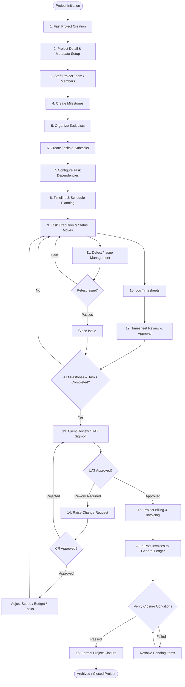

# Project Management Module — End-to-End Workflow Specification

> **Document Status:** Canonical Workflow Reference  
> **Target Location:** `docs/project-management/WORKFLOW.md`  
> **Source References:** *Project Management Module – Functional Flow*, Workflow Diagram, Audit Baseline (September 10, 2026).

---

## 1. Complete Target Business Workflow

The Project Management module orchestrates work across fifteen distinct stages, from initial project initiation through financial billing and operational closure.

---

## 2. Stage-by-Stage Workflow Details

### Stage 1: Fast Project Creation
- **Action:** User clicks "New Project" on the directory view.
- **Input:** `name` (required).
- **Automations:**
  - Sequential code generation (`PRJ-0001`).
  - System defaults: `owner_id = auth()->id()`, `start_date = today`, `priority = Medium`, `status = Draft`.
  - Collaborator Invariant auto-assignment: Creator is automatically added to `project_members` as an active member.
- **Output:** Immediate redirect to the Project Detail view.
- **Status:** **CURRENTLY IMPLEMENTED.**

### Stage 2: Project Detail & Metadata Setup
- **Action:** User updates remaining project parameters via responsive inline editing.
- **Fields:** Client (`customer_id`), Project Manager (`manager_id`), Start/End Dates, Budget Type (`Fixed` vs `Time & Material`), Budget Amount, Budget Hours, Billing Method (`Project Based`, `Milestone Based`, `Task Based`, `User Based`), Description.
- **Rules:**
  - If `manager_id` is assigned, they are automatically added as an active collaborator.
  - Chronological validation: `end_date >= start_date`.
- **Status:** **CURRENTLY IMPLEMENTED.**

### Stage 3: Staff Project Team & Rate Configuration
- **Action:** Add users to `project_members` via the Collaborators widget or Members management.
- **Fields:** User, Project Role (e.g. Lead Engineer, QA, Designer), Rate Per Hour (billable rate), Cost Per Hour (internal cost), Budget Hours allocation.
- **Rules:**
  - Duplicate user assignment to the same project is blocked.
  - Active role holders (Owner, Manager) cannot be removed.
- **Status:** **CURRENTLY IMPLEMENTED.**

### Stage 4: Milestone Creation
- **Action:** Create delivery milestones (e.g., Phase 1: MVP, Phase 2: Beta).
- **Fields:** Milestone Name, Owner, Description, Start Date, Due Date, Status.
- **Rules:**
  - Owner must be an active project collaborator.
  - Health is dynamically derived (`on_track`, `at_risk`, `off_track`, `blocked`).
- **Progress Rollup:** Automatically rolls up milestone `completion_percentage` based on the completion of child tasks:
  - `eligible = all milestone tasks where status != Cancelled`
  - `progress = completed eligible / total eligible * 100` (0% if total eligible = 0).
  - Recalculates dynamically on task creation, status update, deletion, and reassignment between milestones.
- **Status:** **CURRENTLY IMPLEMENTED (WITH AUTOMATIC PROGRESS ROLLUP).**

### Stage 5: Task List Organization
- **Action:** Create task lists / board categories (e.g., Backlog, In Progress, Review, Done, or functional columns: UI/UX, Backend, QA).
- **Rules:**
  - Task lists can be optionally linked to a Milestone.
  - Reordering persists positional sequence (`moveUp`, `moveDown`).
- **Status:** **CURRENTLY IMPLEMENTED.**

### Stage 6: Task & Subtask Creation
- **Action:** Create tasks under designated task lists.
- **Fields:** Task Code (`PRJ-0001-T-001`), Title, Task List, Milestone, Assignee, Reviewer, Priority, Start Date, Due Date, Estimated Hours.
- **Rules:**
  - Assignee and Reviewer must be active project members.
  - Tasks can be decomposed into Subtasks.
- **Subtask Capabilities:**
  - Independent execution metadata: `assignee_id`, `start_date`, `due_date`, `estimated_hours`, and `status`.
  - Canonical Status/Completion synchronization:
    - `status = Completed` $\iff$ `is_completed = true` and `completed_at = now()`.
    - `status != Completed` $\iff$ `is_completed = false` and `completed_at = null`.
    - `toggleComplete(true)` produces `Completed` / `true` / timestamp; `toggleComplete(false)` produces `Open` / `false` / null.
  - Parent Task Autonomy: Subtask completion does not automatically mutate parent Task status.
- **Status:** **CURRENTLY IMPLEMENTED.**

### Stage 7: Task Dependency Configuration
- **Action:** Define predecessor/successor constraints between tasks.
- **Rules:**
  - In-memory cycle detection rejects direct and indirect circular dependency chains before persistence.
  - Rejects self-dependencies, cross-project dependencies, and duplicate edges.
- **Dependency Classification & Transition Enforcement:**
  - Supports 4 dependency types:
    - **Finish-to-Start (FS):** Task cannot start (`In Progress`, `Review`, `Completed`) until predecessor is Completed.
    - **Start-to-Start (SS):** Task cannot start until predecessor has started.
    - **Finish-to-Finish (FF):** Task can start, but cannot complete until predecessor is Completed.
    - **Start-to-Finish (SF):** Task cannot complete until predecessor has started.
  - Administrative transitions (`On Hold`, `Cancelled`) are always permitted.
- **Status:** **CURRENTLY IMPLEMENTED (CYCLE DETECTION, DEPENDENCY TYPES, TRANSITION ENFORCEMENT).**

### Stage 8: Timeline, Scheduling & Gantt Planning
- **Action:** View project schedule on an interactive Gantt chart.
- **Capabilities:**
  - Milestone timeline planning.
  - Critical Path Method (CPM) calculation identifying non-slack tasks.
  - Resource workload heatmaps.
- **Status:** **TARGET REQUIRED (CURRENTLY MISSING).**

### Stage 9: Task Execution & Status Transitions
- **Workflow Transitions:**
  1. `Open` -> User clicks "Start Work" -> `In Progress`.
  2. `In Progress` -> Work paused -> `On Hold`.
  3. `On Hold` -> Work resumed -> `In Progress`.
  4. `In Progress` -> Work completed -> `Review`.
  5. `Review` -> Reviewer rejects -> `In Progress` (with rework comments).
  6. `Review` -> Reviewer approves -> `Completed`.
- **Status:** **CURRENTLY IMPLEMENTED.**

### Stage 10: Time Tracking & Timesheet Entry
- **Action:** Team members log daily work hours against tasks.
- **Fields:** User, Project, Task, Date, Hours, Start/End Time, Billable (Yes/No), Description.
- **Automations:** Logged hours accumulate in `Task.actual_hours` upon approval.
- **Status:** **TARGET REQUIRED (CURRENTLY MISSING).**

### Stage 11: Defect & Issue Management
- **Action:** QA/Reviewers log bugs found during development or review.
- **Lifecycle:** `Open` -> `Assigned` -> `In Progress` -> `Resolved` -> Retest.
  - **Retest Fails:** Transitions back to `In Progress`.
  - **Retest Passes:** Transitions to `Closed`.
- **Status:** **TARGET REQUIRED (CURRENTLY MISSING).**

### Stage 12: Timesheet Review & Approval
- **Action:** Project Manager reviews submitted timesheets in an approval queue.
- **Outcomes:**
  - **Approve:** Locks the timesheet row, updates task actuals, and marks hours eligible for billing.
  - **Reject:** Returns timesheet to resource with feedback remarks for correction.
- **Status:** **TARGET REQUIRED (CURRENTLY MISSING).**

### Stage 13: Client Review / UAT (User Acceptance Testing)
- **Gatekeeper:** Can only be initiated once **100% of project milestones are Completed**.
- **Action:** Formal review record created with Client Reviewer and Target Sign-off Date.
- **Outcomes:**
  - **Approved:** Unlocks billing and project closure.
  - **Rework Required:** Generates a mandatory Change Request.
- **Status:** **TARGET REQUIRED (CURRENTLY MISSING).**

### Stage 14: Change Request (CR) Governance
- **Trigger:** Initiated when client requests scope additions or UAT indicates rework beyond original specification.
- **Action:** Log CR with Impact Analysis (Budget Delta, Hours Delta, Schedule Impact).
- **Outcomes:**
  - **Approved:** Automatically updates Project Budget, generates required new Tasks/Milestones, and returns project to `Active` execution.
  - **Rejected:** Scope is discarded; project returns to UAT review or proceeds as planned.
- **Status:** **TARGET REQUIRED (CURRENTLY MISSING).**

### Stage 15: Project Billing & Invoicing
- **Action:** Generate commercial customer invoices based on agreed billing model:
  - **Project Based (Fixed):** Billed against scheduled milestones.
  - **Milestone Based:** Invoices triggered upon milestone completion.
  - **Task Based:** Invoices triggered upon task sign-off.
  - **User / Time Based (T&M):** Aggregates approved billable timesheets within date range.
- **Integration:** Directly creates standard Sales Invoices (`App\Domains\Sales\Models\Invoice`), which automatically trigger accounting General Ledger journal entries.
- **Status:** **TARGET REQUIRED (CURRENTLY MISSING IN PROJECTS; INVOICE INFRASTRUCTURE EXISTS IN SALES).**

### Stage 16: Controlled Project Closure
- **Prerequisite Validation Gates:**
  1. All child tasks must be `Completed` or `Cancelled`.
  2. All subtasks must be `Completed`.
  3. All project issues must be `Closed`.
  4. Client UAT Review must be `Approved`.
  5. All approved billable time logs must be marked invoiced.
- **Action:** Project Manager triggers "Close Project".
- **Fields Recorded:** `closure_date`, `client_approval_ref`, `final_remarks`, `status = Closed`.
- **Result:** Project is marked read-only. No further tasks, timesheets, or expenses can be logged.
- **Status:** **TARGET REQUIRED (CURRENTLY MISSING GATES & CLOSURE METADATA).**

---

## 3. Workflow Comparison: Implemented vs Target

| Workflow Stage | Current State | Target Required State | Gap / Action Required |
|---|---|---|---|
| **1. Fast Creation** | Implemented (Modal -> Detail) | Implemented (Modal -> Detail) | None (Preserve intentional UX) |
| **2. Metadata Setup** | Implemented (Inline Edits) | Implemented (Inline Edits) | None |
| **3. Team Staffing** | Implemented (ProjectMember) | Implemented + Capacity tracking | Add capacity / allocation % |
| **4. Milestones** | Implemented (Manual %) | Implemented + Task rollup % | Auto-calculate milestone % from tasks |
| **5. Task Lists** | Implemented (Reorderable) | Implemented | None |
| **6. Tasks & Subtasks** | Implemented (Subtasks boolean) | Full Subtask attributes | Add subtask dates, hours, and status |
| **7. Dependencies** | Cycle Detection Implemented | FS/SS/FF Types + Transition Blocking | Enforce blocker in `updateStatus()` |
| **8. Scheduling / Gantt** | Missing | Interactive Gantt + Critical Path | Build Gantt view and CPM engine |
| **9. Execution & Status** | Implemented (FSM transitions) | Implemented | None |
| **10. Time Tracking** | Missing | Daily time entry against tasks | Build `project_time_logs` & UI |
| **11. Issue Management** | Missing | Defect tracking with retest loop | Build `project_issues` & lifecycle |
| **12. Timesheet Approval** | Missing | PM approval queue | Build approval UI & lock mechanism |
| **13. Client UAT** | Missing | Milestone gate + Sign-off | Build `project_reviews` & gates |
| **14. Change Requests** | Missing | Impact analysis + Budget adjust | Build `project_change_requests` |
| **15. Billing Integration** | Missing in PM | Sales Invoice generation | Bridge approved timesheets -> Sales Invoices |
| **16. Project Closure** | Unvalidated Status Move | 5 Strict Validation Gates | Add closure fields & validation rules |
