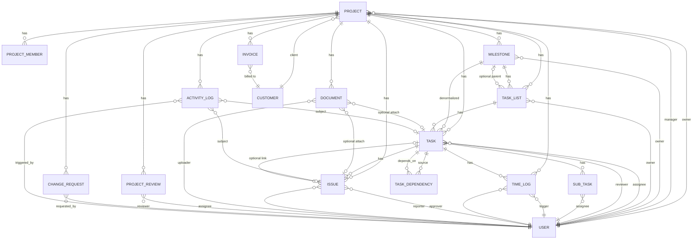
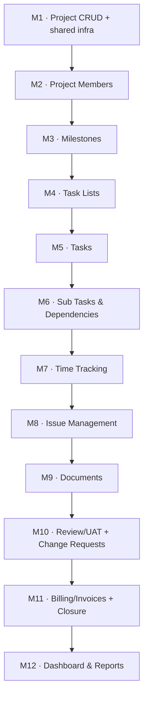
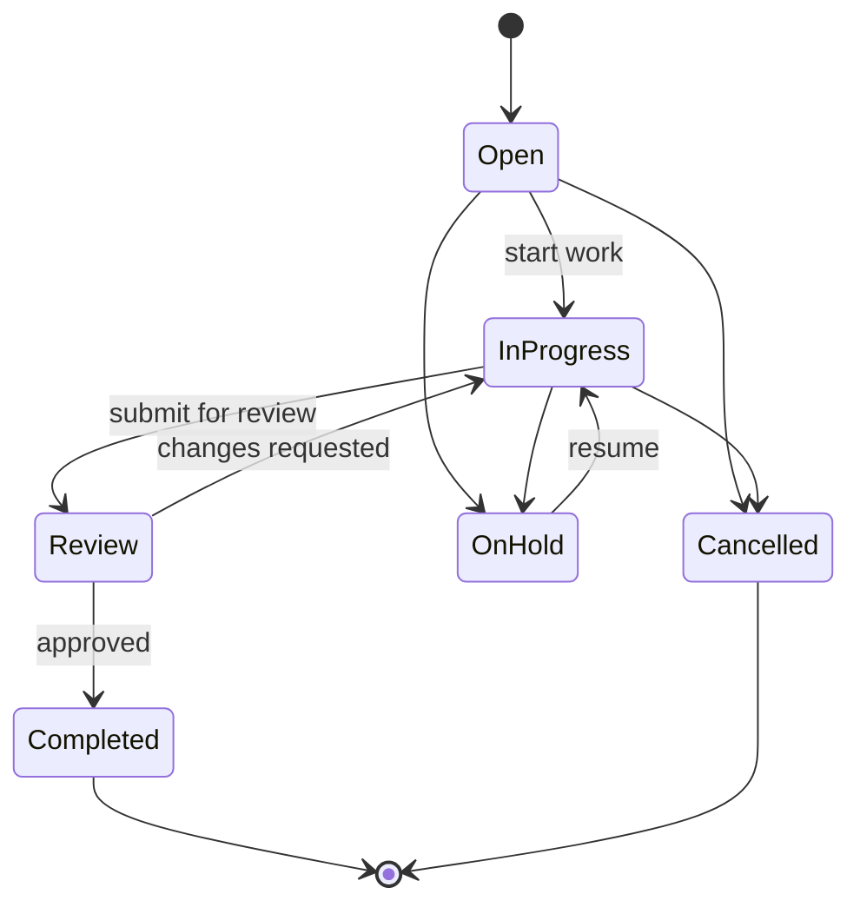
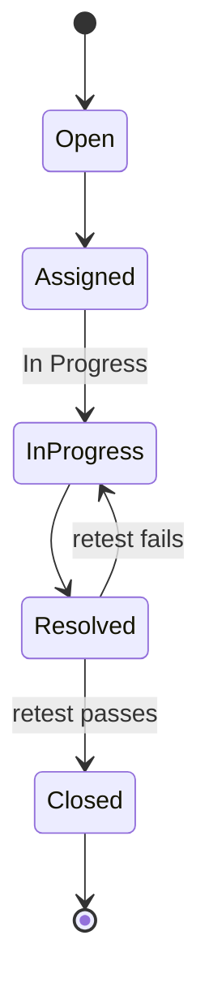

# Project Management Module — Design Specification

> Status: design only, no code written. Sourced from `Project Management Module – Functional Flow.pdf`, `Project Management Module – Screen Wise Fields.pdf`, the workflow diagram, and an architecture research pass over this codebase (CRM's vertical slice, Production's repository/policy pattern, the RBAC core, tenant isolation, and Blade component library).
>
> Target location: `app/Domains/Projects` — currently an empty scaffold (only `.gitkeep` files and a stub `Routes/web.php`), so this is a clean build inside an already-reserved module slot, not a merge into existing PM code.

## Table of contents

1. [Every entity / model required](#1-every-entity--model-required)
2. [Reused models](#2-reused-models)
3. [Database relationships](#3-database-relationships)
4. [What belongs inside app/Domains/Projects](#4-what-belongs-inside-appdomainsprojects)
5. [Every migration](#5-every-migration)
6. [Every controller](#6-every-controller)
7. [Every repository interface + implementation](#7-every-repository-interface--implementation)
8. [Every service](#8-every-service)
9. [Every policy](#9-every-policy)
10. [Every route group](#10-every-route-group)
11. [Every Blade page](#11-every-blade-page)
12. [Reusable UI components already available](#12-reusable-ui-components-already-available)
13. [Milestone breakdown](#13-milestone-breakdown)
14. [Per-milestone detail](#14-per-milestone-detail)

Architectural decisions this spec bakes in (each flagged inline where relevant) — confirm before implementation starts:

- **Authorization** — every policy calls `AccessService::allows()` (CRM's pattern), never Production's legacy `hasProductionPermission()` / raw `role === 'admin'` escape hatch. New permissions are seeded as real `Permission`/`RolePermission` rows, never added to `config/production.php`.
- **Repositories** — bound as interfaces in `AppServiceProvider::register()`, following Production's pattern, not CRM's concrete-only injection. This is the pattern CLAUDE.md names as canonical for new modules.
- **Validation** — one `FormRequest` per write action (CRM has none today; with 14 new entities, inline duplicated rule arrays would compound badly).
- **Table naming** — every new table is prefixed `project_*` to avoid future collisions (`tasks`, `issues`, `invoices` are generic enough that Accounting/HRMS could plausibly want the same bare name later).
- **UI pattern** — dedicated full pages (the Customer pattern) for entities users navigate to directly; modal/drawer-driven inline CRUD (the Quotation pattern) for entities always edited in a parent's context.
- **Activity log** — one shared polymorphic `project_activity_logs` table (modeled on Production's `ProductionEventTimeline`), not per-entity history tables or Production's log-file-only `Loggable` trait.
- **Notifications** — activate Laravel's already-present but unwired `Notifiable` trait on `User` via the built-in `database` channel. No new package.

---

## 1. Every Entity / Model Required

| Model | Table | Status |
|---|---|---|
| `Project` | `projects` | new |
| `ProjectMember` | `project_members` | new |
| `Milestone` | `project_milestones` | new |
| `TaskList` | `project_task_lists` | new |
| `Task` | `project_tasks` | new |
| `SubTask` | `project_sub_tasks` | new |
| `TaskDependency` | `project_task_dependencies` | new |
| `TimeLog` | `project_time_logs` | new — carries its own approval fields, no separate Approval model |
| `Issue` | `project_issues` | new |
| `Document` | `project_documents` | new |
| `ProjectReview` | `project_reviews` | new — Client Review / UAT |
| `ChangeRequest` | `project_change_requests` | new |
| `Invoice` | `project_invoices` | new |
| `ActivityLog` | `project_activity_logs` | new — shared/polymorphic, not directly user-editable |
| *Project Closure* | columns on `projects` | extension, not a model |
| *Timesheet Approval* | columns on `project_time_logs` | extension, not a model |

14 real models. Closure and Approval are workflow states, not independent entities — the Screen-Wise Fields doc's "Project Close" and "Approval" screens both read/write an existing parent row rather than creating a new one.

---

## 2. Reused Models

Nothing in the module introduces a new Client, User, or Employee concept — every field in the Screen-Wise Fields doc that names one of these maps onto a model that already exists.

| Doc field | Reused model | Where it lives |
|---|---|---|
| Client / Customer | `Customer` | `app/Domains/CRM/Models/Customer.php` |
| Project Owner, Project Manager, Assignee, Reviewer, Reporter, Uploaded By, Approved By, Requested By | `User` | `app/Models/User.php` |
| Resource / Role dropdown | `User` | filtered through `ProjectMember`, not a new Resource model |

**Explicitly not reused:**

| Model | Why not |
|---|---|
| HRMS `Employee` / `Department` / `Branch` | Confirmed in the architecture pass to be plain `Model`, not `BaseModel` — no tenant scope. Using them as an assignment FK would be a tenant-leakage risk, so PM assignment fields always point at `User` instead. |

---

## 3. Database Relationships

Prose form (for the relationships a strict ER diagram compresses):

| Entity | Relationships |
|---|---|
| **Project** | belongsTo `Customer` (client), belongsTo `User` ×2 (owner, manager) · hasMany Member, Milestone, TaskList, Task, TimeLog, Issue, Document, Review, ChangeRequest, Invoice, ActivityLog |
| **ProjectMember** | belongsTo Project, belongsTo `User` |
| **Milestone** | belongsTo Project, belongsTo `User` (owner) · hasMany TaskList, Task |
| **TaskList** | belongsTo Project, belongsTo Milestone (nullable), belongsTo `User` (owner) · hasMany Task |
| **Task** | belongsTo Project, Milestone (denormalized), TaskList, belongsTo `User` ×2 (assignee, reviewer) · hasMany SubTask, TimeLog, Issue, TaskDependency (as source & target), ActivityLog |
| **SubTask** | belongsTo Task, belongsTo `User` (assignee) |
| **TaskDependency** | belongsTo Task (as `task`), belongsTo Task (as `dependsOn`) — self-referencing edge, not a tree |
| **TimeLog** | belongsTo Project, Task, `User` (logger), `User` (approver) |
| **Issue** | belongsTo Project, Task (nullable), `User` ×2 (reporter, assignee) |
| **Document** | belongsTo Project, morphTo `attachable` (Task/Issue, nullable), belongsTo `User` (uploader) |
| **ProjectReview** | belongsTo Project, belongsTo `User` (reviewer) |
| **ChangeRequest** | belongsTo Project, belongsTo `User` (requested_by) |
| **Invoice** | belongsTo Project, belongsTo `Customer` |
| **ActivityLog** | belongsTo Project, morphTo `subject` (any PM entity), belongsTo `User` (triggered_by) |

---

## 4. What Belongs Inside app/Domains/Projects

`app/Domains/Projects` is currently an empty scaffold (only `.gitkeep` files and a stub `Routes/web.php`) — confirmed in the architecture pass — so it becomes the home for all fourteen new models below. Nothing moves out of CRM or HRMS; the module only *references* their models via foreign key.

| Inside `app/Domains/Projects` | Stays where it is (referenced only) |
|---|---|
| `Project`, `ProjectMember`, `Milestone`, `TaskList`, `Task`, `SubTask`, `TaskDependency`, `TimeLog`, `Issue`, `Document`, `ProjectReview`, `ChangeRequest`, `Invoice`, `ActivityLog` | `Customer` (CRM), `User` (`app/Models`) |

---

## 5. Every Migration

| # | File | Notes |
|---|---|---|
| 01 | `2026_XX_XX_000001_create_projects_table.php` | |
| 02 | `2026_XX_XX_000002_create_project_members_table.php` | |
| 03 | `2026_XX_XX_000003_create_project_activity_logs_table.php` | |
| 04 | `2026_XX_XX_000004_create_notifications_table.php` | stock `php artisan notifications:table` stub |
| 05 | `2026_XX_XX_000005_create_project_milestones_table.php` | |
| 06 | `2026_XX_XX_000006_create_project_task_lists_table.php` | |
| 07 | `2026_XX_XX_000007_create_project_tasks_table.php` | |
| 08 | `2026_XX_XX_000008_create_project_sub_tasks_table.php` | |
| 09 | `2026_XX_XX_000009_create_project_task_dependencies_table.php` | |
| 10 | `2026_XX_XX_000010_create_project_time_logs_table.php` | |
| 11 | `2026_XX_XX_000011_create_project_issues_table.php` | |
| 12 | `2026_XX_XX_000012_create_project_documents_table.php` | |
| 13 | `2026_XX_XX_000013_create_project_reviews_table.php` | |
| 14 | `2026_XX_XX_000014_create_project_change_requests_table.php` | |
| 15 | `2026_XX_XX_000015_create_project_invoices_table.php` | |
| 16 | `2026_XX_XX_000016_add_closure_fields_to_projects_table.php` | additive, mirrors CRM's own `add_X_to_Y` convention |

Column-level specs (types, indexes, FKs, soft-delete/status decisions) for each table are documented per-entity in the prior architecture research pass and are not re-derived here to avoid duplicating that document; the naming/order above is authoritative for build sequencing.

---

## 6. Every Controller

All in `app/Domains/Projects/Controllers/`, all thin — authorize → validate via FormRequest → delegate to Service → redirect/JSON, matching the CRM controller shape.

| Area | Controller |
|---|---|
| Project | `ProjectController` |
| Project | `ProjectClosureController` |
| Project | `ProjectDashboardController` |
| Project | `ProjectReportController` |
| Project | `ProjectActivityLogController` — read-only feed |
| Members | `ProjectMemberController` |
| Milestones | `MilestoneController` |
| Task Lists | `TaskListController` |
| Tasks | `TaskController` |
| Sub Tasks | `SubTaskController` |
| Dependencies | `TaskDependencyController` |
| Time | `TimeLogController` |
| Time | `TimesheetApprovalController` |
| Issues | `IssueController` |
| Documents | `DocumentController` |
| UAT | `ProjectReviewController` |
| Change | `ChangeRequestController` |
| Billing | `InvoiceController` |

---

## 7. Every Repository Interface + Implementation

Bound as interfaces, following Production's pattern (not CRM's concrete-only pattern) — every one of these gets both files plus a binding line in `AppServiceProvider::register()`.

| # | Interface / Implementation |
|---|---|
| 01 | `ProjectRepositoryInterface` / `ProjectRepository` |
| 02 | `ProjectMemberRepositoryInterface` / `ProjectMemberRepository` |
| 03 | `MilestoneRepositoryInterface` / `MilestoneRepository` |
| 04 | `TaskListRepositoryInterface` / `TaskListRepository` |
| 05 | `TaskRepositoryInterface` / `TaskRepository` |
| 06 | `SubTaskRepositoryInterface` / `SubTaskRepository` |
| 07 | `TaskDependencyRepositoryInterface` / `TaskDependencyRepository` |
| 08 | `TimeLogRepositoryInterface` / `TimeLogRepository` |
| 09 | `IssueRepositoryInterface` / `IssueRepository` |
| 10 | `DocumentRepositoryInterface` / `DocumentRepository` |
| 11 | `ProjectReviewRepositoryInterface` / `ProjectReviewRepository` |
| 12 | `ChangeRequestRepositoryInterface` / `ChangeRequestRepository` |
| 13 | `InvoiceRepositoryInterface` / `InvoiceRepository` |
| 14 | `ActivityLogRepositoryInterface` / `ActivityLogRepository` |

---

## 8. Every Service

| Service | Notes |
|---|---|
| `ActivityLogService` | shared — called by every other service below |
| `ProjectService` | code generation, status transitions |
| `ProjectMemberService` | |
| `MilestoneService` | |
| `TaskListService` | |
| `TaskService` | task number generation, status workflow guard |
| `SubTaskService` | rolls up parent Task completion % |
| `TaskDependencyService` | cycle-detection before insert |
| `TimeLogService` | entry + approval + `Task.actual_hours` rollup |
| `IssueService` | issue number generation, retest-fail loop-back |
| `DocumentService` | |
| `ProjectReviewService` | gated on all-milestones-completed |
| `ChangeRequestService` | CR number generation |
| `InvoiceService` | invoice number generation, aggregates billable TimeLogs |
| `ProjectClosureService` | or a method on `ProjectService` — architect's call at build time |
| `ProjectDashboardService` | widget aggregates |
| `ProjectReportService` | seven reports |

---

## 9. Every Policy

Every policy calls `AccessService::allows()` (CRM's pattern) — never Production's legacy `hasProductionPermission()` / role-string escape hatch. Registered in `AppServiceProvider::boot()` under a `// ── Projects Policies ──` banner, one `Gate::policy()` call per model.

| # | Policy |
|---|---|
| 01 | `ProjectPolicy` |
| 02 | `ProjectMemberPolicy` |
| 03 | `MilestonePolicy` |
| 04 | `TaskListPolicy` |
| 05 | `TaskPolicy` — SubTask + TaskDependency delegate to this, no separate policy |
| 06 | `TimeLogPolicy` — covers both entry (own) and approval (team/tenant) |
| 07 | `IssuePolicy` |
| 08 | `DocumentPolicy` |
| 09 | `ProjectReviewPolicy` |
| 10 | `ChangeRequestPolicy` |
| 11 | `InvoicePolicy` |

---

## 10. Every Route Group

All declared in `app/Domains/Projects/Routes/web.php`, wrapped once in `Route::prefix('projects')->as('projects.')->group(...)` — auto-`require`d by the existing `glob('Domains/*/Routes/web.php')` in `routes/web.php`, itself already nested in `['tenant']` + `['auth']` middleware. No new route-file wiring needed.

| Group | Route name prefix | Notes |
|---|---|---|
| Projects | `projects.*` | index/create/store/show/edit/update/destroy |
| Closure | `projects.close` | `PATCH /projects/{project}/close` |
| Members | `projects.members.*` | nested under `{project}` |
| Milestones | `projects.milestones.*` | nested under `{project}` |
| Task Lists | `projects.tasklists.*` | + `projects.tasklists.reorder` |
| Tasks | `projects.tasks.*` | + `projects.tasks.updateStatus`, `projects.tasks.assign` |
| Sub Tasks | `projects.tasks.subtasks.*` | nested under `{task}` |
| Dependencies | `projects.tasks.dependencies.*` | nested under `{task}`, store/destroy only |
| Time Logs | `projects.timelogs.*` | |
| Timesheet Approval | `projects.timelogs.approval.*` | `index`, `approve`, `reject` |
| Issues | `projects.issues.*` | |
| Documents | `projects.documents.*` | + `projects.documents.attach` |
| Reviews / UAT | `projects.reviews.*` | |
| Change Requests | `projects.changerequests.*` | |
| Invoices | `projects.invoices.*` | |
| Dashboard | `projects.dashboard` | single per-project view |
| Reports | `projects.reports.*` | 7 sub-routes: summary, tasks, resources, timesheet, issues, milestones, budget |
| Activity feed | `projects.activity` | read-only, JSON or partial view for the Activity tab |

---

## 11. Every Blade Page

All under `resources/views/modules/projects/` (lowercase, per CLAUDE.md's screen-location rule). Split between dedicated full pages (Customer pattern, for entities users navigate to directly) and modal/drawer-driven partials (Quotation pattern, for entities always edited in a parent's context).

| Type | View |
|---|---|
| dedicated | `projects/index.blade.php` |
| dedicated | `projects/create.blade.php` |
| dedicated | `projects/edit.blade.php` |
| dedicated | `projects/show.blade.php` — hosts tabs below via `@include` |
| partial | `projects/_members.blade.php` |
| partial | `projects/_milestones.blade.php` |
| partial | `projects/_tasklists.blade.php` — renders the Task board |
| partial | `projects/tasks/_drawer.blade.php` — Task detail: sub-tasks, dependencies, time logs on this task |
| partial | `projects/_activity-feed.blade.php` — reused across show pages |
| dedicated | `projects/timelogs/index.blade.php` |
| dedicated | `projects/timelogs/approval.blade.php` |
| dedicated | `projects/issues/index.blade.php` |
| dedicated | `projects/issues/create.blade.php` |
| dedicated | `projects/issues/show.blade.php` |
| dedicated | `projects/documents/index.blade.php` |
| dedicated | `projects/reviews/index.blade.php` |
| dedicated | `projects/reviews/create.blade.php` |
| dedicated | `projects/changerequests/index.blade.php` |
| dedicated | `projects/changerequests/create.blade.php` |
| dedicated | `projects/changerequests/show.blade.php` |
| dedicated | `projects/invoices/index.blade.php` |
| dedicated | `projects/invoices/show.blade.php` |
| dedicated | `projects/dashboard.blade.php` |
| dedicated ×7 | `projects/reports/{summary,tasks,resources,timesheet,issues,milestones,budget}.blade.php` |

---

## 12. Reusable UI Components Already Available

| Component | Used for |
|---|---|
| `x-ui.table` | Task/Issue/Invoice/Document lists |
| `x-ui.modal` | Milestone/TaskList/quick-create dialogs (Quotation pattern) |
| `x-ui.drawer` | Task detail slide-over — not used elsewhere in the app yet, good fit here |
| `x-ui.odoo-form-ui` | Structured create/edit forms |
| `x-ui.filter` | Status/assignee/priority/date filters on every index |
| `x-ui.sort-dropdown` | List sorting |
| `x-ui.pagination` | Every index |
| `x-ui.badge` | Status pills (Task/Issue/Invoice/CR status) |
| `x-ui.button`, `x-ui.icon-btn` | All actions |
| `x-ui.input` / `select` / `textarea` / `checkbox` / `radio` | All forms |
| `x-ui.action-dropdown` | Row-level menus |
| `x-ui.toast` | Success/error feedback |
| `layouts/duralux.blade.php` + `partials/duralux/*` | Admin shell, sidebar entry, header |

---

## 13. Milestone Breakdown

| # | Milestone |
|---|---|
| M1 | Project CRUD + shared infra (Activity Log, permission seeding) |
| M2 | Project Members |
| M3 | Milestones |
| M4 | Task Lists |
| M5 | Tasks |
| M6 | Sub Tasks & Task Dependencies |
| M7 | Time Tracking (entry + approval) |
| M8 | Issue Management |
| M9 | Documents |
| M10 | Client Review / UAT + Change Requests |
| M11 | Billing / Invoices + Project Closure |
| M12 | Dashboard & Reports |

---

## 14. Per-Milestone Detail

### M1 — Project CRUD + Shared Infra

- **Goal:** Stand up the first real entity in the domain, plus the cross-cutting Activity Log every later milestone writes to.
- **Models:** `Project`, `ActivityLog`
- **Migrations:** `create_projects_table`, `create_project_activity_logs_table`, `create_notifications_table`
- **Controllers:** `ProjectController`, `ProjectActivityLogController`
- **Services:** `ProjectService`, `ActivityLogService`
- **Repositories:** `ProjectRepositoryInterface`/`ProjectRepository`, `ActivityLogRepositoryInterface`/`ActivityLogRepository`
- **Views:** `projects/{index,create,show,edit}.blade.php`, `projects/_activity-feed.blade.php`
- **Permissions:** `projects.projects.view/create/update/delete.{own,team,tenant}`
- **Manual testing checklist:**
  - [ ] Create a project as Tenant A; confirm invisible to Tenant B even via direct URL
  - [ ] Edit status; confirm an activity log row is written
  - [ ] Log in without `projects.projects.view` and confirm 403, not an empty list

### M2 — Project Members

- **Goal:** Staff a project with rated team members before any task can be assigned.
- **Models:** `ProjectMember`
- **Migrations:** `create_project_members_table`
- **Controllers:** `ProjectMemberController`
- **Services:** `ProjectMemberService`
- **Repositories:** `ProjectMemberRepositoryInterface`/`ProjectMemberRepository`
- **Views:** `projects/_members.blade.php` (modal add/remove on show page)
- **Permissions:** `projects.members.manage.{own,tenant}`
- **Manual testing checklist:**
  - [ ] Add the same user twice — unique constraint blocks it with a friendly error
  - [ ] Deactivate a member — confirm they drop out of assignee dropdowns

### M3 — Milestones

- **Goal:** Give a project its major phases, each with an owner and completion %.
- **Models:** `Milestone`
- **Migrations:** `create_project_milestones_table`
- **Controllers:** `MilestoneController`
- **Services:** `MilestoneService`
- **Repositories:** `MilestoneRepositoryInterface`/`MilestoneRepository`
- **Views:** `projects/_milestones.blade.php`
- **Permissions:** `projects.milestones.manage.{own,team,tenant}`
- **Manual testing checklist:**
  - [ ] Due date before start date — FormRequest rejects it
  - [ ] Complete a milestone — notification fires to owner/manager

### M4 — Task Lists

- **Goal:** Group related tasks under a Milestone/Project, in a reorderable board-column layout.
- **Models:** `TaskList`
- **Migrations:** `create_project_task_lists_table`
- **Controllers:** `TaskListController`
- **Services:** `TaskListService`
- **Repositories:** `TaskListRepositoryInterface`/`TaskListRepository`
- **Views:** `projects/_tasklists.blade.php`
- **Permissions:** `projects.tasklists.manage.{team,tenant}`
- **Manual testing checklist:**
  - [ ] Drag-drop reorder persists `position` without a page reload
  - [ ] Milestone set on a Task List from a different project is rejected

### M5 — Tasks

- **Goal:** The core unit of work — full status workflow and assignment.
- **Models:** `Task`
- **Migrations:** `create_project_tasks_table`
- **Controllers:** `TaskController`
- **Services:** `TaskService`
- **Repositories:** `TaskRepositoryInterface`/`TaskRepository`
- **Views:** `projects/tasks/_drawer.blade.php`
- **Permissions:** `projects.tasks.view/create/update/delete.{own,team,tenant}`
- **Manual testing checklist:**
  - [ ] Assignee with only `own` scope can move their own task forward, not someone else's
  - [ ] Assigning a non-member is rejected by the FormRequest
  - [ ] TaskAssigned/Updated/Completed notifications fire correctly

Task status workflow (from the Functional Flow doc):

### M6 — Sub Tasks & Task Dependencies

- **Goal:** Break tasks down further; wire a cycle-safe dependency graph.
- **Models:** `SubTask`, `TaskDependency`
- **Migrations:** `create_project_sub_tasks_table`, `create_project_task_dependencies_table`
- **Controllers:** `SubTaskController`, `TaskDependencyController`
- **Services:** `SubTaskService`, `TaskDependencyService`
- **Repositories:** `SubTaskRepositoryInterface`/`SubTaskRepository`, `TaskDependencyRepositoryInterface`/`TaskDependencyRepository`
- **Views:** inline in `projects/tasks/_drawer.blade.php`
- **Permissions:** delegates to parent Task's policy — no new permission rows
- **Manual testing checklist:**
  - [ ] A→B→C→A dependency chain is rejected before touching the database
  - [ ] Dependency across two different projects is rejected

### M7 — Time Tracking

- **Goal:** Log hours against tasks; let PMs bulk-approve/reject.
- **Models:** `TimeLog`
- **Migrations:** `create_project_time_logs_table`
- **Controllers:** `TimeLogController`, `TimesheetApprovalController`
- **Services:** `TimeLogService`
- **Repositories:** `TimeLogRepositoryInterface`/`TimeLogRepository`
- **Views:** `projects/timelogs/{index,approval}.blade.php`
- **Permissions:** `projects.timelogs.create.own`, `projects.timelogs.approve.{team,tenant}`
- **Manual testing checklist:**
  - [ ] Approving a log recalculates the parent Task's `actual_hours`
  - [ ] A user cannot approve their own logged time

### M8 — Issue Management

- **Goal:** Track bugs/issues per project with the retest-fail loop-back from the workflow diagram.
- **Models:** `Issue`
- **Migrations:** `create_project_issues_table`
- **Controllers:** `IssueController`
- **Services:** `IssueService`
- **Repositories:** `IssueRepositoryInterface`/`IssueRepository`
- **Views:** `projects/issues/{index,create,show}.blade.php`
- **Permissions:** `projects.issues.view/create/update.{own,team,tenant}`
- **Manual testing checklist:**
  - [ ] Resolved → Retest fails → routes back to In Progress, not Closed
  - [ ] Resolved → Retest passes → Closed

Issue status workflow:

### M9 — Documents

- **Goal:** Central file repository per project, optionally attached to a Task or Issue.
- **Models:** `Document`
- **Migrations:** `create_project_documents_table`
- **Controllers:** `DocumentController`
- **Services:** `DocumentService`
- **Repositories:** `DocumentRepositoryInterface`/`DocumentRepository`
- **Views:** `projects/documents/index.blade.php`
- **Permissions:** `projects.documents.upload/view/delete.{team,tenant}`
- **Manual testing checklist:**
  - [ ] Upload size/type limits enforced by FormRequest
  - [ ] A Project-level doc can be attached to a Task without re-upload

### M10 — Client Review / UAT + Change Requests

- **Goal:** Gate client sign-off on all-milestones-completed; raise a Change Request when rework is required.
- **Models:** `ProjectReview`, `ChangeRequest`
- **Migrations:** `create_project_reviews_table`, `create_project_change_requests_table`
- **Controllers:** `ProjectReviewController`, `ChangeRequestController`
- **Services:** `ProjectReviewService`, `ChangeRequestService`
- **Repositories:** `ProjectReviewRepositoryInterface`/`ProjectReviewRepository`, `ChangeRequestRepositoryInterface`/`ChangeRequestRepository`
- **Views:** `projects/reviews/{index,create}.blade.php`, `projects/changerequests/{index,create,show}.blade.php`
- **Permissions:** `projects.reviews.manage.{team,tenant}`, `projects.changerequests.manage.{team,tenant}`
- **Manual testing checklist:**
  - [ ] Review creation blocked until every Milestone on the project is Completed
  - [ ] "Rework Required" surfaces a Raise Change Request action; "Approved" unlocks Closure

### M11 — Billing / Invoices + Project Closure

- **Goal:** Generate invoices from approved billable time; close the project out.
- **Models:** `Invoice` (Closure extends `Project`, no new model)
- **Migrations:** `create_project_invoices_table`, `add_closure_fields_to_projects_table`
- **Controllers:** `InvoiceController`, `ProjectClosureController`
- **Services:** `InvoiceService`, `ProjectClosureService`
- **Repositories:** `InvoiceRepositoryInterface`/`InvoiceRepository`
- **Views:** `projects/invoices/{index,show}.blade.php`
- **Permissions:** `projects.invoices.manage.tenant`, `projects.projects.close.{own,tenant}`
- **Manual testing checklist:**
  - [ ] Invoice totals match the underlying approved Time Logs exactly
  - [ ] Closure blocked without an Approved review
  - [ ] Closed project stops accepting new Time Logs

### M12 — Dashboard & Reports

- **Goal:** Surface the seven reports and widget dashboard across the whole module.
- **Models:** none new — reads across all thirteen entities above
- **Migrations:** none
- **Controllers:** `ProjectDashboardController`, `ProjectReportController`
- **Services:** `ProjectDashboardService`, `ProjectReportService`
- **Repositories:** none new — composes existing repositories
- **Views:** `projects/dashboard.blade.php`, `projects/reports/*.blade.php` ×7
- **Permissions:** `projects.dashboard.view.{team,tenant}`, `projects.reports.view.tenant`
- **Manual testing checklist:**
  - [ ] Dashboard loads acceptably on a project with hundreds of tasks / thousands of time logs
  - [ ] Each of the 7 reports' numbers match a seeded fixture exactly

---

*No code has been written. Implementation proceeds one milestone at a time, in the order above, starting at M1.*
