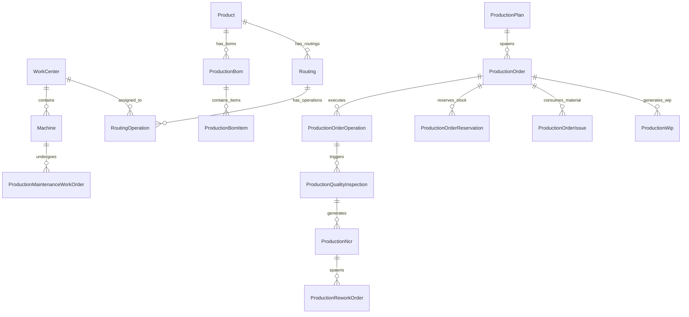

# Production Planning & Manufacturing Execution (MES) — Developer Manual

> **Domain Location:** `app/Domains/Production`  
> **Target Document:** `docs/user-manuals/production/DEVELOPER_MANUAL.md`  
> **Audience:** Senior Laravel Engineers, SaaS ERP Architects, Systems Integrators  
> **Framework:** Laravel 12 / PHP 8.3 / Multi-Tenant SaaS ERP  
> **Architectural Pattern:** Domain-Driven Design (DDD) with Strict 4-Layer Architecture & Repository Pattern

---

## 1. Domain Architecture & Directory Standards

The Production module follows a modular Domain-Driven Design (DDD) structure located entirely within `app/Domains/Production`.

```text
app/Domains/Production/
├── Controllers/              # 54 Web Controllers (Thin HTTP coordinators)
│   └── Api/                  # 15 REST API Controllers (Sanctum/Dual-gated)
├── DTO/                      # Data Transfer Objects (Immutable request bags)
├── Events/                   # Domain Events (Timeline & system triggers)
├── Exports/                  # Maatwebsite Excel & CSV export definitions
├── Listeners/                # Event Listeners (Decoupled side effects)
├── Models/                   # 74 Eloquent Models (Tenant-scoped via BaseModel)
├── Policies/                 # 13 Authorization Policies (Registered in AppServiceProvider)
├── Repositories/             # Flat Repository Interfaces & Implementations
├── Requests/                 # FormRequests for validation
│   └── Api/                  # API-specific FormRequests
├── Resources/                # Eloquent API Resources (JSON transformers)
├── Routes/                   # Route files (web.php and api.php)
├── Services/                 # 79 Domain Services (Business logic & transactions)
└── docs/                     # Internal engineering references
```

---

## 2. The Mandatory 4-Layer Architecture

All production code strictly adheres to the 4-layer architectural standard:

```text
1. Controller Layer   (app/Domains/Production/Controllers)
         ↓
2. Domain Service     (app/Domains/Production/Services)
         ↓
3. Repository Layer   (app/Domains/Production/Repositories)
         ↓
4. Eloquent / DB      (app/Domains/Production/Models → 74 MySQL Tables)
```

### Layer Responsibilities & Invariants

| Layer | Permitted Responsibilities | Strictly Forbidden |
|---|---|---|
| **1. Controllers** | Route binding, FormRequest validation, Gate authorization (`Gate::authorize`), Service invocation, Blade/JSON responses | Direct Model queries (`ProductionOrder::where()`), `Model::create()`, multi-step transactions, scheduling/MRP math |
| **2. Domain Services** | Manufacturing algorithms, status transitions, business validations, `DB::transaction()` boundaries, cross-domain orchestration | Direct HTTP Request access, view rendering, raw SQL queries bypassing repositories |
| **3. Repositories** | Data retrieval, pagination, filtering, tenant scoping, pessimistic locking (`lockForUpdate`), model persistence | Business logic calculations, status change workflows, transaction wrapping |
| **4. Models** | Database table mappings, Eloquent relationships, attribute casting, local scopes, tenant global scopes | Business workflows, cross-domain API calls, transaction orchestration |

### Flat Repository Standard
* All repositories reside directly in `app/Domains/Production/Repositories/`.
* Nested directories like `Repositories/Contracts/` or `Repositories/Eloquent/` are **strictly forbidden**.
* Repositories map to aggregate roots, not individual child tables. For example, `ProductionBomRepository` manages `ProductionBom` and its child lines `ProductionBomItem`.
* Bindings reside exclusively in `app/Providers/AppServiceProvider.php`.

---

## 3. Multi-Tenancy & Scoping Invariants

The application operates as a multi-tenant SaaS ERP where all tenant data shares a common database schema isolated by `tenant_id`.

### 3.1 Tenant Scope Enforcement
* Every model in `app/Domains/Production/Models` extends `App\Core\Database\BaseModel` or incorporates the `BelongsToTenant` scope.
* Controllers resolve the active tenant via `require_tenant_id()` or `$request->user()->tenant_id`.
* Global scope `TenantScope` automatically appends `WHERE tenant_id = ?` to all select, update, and delete queries.
* **Testing Bypass Guard:** When writing batch background jobs or queues, never call `withoutGlobalScopes()` unless explicitly executing a system-wide maintenance command that verifies tenancy inside the loop.

### 3.2 Company & Branch Context
* Where applicable, records store `company_id` and `branch_id`:
  ```php
  'company_id' => $order->company_id ?? company_id(),
  'branch_id'  => $order->branch_id ?? branch_id(),
  ```

---

## 4. Core Data Model & Key Relationships



### Key Entities & Status Lifecycles

#### 1. `ProductionBom` (`production_boms`)
* **Key Columns:** `id`, `tenant_id`, `product_id`, `bom_number`, `version`, `status`, `is_active`, `scrap_percentage`, `base_quantity`.
* **Status Enum:** `draft` → `pending_approval` → `approved` → `obsolete`.
* **Invariants:** Once a BOM reaches `approved`, it is frozen. Modifications require calling `createRevision()`, which creates a new row with an incremented version number.

#### 2. `ProductionOrder` (`production_orders`)
* **Key Columns:** `id`, `tenant_id`, `order_number`, `product_id`, `bom_id`, `routing_id`, `sales_order_id`, `quantity_ordered`, `quantity_produced`, `status`, `planned_start_date`, `actual_start_date`, `actual_end_date`.
* **Status Enum:**
  `draft` → `planned` → `released` → `in_progress` → `completed` → `closed` (or `cancelled`).
* **Lifecycle Rules:**
  * Materials can only be issued when `status ∈ ['released', 'in_progress']`.
  * Finished goods can only be received when in progress.
  * An order cannot be closed if active open rework orders exist.

#### 3. `ProductionOrderOperation` (`production_order_operations`)
* **Key Columns:** `id`, `production_order_id`, `sequence`, `work_center_id`, `machine_id`, `setup_time_minutes`, `processing_time_minutes`, `status`, `is_subcontract`, `vendor_id`, `subcontract_cost_per_unit`.
* **Status Enum:** `pending` → `in_progress` → `paused` → `completed` → `cancelled`.

#### 4. `ProductionWip` (`production_wips`)
* **Key Columns:** `id`, `tenant_id`, `production_order_id`, `work_center_id`, `batch_id`, `quantity`, `status`.
* **Tracks:** In-process intermediate quantities on the shop floor before final finished goods intake.

---

## 5. Domain Business Logic & Core Algorithms

### 5.1 MRP Explosion Engine (`MrpEngineService`)
```php
public function runMrp(int $tenantId, ProductionPlan $plan): array
```
1. Retrieves the plan's target finished product, planned quantity, and approved BOM.
2. Traverses the BOM hierarchy recursively, multiplying component requirements by the order multiplier.
3. Incorporates component-level scrap allowances:
   $$\text{Gross Requirement} = \text{BOM Qty} \times \text{Plan Qty} \times \left(1 + \frac{\text{Scrap \%}}{100}\right)$$
4. Queries `ProductWarehouseStock` to retrieve current unreserved on-hand inventory across raw material warehouses.
5. Calculates net shortages:
   $$\text{Net Shortage} = \max(0, \text{Gross Requirement} - \text{Available Stock})$$
6. Populates `production_plan_requirements` with shortage flags and generates Purchase Requisition recommendations.

### 5.2 Finite Capacity Scheduling (`SchedulingService`)
```php
public function scheduleOrder(ProductionOrder $order, string $strategy = 'forward'): ProductionSchedule
```
* **Forward Scheduling:** Starts from the requested start date. For each routing operation:
  $$\text{Earliest Start} = \max(\text{Previous Op Completion}, \text{Next Available Machine Slot})$$
  $$\text{Op Duration} = \text{Setup Time} + (\text{Batch Qty} \times \text{Unit Processing Time})$$
* **Calendar Integration:** Intersects calculated duration against work center shift calendars (`production_shifts`), deducting non-working hours, shift breaks, and registered plant holidays (`production_calendar_holidays`).
* **Capacity Leveling:** `CapacityLevelingService` identifies machine overload conditions where scheduled demand exceeds 100% of shift capacity and automatically shifts non-locked operations forward.

### 5.3 Shopfloor MES Execution (`ProductionExecutionService` / `MesExecutionService`)
* **Atomic Operation Timers:** When an operator starts an operation, `started_at` is stamped and machine state updates to `Active`.
* **Progress Logging & Batch Overflow:**
  * `recordProgress()` updates `completed_qty` and active batch statistics.
  * **Overflow Batch Handling:** When reported progress causes `batch->actual_quantity > batch->planned_quantity`, the system caps the parent batch at planned quantity and calls `ProductionBatchService::createOverflowBatch($batch, $overflowQty, $op)` to generate an auditable, linked overflow batch.
* **Automated Non-Conformance (NCR) & Rework/Scrap Spawning:**
  * **Rejections (`rejected > 0`):** Calls `logRework()`, automatically creates an open NCR (`ncr_number = 'NCR-AUTO-...'`, disposition `rework`, category `process`), and invokes `ReworkService::createReworkOrder()` to spawn an actionable shopfloor rework loop.
  * **Scrap (`scrapped > 0`):** Calls `logScrap()`, creates an auto-NCR (`disposition = 'scrap'`), and invokes `ScrapService::createScrapDisposal()` to initiate disposal tracking. Intermediate WIP scrap does not deduct finished goods inventory.

### 5.4 Subcontract Procurement Policy Engine
Located in `SubcontractProcurementPolicyResolver`:
* Verifies vendor assignment, service product validity, and unit cost.
* Checks tenant auto-approval threshold:
  ```php
  if ($workflowMode === 'auto_approved_po') {
      if ($unitCost <= 0) {
          $canAutoApprove = false;
      } elseif ($autoApprovalLimit > 0 && $totalCost > $autoApprovalLimit) {
          $canAutoApprove = false; // Fall back safely to auto_draft_po
      }
  }
  ```

### 5.5 Production Order Completion Safeguards (`ProductionOrderCompletionValidator`)
Enforces strict multi-checkpoint validation before allowing finished goods intake and order completion:
1. **Subcontract Operations:** Rejects completion if external operations remain in `ready`, `subcontract_qc_pending`, or `in_process`.
2. **Quality Hold / Active Rework:** Blocks completion if any `ProductionWip` remains in `quality_hold` or `rework`, or if `ProductionOrderRework` records are `pending`.
3. **Open Non-Conformance Reports (NCRs):** Blocks completion if any NCR remains `open` or `under_review`.
4. **Company Material Reconciliation:** If operating under `subcontract_company_material` or `hybrid` model, queries `SubcontractMaterialBalanceService::getMaterialBalance()` and blocks completion if unreconciled company material remains at vendor (`remaining > 0.0001`).

### 5.6 Automated General Ledger Accounting Integration (`PostProductionConsumptionJournal`)
* **Event Listener:** `App\Domains\Accounting\Listeners\PostProductionConsumptionJournal` (registered in `AppServiceProvider` on `StockOutflowRecorded`).
* **Trigger Invariant:** Triggers only when `StockTransaction.reference_type === 'Production Material Issue'` and `total_value > 0`.
* **Idempotency:** Checked via `JournalService::findByReference('stock_transaction', $transaction->id)` to prevent duplicate ledger postings across multiple material issue transactions on the same order.
* **Double-Entry Voucher:**
  * **Debit:** Work-in-Progress (WIP Asset Account, fallback code `1204`).
  * **Credit:** Raw Material Inventory Asset Account (`AccountResolverService::resolveInventoryAccount($product, $tenantId)`).
  * **Journal Source:** `Journal::SOURCE_PRODUCTION` (`'production'`).
* **Boundaries:** Finished goods inflow (`Production Receipt`) updates stock and weighted-average valuation, but does not auto-dispatch a GL voucher. Operational scrap and maintenance spare transactions are explicitly skipped by this listener.

---

## 6. REST API Architecture (v1)

Production exposes a dual-gated REST API defined in `app/Domains/Production/Routes/api.php`.

### 6.1 Authentication & Security Pipeline
Every API request must satisfy 5 sequential middleware gates:
1. `production.api.secret`: Verifies `X-API-SECRET` header against `config('production.api_secret')`.
2. `tenant`: Resolves tenant context.
3. `auth:sanctum`: Verifies user Bearer token.
4. `production.api.tenant`: Enforces that the authenticated user belongs to the resolved tenant.
5. `throttle:production-api`: Rate limits requests (60 requests/minute default, 20 requests/minute for write routes).

### 6.2 Key API Endpoints Catalog

| Route | Method | Controller & Action | Description |
|---|---|---|---|
| `/api/v1/production/dashboard` | `GET` | `ProductionDashboardApiController@dashboard` | High-level plant KPIs and order metrics |
| `/api/v1/production/orders` | `GET` | `ProductionOrderApiController@index` | Filtered list of production orders |
| `/api/v1/production/orders` | `POST` | `ProductionOrderApiController@store` | Create discrete production order |
| `/api/v1/production/orders/{id}` | `GET` | `ProductionOrderApiController@show` | Full order detail with operations & reservations |
| `/api/v1/production/mes/operations/{id}/start` | `POST` | `MesExecutionApiController@startOperation` | Start MES operation runtime |
| `/api/v1/production/mes/operations/{id}/complete` | `POST` | `MesExecutionApiController@completeOperation` | Complete operation with good/scrap counts |
| `/api/v1/production/boms` | `GET` | `ProductionBomApiController@index` | List product BOMs |
| `/api/v1/production/routing` | `GET` | `RoutingApiController@index` | List manufacturing routings |
| `/api/v1/production/machines/{id}/state` | `POST` | `MachineApiController@updateState` | Override machine operating state |

---

## 7. Testing, Debugging & QA Standards

### 7.1 Running Automated Feature Tests

All tests execute using PHPUnit via the Artisan test runner:

```bash
# Run the complete Production test suite
php artisan test --filter=Production

# Run targeted test suites
php artisan test tests/Feature/Production/WorkCenterTest.php
php artisan test tests/Feature/Production/MaintenanceWorkflowTest.php
php artisan test tests/Feature/Production/RoutingTest.php
php artisan test tests/Feature/Production/SubcontractProcurementAutomationWorkflowTest.php
php artisan test tests/Feature/Production/ProductionMisReportsTest.php
php artisan test tests/Feature/Production/ShopfloorQcScrapReworkArchitectureTest.php
```

### 7.2 Currency Standards (BOM Canonical Reference)
* All internal calculations, database column persistence, and service logic operate strictly in **Base Currency**.
* Whenever rendering monetary amounts in Blade views or PDF exports, invoke `format_currency($amount)` or `active_currency_symbol()`.
* Whenever reading user monetary input in controllers before database saving, invoke `convert_to_base((float) $input)`.
* Whenever populating an HTML form input with existing base values, invoke `convert_from_base((float) $modelValue)`.
* **Forbidden:** Hardcoding `$`, `₹`, or static currency symbols in Blade, JavaScript, or localization strings.
