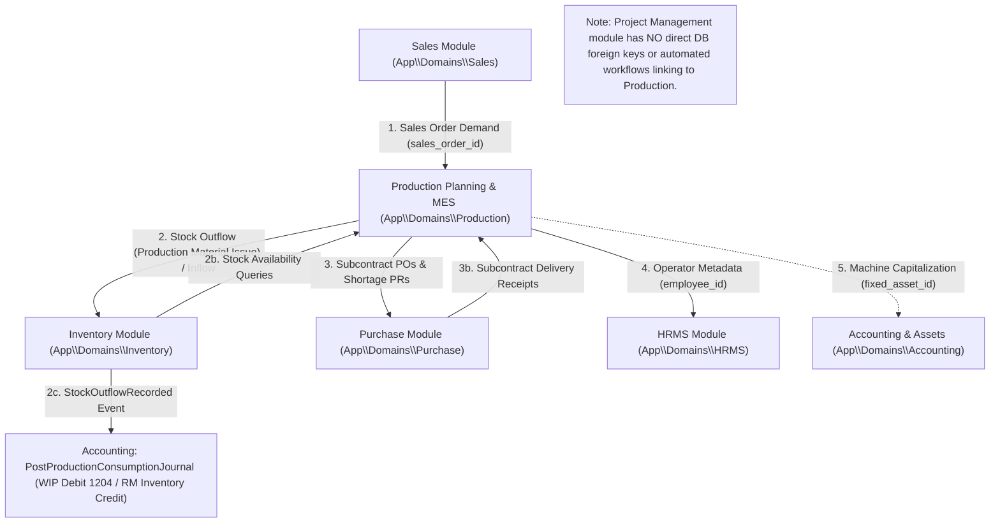

# Production Module — ERP Cross-Module Integrations

> **Module:** Production Planning & MES (`wm-product-saas`)  
> **Target Document:** `docs/user-manuals/production/INTEGRATIONS.md`  
> **Audience:** Technical Architects, Integration Developers, Systems Analysts  
> **Standards:** Implementation-Verified Inter-Module Touchpoints

---

## 1. ERP Integration Topology

The Production module acts as the core manufacturing engine within the multi-tenant ERP suite. It interfaces with five adjacent functional domains while maintaining strict architectural boundaries.



---

## 2. Integration with Inventory Domain (`App\Domains\Inventory`)

The Inventory domain is Production's primary operational partner. All physical warehouse inventory movements flow through `App\Domains\Inventory\Services\StockService`. Direct SQL manipulation of warehouse stock tables from Production is strictly prohibited.

### 2.1 Raw Material Reservation
* **Trigger:** Creation of a `ProductionOrder` or approval of a `ProductionPlan`.
* **Participating Entities:** `ProductionOrderReservation`, `ProductWarehouseStock`.
* **Mechanism:** Net component requirements are computed from the BOM. The system inserts `ProductionOrderReservation` records. This creates a soft reservation that decrements available-to-promise inventory while leaving physical `on_hand` unchanged until actual issuance.

### 2.2 Raw Material Issuance (Outflow & Accounting Event)
* **Trigger:** Storekeeper executes **Issue Material** on `/production/orders/{order}/issue` via `ProductionMaterialService::issueMaterial()`.
* **Service Invocation:**
  ```php
  $transaction = \App\Domains\Inventory\Services\StockService::recordOutflow(
      $res->tenant_id,
      $res->product_id,
      $warehouseId,
      $quantity,
      'Production Material Issue',
      $res->production_order_id
  );
  ```
* **Database & Accounting Impact:**
  * Inserts record into `stock_transactions` (`type = 'OUT'`, `reference_type = 'Production Material Issue'`, `reference_id = $order->id`, `total_value = quantity * unit_cost`).
  * Decrements physical `on_hand` count in `product_warehouse_stocks`.
  * Increments issued quantity in `production_order_issues` and updates reservation status.
  * Dispatches `App\Domains\Inventory\Events\StockOutflowRecorded($transaction)`.
  * **Automatic General Ledger Posting:** Listened to by `App\Domains\Accounting\Listeners\PostProductionConsumptionJournal`. Automatically posts a double-entry journal:
    * **Debit:** Work-in-Progress Account (`fallbackCode = '1204'`, Asset).
    * **Credit:** Raw Material Inventory Account (`AccountResolverService::resolveInventoryAccount($product)`).
    * **Journal Source:** `Journal::SOURCE_PRODUCTION` (`'production'`).
    * **Idempotency Key:** `reference_type = 'stock_transaction'`, `reference_id = $transaction->id`.

### 2.3 Operational Scrap Outflow
* **Trigger:** Operator logs operational scrap on `/production/mes/{op}/scrap`.
* **Mechanism:** If material was already issued from stores to the shopfloor, `StockService::recordOutflow()` writes down the damaged quantity to process scrap. Intermediate WIP scrap does not deduct warehouse finished goods stock because intermediate WIP has not yet been received into inventory.

### 2.4 Finished Goods Intake (Inflow)
* **Trigger:** Final operation completion or order completion (`receiveFinishedGoods()`).
* **Service Invocation:**
  ```php
  app(\App\Domains\Inventory\Services\StockService::class)->recordInflow(
      $tenantId,
      $order->product_id,
      $destinationWarehouseId,
      $quantityProduced,
      "Production Receipt #{$order->order_number}",
      $order->id
  );
  ```
* **Database Impact:**
  * Inserts record into `stock_transactions` (`type = 'inflow'`).
  * Increments `product_warehouse_stocks.on_hand` in the destination finished goods warehouse.
  * Creates `ProductionOrderReceipt` record.
* **Quarantine Handling:** If quality inspection indicates `quarantine`, the system automatically substitutes the commercial warehouse with the designated plant quarantine warehouse (`quarantine_warehouse_id`).

---

## 3. Integration with Purchase Domain (`App\Domains\Purchase`)

### 3.1 MRP Shortage to Purchase Requisition
* **Trigger:** Planner runs MRP on `/production/plans/{plan}/run-mrp` and selects **Generate PR**.
* **Participating Entities:** `production_plan_requirements`, `purchase_requisitions`, `purchase_requisition_items`.
* **Mechanism:** Net shortages calculate gross BOM requirement minus on-hand inventory. The system maps missing items into a new Purchase Requisition in `draft` state, notifying the purchasing department to initiate supplier RFQs.

### 3.2 Subcontract Procurement Automation
* **Trigger:** Production Order release containing a subcontract routing operation (`is_subcontract = true`).
* **Orchestrator:** `App\Domains\Production\Services\SubcontractProcurementOrchestrator`.
* **Policy Resolver:** `SubcontractProcurementPolicyResolver`.
* **Workflow Logic:**
  ```mermaid
  flowchart TD
      Rel["Release Order with Subcontract Operation"] --> Policy{"Evaluate Policy & Threshold"}
      Policy --> |Mode: auto_approved_po & Total <= Limit| AutoPO["Generate Approved PurchaseOrder"]
      Policy --> |Mode: auto_draft_po OR Total > Limit| DraftPO["Generate Draft PurchaseOrder (Review Required)"]
      Policy --> |Mode: manual_pr_po| PR["Generate PurchaseRequisition (Manual PO Flow)"]
  ```
* **Database Impact:**
  * Populates `purchase_orders` and `purchase_order_items`.
  * Populates `production_order_operations.purchase_order_id` and `purchase_order_item_id`.
  * Reconciles external vendor costs against planned routing expenses.

---

## 4. Integration with Sales Domain (`App\Domains\Sales`)

### 4.1 Make-to-Order Demand Links
* **Foreign Key:** `production_orders.sales_order_id` and `production_plans.sales_order_id`.
* **Business Purpose:** Directly links manufacturing work orders to the customer sales order that initiated the demand.
* **Data Flow:**
  * Customer order code is displayed on shopfloor travelers and dispatch boards.
  * When the production order completes, sales dispatchers can view ready-to-ship finished goods linked directly to their customer order ID.

### 4.2 Customer Traceability Traversal
* **Service:** `LotTraceabilityService`.
* **Mechanism:** In the event of an upstream supplier quality defect, the graph traversal engine follows:
  `Raw Supplier Lot` → `Production Issue` → `Production Batch` → `Production Order` → `Sales Order (sales_orders)` → `Customer (customers)`.
  Enables targeted customer notifications rather than broad, costly product recalls.

---

## 5. Integration with Accounting Domain (`App\Domains\Accounting`)

### 5.1 Fixed Asset Linking
* **Foreign Key:** `machines.fixed_asset_id` (references `fixed_assets.id`).
* **Business Purpose:** Capital equipment on the factory floor (presses, CNC machines, injection molders) is linked to capitalized balance sheet assets. This enables depreciation records in Accounting to correlate with machine operating hours and maintenance cost history in Production.

### 5.2 Manufacturing Costing & General Ledger Integration

* **Trace of Production Transactions to the General Ledger:**

| Transaction / Action | Domain Service | Event Dispatched | Downstream GL Impact | Automated Journal Details |
| :--- | :--- | :--- | :--- | :--- |
| **Raw Material Issue** (`/production/orders/{id}/issue`) | `ProductionMaterialService::issueMaterial` | `StockOutflowRecorded` (`reference_type = 'Production Material Issue'`) | **Automated GL Journal** | **Dr. WIP (1204)**<br>**Cr. Raw Material Inventory**<br>Source: `production`, idempotent by `stock_transaction_id` via `PostProductionConsumptionJournal`. |
| **Finished Goods Receipt** (`receiveFinishedGoods`) | `StockService::recordInflow` | None (`reference_type = 'Production Receipt'`) | Valuation & Stock Updated | Updates `product_warehouse_stocks` on-hand quantity & weighted average cost. **No automated GL journal entry** is triggered directly; FG capitalization is handled via periodic inventory valuation adjustments. |
| **Operational Scrap Logging** (`/mes/{op}/scrap`) | `StockService::recordOutflow` | `StockOutflowRecorded` (`reference_type = 'Production Scrap'`) | Stock Deducted Only | Process scrap deducts inventory. Skipped by `PostProductionConsumptionJournal` (only handles `Production Material Issue`) and `PostCogsJournal`. |
| **Maintenance Spare Parts Issue** (`issueSparePart` or Store Queue) | `StockService::recordOutflow` | `StockOutflowRecorded` (`reference_type = 'MaintenanceWorkOrder'`) | Stock Deducted & MWO Cost Updated | Updates `spare_parts_cost` and `total_cost` on `production_maintenance_work_orders`. Does not post a GL journal directly. |
| **Subcontract PO Execution** | `SubcontractProcurementOrchestrator` | Purchase Order Events | Handled via Purchase / AP | Purchase invoices against subcontract POs follow standard Accounts Payable voucher workflows. |

* **Cost Aggregation within Production:**
  * Direct material consumption cost, standard labor run cost, machine overhead rate, subcontract fees, and manual cost adjustments (`production_cost_adjustments`) are aggregated and stored on `production_orders`.
  * Failure handling: If WIP or Inventory chart-of-accounts are not configured, `PostProductionConsumptionJournal` logs a warning and stores the error in `PostingFailureRecorder` without crashing the shopfloor issuance transaction.

---

## 6. Integration with HRMS Domain (`App\Domains\HRMS`)

### 6.1 Operator Assignment & Skill Verification
* **Identifier:** `production_operator_assignments.operator_id` (maps to `App\Domains\HRMS\Models\Employee.id`).
* **Code Identifier:** `CodeService` formats operator barcodes as `OPR:{employee_id}` using `Employee.employee_id`.
* **Business Rule:** Before an operator is assigned to a high-precision work center, `OperatorSkillController` verifies that the employee possesses the required skill certifications in `production_operator_skills`.

---

## 7. Project Management Relationship (Verified Independent)

* **Comprehensive Audit Verification:** An exhaustive search of the entire database schema, migrations, models, services, controllers, events, and routes confirms that **no direct `project_id` foreign key exists** on any Production table (`production_orders`, `production_plans`, `routings`, `work_centers`, `machines`, `production_batches`, etc.).
* **Architectural & Operational Independence:**
  * Production operates as an independent manufacturing engine driven by **Sales Orders** (`sales_order_id` on `production_orders` and `production_plans`) for Make-to-Order jobs or **Inventory Replenishment / Forecast** via MRP for Make-to-Stock jobs.
  * There are no automated event listeners, listeners, background jobs, or API endpoints linking Project Management milestone tasks or project budgets to production orders.
  * If manufacturing activity relates to a customer project, it connects upstream through Sales Orders (`sales_orders`), where the Sales Order represents the commercial contract. Any project-to-production correlation is an external business-process handoff rather than an automated software integration.
