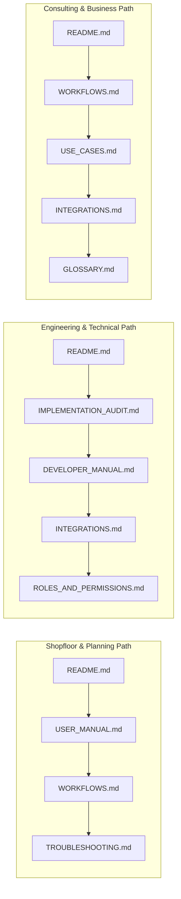

# Production Planning & Manufacturing Execution (MES) — Documentation Suite

> **Application:** Multi-Tenant SaaS ERP (`wm-product-saas`)  
> **Module:** Production Planning & Shopfloor MES (`app/Domains/Production`)  
> **Framework:** Laravel 12 / PHP 8.3 / MySQL / DDD Architecture  
> **Target Location:** `docs/user-manuals/production/`

---

## 1. Documentation Suite Overview

Welcome to the canonical documentation suite for the **Production Planning & Manufacturing Execution (MES)** module of `wm-product-saas`. 

This documentation package has been compiled through a comprehensive source code audit of the live implementation (74 Eloquent models, 79 domain services, 54 controllers, 13 policies, and 65 automated test suites). It serves three core audiences:
1. **End Users:** Plant managers, master schedulers, storekeepers, machine operators, quality inspectors, and maintenance technicians.
2. **Software Engineers:** Laravel developers, integration specialists, and SaaS architects maintaining and extending the platform.
3. **Business Stakeholders:** Manufacturing consultants, plant controllers, and ERP analysts mapping industrial processes to software automation.

---

## 2. Documentation Directory Map

Every document in this suite is purpose-built, implementation-verified, and cross-referenced:

| Document | File Name | Primary Audience | Key Contents |
|---|---|---|---|
| **1. Implementation Audit** | [`IMPLEMENTATION_AUDIT.md`](IMPLEMENTATION_AUDIT.md) | Architects, Leads | Complete feature-by-feature implementation matrix, evidence files, test references, and verified vs partial capabilities |
| **2. End-User Manual** | [`USER_MANUAL.md`](USER_MANUAL.md) | Planners, Operators, Leads | Step-by-step user instructions with real UI navigation paths, fields, validations, status changes, and mistake resolutions |
| **3. Developer Manual** | [`DEVELOPER_MANUAL.md`](DEVELOPER_MANUAL.md) | Laravel Developers | 4-layer architecture, 74 models, 79 services, database constraints, business algorithms (MRP, scheduling, WIP), and REST APIs |
| **4. Manufacturing Workflows** | [`WORKFLOWS.md`](WORKFLOWS.md) | Consultants, Engineers | 7 end-to-end Mermaid process lifecycles (Demand-to-Order, Execution, WIP, Quality/Rework, Traceability, Maintenance, Accounting) |
| **5. Business Use Cases** | [`USE_CASES.md`](USE_CASES.md) | BAs, QA Engineers | 11 detailed operating scenarios with preconditions, sample data, step flows, alternate paths, acceptance criteria, and test links |
| **6. Roles & Permissions** | [`ROLES_AND_PERMISSIONS.md`](ROLES_AND_PERMISSIONS.md) | Security, Admins | RBAC security architecture, 13 domain policies, permission keys reference, controller gates, and role mapping matrix |
| **7. Cross-Module Integrations** | [`INTEGRATIONS.md`](INTEGRATIONS.md) | Integration Engineers | Touchpoints with Inventory (`StockService`), Purchase (subcontract POs), Sales (demand), Accounting (assets/costing), and HRMS |
| **8. Troubleshooting Guide** | [`TROUBLESHOOTING.md`](TROUBLESHOOTING.md) | SysAdmins, Support | Diagnostic playbooks, machine lockout resolutions, stock shortages, WIP orphans, scanner errors, and safe read-only SQL |
| **9. Frequently Asked Questions** | [`FAQ.md`](FAQ.md) | All Personas | Answers to 11 practical questions regarding BOM revisions, scrap math, accounting GL boundaries, and machine decommissioning |
| **10. Industry Glossary** | [`GLOSSARY.md`](GLOSSARY.md) | New Users, BAs | A-to-Z dictionary of manufacturing terminology (BOM, Routing, OEE, MRP, Andon, WIP, NCR, CAPA, Remnants, Gate Pass) |
| **11. Documentation QA Report** | [`DOCUMENTATION_QA_REPORT.md`](DOCUMENTATION_QA_REPORT.md) | QA Leads, Release Managers | Comprehensive verification report validating doc accuracy against live code, schemas, routes, and test outcomes |

---

## 3. Persona-Based Reading Paths

Depending on your role in the organization, follow these recommended reading sequences:

---

## 4. Key Architectural Standards & Golden Rules

When developing or configuring the Production module:
1. **Repository Pattern Is Mandatory:** Controllers never perform direct model queries or calls to `Model::create()`. All persistence delegates to aggregate repositories in `app/Domains/Production/Repositories/`.
2. **Transaction Boundaries Belong in Services:** Multi-step business operations encapsulate database transactions via `DB::transaction(...)` in domain services.
3. **Strict Base Currency Normalization:** All internal math, database columns, and service parameters operate strictly in **Base Currency**. Conversions occur symmetrically at the boundary:
   * View rendering: `format_currency($amount)` or `active_currency_symbol()`.
   * Form preloading: `convert_from_base($amount)`.
   * Controller input: `convert_to_base((float) $input)`.
4. **Tenant Isolation:** Enforced automatically via `BaseModel` and `require_tenant_id()`. No cross-tenant data leaks can occur.
5. **Clean Accounting Event Integration:** Production delegates physical stock transactions to `StockService`. Material issues dispatch `StockOutflowRecorded`, which `PostProductionConsumptionJournal` in the Accounting domain listens to for automated Work-in-Progress (WIP) general ledger postings. Finished goods capitalization is managed via periodic inventory valuation in Accounting.
