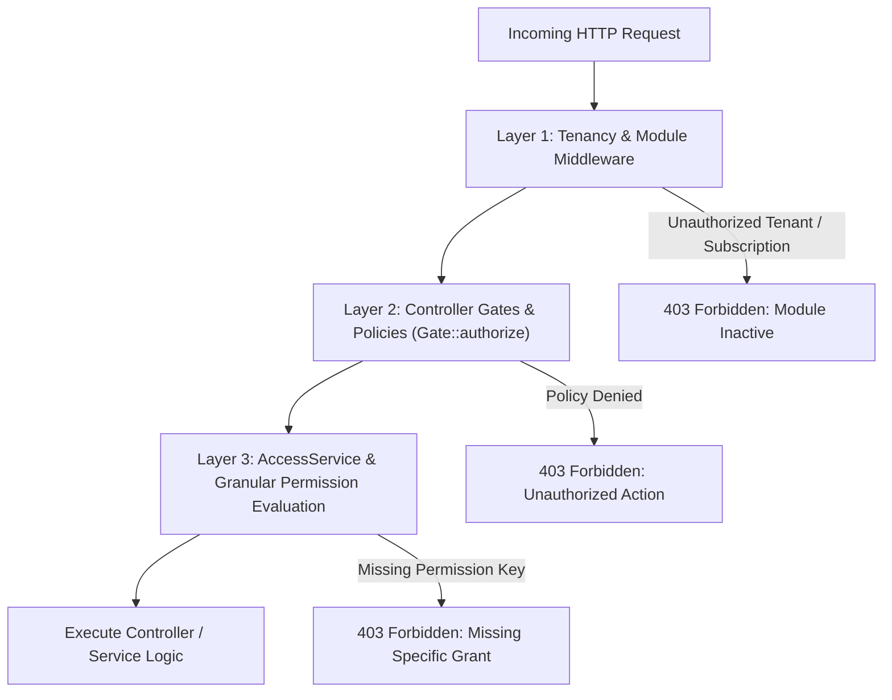

# Production Module — Roles, Permissions & Security Architecture

> **Module:** Production Planning & MES (`wm-product-saas`)  
> **Target Document:** `docs/user-manuals/production/ROLES_AND_PERMISSIONS.md`  
> **Audience:** Security Engineers, System Administrators, Compliance Officers, Technical Leads  
> **Standards:** Implementation-Verified RBAC & Multi-Tenant Authorization

---

## 1. Authorization Architecture Overview

Authorization in the Production module is enforced across three sequential security layers:

### 1.1 The 3 Security Layers

1. **Layer 1: Module & Tenant Middleware**
   * `ResolveTenant`: Resolves tenant context from domain/subdomain/header and applies tenant database scoping.
   * `EnsureTenantModuleAccess`: Inspects `tenants.modules` to confirm the tenant has an active subscription to the `production` module.
2. **Layer 2: Controller Gates & Domain Policies**
   * Before executing business logic, controllers execute `Gate::authorize('action', $model)`.
   * Evaluated by 13 dedicated Policy classes in `app/Domains/Production/Policies/`.
3. **Layer 3: Granular Permission Bridge (`AccessService`)**
   * Models and policies invoke `$user->hasProductionPermission('permission.key', $tenantId)`.
   * Enforced via `App\Models\Concerns\HasProductionPermissions` delegating to `App\Services\Access\AccessService`.
   * Evaluates role grants, user-specific overrides, and tenant boundary constraints.

---

## 2. Production Domain Policies Catalog (13 Policies)

All Production policies reside in `app/Domains/Production/Policies/` and are registered in `AppServiceProvider`:

| Policy Class | Enforced Entity | Policy Methods | Core Authorization Logic |
|---|---|---|---|
| `ProductionOrderPolicy` | `ProductionOrder` | `viewAny`, `view`, `create`, `update`, `delete`, `release`, `issue`, `return`, `logProgress`, `receive` | `viewAny`: true; `view`: tenant match; `create`: `production.order.create` or `admin`; `update`/`release`: order not frozen + `production.order.update` |
| `ProductionBomPolicy` | `ProductionBom` | `viewAny`, `view`, `create`, `update`, `delete`, `submit`, `approve`, `reject` | `approve`: `production.bom.approve` or `admin`; `create`/`update`: `production.bom.create`/`manage`; enforces revision locking |
| `RoutingPolicy` | `Routing` | `viewAny`, `view`, `create`, `update`, `delete`, `approve` | `approve`: `production.routing.approve`; `create`/`update`: `production.routing.manage`; prevents editing locked routings |
| `ProductionSchedulePolicy` | `ProductionSchedule`| `viewAny`, `view`, `create`, `delete`, `release`, `cancel` | `release`: `production.schedules.release`; `create`: `production.schedules.manage` |
| `WorkCenterPolicy` | `WorkCenter` | `viewAny`, `view`, `create`, `update`, `delete` | `create`/`update`/`delete`: `production.work_center.manage` or `admin` |
| `MachinePolicy` | `Machine` | `viewAny`, `view`, `create`, `update`, `delete` | `create`/`update`: `production.work_center.manage` or `admin` |
| `ProductionPlanPolicy` | `ProductionPlan` | `viewAny`, `view`, `create`, `update`, `release`, `mrp` | `release`/`mrp`: `production.plans.manage` or `admin`; validates approval before release |
| `QualityPlanPolicy` | `ProductionQualityPlan` | `viewAny`, `create`, `update`, `delete` | `create`/`update`: `production.quality.inspect` or `admin` |
| `QualityInspectionPolicy` | `ProductionQualityInspection` | `viewAny`, `create`, `approve` | `create`: inspector role; `approve`: quality lead or `admin` |
| `ProductionEcoPolicy` | `ProductionEco` | `viewAny`, `create`, `approve`, `release` | `approve`/`release`: engineering manager or `admin` |
| `DeliveryChallanPolicy` | `DeliveryChallan` | `viewAny`, `create`, `dispatch`, `receive` | `create`/`dispatch`: `production.subcontract.manage` or `admin` |
| `ShiftPolicy` | `ProductionShift` | `viewAny`, `create`, `update`, `delete` | `create`/`update`: `production.work_center.manage` or `admin` |
| `CalendarPolicy` | `ProductionCalendar` | `viewAny`, `create`, `update`, `delete` | `create`/`update`: `production.work_center.manage` or `admin` |

---

## 3. Production Permission Keys Reference

The following table documents all granular permission strings recognized by `hasProductionPermission()` and `AccessService`:

| Permission String | Description | Permitted Actions |
|---|---|---|
| `production.dashboard.view` | View plant dashboards | Read executive OEE, Andon boards, and plant overview metrics |
| `production.work_center.manage` | Master data administration | Create and edit Work Centers, Machines, Shifts, and Calendars |
| `production.boms.manage` | BOM Engineering | Create, edit, submit, and duplicate Bills of Materials |
| `production.boms.approve` | BOM Authorization | Formally approve or reject submitted BOM revisions |
| `production.routing.manage` | Routing Engineering | Configure operations, runtimes, work center links, and subcontract setups |
| `production.routing.approve` | Routing Authorization | Formally approve or reject routing revisions |
| `production.plans.manage` | Master Planning | Create aggregate plans, run MRP engine, and generate child orders |
| `production.orders.view` | Order Inquiries | Browse order directories, view picking slips, and inspect variance logs |
| `production.orders.create` | Order Creation | Create new discrete production work orders |
| `production.orders.update` | Order Lifecycle Management | Release orders, process material picking, and issue goods |
| `production.orders.receive` | Finished Goods Intake | Execute commercial receipts of manufactured goods into warehouse inventory |
| `production.schedules.manage` | Scheduling & Dispatch | Generate schedules, adjust Gantt bars, level capacity, and lock operations |
| `production.schedules.release` | Schedule Shopfloor Release | Formally push optimized schedule to shopfloor MES terminals |
| `production.mes.execute` | Shopfloor Operation Execution | Start, pause, resume, and complete operations; report Andon; log scrap |
| `production.quality.inspect` | Quality Inspection | Record parameter measurements, approve inspections, and generate NCRs |
| `production.wip.manage` | WIP Inventory Management | Transfer WIP between work centers, perform manual adjustments, convert to FG |
| `production.subcontract.manage` | Subcontract Administration | Create Delivery Challans (Gate Passes), dispatch to vendors, receive returns |
| `production.maintenance.manage` | Equipment Maintenance | Manage PM schedules, report breakdowns, assign mechanics, and issue spares |
| `production.cost_adjustment.manage`| Cost Administration | Post manual cost adjustments and variance write-offs on orders |
| `production.settings.manage` | Module Configuration | Configure subcontract procurement workflows and auto-approval limits |

---

## 4. Standard ERP Role-to-Permission Matrix

In `wm-product-saas`, users are assigned roles that bundle specific permission sets:

| Role Name | Description | Default Production Permissions Granted |
|---|---|---|
| **System Admin (`admin`)** | Full technical and administrative control | Full access across all permissions (bypasses individual checks) |
| **Plant Manager** | Complete operational authority over manufacturing | All `production.*` permissions except developer APIs |
| **Production Planner** | Master scheduling and inventory planning | `plans.manage`, `orders.create`, `orders.update`, `boms.manage`, `schedules.manage`, `schedules.release` |
| **Process / Manufacturing Engineer** | Product structure and routing definitions | `boms.manage`, `boms.approve`, `routing.manage`, `routing.approve`, `work_center.manage` |
| **Shopfloor Supervisor / Lead** | Daily shift supervision and dispatching | `orders.view`, `mes.execute`, `wip.manage`, `subcontract.manage`, `dashboard.view` |
| **Machine Operator** | Workstation execution | `mes.execute`, `orders.view` (scoped to assigned operations) |
| **Quality Inspector (QC)** | Quality assurance and compliance | `quality.inspect`, `orders.view`, `dashboard.view` |
| **Warehouse Storekeeper** | Material picking and store fulfillment | `orders.update` (issue/return), `maintenance.manage` (issue spares), `orders.receive` |
| **Maintenance Engineer** | Machinery uptime and PM execution | `maintenance.manage`, `work_center.manage` (machine states), `dashboard.view` |
| **Plant Financial Controller** | Cost accounting and variance auditing | `orders.view`, `dashboard.view`, `cost_adjustment.manage` |

---

## 5. UI Visibility vs. Backend Enforcement Security Check

* **UI Directive Checks:** Blade templates conditionally display action buttons using `@can(...)` or `@if(auth()->user()->hasProductionPermission(...))` directives. For example, the **Approve BOM** button is only rendered if the user has `production.boms.approve`.
* **Backend Invariant:** Hiding an element in the browser does not constitute security. If an operator bypasses the UI and dispatches a direct HTTP POST request to `/production/boms/{id}/approve`, the controller executes `Gate::authorize('approve', $bom)`, resulting in an immediate `403 Forbidden` response.
* **Tenant Boundary Protection:** Even if a user possesses the `admin` role in Tenant A, attempting to view or modify an order in Tenant B triggers a 403 or 404 response because all database queries are scoped by `require_tenant_id()`.
