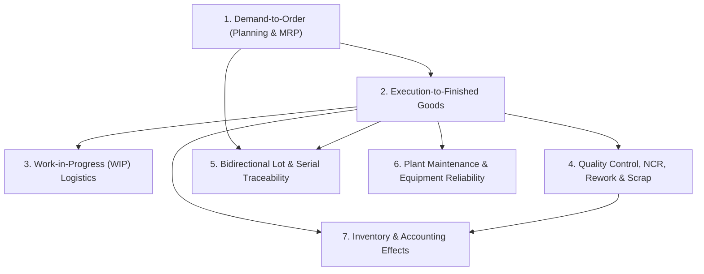
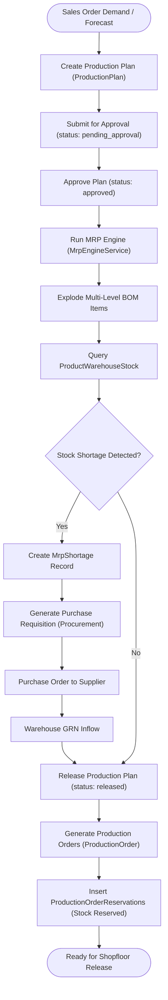
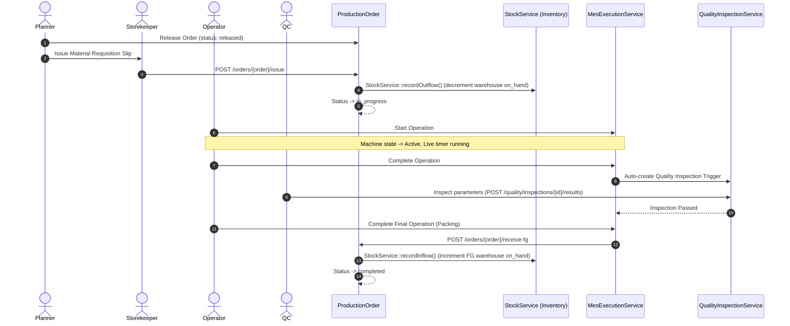
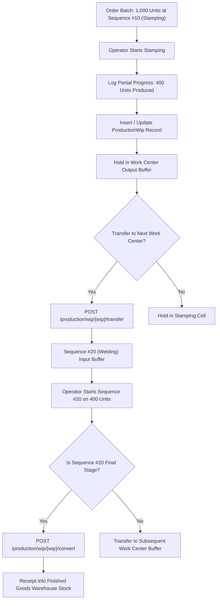
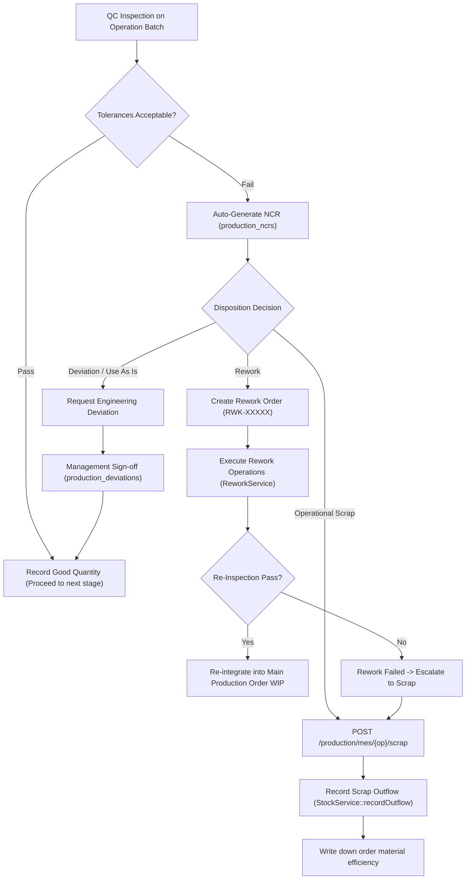
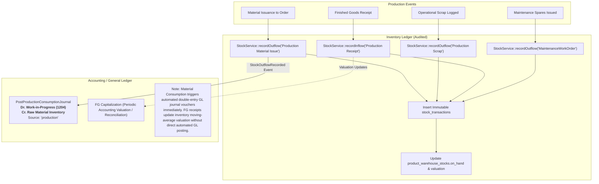

# Manufacturing Workflows & Process Lifecycles

> **Module:** Production Planning & MES (`wm-product-saas`)  
> **Target Document:** `docs/user-manuals/production/WORKFLOWS.md`  
> **Audience:** Manufacturing Consultants, ERP Business Analysts, Developers, Process Engineers  
> **Architecture Pattern:** Verified Implementation Lifecycles

---

## 1. Overview of Core Manufacturing Workflows

This document models the complete set of verified, end-to-end manufacturing process lifecycles in the `wm-product-saas` Production module. Each workflow illustrates the real interplay between user actions, domain services, database transactions, and cross-module integrations.



---

## 2. Workflow 1: Demand to Production Order (Planning & MRP)

### 2.1 Process Flow Diagram



### 2.2 Workflow Breakdown
* **Initiating Action:** A customer Sales Order is confirmed in the Sales module, or a planner creates an aggregate replenishment forecast in `/production/plans`.
* **System Components:** `ProductionPlanController`, `ProductionPlanService`, `MrpEngineService`, `MrpShortageService`, `StockService`.
* **Decision Points:**
  * If on-hand stock is sufficient: The plan transitions directly to `released`.
  * If shortages exist: Requirements are logged in `production_plan_requirements`. The planner generates external Purchase Requisitions through `/production/mrp/shortages`.
* **Status Transitions:**
  * `ProductionPlan`: `draft` → `pending_approval` → `approved` → `released` → `in_progress` → `completed`.
* **Data Created/Updated:** `production_plans`, `production_plan_requirements`, `production_orders`, `production_order_reservations`.
* **Final Outcome:** Manufacturing orders are created and scheduled, with raw materials safely reserved against competing orders.

---

## 3. Workflow 2: Order Release to Finished Goods Receipt

### 3.1 Process Flow Diagram



### 3.2 Workflow Breakdown
* **Initiating Action:** Planner clicks **Release Order** on `/production/orders/{order}`.
* **Material Issuance:** Storekeeper uses **Issue Material**. Physical inventory is decremented via `StockService::recordOutflow()`, and status updates to `in_progress`.
* **MES Shopfloor Execution:** Operators interact with `/production/mes`. Timers record machine and labor runtime.
* **Finished Goods Intake:** Upon the final operation, `ProductionExecutionService::receiveFinishedGoods()` writes an inflow `StockTransaction` to the designated finished goods warehouse.
* **Quarantine Handling:** If quality inspection indicates `quarantine`, the inflow automatically posts to a quarantine storage location rather than commercial stock.

---

## 4. Workflow 3: Partial Operation Completion & Work-In-Progress (WIP)

### 4.1 Process Flow Diagram



### 4.2 Workflow Breakdown
* **Initiating Action:** Operator logs partial output on a large order batch before the total run is complete.
* **System Components:** `MesController`, `MesExecutionService`, `WipController`, `ProductionWipService`.
* **Data Flow:**
  * Partial completions create `production_order_progress_logs` and update `production_wips`.
  * `ProductionWipTransaction` tracks movement history between plant work centers.
* **Business Benefit:** Eliminates "black hole" manufacturing by providing visibility into where semi-finished parts reside across physical departments.

---

## 5. Workflow 4: Quality Rejection, Non-Conformance, Rework & Scrap

### 5.1 Process Flow Diagram



### 5.2 Workflow Breakdown
* **Initiating Action:** An inspection check records dimensional deviation or cosmetic defects.
* **System Components:** `QualityInspectionService`, `NcrService`, `ReworkService`, `ScrapService`, `StockService`.
* **Decision Paths:**
  * **Rework:** Spawns a dedicated `ProductionReworkOrder` with specialized repair operations. If rework fails, `ReworkService::failRework()` converts the damaged parts to operational scrap.
  * **Scrap:** Writes off the scrapped material and decrements shopfloor inventory via `StockService::recordOutflow()`.
  * **Deviation:** Formal deviation document allows controlled acceptance without alteration.

---

## 6. Workflow 5: Bidirectional Lot, Batch & Serial Traceability

### 6.1 Process Flow Diagram

```mermaid
flowchart LR
    subgraph Upstream_Suppliers["1. Raw Material Inflow"]
        SUP["Supplier Lot #SUP-9921"] --> RM["Raw Material Inward GRN"]
    end

    subgraph Production_Execution["2. Manufacturing Run"]
        RM --> ISSUE["Issued to Order #PO-2026-0042"]
        ISSUE --> BATCH["Run in Batch #BATCH-20261009-001"]
        BATCH --> TRACE["production_lot_traces Linking Table"]
    end

    subgraph Finished_Goods["3. Finished Products"]
        TRACE --> FG_BATCH["Finished Goods Lot #FG-LOT-881"]
        FG_BATCH --> SERIAL["Assigned Serial #SN-900214"]
    end

    subgraph Downstream_Sales["4. Customer Fulfillment"]
        SERIAL --> DISP["Delivery Note / Dispatch"]
        DISP --> SO["Sales Order #SO-50012"]
        SO --> CUST["Customer: Global Logistics Inc."]
    end
```



### 6.2 Workflow Breakdown
* **Initiating Action:** Quality investigation or regulatory audit initiated on `/production/mes/traceability`.
* **Trace Directions:**
  * **Forward Recall Trace:** Given defective raw supplier lot `SUP-9921`, the engine navigates forward to identify all batches, serial numbers, and customer sales orders that received the contaminated material.
  * **Backward Root-Cause Trace:** Given customer warranty return `SN-900214`, the engine traverses backward to display the exact machine, operator shift, and raw material supplier lots consumed.

---

## 7. Workflow 6: Plant Maintenance & Equipment Reliability

### 7.1 Process Flow Diagram

```mermaid
flowchart TD
    Trigger{"Maintenance Trigger"} --> |Schedule Due| PM["PM Schedule Next Due Date"]
    Trigger --> |Machine Crashes| BD["Report Emergency Breakdown (POST /breakdown)"]
    
    PM --> GenWO["Generate PM Work Order"]
    BD --> GenDraftWO["Generate Draft Breakdown Work Order"]
    
    GenDraftWO --> StartWO["Technician Clicks Start Work Order"]
    GenWO --> StartWO
    
    StartWO --> LockMachine["Machine Status -> under_maintenance"]
    LockMachine --> BlockMES["MES Shopfloor Terminal Blocks Machine Operations"]
    
    StartWO --> AssignMech["Assign Mechanics with Hourly Wage Rates"]
    StartWO --> AddSpares["Request Maintenance Spare Parts"]
    
    AddSpares --> SlipGen["Auto-create/Append Store Requisition Slip (source_type: maintenance_work_order)"]
    SlipGen --> FulfillPath{"Fulfillment Method"}
    
    FulfillPath --> |Store Queue (/inventory/material-requests)| StoreIssue["Storekeeper: Reserve & Issue via MaterialRequestService"]
    FulfillPath --> |Direct Maintenance Issue| DirectIssue["Maintenance Lead: Issue via MaintenanceSpareService"]
    
    StoreIssue --> StockOut["StockService::recordOutflow(ref: MaintenanceWorkOrder)"]
    DirectIssue --> StockOut
    
    StockOut --> UpdateCosts["Update Spare Costs & Recalculate MWO total_cost"]
    UpdateCosts --> CompleteWO["Complete Work Order"]
    AssignMech --> CompleteWO
    
    CompleteWO --> ScrapOrRestore{"Machine Economically Viable?"}
    ScrapOrRestore -- Restore Active --> Restore["Machine Status -> Active, Downtime Closed"]
    Restore --> UnblockMES["MES Operations Re-Enabled on Machine"]
    
    ScrapOrRestore -- Scrap Machine --> Decom["Machine Status -> Decommissioned"]
    Decom --> PermanentLock["Machine Removed from Available Production Capacity"]
```

### 7.2 Workflow Breakdown
* **Initiating Action:** Calendar schedule trigger or operator reporting an unexpected breakdown.
* **Safety Lockout:** When a machine transitions to `under_maintenance` or `breakdown`, `MesController` actively blocks operators from launching production operations on that machine.
* **Spare Parts Requisition & Dual Fulfillment:**
  * Requesting spare parts on an MWO automatically creates/attaches to a `ProductionRequisitionSlip` with `source_type = 'maintenance_work_order'`. Warehouse assignment is deferred to storekeepers.
  * Storekeepers fulfill through the central Store queue (`/inventory/material-requests`), or authorized maintenance engineers fulfill directly via the MWO interface.
  * In both paths, stock outflow is recorded under reference `MaintenanceWorkOrder`, preventing negative stock and syncing `spare_parts_cost` and `total_cost` on the work order.

---

## 8. Workflow 7: Inventory & Accounting Integration Effects

### 8.1 Process Flow Diagram



### 8.2 Summary of Accounting & Financial Boundaries
1. **Automated WIP Accounting Voucher:** When raw materials are issued to a production order, `PostProductionConsumptionJournal` captures `StockOutflowRecorded` and immediately books a General Ledger double-entry voucher: **Debiting Work-in-Progress (Account 1204 / Asset)** and **Crediting Raw Material Inventory**.
2. **Finished Goods Valuation:** Receiving finished goods updates warehouse quantities and weighted-average unit costs in `product_warehouse_stocks`. Capitalization of finished goods and clearing of WIP is performed via periodic accounting inventory valuation adjustments.
3. **Scrap & Maintenance Spares:** Write down physical stock and update operational job costs in base currency; downstream write-off journals are booked through periodic accounting ledger reconciliations.
