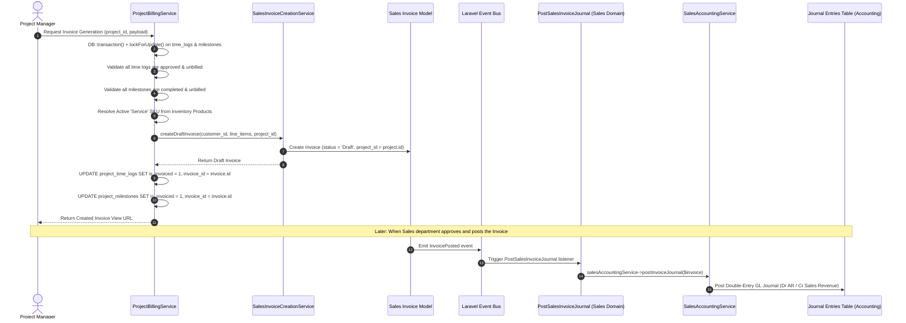

# Project Management Module — Developer & Technical Architecture Manual

## 1. Domain Architecture Overview

The Project Management module resides under `app/Domains/Projects/` and is structured according to Domain-Driven Design (DDD) principles. It is isolated from generic controllers and adheres to strict domain boundaries, interfacing with canonical ERP models (`User`, `Customer`, `Invoice`, and `Product`).

### Layered Architecture
```
app/Domains/Projects/
├── Models/              ← 13 Eloquent Domain Models (extend App\Core\Database\BaseModel)
├── Repositories/        ← 13 Repository Interfaces & 13 Eloquent Implementations (Flat structure)
├── Services/            ← 19 Domain Services managing state, CPM math, transactions, and gates
├── Controllers/         ← 19 Web/API Controllers handling HTTP requests
├── Requests/            ← 29 Form Request validation classes
├── Policies/            ← 10 Authorization Policies bound in AppServiceProvider
├── Events/              ← 12 Strongly-typed Domain Event classes
├── Listeners/           ← ProjectNotificationListener
├── Jobs/                ← SendProjectNotificationEmailJob (asynchronous email queue worker)
├── DTO/                 ← Data Transfer Objects (DashboardKpiDTO, ReportFilterDTO)
├── Exports/             ← ProjectReportExport, ProjectsExport (CSV/XLSX export pipelines)
└── Routes/
    └── web.php          ← Web routing definitions (224 lines)
```

---

## 2. Domain Models & Relational Schema

All 13 domain models extend `App\Core\Database\BaseModel`, automatically inheriting multi-tenant global scopes via traits (`BelongsToTenant`, `BelongsToCompany`, `BelongsToBranch`).

Every model defines an explicit table name with the `project_` prefix (except `projects`):

| Model Class | Database Table | Primary Foreign Keys | Key Attributes & Business Scopes |
| :--- | :--- | :--- | :--- |
| `Project` | `projects` | `tenant_id`, `company_id`, `branch_id`, `customer_id`, `manager_id`, `owner_id`, `closed_by` | `code`, `name`, `type`, `billing_type`, `budget_amount`, `status`, `closure_status`, `closed_at`. |
| `ProjectMember` | `project_members` | `tenant_id`, `project_id`, `user_id` | `project_role`, `rate_per_hour`, `cost_per_hour`, `budget_hours`, `is_active`. |
| `TaskList` | `project_task_lists` | `tenant_id`, `company_id`, `branch_id`, `project_id`, `milestone_id`, `owner_id` | `name`, `description`, `position`. |
| `Task` | `project_tasks` | `tenant_id`, `company_id`, `branch_id`, `project_id`, `task_list_id`, `milestone_id`, `assigned_to` | `title`, `description`, `priority`, `status`, `estimated_hours`, `actual_hours`, `start_date`, `due_date`, `total_float`, `is_critical`. |
| `SubTask` | `project_sub_tasks` | `tenant_id`, `company_id`, `branch_id`, `task_id`, `assigned_to` | `title`, `is_completed`, `completed_at`, `position`. |
| `TaskDependency` | `project_task_dependencies` | `tenant_id`, `company_id`, `branch_id`, `project_id`, `task_id`, `depends_on_task_id` | `dependency_type` (`Finish-to-Start`, `Start-to-Start`, `Finish-to-Finish`, `Start-to-Finish`), `lag_days`. |
| `Milestone` | `project_milestones` | `tenant_id`, `company_id`, `branch_id`, `project_id`, `invoice_id` | `name`, `due_date`, `completion_date`, `completion_percentage`, `billing_amount`, `is_completed`, `is_invoiced`, `status`. |
| `TimeLog` | `project_time_logs` | `tenant_id`, `company_id`, `branch_id`, `project_id`, `task_id`, `user_id`, `approved_by`, `invoice_id` | `log_date`, `hours`, `is_billable`, `hourly_rate`, `approval_status` (`Pending`, `Approved`, `Rejected`), `approved_at`, `is_invoiced`. |
| `Issue` | `project_issues` | `tenant_id`, `company_id`, `branch_id`, `project_id`, `task_id`, `assigned_to`, `reported_by` | `title`, `severity` (`Minor`, `Major`, `Critical`), `priority`, `status` (`Open`, `Assigned`, `In Progress`, `Resolved`, `Closed`), `resolved_at`. |
| `ProjectDocument` | `project_documents` | `tenant_id`, `company_id`, `branch_id`, `project_id`, `uploaded_by`, `attachable` (morph) | `title`, `file_name`, `file_path`, `file_size`, `mime_type`, `category`. |
| `ProjectReview` | `project_reviews` | `tenant_id`, `company_id`, `branch_id`, `project_id`, `reviewer_id` | `title`, `review_type`, `status` (`Pending`, `Approved`, `Rework Required`), `sign_off_date`. |
| `ChangeRequest` | `project_change_requests` | `tenant_id`, `company_id`, `branch_id`, `project_id`, `requested_by`, `approved_by` | `title`, `schedule_impact_days`, `cost_impact_amount`, `status` (`Pending`, `Approved`, `Rejected`, `Implemented`). |
| `ActivityLog` | `project_activity_logs` | `tenant_id`, `company_id`, `branch_id`, `project_id`, `user_id` | `action`, `title`, `description`, `metadata` (JSON), `entity` (morph). |

---

## 3. Repositories & Service Bindings

All 13 domain repository contracts and Eloquent implementations reside directly under `app/Domains/Projects/Repositories/` and are bound as singletons in `app/Providers/AppServiceProvider.php`:

```php
// Binding pattern in AppServiceProvider::register()
$this->app->bind(
    \App\Domains\Projects\Repositories\ProjectRepositoryInterface::class,
    \App\Domains\Projects\Repositories\ProjectRepository::class
);
$this->app->bind(
    \App\Domains\Projects\Repositories\TaskRepositoryInterface::class,
    \App\Domains\Projects\Repositories\TaskRepository::class
);
// All 13 repository interfaces bound to Eloquent implementations in AppServiceProvider
```

### Domain Services Reference
1. `ProjectService`: Lifecycle state machine (`planning` → `active` → `on_hold` → `closed` / `cancelled`).
2. `ProjectMemberService`: Roster management, rate card lookup (`rate_per_hour`, `cost_per_hour`).
3. `TaskListService`: WBS category creation and sort position sequencing.
4. `TaskService`: Task status transitions, progress rollups, and assignee dispatches.
5. `SubTaskService`: Checklist lifecycle; triggers parent task completion percentage recalculations.
6. `TaskDependencyService`: Dependency CRUD; executes Depth-First Search cycle detection.
7. `ProjectScheduleService`: Critical Path Method (CPM) calculation engine.
8. `MilestoneService`: Milestone achievement tracking and billing readiness.
9. `TimeLogService`: Time tracking, rate lookup from `project_members`, billability, and approval transitions.
10. `IssueService`: Defect lifecycle transitions and assignment notifications.
11. `ProjectDocumentService`: Secure file upload (`local` disk), download streaming, and access audits.
12. `ProjectReviewService`: Quality reviews and UAT milestone sign-offs.
13. `ChangeRequestService`: Scope change evaluation, schedule adjustments, and budget revisions.
14. `ProjectBillingService`: Unbilled item aggregation and bridge to `SalesInvoiceCreationService::createDraftInvoice()`.
15. `ProjectClosureService`: Evaluates 5 formal condition gates and finalizes project closure.
16. `ProjectNotificationService`: Dispatches in-app alerts and asynchronous email notification jobs.
17. `ProjectDashboardService`: Computes real-time KPI metrics (`DashboardKpiDTO`) and portfolio health scoring.
18. `ProjectReportService`: Generates database-level paginated queries and collections for 7 reports.
19. `ActivityLogService`: Records fine-grained change audits and event history.

---

## 4. Key Algorithmic Implementations

### Critical Path Method (CPM) Engine (`ProjectScheduleService`)
The scheduling engine implements a 2-pass topological sorting algorithm on the Directed Acyclic Graph (DAG) formed by tasks and their dependencies:

1. **Forward Pass (Early Dates)**:
   - Root tasks: $ES = \text{Project Start Date}$.
   - $EF = ES + \text{Duration} - 1$.
   - Successor tasks: $ES_j = \max(EF_i + \text{Lag}_{ij} + 1)$, $EF_j = ES_j + \text{Duration}_j - 1$.
2. **Backward Pass (Late Dates)**:
   - Project completion date $T_{\text{end}} = \max(EF_{\text{all}})$.
   - Leaf tasks: $LF = T_{\text{end}}$, $LS = LF - \text{Duration} + 1$.
   - Predecessor tasks: $LF_i = \min(LS_j - \text{Lag}_{ij} - 1)$, $LS_i = LF_i - \text{Duration}_i + 1$.
3. **Float & Critical Path Identification**:
   - Total Float: $\text{Total Float} = LS - ES = LF - EF$.
   - **Critical Path Flag**: If $\text{Total Float} \le 0$, `is_critical = true`.

### Cycle Detection Algorithm (`TaskDependencyService`)
Before persisting any dependency relationship to `project_task_dependencies`, the service verifies that adding `task_id -> depends_on_task_id` does not create a closed loop:
```php
public function wouldCreateCycle(int $taskId, int $dependsOnTaskId): bool
{
    if ($taskId === $dependsOnTaskId) {
        return true;
    }
    return $this->isReachable($taskId, $dependsOnTaskId);
}
```
If reachable, the service aborts and throws a `ValidationException` preventing circular graph generation.

---

## 5. Sales Billing Bridge Architecture

Project Management **never** generates invoices directly or writes to General Ledger tables. It acts as an upstream operational feeder to the **Sales** domain:



---

## 6. Controlled Closure: 5 Condition Gates (`ProjectClosureService`)

Project closure is strictly evaluated by `ProjectClosureService::evaluateGates(Project $project)` and enforced by `assertClosable()`:

```php
// Gate 1: Tasks & Subtasks
$openTasksCount = Task::where('project_id', $project->id)
    ->whereNotIn('status', [Task::STATUS_COMPLETED, Task::STATUS_CANCELLED])->count();
$incompleteSubtasksCount = SubTask::whereHas('task', fn ($q) => $q->where('project_id', $project->id))
    ->where('is_completed', false)->count();

// Gate 2: Issues
$unresolvedIssuesCount = Issue::where('project_id', $project->id)
    ->whereNotIn('status', [Issue::STATUS_RESOLVED, Issue::STATUS_CLOSED])->count();

// Gate 3: Reviews & Governance (UAT Sign-off & Change Requests)
$hasMilestones = Milestone::where('project_id', $project->id)->exists();
$hasApprovedReview = ProjectReview::where('project_id', $project->id)->where('status', 'Approved')->exists();
$pendingReviewsCount = ProjectReview::where('project_id', $project->id)->where('status', 'Pending')->count();
$pendingCrsCount = ChangeRequest::where('project_id', $project->id)->where('status', 'Pending')->count();

// Gate 4: Billing Settlement (Hard Blocker)
$unbilledTimeLogsCount = TimeLog::where('project_id', $project->id)->where('is_billable', true)
    ->where('approval_status', 'Approved')->where('is_invoiced', false)->count();
$pendingTimeLogsCount = TimeLog::where('project_id', $project->id)->where('approval_status', 'Pending')->count();
$unbilledMilestonesCount = Milestone::where('project_id', $project->id)->where('billing_amount', '>', 0)
    ->where('status', 'Completed')->where('is_invoiced', false)->count();

// Gate 5: Milestones Completion
$incompleteMilestonesCount = Milestone::where('project_id', $project->id)
    ->whereNotIn('status', ['Completed', 'Closed'])->count();
```

If any gate fails, `assertClosable()` throws a `ValidationException`, completely preventing project closure.

---

## 7. Event Bus & Notification Pipeline

The module defines 12 domain event classes in `app/Domains/Projects/Events/`, registered in `app/Providers/AppServiceProvider.php` (lines 583–601):

1. `TaskAssigned`: Dispatched when a task is assigned or reassigned.
2. `TaskCompleted`: Dispatched when a task transitions to `'Completed'`.
3. `IssueLogged`: Dispatched when a new defect or blocker is reported.
4. `IssueResolved`: Dispatched when a defect is marked `'Resolved'`.
5. `IssueRetested`: Dispatched when an issue is retested or reopened.
6. `TimesheetSubmitted`: Dispatched when a time log is submitted for approval.
7. `TimesheetApproved`: Dispatched when a PM approves a time log.
8. `TimesheetRejected`: Dispatched when a PM rejects a time log with feedback.
9. `ProjectReviewRequested`: Dispatched when a formal review or UAT is initiated.
10. `ProjectReviewSignedOff`: Dispatched when a review is formally approved.
11. `ChangeRequestCreated`: Dispatched when a scope variation is logged.
12. `ProjectClosed`: Dispatched when project closure gates pass and closure is finalized.

All 12 events are handled by `\App\Domains\Projects\Listeners\ProjectNotificationListener`, which routes alerts through `ProjectNotificationService`. In-app notifications optionally attach the recipient's `employee_id` if linked to an HRMS Employee record.

---

## 8. Document Storage Architecture

- **Disk**: Stored on Laravel's `local` disk.
- **Directory Path**: `tenants/{tenant_id}/projects/{project_id}/documents/`
- **Filename**: `Str::random(40) . '.' . $extension` (preserving original name in database `file_name`).
- **Validation**: Enforced via `UploadProjectDocumentRequest`:
  - `file`: `required`, `file`, `max:25600` (25 MB), `mimes:pdf,docx,xlsx,csv,png,jpg,jpeg,zip,txt`.
  - `category`: Validated against `ProjectDocument::CATEGORIES`.
- **Access Control**: Downloads stream via `Storage::disk('local')->download()`, guarded by `ProjectDocumentPolicy`.
