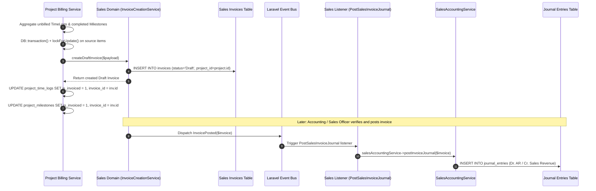

# Project Management Module — Cross-Module ERP Integrations

## 1. Executive Integration Summary

A critical objective of enterprise ERP architecture is defining strict domain boundaries and preventing data redundancy. The Project Management module in `wm-product-saas` is designed to be an operational orchestrator rather than an isolated silo. It leverages foundational ERP data structures (such as Users, Customers, Products, and Invoices) while maintaining strict segregation of duties.

### Integration Relationship Taxonomy
To eliminate ambiguity, cross-module relationships are categorized into five verified technical levels:
1. **Direct Automated Integration**: Modules exchange transactional data synchronously via domain service calls within database transactions.
2. **Direct Reference Only**: Foreign key relationship storing canonical entity IDs without mutating the external module.
3. **Event-Driven Integration**: Decoupled asynchronous or synchronous handling via Laravel event buses and listeners.
4. **Manual Business-Process Handoff**: Workflow coordination achieved administratively by ERP users without automated software coupling.
5. **No Integration Found**: Verified as completely absent in database schema and code.

---

## 2. Master ERP Integration Matrix

| ERP Module | Relationship Level | Technical Mechanism | Canonical Owner | Automated? | Implementation Evidence | Known Limitations |
| :--- | :--- | :--- | :--- | :--- | :--- | :--- |
| **CRM** | **Direct Reference Only** | Foreign key `projects.customer_id` referencing `customers.id`; autocomplete endpoint `/projects/search-clients`. | **CRM Domain** (`App\Domains\CRM\Models\Customer`) | Semi-Automated (Lookup & link) | `migrations/*create_projects_table.php`<br>`ProjectController::searchClients()` | Projects does not create CRM customers; customer profile edits must be executed in CRM. |
| **Sales** | **Direct Automated Integration** | Project billing aggregates unbilled items and invokes `SalesInvoiceCreationService::createDraftInvoice()`; stores `invoices.project_id`. | **Sales Domain** (`App\Domains\Sales\Models\Invoice`) | **Fully Automated** | `ProjectBillingService::generateInvoice()`<br>`ProjectBillingTest.php` | Project Management cannot modify invoice tax rules, terms, or currencies; those are governed by Sales settings. Invoices are created in 'Draft' status. |
| **Accounting** | **Event-Driven Integration** | Project billing creates Sales invoice; Sales posts invoice and emits `InvoicePosted`; Sales listener `PostSalesInvoiceJournal` posts GL. | **Accounting Domain** (`App\Domains\Accounting\Models\JournalEntry`) | **Fully Automated (Via Sales)** | `App\Domains\Sales\Listeners\PostSalesInvoiceJournal.php`<br>`ProjectBillingTest.php` | Project Management never writes directly to `journal_entries` or general ledger tables. |
| **Inventory** | **Product-Master Dependency Only** | Resolves active 'Service' items from `products` table (`item_type = 'Service'`) for invoice line item codes. | **Inventory Domain** (`App\Domains\Inventory\Models\Product`) | Semi-Automated (Catalog lookup) | `ProjectBillingService::resolveServiceProduct()` | **Zero inventory stock movements, warehouse reservations, or item ledger transactions are triggered.** |
| **Production** | **No Integration Found** | Exhaustive code search reveals 0 references to projects in Production. No `project_id` foreign key exists on `production_orders` or `production_plans`. | **Production Domain** | **None** (Manual handoff) | Audited `app/Domains/Production/` & schema | Manufacturing orders cannot be dispatched directly from project tasks or milestones in software. |
| **Purchase** | **No Integration Found** | Exhaustive code search reveals 0 references to projects in Purchase. No automated PR/PO generation from project tasks. | **Purchase Domain** | **None** (Manual handoff) | Audited `app/Domains/Purchase/` & schema | Procurement expenses incurred for projects must be entered manually as financial adjustments. |
| **HRMS** | **Direct Reference Only** | Relies on canonical `App\Models\User`. `ProjectNotificationService` optionally resolves `Employee` to attach `employee_id` to notification records. | **HRMS / Shared ERP** (`App\Models\User`, `App\Domains\HRMS\Models\Employee`) | Semi-Automated (User binding) | `create_project_members_table.php`<br>`ProjectNotificationService.php` | No automated payroll deduction or biometric timeclock punch ingestion into project timesheets. |
| **Notification Center** | **Event-Driven Integration** | Dispatches 12 domain events to `ProjectNotificationListener` registered in `AppServiceProvider`. | **ERP Core Notifications** | **Fully Automated** | `AppServiceProvider.php` (lines 583–601)<br>`ProjectNotificationTest.php` | Notification delivery depends on queue workers (`SendProjectNotificationEmailJob`) and user notification preference settings. |

---

## 3. Deep-Dive: CRM Customer Ownership

```mermaid
flowchart LR
    subgraph CRM_Domain [CRM Module (Owner)]
        Cust[Customer Master: customers table]
    end

    subgraph Projects_Domain [Project Management Module]
        Proj[Project Record: projects table]
        Lookup[Search Clients Endpoint: /projects/search-clients]
    end

    Lookup -->|Query active clients| Cust
    Proj -->|Foreign Key: customer_id| Cust
```

- **Architectural Principle**: Project Management **never** duplicates customer records. There is no `project_customers` or `client_accounts` table.
- **Implementation**: The `projects` table defines an unsigned integer foreign key `customer_id` referencing `customers.id`. When creating or editing projects, the UI queries `ProjectController::searchClients()`, which searches active CRM customers within the tenant boundary.
- **Data Integrity**: Deleting a customer in CRM is restricted if active projects exist with that `customer_id` (enforced via foreign key constraints).

---

## 4. Deep-Dive: Sales & Accounting Invoicing Pipeline

A frequent architectural flaw in ERP design is allowing multiple modules to create independent accounting journals or duplicate invoice tables. In `wm-product-saas`, **Sales owns all customer invoicing**, and **Accounting owns the General Ledger**:



### Key Technical Facts:
1. **Invoice Storage**: Invoices reside in the standard `invoices` table owned by the Sales module. The column `invoices.project_id` tracks project origin.
2. **Double-Billing Prevention**: In `ProjectBillingService::generateInvoice()`, source records are pessimistically locked via `lockForUpdate()`. Within the same database transaction, `is_invoiced` is set to `true` and `invoice_id` is set to the created invoice ID on both `project_time_logs` and `project_milestones`.
3. **General Ledger Boundary**: Project Management has **zero** dependencies on `JournalEntry`, `ChartOfAccount`, or `GeneralLedgerService`. Accounting integration is 100% event-driven via Sales.

---

## 5. Deep-Dive: Inventory & Product-Master Boundary

- **Product-Master Lookup**: `ProjectBillingService::resolveServiceProduct()` queries `App\Domains\Inventory\Models\Product` where `tenant_id = :tenant_id` and `item_type = 'Service'`.
- **Purpose**: Retrieves the default Service product SKU and `gst_rate` to populate invoice line items required by the Sales billing engine.
- **Critical Boundary**: **No physical inventory transactions occur.** Because the item type is `'Service'`, there are no warehouse bin allocations, stock deductions, or cost-of-goods-sold (COGS) inventory ledger entries created.

---

## 6. Deep-Dive: Production & Purchase Module Decoupling

An exhaustive code-level search across `app/Domains/Production/`, `app/Domains/Purchase/`, and database migrations confirmed:

- **Zero Project References in Production**: Neither `production_orders`, `production_plans`, `work_centers`, nor `routings` contain a `project_id` foreign key. No production service or controller imports `App\Domains\Projects`.
- **Zero Project References in Purchase**: Neither `purchase_orders` nor `purchase_requisitions` contain a `project_id` foreign key.
- **Operational Reality**: Production in this ERP operates on a Make-to-Stock or Make-to-Order basis driven by Sales Orders (`sales_order_id`). If an enterprise manufactures physical deliverables for a project, the business handoff is:
  1. The Project Manager creates tasks to track manufacturing milestones administratively.
  2. The Sales department issues a Sales Order linked to the client.
  3. Production executes the Work Orders against the Sales Order.
  4. Project Management tracks project progress via milestone reviews.

> [!NOTE]
> There is **no automated software bridge** between Project Management tasks and Production Work Orders or Purchase Requisitions in the current release.

---

## 7. Deep-Dive: HRMS & Canonical User Model

- **Canonical Identity**: All project staffing (`project_members`), task assignments (`project_tasks.assigned_to`), document uploads, reviews, and time logs reference `App\Models\User`.
- **Rate Cards**: Because HRMS employee records contain confidential salary and payroll data, the project module maintains dedicated `rate_per_hour` (client billing) and `cost_per_hour` (internal cost baseline) columns inside the `project_members` table.
- **In-App Notification Routing**: In `ProjectNotificationService.php`, when building an in-app `Notification`, the service checks `$employee = Employee::where('user_id', $recipient->id)->first();` and sets `employee_id = $employee?->id` to ensure alerts appear in employee-specific topbar drawers.
