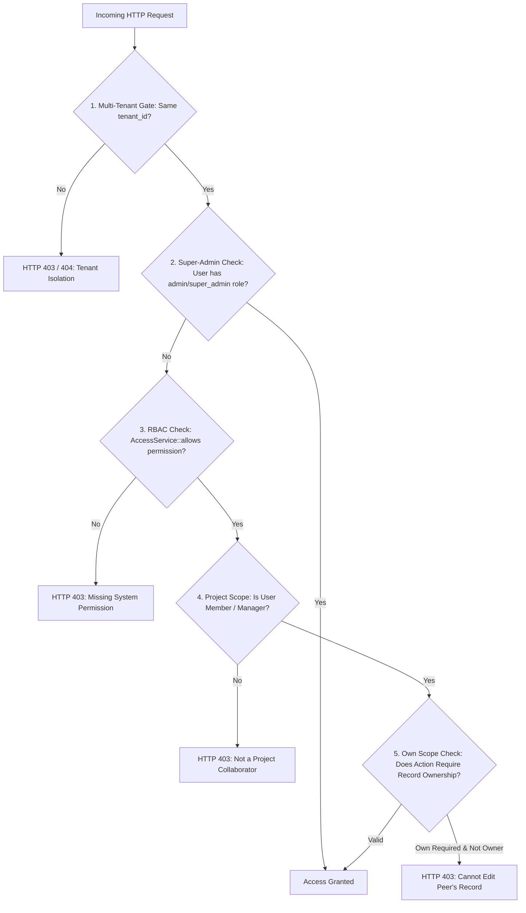

# Project Management Module — Roles, Permissions & Access Control

## 1. Access Control Architecture

The Project Management module implements a multi-tiered authorization architecture combining:
1. **Multi-Tenant Scoping**: All operations are strictly sandboxed by `tenant_id` at the database query level via `App\Core\Database\BaseModel` and tenant middleware (`tenant.context`). Users cannot view or mutate records belonging to other tenants.
2. **System-Level Permissions (RBAC)**: Managed by `App\Services\Access\AccessService`, checking whether the authenticated user possesses discrete module permission keys (e.g., `projects.projects.view`, `projects.projects.create`).
3. **Project-Level Role Scoping**: Controlled via the `project_members` roster. A user may have system-wide project access but only possess edit privileges on projects where they are explicitly assigned as a `Project Manager`, `Technical Lead`, or `Member`.
4. **Record-Level Ownership (Own Scope)**: Certain resources (such as pending time logs and issues) permit individual authors to edit their own submissions while restricting changes by peer team members.
5. **Super-Admin Override**: Users with the canonical `admin` or `super_admin` role bypass member-level restrictions while remaining strictly confined within their active tenant boundary.

---

## 2. Standard Project Roles & Responsibilities

| Role Name | Scope of Authority | Typical Enterprise Assignments |
| :--- | :--- | :--- |
| **System Admin** | Global tenant access to all projects, settings, reports, and administrative overrides. | IT Administrator, ERP Superuser |
| **Project Manager (PM)** | Full lifecycle control over assigned projects: schedule, members, rate cards, approvals, billing, and closure. | Senior Project Manager, Delivery Director, Engagement Manager |
| **Technical Lead** | Task management, WBS decomposition, dependency planning, review requests, and issue triaging. | Lead Architect, Engineering Lead, Scrum Master |
| **Team Member / Contributor** | Execute assigned tasks, complete subtasks, submit time logs, and report issues. | Software Engineer, Designer, Consultant, Specialist |
| **Project Viewer / Stakeholder** | Read-only access to project overview, Gantt charts, documents, and status reports. | Executive Sponsor, Client Observer, External Auditor |

---

## 3. Master Permission Matrix

The following matrix documents every system permission key recognized by the Project domain:

| Permission Key | Resource | Action | Default Roles | Policy Method | Scope & Restrictions |
| :--- | :--- | :--- | :--- | :--- | :--- |
| `projects.projects.view` | `Project` | List and view project details | Admin, PM, Lead, Member, Viewer | `ProjectPolicy::view()` | Tenant scope. Members can view projects they are assigned to; Admins view all tenant projects. |
| `projects.projects.create` | `Project` | Initialize a new project | Admin, PM | `ProjectPolicy::create()` | Tenant scope. Grants authority to allocate budgets and assign project managers. |
| `projects.projects.edit` | `Project` | Update metadata, settings, dates | Admin, PM | `ProjectPolicy::update()` | Enforces PM membership or Admin override. Closed projects are read-only. |
| `projects.projects.delete` | `Project` | Delete project | Admin only | `ProjectPolicy::delete()` | Enforces Admin role. Projects with billed invoices or posted time cannot be hard-deleted. |
| `projects.members.manage` | `ProjectMember` | Add/remove team members & rate cards | Admin, PM | `ProjectMemberPolicy::manage()` | Restricts rate card modifications (`rate_per_hour`, `cost_per_hour`) to designated PMs and admins. |
| `projects.tasks.view` | `Task` | View tasks, Gantt, and WBS | Admin, PM, Lead, Member, Viewer | `TaskPolicy::view()` | Inherits project view authorization. |
| `projects.tasks.create` | `Task` | Create tasks and checklists | Admin, PM, Lead | `TaskPolicy::create()` | Allows leads and PMs to build and restructure task lists. |
| `projects.tasks.edit` | `Task` | Edit task status, dates, assignees | Admin, PM, Lead, Assignee | `TaskPolicy::update()` | Assignees can update status/progress; only PM/Lead can alter estimated hours/due dates. |
| `projects.tasks.delete` | `Task` | Delete tasks | Admin, PM | `TaskPolicy::delete()` | Tasks with logged time cannot be deleted; must be marked cancelled. |
| `projects.timelogs.create` | `TimeLog` | Submit time entries | Admin, PM, Lead, Member | `TimeLogPolicy::create()` | User must be an active project member. |
| `projects.timelogs.edit` | `TimeLog` | Edit or delete time entries | Submitter (Own), Admin | `TimeLogPolicy::update()` | **Own Scope**: Submitter can edit while `approval_status = 'Pending'`. Approved or invoiced logs are locked. |
| `projects.timesheets.approve`| `TimeLog` | Approve/reject timesheets | Admin, PM | `TimeLogPolicy::approve()` | User must be designated Project Manager or possess Admin role. |
| `projects.issues.create` | `Issue` | Log a defect or blocker | Admin, PM, Lead, Member | `IssuePolicy::create()` | Any active project member can report issues. |
| `projects.issues.edit` | `Issue` | Update issue status/severity | Admin, PM, Lead, Assignee | `IssuePolicy::update()` | Assignee and Leads can transition status; PM can change severity and closure. |
| `projects.documents.upload`| `ProjectDocument` | Upload deliverables & files | Admin, PM, Lead, Member | `ProjectDocumentPolicy::upload()` | Validates file size (max 25MB) and approved MIME types. |
| `projects.documents.delete`| `ProjectDocument` | Delete uploaded documents | Admin, PM, Document Owner | `ProjectDocumentPolicy::delete()` | Document uploader or PM can remove unneeded files. |
| `projects.billing.manage` | `Project`, `Invoice` | Trigger Sales invoice bridge | Admin, PM | `ProjectPolicy::manageBilling()` | Requires edit permission; checks presence of unbilled approved logs or milestones. |
| `projects.closure.execute` | `Project` | Execute project closure gates | Admin, PM | `ProjectPolicy::close()` | Evaluates 5 condition gates; requires PM or Admin authority. |
| `projects.reports.view` | Reports | View executive reports and export | Admin, PM, Lead | `ProjectReportController::authorizeReports()` | Tenant scope; allows viewing and exporting CSV/XLSX summaries. |

---

## 4. Policy Implementation & Scoping Logic

All 10 project policies are bound to their respective models in `app/Providers/AppServiceProvider.php` (lines 873–921):

```php
Gate::policy(\App\Domains\Projects\Models\Project::class, \App\Domains\Projects\Policies\ProjectPolicy::class);
Gate::policy(\App\Domains\Projects\Models\ProjectMember::class, \App\Domains\Projects\Policies\ProjectMemberPolicy::class);
Gate::policy(\App\Domains\Projects\Models\Milestone::class, \App\Domains\Projects\Policies\MilestonePolicy::class);
Gate::policy(\App\Domains\Projects\Models\TaskList::class, \App\Domains\Projects\Policies\TaskListPolicy::class);
Gate::policy(\App\Domains\Projects\Models\Task::class, \App\Domains\Projects\Policies\TaskPolicy::class);
Gate::policy(\App\Domains\Projects\Models\TimeLog::class, \App\Domains\Projects\Policies\TimeLogPolicy::class);
Gate::policy(\App\Domains\Projects\Models\Issue::class, \App\Domains\Projects\Policies\IssuePolicy::class);
Gate::policy(\App\Domains\Projects\Models\ProjectDocument::class, \App\Domains\Projects\Policies\ProjectDocumentPolicy::class);
Gate::policy(\App\Domains\Projects\Models\ProjectReview::class, \App\Domains\Projects\Policies\ProjectReviewPolicy::class);
Gate::policy(\App\Domains\Projects\Models\ChangeRequest::class, \App\Domains\Projects\Policies\ChangeRequestPolicy::class);
```

*(Note: `SubTask` and `TaskDependency` do not have standalone policies; their authorization is inherited through parent `TaskPolicy` and controller authorization checks).*

### Authorization Scope Hierarchy



### Code Example: Own-Scope Enforcement in `TimeLogPolicy`
```php
public function update(User $user, TimeLog $timeLog): bool
{
    // Tenant isolation verification
    if ($user->tenant_id !== $timeLog->tenant_id) {
        return false;
    }

    // Admins have override access
    if ($this->access->hasRole($user, 'admin') || $this->access->hasRole($user, 'super_admin')) {
        return true;
    }

    // Approved or invoiced logs cannot be modified by anyone
    if ($timeLog->approval_status === TimeLog::STATUS_APPROVED || $timeLog->is_invoiced) {
        return false;
    }

    // Submitter can only edit their own pending logs
    return (int) $user->id === (int) $timeLog->user_id;
}
```

---

## 5. Security Audit & Common Misconfigurations

1. **Member Cannot View Project**:
   - Cause: User has `projects.projects.view` permission but has not been added to `project_members`.
   - Resolution: Project Manager must navigate to Members tab and add the user.
2. **Project Manager Cannot Approve Own Timesheet**:
   - Cause: Segregation of duties rule; if the PM is the submitter of a time log, an independent Admin or co-manager must approve the entry to prevent self-approval compliance violations.
3. **Closed Project Appears Read-Only**:
   - Cause: When `projects.status = 'closed'`, all mutating policies deliberately return `false` to preserve audit immutability.
   - Resolution: Reopening requires an Admin to transition project status back to `active`.
