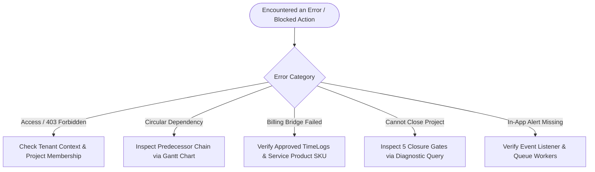

# Project Management Module — Troubleshooting & Diagnostic Guide

## 1. Quick Diagnostic Flowchart



---

## 2. Common Operational Issues & Playbooks

### Playbook 01: Cannot Access Project (HTTP 403 / 404)
- **Symptom**: User receives HTTP 403 Forbidden or 404 Not Found when clicking on a project link.
- **Root Causes**:
  1. The user's active session is logged into a different tenant/company than the project (`tenant_id` mismatch).
  2. The user lacks the system permission `projects.projects.view`.
  3. The project is restricted to team members, and the user has not been added to `project_members`.
- **Diagnostic Action (Read-Only SQL)**:
  ```sql
  -- Verify project exists in the active tenant and inspect user membership
  SELECT p.id, p.code, p.tenant_id, p.status, pm.project_role 
  FROM projects p
  LEFT JOIN project_members pm ON p.id = pm.project_id AND pm.user_id = :current_user_id
  WHERE p.id = :target_project_id;
  ```
- **Recovery Steps**:
  1. Ensure the user is logged into the correct tenant workspace.
  2. If the user is an authorized team member, the Project Manager must open the Members tab and add them to the roster.

---

### Playbook 02: Circular Dependency Error When Linking Tasks
- **Symptom**: System throws a validation error: *"Circular dependency detected: Task [A] cannot depend on Task [B] because Task [B] already depends on Task [A]."*
- **Root Cause**: The proposed dependency would create a cycle in the task graph, violating the Directed Acyclic Graph (DAG) requirement of the Critical Path Method.
- **Diagnostic Action (Read-Only SQL)**:
  ```sql
  -- Inspect the dependency chain for the target task
  SELECT td.id, td.task_id, t1.title AS task_title, td.depends_on_task_id, t2.title AS depends_on_title, td.dependency_type
  FROM project_task_dependencies td
  JOIN project_tasks t1 ON td.task_id = t1.id
  JOIN project_tasks t2 ON td.depends_on_task_id = t2.id
  WHERE td.task_id = :target_task_id OR td.depends_on_task_id = :target_task_id;
  ```
- **Recovery Steps**:
  1. Open the Gantt chart (`/projects/{project}/schedule`).
  2. Trace the predecessor path leading into the desired task.
  3. Remove the reverse dependency edge before adding the forward dependency.

---

### Playbook 03: Gantt / CPM Schedule Calculation Inconsistencies
- **Symptom**: A task's Early Start date does not advance even though its predecessor's finish date moved out, or Critical Path highlight is missing.
- **Root Causes**:
  1. One or more predecessor tasks are missing a valid `start_date` or `due_date`.
  2. Task duration is 0 days or dates are inverted (`due_date < start_date`).
- **Diagnostic Action (Read-Only SQL)**:
  ```sql
  -- Find tasks with invalid or missing date parameters
  SELECT id, title, start_date, due_date, estimated_hours, total_float, is_critical
  FROM project_tasks
  WHERE project_id = :project_id 
    AND (start_date IS NULL OR due_date IS NULL OR due_date < start_date);
  ```
- **Recovery Steps**:
  1. Ensure every task in the dependency chain has explicit start and due dates.
  2. Click **Recalculate Schedule** on the Gantt page to re-run `ProjectScheduleService::calculateCPM()`.

---

### Playbook 04: Project Billing Generation Fails
- **Symptom**: Clicking **Generate Invoice** on the Billing tab produces an error or displays *"No unbilled items found to invoice."*
- **Root Causes**:
  1. Time logs have been submitted but remain in `approval_status = 'Pending'`. Only `Approved` time logs can be billed.
  2. Time logs or milestones have already been marked `is_invoiced = true`.
  3. The ERP Inventory master lacks an active product with `item_type = 'Service'`, preventing the Sales invoice creation service from resolving a default line-item SKU.
- **Diagnostic Action (Read-Only SQL)**:
  ```sql
  -- Check for approved unbilled time logs
  SELECT id, user_id, hours, hourly_rate, approval_status, is_billable, is_invoiced
  FROM project_time_logs
  WHERE project_id = :project_id AND is_billable = 1 AND approval_status = 'Approved' AND is_invoiced = 0;

  -- Check for unbilled completed milestones
  SELECT id, name, billing_amount, status, is_invoiced
  FROM project_milestones
  WHERE project_id = :project_id AND status = 'Completed' AND is_invoiced = 0;

  -- Verify active Service product exists in Inventory
  SELECT id, name, sku, item_type, is_active
  FROM products
  WHERE tenant_id = :tenant_id AND item_type = 'Service'
  LIMIT 1;
  ```
- **Recovery Steps**:
  1. Have the Project Manager approve pending timesheets at `/timesheets/approvals`.
  2. If the Service product query returns no rows, an Administrator must create an active Service product in the Inventory module.

---

### Playbook 05: Project Closure Blocked by Validation Gates (5 Gates)
- **Symptom**: Project Manager clicks **Finalize Project Closure**, but receives an HTTP 422 error detailing unresolved closure gates.
- **Root Cause**: `ProjectClosureService::evaluateGates()` strictly forbids closing projects that contain dangling operational items across all 5 gates.
- **Diagnostic Action (Read-Only SQL)**:
  ```sql
  -- Gate 1: Check open tasks & incomplete subtasks
  SELECT id, title, status FROM project_tasks 
  WHERE project_id = :project_id AND status NOT IN ('Completed', 'Cancelled');

  SELECT st.id, st.title FROM project_sub_tasks st
  JOIN project_tasks pt ON st.task_id = pt.id
  WHERE pt.project_id = :project_id AND st.is_completed = 0;

  -- Gate 2: Check unresolved issues
  SELECT id, title, severity, status FROM project_issues 
  WHERE project_id = :project_id AND status NOT IN ('Resolved', 'Closed');

  -- Gate 3: Check pending reviews & change requests
  SELECT id, review_type, status FROM project_reviews 
  WHERE project_id = :project_id AND status = 'Pending';

  SELECT id, title, status FROM project_change_requests 
  WHERE project_id = :project_id AND status = 'Pending';

  -- Gate 4: Check unbilled approved time logs, pending timesheets, & unbilled milestones
  SELECT id, hours, approval_status, is_billable, is_invoiced FROM project_time_logs
  WHERE project_id = :project_id AND ((is_billable = 1 AND approval_status = 'Approved' AND is_invoiced = 0) OR approval_status = 'Pending');

  SELECT id, name, billing_amount, status, is_invoiced FROM project_milestones
  WHERE project_id = :project_id AND billing_amount > 0 AND status = 'Completed' AND is_invoiced = 0;

  -- Gate 5: Check incomplete milestones
  SELECT id, name, status FROM project_milestones
  WHERE project_id = :project_id AND status NOT IN ('Completed', 'Closed');
  ```
- **Recovery Steps**:
  1. **Gate 1**: Mark completed tasks as `Completed` or cancel abandoned tasks. Check off all subtasks.
  2. **Gate 2**: Resolve or close all reported issues.
  3. **Gate 3**: Conduct UAT reviews (must be `Approved`) and resolve change requests.
  4. **Gate 4**: Generate invoices for all approved unbilled hours and milestones, and settle pending timesheets.
  5. **Gate 5**: Conclude incomplete milestones.
  6. Re-evaluate closure at `/projects/{project}/closure`.

---

### Playbook 06: In-App Notifications Not Received
- **Symptom**: Assignee does not receive an alert when a task is assigned, or PM does not receive an alert when a time log is submitted.
- **Root Causes**:
  1. The Laravel queue worker (`php artisan queue:work`) is stalled or stopped (affecting `SendProjectNotificationEmailJob`).
  2. The user has muted notifications in their profile settings.
- **Diagnostic Action**:
  Check failed queue jobs in the database:
  ```sql
  SELECT id, queue, payload, exception, failed_at 
  FROM failed_jobs 
  ORDER BY failed_at DESC LIMIT 5;
  ```
- **Recovery Steps**:
  1. Restart queue workers: `php artisan queue:restart`.
  2. Ensure Redis/database queue connection is healthy.

---

### Playbook 07: Report Export Timeout or Memory Limit Exceeded
- **Symptom**: Exporting reports over a multi-year date range results in HTTP 500 or gateway timeout.
- **Root Cause**: Large datasets exceeding PHP `memory_limit` or web server execution timeouts during Excel rendering.
- **Recovery Steps**:
  1. Narrow the report filter date range using `ReportFilterDTO` presets (e.g., query by Quarter rather than All Time).
  2. Select **Export CSV** instead of **Export Excel (XLSX)**, as the streaming CSV export consumes minimal memory.
