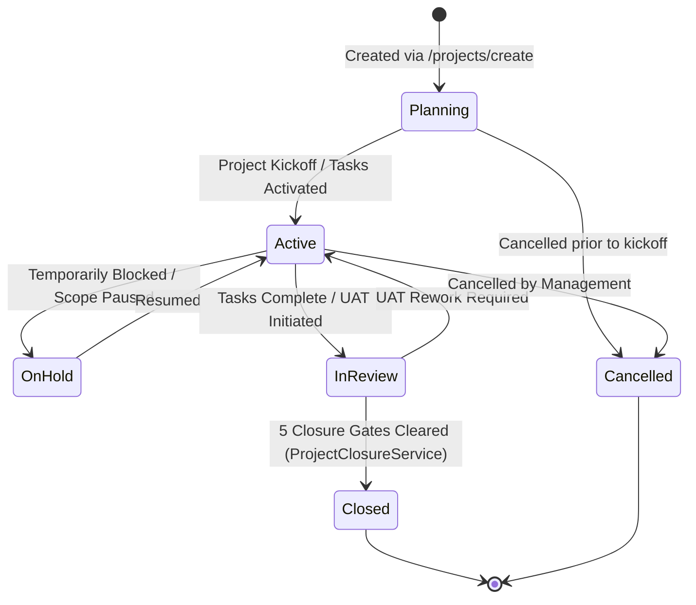
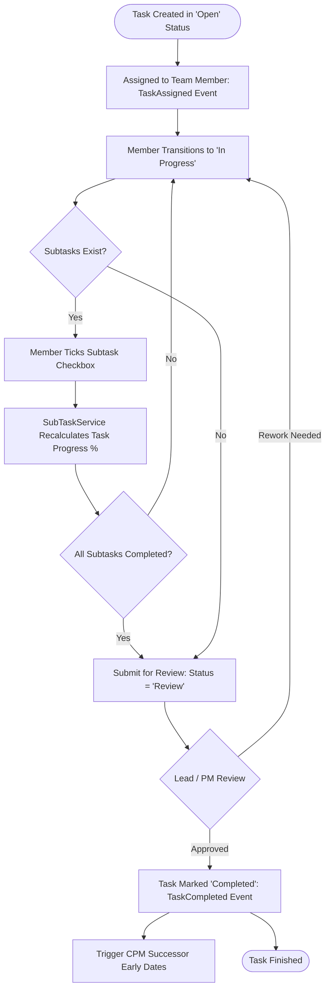
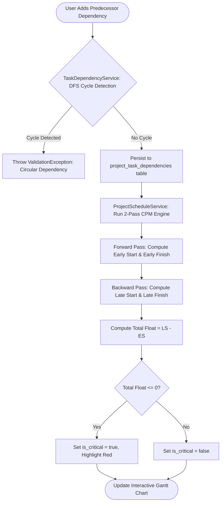
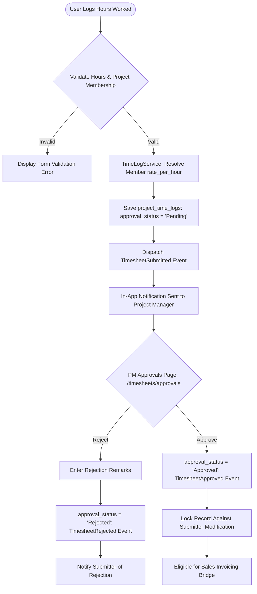
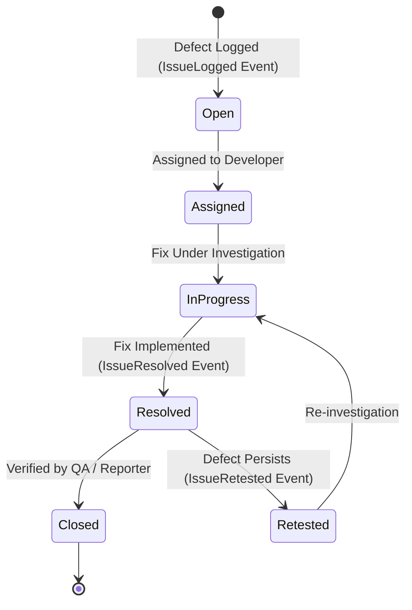
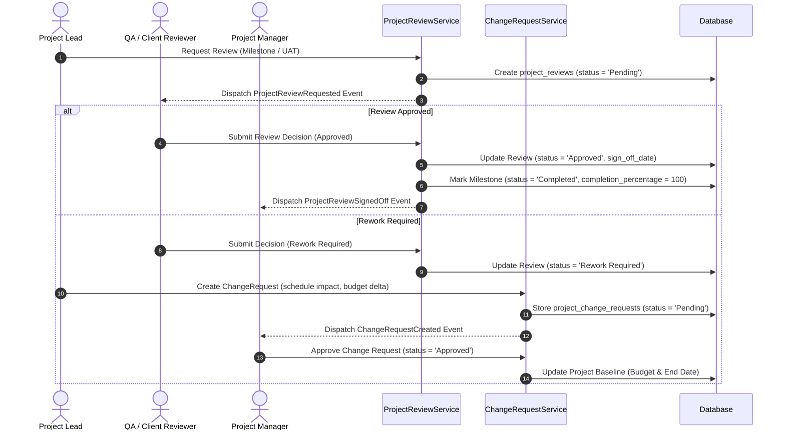

# Project Management Module — End-to-End Operational Workflows

## 1. Project Lifecycle & State Machine

Projects follow a governed lifecycle from initial planning to final sign-off. Transitions are managed by `ProjectService` and guarded by authorization policies.



### Lifecycle Transition Rules
1. **Planning**: Project structure, task lists, and initial member allocations are configured. Financial budget and target delivery dates are set.
2. **Active**: Team members log time, execute tasks, report issues, and complete subtasks.
3. **On Hold**: Pauses timeline calculations and alerts team members that active work is deferred.
4. **In Review**: Formal UAT or milestone sign-off is underway.
5. **Closed**: Final closure state; requires passing all 5 closure validation gates. The project becomes read-only.
6. **Cancelled**: Premature termination; preserves historical timesheets and audit logs.

---

## 2. Task Execution & Subtask Progress Aggregation



---

## 3. Dependency Validation & CPM Schedule Calculation



---

## 4. Time Tracking & Timesheet Approval Flow



---

## 5. Issue Tracking & Resolution Lifecycle



### Issue Gate Rules
- Any issue with status `Open`, `Assigned`, or `In Progress` acts as a hard block (Gate 2) against project closure.
- Resolving an issue records the `resolved_at` timestamp.

---

## 6. Milestone Sign-off, Client UAT & Change Requests



---

## 7. Project Billing & Invoicing Bridge Flow

```mermaid
flowchart TD
    StartBill([Project Manager Navigates to /projects/{project}/billing]) --> AggUnbilled[ProjectBillingService: Fetch Unbilled Items]
    AggUnbilled --> LockCheck[Pessimistic lockForUpdate on time_logs & milestones]
    LockCheck --> ItemsCheck{Unbilled Items Found?}
    ItemsCheck -- None --> NoAction[Display 'No Unbilled Work Found']
    
    ItemsCheck -- Items Present --> GatherLines[Build Invoice Line Items: Approved TimeLogs + Completed Milestones]
    GatherLines --> ItemType[Resolve Inventory 'Service' SKU for GST/Tax]
    GatherLines --> CallSales[Invoke SalesInvoiceCreationService::createDraftInvoice]
    CallSales --> CreateInv[Sales Domain: Create Invoice with status = 'Draft']
    CreateInv --> LinkProj[Store project_id on invoices table]
    LinkProj --> FlagLogs[Update project_time_logs: is_invoiced = 1, invoice_id = inv.id]
    FlagLogs --> FlagMiles[Update project_milestones: is_invoiced = 1, invoice_id = inv.id]
    FlagMiles --> ShowInv[Display Draft Sales Invoice Details & Link]
    
    ShowInv --> SalesPost{Sales Officer Posts Invoice}
    SalesPost --> PostEvt[Sales Domain Emits InvoicePosted Event]
    PostEvt --> AccGL[Sales Listener: PostSalesInvoiceJournal]
    AccGL --> CallSAS[SalesAccountingService::postInvoiceJournal]
    CallSAS --> PostJournals[Create GL Double-Entry: Dr Accounts Receivable / Cr Sales Revenue]
```

---

## 8. Controlled Project Closure Flow (5 Gates)

```mermaid
flowchart TD
    ReqClose([PM Initiates Closure at /projects/{project}/closure]) --> Gate1{Gate 1: Any Open Tasks or Incomplete Subtasks?}
    Gate1 -- Yes --> Fail1[Block Closure: Complete/Cancel Tasks & Checklist Items]
    Gate1 -- No --> Gate2{Gate 2: Any Unresolved Issues?}
    Gate2 -- Yes --> Fail2[Block Closure: Resolve or Close All Issues]
    Gate2 -- No --> Gate3{Gate 3: Milestone Exists Without Approved UAT, or Reviews/CRs Pending?}
    Gate3 -- Yes --> Fail3[Block Closure: Complete Reviews & Change Requests]
    Gate3 -- No --> Gate4{Gate 4: Unbilled Approved TimeLogs, Pending Timesheets, or Unbilled Milestones?}
    Gate4 -- Yes --> Fail4[Block Closure: Invoice Approved Work or Settle Timesheets]
    Gate4 -- No --> Gate5{Gate 5: Any Incomplete Milestones?}
    Gate5 -- Yes --> Fail5[Block Closure: Complete Incomplete Milestones]
    Gate5 -- No --> PassAll[All 5 Gates Cleared]
    
    PassAll --> CollectNotes[Collect: Closure Status, Lessons Learned, Client Rating]
    CollectNotes --> ExecClose[ProjectClosureService::close]
    ExecClose --> SetClosed[Set status = 'closed', closed_at = NOW(), closed_by = user.id]
    SetClosed --> EmitCloseEvt[Dispatch ProjectClosed Event]
    EmitCloseEvt --> AuditLog[Record Closure in Activity Log]
```

---

## 9. Domain Events & Notification Dispatch Flow

```mermaid
flowchart LR
    subgraph Producers [Domain Services]
        TS[TaskService]
        IS[IssueService]
        TLS[TimeLogService]
        PRS[ProjectReviewService]
        CRS[ChangeRequestService]
        PCS[ProjectClosureService]
    end

    subgraph Bus [Event Bus (AppServiceProvider)]
        Evts["12 Domain Events
        TaskAssigned, TaskCompleted
        IssueLogged, IssueResolved, IssueRetested
        TimesheetSubmitted, Approved, Rejected
        ProjectReviewRequested, SignedOff
        ChangeRequestCreated, ProjectClosed"]
    end

    subgraph Listener [Domain Listener]
        PNL[ProjectNotificationListener]
    end

    subgraph Consumers [Notification Pipeline]
        PNS[ProjectNotificationService]
        InApp[In-App ERP Topbar Notifications]
        QueueJob[SendProjectNotificationEmailJob]
        ActLog[Activity Audit Log]
    end

    Producers --> Evts
    Evts --> PNL
    PNL --> PNS
    PNS --> InApp
    PNS --> QueueJob
    PNL --> ActLog
```
